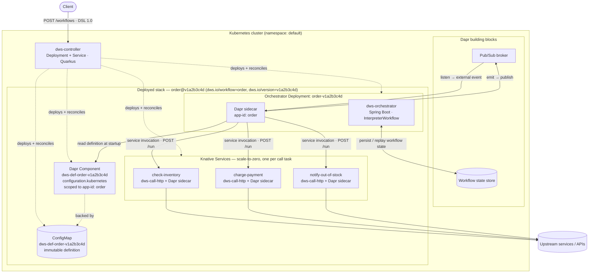

# dapr-workflow-spec (DWS)

A config-driven workflow platform for Kubernetes built on [Dapr](https://dapr.io/) and
the [Open Workflow Specification](https://open-workflow-specification.org/) DSL 1.0. Workflow definitions are
plain YAML/JSON documents — no per-workflow code is written or generated. A definition is
posted to the controller, which compiles it and deploys the corresponding Dapr-backed
resources on the cluster; a generic orchestrator then interprets the definition at runtime.

## Components

| Component | Description |
|---|---|
| [`dws-controller`](dws-controller) | Accepts Open Workflow Specification DSL 1.0 definitions, compiles them, and deploys one stack per definition (definition ConfigMap, Dapr Configuration component, Knative Services for each I/O task, and an orchestrator Deployment). Quarkus. |
| [`dws-orchestrator`](dws-orchestrator) | Generic, config-driven Dapr workflow orchestrator built on the interpreter pattern. Loads one workflow definition at startup and walks its task list — no per-workflow code is ever generated. Spring Boot. |
| [`dws-call-http`](dws-call-http) | Generic, prebuilt step image for `call: http` tasks. One image serves every HTTP call step; behavior is defined entirely by environment configuration. Go. |
| [`dws-call-openapi`](dws-call-openapi) | Generic, prebuilt step image for `call: openapi` tasks. Loads an OpenAPI document, resolves an operation, and executes it against upstream services. Node.js/TypeScript. |

## How it fits together

1. A client `POST`s an Open Workflow Specification DSL 1.0 definition to `dws-controller`.
2. The controller validates and compiles the definition, then deploys:
   - an immutable, versioned definition stored in a Dapr Configuration component,
   - one scale-to-zero Knative Service per I/O (`call`) task, using the prebuilt
     `dws-call-http` / `dws-call-openapi` images,
   - a dedicated `dws-orchestrator` Deployment for the definition.
3. `dws-orchestrator` loads the definition once at startup and interprets it: `call` tasks
   invoke the corresponding step service via Dapr service invocation, `switch`/`set` are
   evaluated with `jq`, `wait`/`listen`/`emit` map to Dapr timers, external events, and pub/sub.

## Deployed component state

The diagram below shows the desired component state for a **single deployed workflow**
(`order@v1a2b3c4d`, `checkInventory → switch .inStock → chargePayment | notifyOutOfStock`).
The controller reconciles the cluster toward this state; every resource in the stack is
content-addressed by version and selected by the `dws.io/*` labels, so a new definition
version is a new stack deployed alongside the old one.

See each component's README for API details, configuration, local development, and
deployment instructions.
