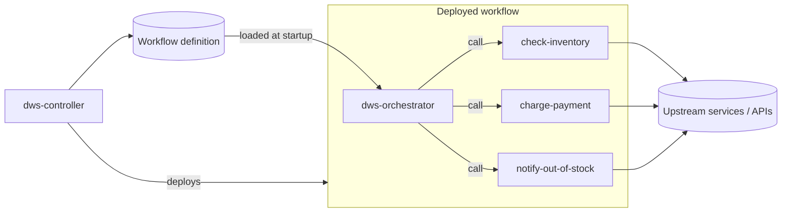

# dapr-workflow-spec (DWS)

A config-driven workflow platform for Kubernetes built on [Dapr](https://dapr.io/) and
the [Open Workflow Specification](https://open-workflow-specification.org/) DSL 1.0. Workflow definitions are
plain YAML/JSON documents — no per-workflow code is written or generated. A definition is
posted to the controller, which compiles it and deploys the corresponding Dapr-backed
resources on the cluster; a generic orchestrator then interprets the definition at runtime.

For concise setup, architecture, API, and operations guides, start with the
[DWS wiki](https://github.com/tonylibs/dapr-workflow-spec/wiki). Component READMEs below retain
detailed configuration and development references.

## Components

| Component | Description |
|---|---|
| [`dws-controller`](dws-controller) | Accepts Open Workflow Specification DSL 1.0 definitions, compiles them, and deploys one stack per definition (definition ConfigMap, Dapr Configuration component, Knative Services for each I/O task, and an orchestrator Deployment). Quarkus. |
| [`dws-orchestrator`](dws-orchestrator) | Generic, config-driven Dapr workflow orchestrator built on the interpreter pattern. Loads one workflow definition at startup and walks its task list — no per-workflow code is ever generated. Spring Boot. |
| [`dws-call-http`](dws-call-http) | Generic, prebuilt step image for `call: http` tasks. One image serves every HTTP call step; behavior is defined entirely by environment configuration. Go. |
| [`dws-call-openapi`](dws-call-openapi) | Generic, prebuilt step image for `call: openapi` tasks. Loads an OpenAPI document, resolves an operation, and executes it against upstream services. Node.js/TypeScript. |
| [`dws-run`](dws-run) | Prebuilt step images for `run: shell` and `run: script` tasks. One codebase produces three images (`dws-run-shell`, `dws-run-script-js`, `dws-run-script-python`) differing only in base layer and interpreter. Go. |

## Install

DWS ships as a Helm chart (`charts/dws`) published to GitHub Container Registry as an OCI
artifact. One `helm install` brings up the control plane — `dws-controller`, `dws-admin` and its
Postgres read model — and, by default, the Dapr control plane and Redis they depend on.

Requires Helm 3.8+ (OCI registry support) and a Kubernetes cluster you can create namespaces in.

```sh
helm install dws oci://ghcr.io/tonylibs/charts/dws \
  --namespace dws-system --create-namespace \
  --timeout 5m
```

A default install gives you `dws-controller`, `dws-admin`, the Dapr control plane, an in-chart
Postgres and Redis, and the three Dapr Redis Components (`pubsub` on topic `dws.events`,
`dws-definitions`, and the actor state store). The console, Dex, APISIX, the Gateway API front
door, and JWT auth are all off by default — see the values table below.

Pin a chart version with `--version` (chart versions are listed on the
[releases page](https://github.com/tonylibs/dapr-workflow-spec/releases); the chart is cut
manually, see [`docs/release-process.md`](docs/release-process.md)).

If Dapr is already installed cluster-wide, install against it instead of bundling a second
control plane:

```sh
helm install dws oci://ghcr.io/tonylibs/charts/dws \
  --namespace dws-system --create-namespace \
  --set dapr.enabled=false
```

A preflight check fails the install fast if `dapr.enabled=false` but Dapr's CRDs aren't actually
present, rather than deploying workloads against a control plane that isn't there.

### Verify, upgrade, uninstall

```sh
helm test dws --namespace dws-system --logs      # admin DB connectivity (+ auth checks when enabled)
helm upgrade dws oci://ghcr.io/tonylibs/charts/dws --namespace dws-system --reuse-values
helm uninstall dws --namespace dws-system
```

`helm uninstall` leaves the namespace, any PersistentVolumeClaims from the in-chart Postgres and
Redis, and CRDs installed by subcharts behind — delete those separately if you want a clean slate.

### Values reference

Top-level knobs. Everything else — per-component `image.{repository,tag,pullPolicy}`,
`replicaCount`, `service.port`, `resources` — follows the same shape per component, and the
subchart passthroughs (`postgresql.*`, `redis.*`, `dex.*`, `apisix.*`) accept their upstream
chart's full schema. See [`charts/dws/values.yaml`](charts/dws/values.yaml) for the annotated
source of truth.

| Value | Default | Effect |
|---|---|---|
| `controller.enabled` | `true` | `dws-controller` Deployment, Service, and RBAC. Outbound-only — it deliberately gets no route. |
| `admin.enabled` | `true` | `dws-admin` read-model Deployment and Service. |
| `console.enabled` | `false` | `dws-console` Deployment and Service. Carries no route of its own — pair with `apiGateway.enabled`. |
| `dapr.enabled` | `true` | Installs the Dapr control plane as a subchart. Set `false` when Dapr is managed outside the release. |
| `postgresql.enabled` | `true` | In-chart Bitnami Postgres backing `dws-admin`. Dev/eval-grade: single replica, no backups. |
| `admin.database.url` / `.existingSecret` / `.existingSecretKey` | `""` | External database DSN. Set one of these when `postgresql.enabled=false`. |
| *(Redis — no toggle)* | follows `dapr.enabled` | Backs the three Dapr Redis Components, so its lifecycle is tied to Dapr's. |
| `redis.external.host` | `""` | Retargets the Dapr Components at a managed Redis. Note: the in-chart Redis still installs alongside — a documented trade-off, Helm conditions can't AND two values. |
| `auth.enabled` | `false` | Dapr-native JWT bearer auth on the controller. Requires either `auth.issuer` + `auth.audience` (external OIDC) or `auth.dex.enabled=true`; enabling it without either fails render. |
| `dex.enabled` | `false` | In-chart Dex IdP for console login. Set `dex.issuer` and `dex.consoleRedirectURI` for anything past local testing. |
| `apiGateway.enabled` | `false` | Renders the shared Gateway API front door (GatewayClass, Gateway, console + `/dws-admin` HTTPRoutes). Requires `auth.enabled`, `admin.enabled`, and `console.enabled`. |
| `apiGateway.hostname` / `apiGateway.tls.*` | `""` / off | Public hostname and TLS Secret for the Gateway listener. |
| `apisix.enabled` | `false` | Bundles APISIX as the Gateway API data plane. **Fresh installs only** — see the caveat below. Leave `false` and set `apiGateway.external.gatewayProxyName` to use an APISIX you manage. |
| `defaults.{resources,nodeSelector,tolerations,affinity}` | 100m/256Mi req, 512Mi limit | Shared scheduling and resource defaults for every chart-owned Deployment. Per-component maps deep-merge; a non-empty component `tolerations` list replaces the default outright. |
| `namespaceOverride` | `""` | Deploy into a namespace other than the release namespace. |
| `imagePullSecrets` | `[]` | Pull secrets for private registries. |

Two things worth knowing before you flip a toggle on an existing release:

- **`apisix.enabled=true` only works on a brand-new `helm install`.** Turning it on via
  `helm upgrade` deadlocks: the bundled etcd subchart's `pre-upgrade` hook waits on a Secret that
  only the main manifest sync would create, and Helm never re-applies a subchart's `crds/` on
  upgrade. Neither shows up in `helm lint`/`helm template`. Install APISIX as its own release and
  use external mode instead.
- **`console.ingress.enabled` no longer renders anything.** The console's plain Ingress was
  replaced by the Gateway API front door; the value survives only as a trap that fails the upgrade
  with migration steps rather than silently dropping your route.

Both are covered end to end, along with the migration recipe and rollback behavior, in
[`charts/dws/README.md`](charts/dws/README.md).

## Dev container on Windows

When this repository is stored on a Windows drive and mounted into the Linux dev container,
the `9p` filesystem can report every file as executable or with changed metadata. Configure Git
once per clone to ignore those mount artifacts and keep the working tree in LF format:

```sh
git config --local core.filemode false
git config --local core.autocrlf false
git config --local core.trustctime false
git config --local core.checkStat minimal
```

## How it fits together

1. A client `POST`s an Open Workflow Specification DSL 1.0 definition to `dws-controller`.
2. The controller validates and compiles the definition, then deploys:
   - an immutable, versioned definition stored in a Dapr Configuration component,
   - one scale-to-zero Knative Service per I/O (`call` or `run`) task, using the prebuilt
     `dws-call-http` / `dws-call-openapi` / `dws-run-*` images,
   - a dedicated `dws-orchestrator` Deployment for the definition.
3. `dws-orchestrator` loads the definition once at startup and interprets it: `call` and `run`
   tasks invoke the corresponding step service via Dapr service invocation, `switch`/`set` are
   evaluated with `jq`, `wait`/`listen`/`emit` map to Dapr timers, external events, and pub/sub.

Both components also publish **lifecycle events** (definition/deployment from the controller,
instance/task from the orchestrator) to the Dapr pub/sub topic `dws.events` on component `pubsub`.
The shared event contract — envelope, types, payloads, and the in-cluster `pubsub` component
prerequisite — is documented in [`docs/events.md`](docs/events.md).

## Deployed component state

Each deployed workflow gets its own **orchestrator** plus one **step service per `call`/`run`
task**. The controller deploys the stack from the definition; at runtime the orchestrator
loads the definition and invokes each step via Dapr.


```mermaid
flowchart LR
  controller["dws-controller"]
  definition[("Workflow definition")]

  subgraph workflow["Deployed workflow"]
    orchestrator["dws-orchestrator"]
    step1["check-inventory"]
    step2["charge-payment"]
    step3["notify-out-of-stock"]
  end

  upstream[("Upstream services / APIs")]

  controller -->|deploys| workflow
  controller --> definition
  definition -->|loaded at startup| orchestrator
  orchestrator -->|call| step1
  orchestrator -->|call| step2
  orchestrator -->|call| step3
  step1 --> upstream
  step2 --> upstream
  step3 --> upstream
```

See each component's README for API details, configuration, local development, and
deployment instructions.
