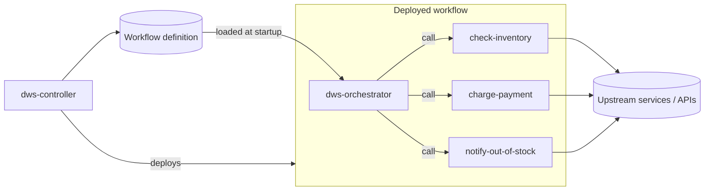

# dapr-workflow-spec (DWS)

A config-driven workflow platform for Kubernetes built on [Dapr](https://dapr.io/) and
the [Open Workflow Specification](https://open-workflow-specification.org/) DSL 1.0. Workflow definitions are
plain YAML/JSON documents — no per-workflow code is written or generated. A definition is
posted to the controller, which compiles it and deploys the corresponding Dapr-backed
resources on the cluster; a generic orchestrator then interprets the definition at runtime.

## Components

| Component | Description |
|---|---|
| [`dws-controller`](dws-controller) | Accepts Open Workflow Specification DSL 1.0 definitions, compiles them, and deploys one stack per definition (definition ConfigMap, Dapr Configuration component, Knative Services for each I/O task, and an orchestrator Deployment). Quarkus. |
| [`dws-orchestrator`](dws-orchestrator) | Generic, config-driven Dapr workflow orchestrator built on the interpreter pattern. Loads one workflow definition at startup and walks its task list — no per-workflow code is ever generated. Spring Boot. |
| [`dws-call-http`](dws-call-http) | Generic, prebuilt step image for `call: http` tasks. One image serves every HTTP call step; behavior is defined entirely by environment configuration. Go. |
| [`dws-call-openapi`](dws-call-openapi) | Generic, prebuilt step image for `call: openapi` tasks. Loads an OpenAPI document, resolves an operation, and executes it against upstream services. Node.js/TypeScript. |
| [`dws-run`](dws-run) | Prebuilt step images for `run: shell` and `run: script` tasks. One codebase produces three images (`dws-run-shell`, `dws-run-script-js`, `dws-run-script-python`) differing only in base layer and interpreter. Go. |

## Dev container on Windows

When this repository is stored on a Windows drive and mounted into the Linux dev container,
the `9p` filesystem can report every file as executable or with changed metadata. Configure Git
once per clone to ignore those mount artifacts and keep the working tree in LF format:

```sh
git config --local core.filemode false
git config --local core.autocrlf false
git config --local core.trustctime false
git config --local core.checkStat minimal
```

## How it fits together

1. A client `POST`s an Open Workflow Specification DSL 1.0 definition to `dws-controller`.
2. The controller validates and compiles the definition, then deploys:
   - an immutable, versioned definition stored in a Dapr Configuration component,
   - one scale-to-zero Knative Service per I/O (`call` or `run`) task, using the prebuilt
     `dws-call-http` / `dws-call-openapi` / `dws-run-*` images,
   - a dedicated `dws-orchestrator` Deployment for the definition.
3. `dws-orchestrator` loads the definition once at startup and interprets it: `call` and `run`
   tasks invoke the corresponding step service via Dapr service invocation, `switch`/`set` are
   evaluated with `jq`, `wait`/`listen`/`emit` map to Dapr timers, external events, and pub/sub.

Both components also publish **lifecycle events** (definition/deployment from the controller,
instance/task from the orchestrator) to the Dapr pub/sub topic `dws.events` on component `pubsub`.
The shared event contract — envelope, types, payloads, and the in-cluster `pubsub` component
prerequisite — is documented in [`docs/events.md`](docs/events.md).

## Deployed component state

Each deployed workflow gets its own **orchestrator** plus one **step service per `call`/`run`
task**. The controller deploys the stack from the definition; at runtime the orchestrator
loads the definition and invokes each step via Dapr.


```mermaid
flowchart LR
  controller["dws-controller"]
  definition[("Workflow definition")]

  subgraph workflow["Deployed workflow"]
    orchestrator["dws-orchestrator"]
    step1["check-inventory"]
    step2["charge-payment"]
    step3["notify-out-of-stock"]
  end

  upstream[("Upstream services / APIs")]

  controller -->|deploys| workflow
  controller --> definition
  definition -->|loaded at startup| orchestrator
  orchestrator -->|call| step1
  orchestrator -->|call| step2
  orchestrator -->|call| step3
  step1 --> upstream
  step2 --> upstream
  step3 --> upstream
```

See each component's README for API details, configuration, local development, and
deployment instructions.
