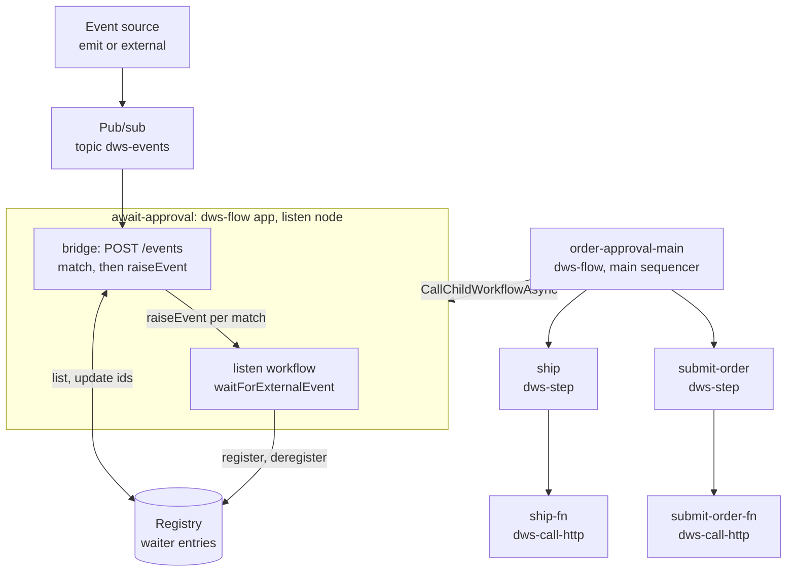
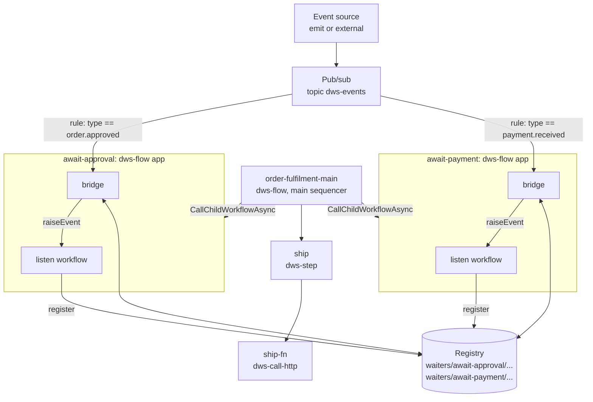

# ADR 0006: `wait` and `listen` Run as Flow Controller Nodes

- **Status:** Accepted for the placement decision, for pub/sub (broadcast) `listen` semantics, and for the
  per-node bridge mechanism. The spike items at the end are open.
- **Date:** 2026-10-01
- **Context:** [`docs/roadmaps/workflow-runtime-architecture-roadmap.md`](../roadmaps/workflow-runtime-architecture-roadmap.md)
  Phase 2, sub-phase 2.0 / 2f — this is the decision `wait` and `listen` were blocked on.
- **Related:** [ADR 0001](0001-workflow-runtime-v2-decisions.md) (per-node app IDs; uniform Step layer),
  [ADR 0003](0003-fork-as-a-flow-node.md) (fork as a Flow node — the uniform parent-dispatch rule),
  [ADR 0004](0004-scope-nodes-carry-their-own-configuration.md) (Sequencer / Controller shapes — this
  decision extends its Controller table)
- **Amends:** the target-state spec [`workflow-runtime-architecture.md`](../roadmaps/workflow-runtime-architecture.md)
  — its classification-table row that lists `wait`/`listen` as Steps, and its "timing and event steps"
  example, which says they "remain Steps".

## Context

The target-state spec classifies `wait`, `listen` and `emit` as Steps whose "Java Activity
implementations use the appropriate Dapr timer, external-event, or pub/sub capability". The roadmap's
Phase 2 row followed it: `WorkflowActivity` implementations for `wait`/`listen` inside `dws-step`.

That cannot work for two of the three. In v1 (`dws-orchestrator`, `InterpreterWorkflow`):

| Task | v1 mechanism | Where it runs |
|---|---|---|
| `wait` | `ctx.createTimer(duration)` | the workflow body |
| `listen` | `ctx.waitForExternalEvent(name, DEFAULT_LISTEN_TIMEOUT)` (1 day); the event payload is merged into the data document | the workflow body |
| `emit` | `EmitEventActivity` (Dapr pub/sub publish) | an activity |

A durable timer and an external-event wait are operations on the *workflow* context. An activity has no
equivalent: one that slept for the wait duration, or blocked up to a day for an event, would hold an
activity slot, run into activity timeouts, and not survive a restart the way a timer does. `emit` has no
such problem — it is a plain publish — and stays a Step.

Today `NodeClassifier` compiles every non-structural task kind to a `StepNode` "with no exceptions", and
the Phase 0 `dws-step` scaffold lists `wait` and `listen` among its known task kinds.

## Decision

**`wait` and `listen` each compile to their own Flow node, in the Controller shape of ADR 0004, and run
as `dws-flow` instances.** The kinds left to `dws-step` are `call`, `run`, `set`, `switch`, `emit` and
`raise`.

- A `wait` node carries the task's duration verbatim; a `listen` node carries its `to` event selection
  verbatim (and its timeout — see the open question). This is ADR 0004's rule that a scope's
  configuration lives on the node that implements it. Exact field names are fixed by the schema change
  that implements this ADR.
- Both are **leaf controllers**: `tasks` is empty (the Controller rule) and `children` is empty too —
  they delegate nothing. They are the first Flow nodes with no children.
- The parent calls each one with `CallChildWorkflowAsync`, like any other Flow child (ADR 0003's uniform
  rule): reach the task, call that node's app ID, await, continue.
- The `wait` workflow creates the timer and returns the incoming data unchanged. The `listen` workflow
  waits for the external event and returns the incoming data with the event payload merged in, as v1
  does.

## Rationale

- **Durable semantics survive.** The timer and the event wait stay workflow-level calls, which is the
  only place Dapr can make them durable.
- **Uniform parent dispatch.** The parent does not special-case `wait`/`listen`; they are one more child
  to call, as `for`, `try-catch` and `fork` already are.
- **`dws-step` stays an Activity-only boundary**, as ADR 0001 describes it.

## Alternatives considered

| Alternative | Why not |
|---|---|
| Step activity (the spec's and roadmap's original plan) | Cannot be durable — see Context. |
| Run inline in the parent Flow | Keeps the semantics, but reintroduces per-kind special-casing in the parent's dispatch that ADR 0003/0004 removed for every other non-Step scope, and the parent's definition would have to carry `wait`/`listen` configuration. |
| A small workflow hosted in `dws-step` | Keeps "every non-structural task is a Step", but `dws-step` would then host a workflow type and stop being an Activity-only boundary, and durable-workflow logic would be split across Java and .NET. |

## What happens to the parent's call while the child waits

The parent's `CallChildWorkflowAsync` is a durable pending task. Neither orchestrator runs during the
wait; both are unloaded. What exists is two persisted workflow histories plus one durable timer (or a
pending external-event subscription). When the timer fires, the child replays and completes, a
completion event is appended to the parent's history, and the parent replays and continues. No thread
and no activity slot is held, and the call has no timeout of its own — a task-level `timeout` still races
a timer against the call, as in v1.

## Consequences

- **A finished phase's output changes.** `NodeClassifier`, `FlowScope`, the single-node schema's scope
  enum, `dws-step`'s known task kinds and the `dws-flow` loader all move. The spec is amended (table row
  and the timing example). In the roadmap, 2f becomes `dws-flow` work, closer to Phase 3 than to
  `dws-step`, and the classification change needs its own Phase 1 follow-up change.
- **+1 pod per `wait`/`listen` node, and these pods cannot scale to zero while an instance waits.** Dapr
  replays a workflow only when its app is connected to the sidecar; until a replica returns, the work
  queues. This adds to the Phase 4 capacity caveat.
- **To verify in the Phase 2 exit gate / Phase 5 tests:** terminating a root instance cascades to a
  waiting child, and Dapr's reminder-backed timer precision is acceptable (fine for minutes, not for
  sub-second waits).
- **A `listen` timeout fails the child**, so the parent's call fails and the parent's `try`/`catch` sees
  an ordinary error.

## `listen` event delivery

### What Dapr gives us

`waitForExternalEvent(name)` is **point-to-point and addressed by instance**: an event is raised with
`POST /v1.0/workflows/dapr/{instanceID}/raiseEvent/{eventName}` (v1: `WorkflowController.raiseEvent` →
`workflowClient.raiseEvent(id, event, body)`). The instance ID is required; the event name only matches
inside that one instance; the body is the payload and carries no routing information. There is no "raise to
whoever waits for X" and no broker subscription. A sidecar's raise-event API is, as far as we know, scoped
to its own app's workflows (to confirm in a spike). Dapr buffers an event raised on an existing instance
until the wait starts (also to verify).

The `listen` workflow therefore **still uses `waitForExternalEvent`** — it is the only durable wait Dapr
offers. Pub/sub is how an event reaches the waiter, not how the waiter waits. (`wait` needs no event at
all: it is `createTimer` only.)

### What the OWS spec says

Checked against the Open Workflow DSL (`dsl.md`, `dsl-reference.md`): **the spec does not define
delivery semantics.**

| Question | In the spec? |
|---|---|
| Can two `listen` tasks wait for the same event? | Not addressed — nothing says "exclusive" or "delivered to all". |
| Is an event consumed (removed) when matched? | Not addressed. |
| Is an event arriving before `listen` starts buffered or dropped? | Not addressed. |
| Ordering | Only that, with `foreach`, consumed events sit in a FIFO queue within that one `listen`. |
| Output | A `listen` outputs the ordered array of the events it consumed. |
| Event sources | `emit`, external sources, and `schedule.on` — not only `emit`. |

The spec reads as pub/sub (`listen` declares what it wants; no instance address) but leaves the runtime to
choose. v1 did not implement the declared model: it matches by **task name** on **one root instance**
and ignores `to.one.with.type`, `any` and `all`, so the caller must know the instance ID and task name.

### Decision: `listen` has pub/sub semantics

- **Broadcast.** An event is delivered to **every** waiting `listen` whose selector matches — two
  `listen` tasks on the same event type both fire, within one instance or across instances. Exclusive
  consumption was rejected: it is a trap (a second `listen` on the same type would silently never fire)
  and is not what `emit`/`listen` suggest.
- **The selector is honored.** `to.one.with.type` (and the other CloudEvent attributes, `any`, `all`)
  match for real; matching by task name is v1 behavior, not v2's contract. Dropping the v1 name-matching
  endpoint is a breaking change, and the migration is Phase 5's concern.
- Early events (before the `listen` starts) are **not** guaranteed — the spec promises nothing, and a
  subscriber-based design only reaches workflows already waiting.

### Terms

| Term | Meaning |
|---|---|
| **Node** | One compiled element of a workflow definition. One `listen` task is one `listen` node. |
| **App** | The node's Kubernetes Deployment: one `dws-flow` Dapr app with its own app ID. In this ADR one node is one app. |
| **Pod (replica)** | One copy of the app. Pods share load, and any pod can raise on any instance. |
| **Workflow instance** | One run of the node's workflow code, with an instance ID, persisted in the workflow state store. One app hosts many instances at once, spread across its pods. Not tied to a pod. |

### Decision: one shared pub/sub component, one bridge per `listen` node

Broadcast means the sender cannot address one instance, so a single deterministic instance ID plus a
front door reaches one waiter, not all matching ones. Instead, **each `listen` node's `dws-flow` app is
also its own event bridge**:

```
emit / external ──► ONE pub/sub component, topic dws-events   (CloudEvents)
                              │  broker fan-out: one copy per subscribing app ID
          ┌───────────────────┼───────────────────┐
          ▼                   ▼                   ▼
   listen-A app         listen-B app         listen-C app
   Subscription         Subscription         Subscription
   scopes:[listen-A]    scopes:[listen-B]    scopes:[listen-C]
   coarse prefilter     coarse prefilter     coarse prefilter
          │                   │
          ▼                   ▼
    POST /events         POST /events
    registry → waiters → exact match → raiseEvent(instanceID, "filter-<i>", payload)
```

- **One component, many topics.** The Dapr pub/sub component holds only the broker connection. It does not
  define routing. By default every app configured with it sees all its topics; topic scoping can
  restrict that.
- **Routing is `Subscription` resources.** The controller generates one declarative `Subscription`
  (`dapr.io/v2alpha1`) per `listen` node from its `to` selector, with `scopes: [<listen app ID>]`, so only
  that app receives it. Routes pick a **path inside the subscribing app**; they do not route between apps.
  Cross-app fan-out comes from each app having its own scoped subscription. Replicas of one app ID compete
  (one replica handles each message), which is fine because any replica can raise on any instance.
- **Waiter registry.** Dapr has no "list waiting instances", and a broker event carries no instance ID.
  Each `listen` instance registers itself in a state store when it starts — instance ID, its filters, and
  the resolved `correlate.expect` values — and removes the entry when it ends or times out. The bridge
  raises on every registered waiter whose filter matches. The registry needs cleanup for terminated
  instances, and delivery is at-least-once, so a waiter must tolerate duplicates.
- **Central event router: rejected as the first choice.** It would hold the registry in one component,
  but it adds a component to run and a single point of concentration. Revisit if the number of `listen`
  nodes makes per-app subscriptions costly.
- **Event names inside the workflow.** The waiter calls `waitForExternalEvent("filter-<i>")`, one per filter
  in `to`; the bridge raises the event named for the filter that matched. The task name is no longer the
  event name.

Deterministic instance IDs remain worthwhile for idempotent `CallChildWorkflowAsync` on replay, but they are
not used for event routing.

### Addressing: how the bridge finds the instance to raise on

- **`raiseEvent(instanceID, eventName, payload)` takes a workflow instance ID**, not the app ID or a pod
  name. The app ID only decides which sidecar and runtime handle the call; the bridge lives in the app,
  so it uses its own sidecar. The instance ID is not a fixed value per node.
- **The bridge receives one copy of an event per app**, not one per waiting instance. It fans that single
  event out to the matching registry entries.
- **Nothing else can supply the instance ID.** The event carries none (the sender does not know it), the
  parent is not on the event path, Dapr offers no "list waiting instances of this app", and the ID cannot
  be recomputed without the root instance and loop position. So each waiting instance writes itself into a
  registry.

Flow:

1. The parent calls the node with `CallChildWorkflowAsync` and a deterministic instance ID
   (`<root>:<nodePath>:<iteration>`).
2. The listen workflow's first step is an **activity that registers** the instance. It must be idempotent
   (a plain set), because activities can run more than once.
3. **Register before `waitForExternalEvent`.** An event raised in between is buffered by Dapr on the
   existing instance (to verify), so it is not lost.
4. The event arrives. The bridge lists the registry entries of its node and checks each entry's filters
   exactly.
5. For every match the bridge calls `raiseEvent(thatInstanceID, "filter-<i>", payload)`.
6. When the workflow ends (event, timeout or error) it deregisters. Each entry also carries a **TTL** of
   the listen timeout plus a margin, so entries of killed or terminated instances expire on their own.

Registry entry (one state-store key per waiter, under a prefix per node app): instance ID, the node's
filters, the resolved `correlate.expect` values, the expiry time, and the CloudEvent IDs already
delivered. One key per waiter avoids read-modify-write races on a shared list; listing by prefix needs a
state store with the query API or a small index key (spike).

**How instances are told apart.** Only through the selector, which the bridge checks per entry:

| Situation | Result |
|---|---|
| Instances with `correlate` (one expects `orderId=1`, another `orderId=2`) | An event for order 1 matches only the first. |
| Filters on `data` | Entries whose filters fail are skipped. |
| Identical filters, no correlation | **Every** such instance is raised (broadcast). |

The last row is by design, not a bug: two concurrent runs both waiting for
`com.example.request.approved` with no correlation are both woken by one such event. A workflow author
who needs "this run only" must use `correlate` (or a `data` filter). Docs and examples must say so.

**Duplicates.** Delivery is at-least-once, so the same event (same CloudEvent `id`) can arrive twice.
The bridge dedupes per waiter by CloudEvent `id`, using the IDs stored in the entry; otherwise the second
raise could be consumed by the next `listen` in a loop.

**Timing limits.** An event published before an instance has registered finds no waiter and is not
delivered. The spec promises nothing here.

### Mapping the OWS `to` strategy

Checked against the DSL reference (`listen.to`, `until`, `correlate`, `read`, `foreach`).

| OWS construct | Handled by | How |
|---|---|---|
| `one: {with: {type: X}}` | Subscription rule + bridge | CEL `event.type == "X"` as a prefilter; bridge raises `filter-0`. |
| `any: [f0, f1, ...]` | Subscription + `Task.WhenAny` | Several rules (or one `\|\|`) all pointing at `/events`. The workflow races `filter-0..n`. |
| `any: []` (listen to all events) | Subscription | No rules, only the default route to `/events`. |
| `all: [f0, f1, ...]` | **Workflow, not routing** | Routing is stateless per message and cannot count. The workflow waits on `filter-0..n` with `Task.WhenAll`. |
| `until` (with `any`) | Workflow | The workflow loops over the race until the condition or the until-event is met; until-events are not in the output. |
| `with` fields: `type`, `source`, `subject`, `datacontenttype`, `dataschema`, `id`, `time` | Prefilter (CEL) and exact check (bridge) | CEL can read any CloudEvents attribute. |
| `with` regex values | Bridge (exact check) | The DSL allows regex and runtime expressions in `with`; CEL support for regex was not verified. |
| `with.data: ${ jq }` | **Bridge (exact check)** | A jq runtime expression has no reliable CEL translation. Route on envelope attributes only; evaluate `data` in the bridge with the same expression engine v1 already uses. |
| `correlate` (`from` / `expect`) | Bridge + registry | `from` is evaluated on the event, `expect` on the waiter's context, so it needs the per-waiter expectation stored in the registry. |
| `read: data / envelope / raw` | Bridge | Decides what payload is raised. |
| `foreach` | Workflow | Out of scope for the first cut. |

**Two-stage matching.** The subscription is a **coarse prefilter** on envelope attributes, a union across
all filters of the node. The bridge does the **exact** match per waiter and per filter index
(jq, regex, `correlate`). One reason is that Dapr evaluates rules in order and, as far as we know, the
first matching rule wins, so one event matching two filters of an `all` would otherwise reach only one of
them. The bridge sees the event once and raises every filter index it satisfies.

Illustrative generated subscription for `any` with two filters:

```yaml
apiVersion: dapr.io/v2alpha1
kind: Subscription
metadata:
  name: listen-await-approval
spec:
  pubsubname: dws-events
  topic: events
  routes:
    rules:
      - match: event.type == "com.example.request.approved"
        path: /events
      - match: event.type == "com.example.request.rejected"
        path: /events
    default: /ignore        # explicit no-op: unmatched behavior is undocumented
scopes:
  - listen-await-approval
```

### Example 1: one `listen` task

```yaml
document: { dsl: '1.0.0', namespace: default, name: order-approval, version: '1.0.0' }
do:
  - submitOrder:
      call: http
      with: { method: post, endpoint: { uri: https://orders.example.com/orders }, body: ${ . } }
  - awaitApproval:
      listen:
        to:
          one:
            with: { type: com.example.order.approved }
            correlate:                      # illustrative syntax: check against the DSL reference
              orderId: { from: ${ .orderId }, expect: ${ $context.orderId } }
  - ship:
      call: http
      with: { method: post, endpoint: { uri: https://shipping.example.com/ship } }
```

| Task | Deployed as |
|---|---|
| main | `order-approval-main` (`dws-flow`, Sequencer) |
| `submitOrder`, `ship` | A `dws-step` app each, delegating to a `dws-call-http` function app |
| `awaitApproval` | A `dws-flow` app holding the listen workflow and its bridge |

App names are illustrative; the real ones follow ADR 0001's naming rules.



The workflow state store is shared by all `dws-flow` apps and is not drawn. The controller generates the
`await-approval` `Subscription` (see above) from the node's `to` selector.

### Example 2: two different `listen` tasks

```yaml
document: { dsl: '1.0.0', namespace: default, name: order-fulfilment, version: '1.0.0' }
do:
  - awaitApproval:
      listen:
        to:
          one:
            with: { type: com.example.order.approved }
            correlate:
              orderId: { from: ${ .orderId }, expect: ${ $context.orderId } }
  - awaitPayment:
      listen:
        to:
          one:
            with: { type: com.example.payment.received }
            correlate:
              orderId: { from: ${ .orderId }, expect: ${ $context.orderId } }
  - ship:
      call: http
      with: { method: post, endpoint: { uri: https://shipping.example.com/ship } }
```

Two `listen` tasks are two nodes, so **two apps, two bridges, two subscriptions**, on the **same** pub/sub
component and topic, with registry entries kept apart by a per-node key prefix.



| Generated subscription | App (`scopes`) | Prefilter rule | Default |
|---|---|---|---|
| `listen-await-approval` | `await-approval` | `event.type == "com.example.order.approved"` to `/events` | `/ignore` |
| `listen-await-payment` | `await-payment` | `event.type == "com.example.payment.received"` to `/events` | `/ignore` |

What happens for one order (instance `X`, `orderId = 42`):

| Step | Event or action | `await-approval` bridge | `await-payment` bridge |
|---|---|---|---|
| 1 | `X` reaches `awaitApproval` and registers under `waiters/await-approval/` | | |
| 2 | `order.approved` (42) published; the broker gives each app one copy | rule matches, reads its prefix, `correlate` matches `X`, raises `filter-0` on `X` | rule does not match, `/ignore` |
| 3 | `X` deregisters, continues to `awaitPayment`, registers under `waiters/await-payment/` | | |
| 4 | `payment.received` (42) published | rule does not match, `/ignore` | rule matches, `correlate` matches `X`, raises `filter-0` on `X` |
| 5 | `X` deregisters and continues to `ship` | | |

Consequences this example shows:

- **Every app receives a copy of every topic message.** The broker delivers one copy per subscribing app,
  and the subscription rule discards the ones that are not for it. Cost grows with
  (events x `listen` apps); a topic per event family would reduce it, but is not decided here.
- **Sequential `listen` tasks have a gap.** `payment.received` published *before* `X` has registered at
  `awaitPayment` (that is, before step 3 finishes) finds no waiter and is lost. Event sources that can
  race ahead of the workflow need a different pattern (for example an `any` listen that waits for both
  events, so a single node is already registered).
- **Entries are isolated per node.** The two bridges only list their own key prefix, so
  `await-approval` never raises on a payment waiter.
- **One `listen` with `to.any` is a different shape.** Two filters in a single `any` give one app, one
  subscription with two rules, and one workflow racing `filter-0` and `filter-1`.

### Still open

1. **Spike (Phase 2.0):** raise-event is app-scoped; early-event buffering; behavior when no rule matches
   and there is no default (undocumented, so a no-op default route is mandatory — returning DROP logs a
   warning per message); first-match semantics of rules; regex support in CEL; several rules per app and
   topic.
2. **Registry design:** which state store (it must support listing by prefix, or an index key), key
   layout, TTL value, and registration inside a `for` loop (one entry per iteration). Cleanup of
   terminated instances relies on the TTL.
3. **Output shape:** the DSL says `listen` outputs an ordered array of consumed events; v1 merges the
   single payload into the data document. Pick one, and record the break if it is the array.
4. **Timeout:** the DSL has no `listen` timeout of its own; v1 uses `DEFAULT_LISTEN_TIMEOUT` (1 day). Keep
   it or require an explicit one.
5. **`emit` coupling:** `emit` already publishes through Dapr pub/sub, so topic naming and the CloudEvent
   envelope must match what the bridges subscribe to.
6. **Migration:** v1's `POST /instances/{id}/events/{event}` matches by task name; v2 matches by selector.
   Phase 5 decides how long both are supported.
7. **Spike: sequential `listen` race.** When two `listen` tasks run in sequence, an event for the second
   one that is published before the instance has registered there (after the first `listen` finished) is
   lost. Measure how wide the window is (registration needs an activity round trip) and test mitigations:
   (a) a single `listen` with `to.any`/`all` so one node is registered up front; (b) the bridge keeping a
   short-lived buffer of recent events per node (TTL of seconds) that a new registration replays;
   (c) a documented rule that event sources must not race ahead of the workflow. Decide before the
   `listen` controller is built; until then the limitation stands as written in Example 2.
8. **Duplicate suppression:** how many delivered CloudEvent IDs an entry keeps, and where the entry is
   updated without a race.
9. **Documentation rule:** a workflow that can run concurrently must use `correlate` on its `listen`
   tasks, or one event wakes every waiter. Also: a `listen` that follows another `listen` can miss early
   events (item 7). Decide where both rules are enforced (docs only, or a controller warning at compile
   time).
