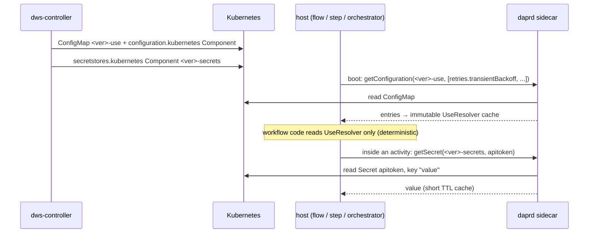

# ADR 0010: `use` Components as a Shared, Version-Scoped Store

- **Status:** Accepted (Decision 4a validated by spike, 2026-10-10 — see Decision 4a)
- **Date:** 2026-10-09
- **Context:** [`docs/roadmaps/openworkflow-features.md`](../roadmaps/openworkflow-features.md)
  §4g (Phase 7 split). This is the `UseResolver` refactor that comes before Phases 7a–7c.
- **Related:** [ADR 0001](0001-workflow-runtime-v2-decisions.md) Decision 2 (function images serve
  plain HTTP with no Dapr *Workflow* SDK — they are still Dapr-enabled apps with a sidecar), [ADR 0002](0002-workflow-compiler-strategy-split.md) (compiler
  strategies), [ADR 0004 — scope nodes](0004-scope-nodes-carry-their-own-configuration.md) (a
  `try-catch` node carries `retry`, which may be a *name*), Phase 4 `workflow-auth`
  (`use.secrets` → `secretKeyRef`, OAuth2 via Dapr middleware)

## Context

The five `use` components DWS supports today are resolved in two different ways, in two components,
by five separate lookups:

| `use.*` | Resolved in | When | Lookup | Unknown name |
|---|---|---|---|---|
| `secrets` | controller → orchestrator | compile time, then pod start | `semanticErrors` → `SECRET_<name>` env (`secretKeyRef`) → `WorkflowRuntimeBootstrap.secretScope` | compile error |
| `authentications` | controller | compile time | `policyOf()` + a second copy for AsyncAPI brokers | compile error |
| `errors` | orchestrator | task run | `RaiseErrorActivity.resolveError` | `IllegalStateException` mid-run |
| `retries` | orchestrator | task run | `CatchPolicy.resolvePolicy` | mid-run |
| `timeouts` | orchestrator | task run | `WorkflowSupport.namedTimeout` | mid-run |

The orchestrator-side three work only because v1 hands the orchestrator the **whole document**
(`WorkflowSupport.definition()`). The v2 runtime does not: each `dws-flow` / `dws-step` node gets
only its own node definition. A `try-catch` node carrying `retry: transientBackoff` (ADR 0004) has
nothing to resolve that name against.

Phase 7 would add a third pattern on top (functions, catalogs, extensions). Before that, the `use`
kinds need one model.

Not every `use` kind is the same kind of thing. Some are **data** a task reads; some shape
**infrastructure** that must exist before a pod starts; some are **code** that changes which nodes
and step services get deployed.

## Decision 1: Group the eight `use` kinds by what they compile into

| Group | `use.*` | Compiled into | Read by | When |
|---|---|---|---|---|
| **DATA** | `errors`, `retries`, `timeouts` | entries in a shared, version-scoped Dapr configuration store (Decision 2) | hosts, by name | host startup (Decision 3) |
| **CREDENTIALS** | `secrets` (as `$secrets` in `set`/`switch`) | a version-scoped Dapr secret store (Decision 4) | hosts, by name | inside activities |
| **AUTH** | `authentications` — `basic`, `bearer` on HTTP calls | a Wasm header-injecting middleware on the step's sidecar, configured from a controller-composed Secret (Decision 4a) | the Dapr sidecar | sidecar startup |
| **INFRA** | `authentications` — `oauth2`; `asyncapi` broker credentials | Dapr `HTTPEndpoint` + OAuth2 middleware `Component` + `Configuration`; binding `Component` metadata — unchanged (Decision 5) | the Dapr sidecar | sidecar startup |
| **CODE** | `functions`, `catalogs`, `extensions` | expanded into graph nodes / step services at compile time (Decision 6) | — | compile time |

**Rationale:** the split follows what the runtime can and cannot do after deploy. A host can read
data at any time. A sidecar reads its middleware pipeline only at startup. Nothing at runtime can
deploy a new step service, so anything that decides *which* step services exist must be resolved
by the controller.

## Decision 2: DATA kinds compile into one shared, version-scoped Dapr configuration store

Per workflow version, the controller emits:

1. An **immutable ConfigMap** `<definitionResource>-use`, one data key per entry:
   `<kind>.<name>` → the entry as JSON.
2. A **`configuration.kubernetes` Component** of the same name, `configMapName` pointing at it,
   `scopes` = every host app ID of that version (v1: the orchestrator; v2: every `dws-flow` and
   `dws-step` node).

Hosts read it through `DaprClient.getConfiguration(store, keys)` — the same call
`WorkflowDefinitionLoader` already uses for the definition.

```yaml
# from the use-retries / use-timeouts / use-errors examples
apiVersion: v1
kind: ConfigMap
metadata:
  name: order-flow-3f9c2a-use
immutable: true
data:
  retries.transientBackoff: '{"delay":{"seconds":2},"backoff":{"exponential":{}},"limit":{"attempt":{"count":5}}}'
  timeouts.fastCall:        '{"after":{"seconds":10}}'
  errors.outOfStock:        '{"type":"https://example.com/errors/out-of-stock","status":409,"title":"Out of stock"}'
---
apiVersion: dapr.io/v1alpha1
kind: Component
metadata:
  name: order-flow-3f9c2a-use
spec:
  type: configuration.kubernetes
  version: v1
  metadata:
    - name: configMapName
      value: order-flow-3f9c2a-use
scopes: [ order-flow-main, order-flow-get-pet-safely, order-flow-get-pet ]
```

Rules:

- **One store per version, shared by all its nodes.** Entries are written once, not copied into
  each node definition.
- **Immutable.** A version never changes its entries; a new definition is a new version with a new
  store. Running instances always see the values they started with.
- **Lifecycle follows the version stack.** Same labels as the definition ConfigMap; deleted with
  the version.
- **No secret value is ever written to the store.**
- **Key charset.** ConfigMap keys allow `[-._a-zA-Z0-9]`. A `use` entry name outside that set is
  rejected at compile time, the same way `use.secrets` is already restricted to DNS-1123.
- **Excluded:** `authentications` (Decisions 4a and 5) and the CODE kinds (Decision 6) are not
  stored.

**Why `configuration.kubernetes` over the chart-level `dws-definitions` Redis store:** version
immutability comes free (`immutable: true`), the lifecycle is tied to the version stack, the
controller writes no Redis keys, and it is the pattern the per-version definition already uses
(`StackSynthesizer.definitionConfigMap` + `configurationComponent`).

## Decision 3: Hosts load the entries they reference at startup, behind one `UseResolver`

- **Only hosts read the configuration store:** `dws-orchestrator`, `dws-flow`, `dws-step`. Step
  function images read neither store and never see a credential (Decision 4a).
- **Load at startup, never from workflow code.** A host knows from its own definition which names
  it references and fetches exactly those at boot into an immutable in-memory map. Dapr workflow
  code is replayed, so a store read inside it is non-deterministic I/O; an immutable per-version
  store loaded once at boot is always replay-safe.
- **Missing entry fails the boot**, not a running instance — earlier than today's mid-run
  `IllegalStateException`.
- **One resolver contract, `UseResolver`:** `(kind, reference) → entry`, with the "inline value,
  else look up by name" rule in one place. It replaces `resolveError`, `resolvePolicy` and
  `namedTimeout`. Implementations: one per host runtime — Java (`dws-orchestrator`, `dws-step`)
  and .NET (`dws-flow`).



## Decision 4: Secrets are pulled by name from a version-scoped Dapr secret store

This covers the `$secrets` scope in `set`/`switch` only; call credentials go through Decision 4a.

- The controller emits a **`secretstores.kubernetes` Component** `<definitionResource>-secrets`,
  `scopes` = the version's **host** app IDs only — never a step service, never a `dws-run` pod.
- Hosts call the Dapr secrets API (`getSecret(store, name)`) and read key **`value`** — the Phase 4
  operator convention (one Kubernetes Secret per declared name, data key `value`) is unchanged.
- **Read inside activities, never workflow code**, with a short TTL cache, so a rotated Secret is
  picked up without a pod restart.
- **The `UseResolver` refuses any name not declared in `use.secrets`.**
- **Replaces** the `SECRET_<name>` env projection on hosts.

**Trade-off accepted:** a missing Secret now fails at first use, not at pod start.

## Decision 4a: `basic`/`bearer` — a Wasm middleware injects the header; the controller composes its config

Step function images never handle credentials. They call the target through their sidecar, and a
Wasm HTTP middleware in the sidecar's `httpPipeline` composes and adds the `Authorization` header.
This is the OAuth2 shape (Decision 5) with a different middleware.

**Per version, per distinct (base URL, policy):**

| Resource | Content |
|---|---|
| `HTTPEndpoint` | `baseUrl` only, no headers; `scopes` = the step app IDs using this policy |
| Kubernetes `Secret` `<ver>-auth-<n>` | **composed by the controller**: one key `guestConfig` holding JSON — scheme, the endpoint it applies to, and the credential values read from the operator's Secrets |
| `Component` `middleware.http.wasm` | `url: file:///mnt/dws-wasm/<binary>`; `guestConfig` ← `secretKeyRef` to the Secret above; `auth.secretStore: kubernetes` (built-in, no secret store component); `scopes` = same step app IDs |
| `Configuration` | `httpPipeline` with that handler; the step pod opts in via `dapr.io/config` |

```
operator Secrets ──(controller reads at deploy)──► <ver>-auth-<n> Secret ──secretKeyRef──► wasm Component guestConfig
step image ──► daprd /v1.0/invoke/<endpoint>/method/... ──► [wasm: path matches → set Authorization] ──► HTTPEndpoint ──► target
```

**Guest behavior.** For a request to its own endpoint's invocation path only, set `Authorization` to
`Basic base64(user:pass)` or `Bearer <token>`; pass every other request through untouched.

**Step images.** One code path for every auth scheme — the one OAuth2 already uses: drop any
`Authorization` header, call the sidecar's invocation URL for the endpoint. Credential env vars
are removed. Applies to `dws-call-http`, `dws-call-openapi`, `dws-call-a2a`.

**Delivering the Wasm binary.**

- Built with **TinyGo 0.34.0** (pinned — see spike results) and wrapped in a small image (`busybox` base, for `cp`), published **public**
  on GHCR alongside the other component images — no pull secret. Versioned by release-please and
  released by hand, like every component.
- The controller adds to each step service that uses Decision 4a: an `emptyDir` volume, an init
  container (image pinned by digest) that copies the binary into it, and
  `dapr.io/volume-mounts: "<volume>:/mnt/dws-wasm"` so daprd reads it **read-only**.
- Init containers complete before a classic daprd sidecar starts, so the file exists when the
  component loads. `dapr.io/enable-native-sidecar` stays off for step services by default; the
  spike observed native daprd ordered after the app init container and working, but Dapr does not
  document that ordering.

**Why the controller composes the config (and copies secret values).** `guestConfig` is one
metadata field: one literal or one `secretKeyRef`, never a mix. A JSON combining the endpoint
filter with two basic-auth secrets can only exist as a Secret someone writes. Having the controller
write it keeps the OWS document authoritative (`${ $secrets.x }` still names the operator's
Secret) and keeps one Wasm binary for both schemes. Rejected: chaining raw-value middleware
instances (no place for the path filter, several role-specific binaries) and an operator-written
JSON Secret (breaks the OWS-to-Secret mapping).

**Exception — gRPC.** The HTTP pipeline does not see `call: grpc`. `dws-call-grpc` keeps today's
`secretKeyRef` env vars for basic/bearer.

**Spike results (2026-10-10)** — `spikes/wasm-auth-middleware/FINDINGS.md`, repeatable probe
`spikes/wasm-auth-middleware/verify.sh`. Local Docker Desktop cluster, daprd 1.18.1 (control plane
1.18.2), Knative Serving 1.21.2. **All 9 checks passed; verdict: adopt with changes.**

| Check | Result |
|---|---|
| Bearer / Basic header composed from the Secret JSON | ✅ `Bearer …` and `Basic base64(user:pass)` observed **at the target** (forwarded request, not response) |
| `secretKeyRef` on `guestConfig`, built-in `kubernetes` store | ✅ no secret value in any resource, pod spec, env var or default-level daprd log |
| Path / endpoint isolation | ✅ other path and other endpoint from the same pod received no `Authorization`; a caller-supplied header is overwritten |
| Init-container delivery, restart | ✅ file present before daprd loads components; also after restart |
| Native sidecar | ✅ worked (ordering observed, not documented) |
| Knative Service, scale-from-zero | ✅ after enabling the two `config-features` flags; one paired sample: +0.59 s cold start |
| One merged Configuration (2 Wasm handlers + tracing) | ✅ — direction for open question 1 |

**Changes the spike adds to this decision:**

- **Pin TinyGo 0.34.0** for `http-wasm-guest-tinygo` v0.4.0. TinyGo ≥ 0.35 builds a module that
  fails at request time (`module closed with exit_code(0)`). Revisit when the guest SDK supports
  newer TinyGo. Guest binary: 218 KB.
- **Step images must wait for their sidecar** before the first invocation. On a Knative cold start
  the app called daprd before it listened and got a 502; a retry after startup passed.
- **Dapr metrics port collides with Knative's queue-proxy (9090).** The spike moved daprd metrics to
  9095. The controller does not set `dapr.io/metrics-port` on Knative step services today, so this
  applies to **every** Dapr-enabled Knative step, not only Wasm ones — verify against current
  deployments.

**Fallback (not needed):** `HTTPEndpoint.headers[].secretKeyRef` pointing at the same
controller-composed Secret.

## Decision 5: OAuth2 stays deploy-time infrastructure

`oauth2` policies keep compiling into a version-scoped `HTTPEndpoint`, OAuth2 middleware
`Component` and Dapr `Configuration`, exactly as Phase 4 shipped. The sidecar builds its middleware
pipeline at startup, so this cannot be pulled at runtime. The `client.secret` expression is resolved
by the controller into a `secretKeyRef` on the Component, as today.

`asyncapi` broker credentials stay the same way: `secretKeyRef` entries in the version-scoped
binding `Component`'s metadata, read by the sidecar.

## Decision 6: Catalogs, functions and extensions are not stored

All three change the graph — which step services to deploy, which tasks a node wraps — so the
controller resolves them at compile time (Phases 7a/7b/7c). A catalog's `endpoint` is used only by
the controller, to fetch function definitions; it is never read at runtime.

## Consequences

- **One lookup path.** `resolveError`, `resolvePolicy`, `namedTimeout` and the duplicated auth
  lookup collapse into `UseResolver` per runtime.
- **v2 nodes resolve names without the full document**, which unblocks named `retry` / `timeout` /
  `raise.error` on `dws-flow` and `dws-step`.
- **New per-version resources:** 1 ConfigMap + 2 Components (`-use`, `-secrets`).
- **Per auth policy:** +1 composed Secret, +1 `HTTPEndpoint`, +1 Wasm `Component`, +1
  `Configuration`; per step pod using it: +1 init container, +1 `emptyDir`.
- **The controller now reads and writes Secrets.** Its Role in `charts/dws` gains `get` on
  Secrets (operator credentials) and `create`/`delete` on Secrets (composed configs), plus whatever
  `httpendpoints`/`configurations` verbs the OAuth2 path already needs — the chart Role today lists
  neither; verify.
- **A rotated credential takes effect only after a redeploy or re-sync** of the composed Secret
  and a sidecar restart. A missing operator Secret now fails **at deploy**, earlier than today.
- **Step images lose credential handling.** `dws-call-http`, `dws-call-openapi`, `dws-call-a2a`
  keep only the sidecar-invocation path; the controller and images must ship together.
- **Knative must allow init containers and `emptyDir`** — `config-features`:
  `kubernetes.podspec-init-containers` and `kubernetes.podspec-volumes-emptydir` (extensions, off
  unless enabled). Belongs with Helm Phase 11 (Knative) and a chart preflight.
- **A new component to release:** the Wasm image, built with TinyGo 0.34.0 pinned.
- **Step-service pod changes beyond Wasm:** sidecar-readiness wait in step images, and
  `dapr.io/metrics-port` moved off 9090 on Knative step services.
- **Each host sidecar initializes 2 more components** at startup. Both are scoped to the version's
  host app IDs only.
- **RBAC:** every host's service account needs `get`/`list`/`watch` on ConfigMaps and `get` on
  Secrets in the workflow namespace (the sidecar performs the reads). `charts/dws` and the
  controller's synthesized workloads must grant this.
- **ConfigMap size limit (1 MiB) per version store.** Entries are small; not expected to bind.
- **Rollout order:** v2 hosts first (they cannot work without it); the v1 orchestrator migrates last,
  removing its `WorkflowSupport.definition()` lookups.

## Implementation plan

| Track | Where | Content |
|---|---|---|
| **Credentials** (Decision 4a + merged Configuration) | OWS roadmap **Phase 4.1** (4.1a–4.1h), `docs/roadmaps/openworkflow-features.md` §4h | Applies to v1 now |
| **Data + `$secrets`** (Decisions 2, 3, 4) | v2 runtime phases 2b, 2c, 3a, 3c, 4, `docs/roadmaps/workflow-runtime-architecture-roadmap.md` "ADR 0010 integration" | No consumer before v2; v1's orchestrator is not migrated |
| **Code kinds** (Decision 6) | OWS Phases 7a/7b/7c | Unchanged |

## Open questions

1. **One Configuration per pod.** A pod names exactly one Dapr `Configuration` via `dapr.io/config`,
   already contended by OAuth2 and tracing (`StackSynthesizer.orchestratorAnnotations`); Decision 4a
   adds a third claimant, and a host's secret allowlist (`secrets.scopes`) would be a fourth.
   **Direction:** the controller composes **one merged Configuration per workload** (pipeline
   handlers + tracing + secret scopes); the spike proved two Wasm handlers + tracing in one
   Configuration work. Open: naming and lifecycle of per-workload Configurations, and how the
   chart-level `dws-tracing` Configuration's settings are copied in. Required before Decision 4a
   ships for traced steps.
2. **`$secrets` in jq** (`set`/`switch`): fetch per evaluation, or once per activity.

## Non-goals

- **Compile-time validation of references** (does `retry: x` name a declared policy?). Deliberately
  set aside; a separate decision. Decision 3's boot-time failure is a side effect, not a substitute.
- Implementing functions, catalogs or extensions (Phases 7a–7c).
- Changing OWS semantics or the operator's Secret convention.
