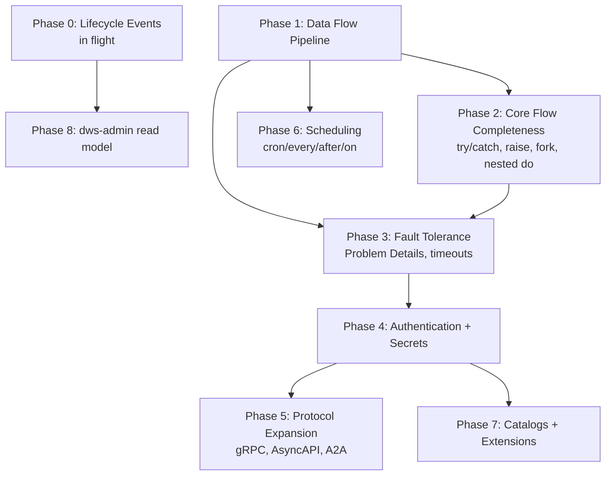

# OWS DSL Feature Roadmap

Gap analysis of [Open Workflow Spec DSL 1.0](https://github.com/open-workflow-specification/specification/blob/main/dsl.md) vs. current `dws-orchestrator`/`dws-controller` support, phased into build order.

## 1. Current task-type coverage

Two different readiness axes get conflated below — worth separating:

- **Control-flow tasks** (`switch`, `set`, `wait`, `listen`, `emit`) run **in-process** in `dws-orchestrator` (jq eval, Dapr timer/external-event/pub-sub primitives). No prebuilt image was ever needed for these, so they're genuinely done despite no new image work.
- **I/O tasks** (`call`, `run`) compile to a deployed **StepService backed by a prebuilt image**. Only `call: http` and `call: openapi` have a real image (`dws-call-http`, `dws-call-openapi`). `run` is wired in `WorkflowCompiler`/`TaskKind.RUN` and reads an `images.run()` config value, but **no `dws-call-run` component exists in the repo** — so `run` is compiler-ready, not deployment-ready.

| Task | Status | Notes |
|---|---|---|
| `call` (http) | ✅ | StepService via `dws-call-http` (built) |
| `call` (openapi) | ✅ | StepService via `dws-call-openapi` (built) |
| `call` (grpc/asyncapi/a2a) | ❌ | not started |
| `run` | ⚠️ | compiler emits a `StepService` referencing `images.run()`, but **no `dws-call-run` image exists** — undeployable today |
| `switch` | ✅ | inline jq eval, no image needed |
| `set` | ✅ | inline jq eval, no image needed |
| `wait` | ✅ | Dapr timer, no image needed |
| `listen` | ✅ | single external event only, no correlation (`one`/`any`/`all`); no image needed |
| `emit` | ✅ | pub/sub, no image needed |
| `for` | ⚠️ | recognized, throws `UnsupportedOperationException` |
| `try` | ⚠️ | recognized, throws `UnsupportedOperationException` — no catch/retry |
| `fork` | ❌ | not recognized |
| `raise` | ❌ | not recognized |
| nested `do` | ❌ | only the top-level task list is interpreted |

## 2. Cross-cutting spec features — status

| Feature | Status |
|---|---|
| Data flow (`input.from/schema`, `output.as/schema`, `export.as/schema`) | ❌ raw data passed through untransformed |
| Errors as Problem Details (RFC 7807) + standard error types | ❌ plain Java exceptions |
| Timeouts (workflow/task) | ❌ |
| Authentication (basic/bearer/oauth2) | ❌ |
| Secrets | ❌ |
| Catalogs / custom functions | ❌ |
| Extensions (`before`/`after` hooks) | ❌ |
| External resources | ❌ |
| Scheduling (`every`/`cron`/`after`/`on`) | ❌ controller deploys on `POST` only |
| Lifecycle events (CloudEvents) | ⚠️ in flight — `openspec/changes/event-publishing` |

## 3. Phase dependency graph

Data flow is the foundation: retry/catch, extensions, and error handling all read/write through `input`/`output`/`context`, so it must land before Phases 2–7 are worth building correctly.

## 4. Phased roadmap

| Phase | Scope | Components | Route |
|---|---|---|---|
| **0** (in flight) | Finish lifecycle CloudEvents publishing | controller, orchestrator | opsx (active change) |
| **0.5** | Build `dws-call-run` prebuilt image (script/shell/container) — `run` is compiler-wired but has no deployable image | new `dws-call-run` component | opsx — new component, same shape as `dws-call-http` |
| **1** | `input.from/schema`, `output.as/schema`, `export.as/schema`, validation faults | orchestrator | opsx — new capability |
| **2** | `try`/`catch`/`retry`, `raise`, `fork` (parallel), nested `do` | orchestrator | opsx — new capability |
| **3** | RFC 7807 error model, standard error types, task/workflow timeouts | orchestrator | opsx — new capability |
| **4** | `basic`/`bearer`/`oauth2` auth, secrets resolution | controller, orchestrator, call-http, call-openapi | opsx — new capability |
| **5** | gRPC, AsyncAPI, A2A call protocols | new `dws-call-grpc`/`dws-call-asyncapi`/`dws-call-a2a` images | opsx — new components |
| **6** | `schedule.every/cron/after/on` triggers | controller (Dapr Jobs API / cron binding) | opsx — new capability |
| **7** | Catalogs, custom functions, extensions (`before`/`after`), external resources | controller, orchestrator | opsx — new capability |
| **8** | `dws-admin` consumes lifecycle events into read model | dws-admin | opsx — depends on Phase 0 |

## 5. Rationale for ordering

- **1 before 2/3**: retry/catch and error handling are meaningless without a real input/output/context pipeline to operate on.
- **2 before 3**: `try`/`raise` define the fault surface that timeouts and Problem Details formatting attach to.
- **4 before 5/7**: new protocols and catalogs both need auth to call real external services.
- **6 is independent**: scheduling only touches the controller's trigger path, not the interpreter — can be pulled forward if needed.
- **8 last**: read model is a pure consumer of Phase 0's event contract; no orchestrator/controller changes required once events exist.
