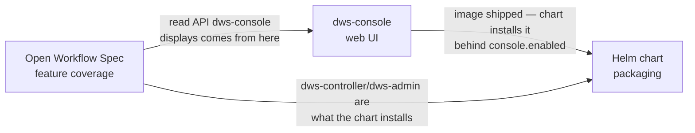

# Roadmaps

Seven independent roadmaps, one per surface. Each moves on its own timeline and has its own
"done" bar — read the one relevant to what you're touching.

| Roadmap | Surface | Current phase |
|---|---|---|
| [Open Workflow Spec feature coverage](openworkflow-features.md) | `dws-controller` + `dws-orchestrator` — DSL 1.0 task types and cross-cutting features | Phases 0–3 done (Phase 3 — RFC 7807 errors + timeouts — implemented and merged, `ows-phase3-errors-timeouts` not yet archived). Phase 4 (auth + secrets) implementation done, 19/21 tasks; blocked on a live-cluster Dapr OAuth path-isolation probe. Phase 5 (protocol expansion) in progress: `dws-call-grpc` shipped, `dws-call-asyncapi` designed and next. A2A was split out into its own deferred Phase 5.5 rather than bundled into Phase 5 |
| [`dws-console` web UI](dws-console.md) | Operator-facing web app (TanStack Start) + `dws-admin` push API | Phases 0–3 and 6 done — workflow browser + instance monitor wired live to `dws-admin` (SSE push, no polling), shipped as a container image built/smoke-tested by CI. Phase 4 (definition submission) done — tracked in detail as the submission roadmap's Phase 1 (editor) + Phase 2 (validation preview); Phase 5 (auth) is ⚠️ partial because its Dapr-gated write path remains, while the console OIDC client is done and bundled-IdP interoperability is deferred to auth-roadmap Phase 8. Detailed sequencing is split across [`dws-console-submission.md`](dws-console-submission.md) and [`dws-auth.md`](dws-auth.md) |
| [`dws-console` definition submission](dws-console-submission.md) | Console-side authoring UX: raw YAML/JSON editor, file upload, dry-run validation, read-only graph preview, exploratory editable canvas | Phases 1–3 done: definition editor, validation preview (two-layer spec + deployability validation, 2026-09-04), and file import + persisted draft (2026-09-05). Submission now goes through the authenticated `dws-admin` relay (OIDC bearer, same-origin `/dws-admin` via the Gateway) rather than straight to `dws-controller`. Phase 3 (file import + Zustand-persisted draft) done 2026-09-05. Phase 4 (workflow diagram) is next, not started; Phase 5 (visual editor) exploratory |
| [`dws-console` auth](dws-auth.md) | Login (OIDC/PKCE in the console) + a Dapr-gated write path from `dws-admin` to `dws-controller` | Phases 0 and 1 done. Phase 2 (Dapr bearer wiring for `dws-controller` + Service bypass fix) has **not** been started — corrected 2026-08-24; only the unrelated sidecar-enable annotations exist. Bundled-IdP browser sessions, RP logout, and the four deferred live checks are tracked separately as Phase 8 |
| [Helm chart packaging](helm-packaging.md) | `charts/dws` — cluster install of the control plane | **Phases 0–10 done** (updated 2026-09-19): control plane (controller, admin+DB with in-chart Postgres), Dapr as a conditional chart dependency + preflight check + sidecar self-heal hook, in-chart Bitnami Redis tied to `dapr.enabled` backing the `pubsub`/`dws-definitions`/actor-statestore Components with an end-to-end pub/sub assertion in CI, console templates behind `console.enabled` routed by the shared `apiGateway.*` Gateway API front door (which superseded the console-only Ingress and the nginx admin gateway), shared `defaults.*` pod config across every chart-owned Deployment, lint/template/kind-integration CI plus shell render-assertions, OCI publish to ghcr.io, and install/values documentation across the root README, `charts/dws/README.md` and `CLAUDE.md`. **Phase 11 (Knative — split out of Phase 4) is the only open phase**: entirely unstarted, independent of everything else, and arguably optional since `dws-controller` already ships pinned Knative bundles operators can apply themselves |
| [Observability](observability.md) | Cross-cutting — OpenTelemetry metrics, traces, and logs from every DWS component, chart-managed and controller-stamped alike | Restructured 2026-09-19 into **Track A** (ordinary Deployments — start now) and **Track B** (Knative step services — deferred). Phase 0-A closed: OTel Operator is a documented prerequisite + preflight, `dws-flow` is glibc so three annotations are the complete set, operator pinned to chart 0.123.0 / 0.159.0. **Phase 1 (chart surface — `dws-controller` + `dws-admin`) is ✅**: the live fixture admitted targeted Java/Node.js agents, the Collector received traces and metrics and its filelog/debug logs pipeline was exercised, and Jaeger captured connected controller/Dapr/admin event traces. The runnable orchestrator replay probe and a Postgres client span remain follow-up limitations (the test image is private and admin uses unsupported `postgres`-JS instrumentation). Phase 2a covers `dws-orchestrator` only; `dws-flow`/`dws-step` wait on [workflow-runtime-architecture-roadmap.md](workflow-runtime-architecture-roadmap.md) Phase 4. Track B waits on the Knative init-container spike, now scoped to just `dws-call-openapi`/`-asyncapi`/`-a2a` |
| [Target workflow runtime and visual architecture](workflow-visual-model.md) | Target .NET Flow, Java/Spring Step, Knative function delegation, and matching structural visual model | ❌ target defined — implementation pending |

## How they relate

- **OWS feature coverage** drives what `dws-admin`'s read model and API can show — `dws-console`
  is a consumer of that API, not an independent source of truth.
- **`dws-console`** no longer blocks Helm packaging: the console image shipped, Phase 6 is done, and
  the chart installs the console behind `console.enabled` with routing from its shared Gateway API
  front door (see [helm-packaging.md](helm-packaging.md)).
- **Helm packaging** is otherwise independent of DSL feature work — it only cares that
  `dws-controller`/`dws-admin` exist and expose a stable container image + config surface.

## Status legend

Used consistently across all docs: ✅ done · ⚠️ partial/stubbed · ❌ not started.
