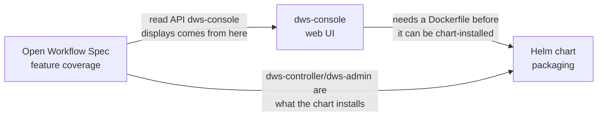

# Roadmaps

Five independent roadmaps, one per surface. Each moves on its own timeline and has its own
"done" bar — read the one relevant to what you're touching.

| Roadmap | Surface | Current phase |
|---|---|---|
| [Open Workflow Spec feature coverage](openworkflow-features.md) | `dws-controller` + `dws-orchestrator` — DSL 1.0 task types and cross-cutting features | Phases 0–3 done (Phase 3 — RFC 7807 errors + timeouts — implemented and merged, `ows-phase3-errors-timeouts` not yet archived). Phase 4 (auth + secrets) implementation done, 19/21 tasks; blocked on a live-cluster Dapr OAuth path-isolation probe. Phase 5 (protocol expansion) in progress: `dws-call-grpc` shipped, `dws-call-asyncapi` designed and next. A2A was split out into its own deferred Phase 5.5 rather than bundled into Phase 5 |
| [`dws-console` web UI](dws-console.md) | Operator-facing web app (TanStack Start) + `dws-admin` push API | Phases 0–3 and 6 done — workflow browser + instance monitor wired live to `dws-admin` (SSE push, no polling), shipped as a container image built/smoke-tested by CI. Phase 4 (definition submission) is next; Phase 5 (auth) is ⚠️ partial because its Dapr-gated write path remains, while the console OIDC client is done and bundled-IdP interoperability is deferred to auth-roadmap Phase 8. Detailed sequencing is split across [`dws-console-submission.md`](dws-console-submission.md) and [`dws-auth.md`](dws-auth.md) |
| [`dws-console` definition submission](dws-console-submission.md) | Console-side authoring UX: raw YAML/JSON editor, file upload, dry-run validation, read-only graph preview, exploratory editable canvas | Nothing started. Deliberately built against a public, unauthenticated `dws-controller` endpoint (CORS only) — no dependency on `dws-auth.md`, which guards/replaces this transport later |
| [`dws-console` auth](dws-auth.md) | Login (OIDC/PKCE in the console) + a Dapr-gated write path from `dws-admin` to `dws-controller` | Phases 0 and 1 done. Phase 2 (Dapr bearer wiring for `dws-controller` + Service bypass fix) has **not** been started — corrected 2026-08-24; only the unrelated sidecar-enable annotations exist. Bundled-IdP browser sessions, RP logout, and the four deferred live checks are tracked separately as Phase 8 |
| [Helm chart packaging](helm-packaging.md) | `charts/dws` — cluster install of the control plane | Phases 0–5 done (controller, admin+DB with in-chart Postgres, Dapr as a conditional chart dependency + preflight check + sidecar self-heal hook, controller-side Dapr sidecar annotations, in-chart Bitnami Redis subchart tied to `dapr.enabled`, `pubsub`/`dws-definitions`/actor-statestore Dapr Component templates, end-to-end pub/sub delivery assertion in CI) plus Phases 8–9 done (full lint/template/kind-integration CI, OCI publish to ghcr.io). Phase 6 (console) still blocked, Phase 10 (docs) not started, Phase 11 (Knative — split out of Phase 4) deferred and independent |

## How they relate

- **OWS feature coverage** drives what `dws-admin`'s read model and API can show — `dws-console`
  is a consumer of that API, not an independent source of truth.
- **`dws-console`** blocks Helm packaging Phase 6 (see [helm-packaging.md](helm-packaging.md#open-items)):
  the chart can't install a console that has no image yet.
- **Helm packaging** is otherwise independent of DSL feature work — it only cares that
  `dws-controller`/`dws-admin` exist and expose a stable container image + config surface.

## Status legend

Used consistently across all docs: ✅ done · ⚠️ partial/stubbed · ❌ not started.
