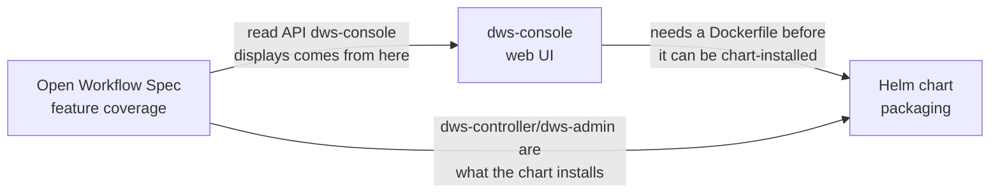

# Roadmaps

Three independent roadmaps, one per surface. Each moves on its own timeline and has its own
"done" bar — read the one relevant to what you're touching.

| Roadmap | Surface | Current phase |
|---|---|---|
| [Open Workflow Spec feature coverage](openworkflow-features.md) | `dws-controller` + `dws-orchestrator` — DSL 1.0 task types and cross-cutting features | Phase 2, slice 2.1 done (`try`/`catch`/`retry`, merged) — slice 2.2 (`raise`) next |
| [`dws-console` web UI](dws-console.md) | Operator-facing web app (TanStack Start) | Phase 2.5 (workflow browser + instance monitor UI built, wiring to live `dws-admin` API next) |
| [Helm chart packaging](helm-packaging.md) | `charts/dws` — cluster install of the control plane | Phase 0–1 (scope confirmed, scaffold not started) |

## How they relate

- **OWS feature coverage** drives what `dws-admin`'s read model and API can show — `dws-console`
  is a consumer of that API, not an independent source of truth.
- **`dws-console`** blocks Helm packaging Phase 5 (see [helm-packaging.md](helm-packaging.md#open-items)):
  the chart can't install a console that has no image yet.
- **Helm packaging** is otherwise independent of DSL feature work — it only cares that
  `dws-controller`/`dws-admin` exist and expose a stable container image + config surface.

## Status legend

Used consistently across all three docs: ✅ done · ⚠️ partial/stubbed · ❌ not started.
