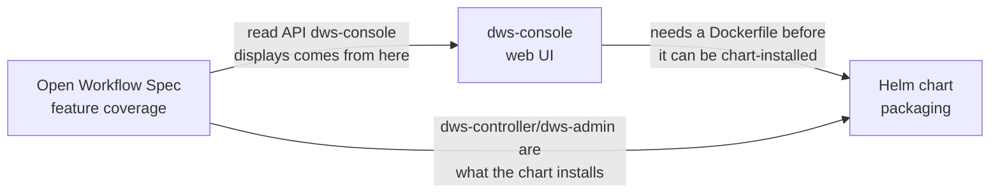

# Roadmaps

Five independent roadmaps, one per surface. Each moves on its own timeline and has its own
"done" bar — read the one relevant to what you're touching.

| Roadmap | Surface | Current phase |
|---|---|---|
| [Open Workflow Spec feature coverage](openworkflow-features.md) | `dws-controller` + `dws-orchestrator` — DSL 1.0 task types and cross-cutting features | Phase 2 done — all slices shipped (`try`/`catch`/`retry`, `raise`, `for`, `fork` + generalized nested `do`: `try-catch-retry`, `raise-task`, `for-task`, `fork-task`). Phase 3 (RFC 7807 error model, timeouts) next |
| [`dws-console` web UI](dws-console.md) | Operator-facing web app (TanStack Start) + `dws-admin` push API | Phase 2.5 done — workflow browser + instance monitor wired to the live `dws-admin` read API. Phase 3 (live updates) next — scope now spans both repos: build the `dws-admin` push API and wire the console to it. Phases 4 (definition submission) and 5 (auth) unblocked and available in parallel — see [`dws-auth.md`](dws-auth.md), which now owns the detailed sequencing for both |
| [`dws-console` auth](dws-auth.md) | Login (OIDC/PKCE in the console) + a Dapr-gated write path from `dws-admin` to `dws-controller` | Phase 0 (Dex as an in-chart IdP) next — nothing started yet |
| [Helm chart packaging](helm-packaging.md) | `charts/dws` — cluster install of the control plane | Phases 0–5 done (controller, admin+DB with in-chart Postgres, Dapr as a conditional chart dependency + preflight check + sidecar self-heal hook, controller-side Dapr sidecar annotations, in-chart Bitnami Redis subchart tied to `dapr.enabled`, `pubsub`/`dws-definitions`/actor-statestore Dapr Component templates, end-to-end pub/sub delivery assertion in CI) plus Phases 8–9 done (full lint/template/kind-integration CI, OCI publish to ghcr.io). Phase 6 (console) still blocked, Phase 10 (docs) not started, Phase 11 (Knative — split out of Phase 4) deferred and independent |
| [Target workflow runtime and visual architecture](workflow-visual-model.md) | Target .NET Flow, Java/Spring Step, Knative function delegation, and matching structural visual model | ❌ target defined — implementation pending |

## How they relate

- **OWS feature coverage** drives what `dws-admin`'s read model and API can show — `dws-console`
  is a consumer of that API, not an independent source of truth.
- **`dws-console`** blocks Helm packaging Phase 6 (see [helm-packaging.md](helm-packaging.md#open-items)):
  the chart can't install a console that has no image yet.
- **Helm packaging** is otherwise independent of DSL feature work — it only cares that
  `dws-controller`/`dws-admin` exist and expose a stable container image + config surface.

## Status legend

Used consistently across all three docs: ✅ done · ⚠️ partial/stubbed · ❌ not started.
