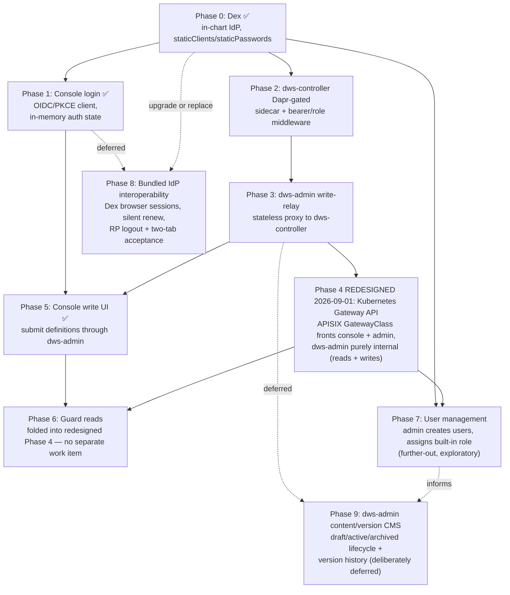

# `dws-console` Auth Roadmap

Supersedes the `dws-console.md` Phase 4 (definition submission) / Phase 5 (auth) split — those
can't ship safely in isolation (an unauthenticated write path is a bad default), so this tracks
them as one dependency-ordered sequence. `dws-console.md` should link here once this lands.

Ground rules decided during design, carried through every phase below:

- Login lives in the React app (OIDC Authorization Code + PKCE, public client, token in memory —
  never `localStorage`).
- JWT/role verification is Dapr-only, never hand-rolled in app code — `middleware.http.bearer` (+
  optional role/Rego middleware) on each sidecar that needs to gate something.
- `dws-console` only ever calls `dws-admin`. `dws-controller` is purely internal, reached only by
  `dws-admin`, server-to-server, through `dws-admin`'s own sidecar.
- Reads stay unauthenticated for now — guarding them was originally a deliberately separate
  later phase (6); as of 2026-09-01 that work is folded into a redesigned Phase 4 instead of
  a standalone phase (see §2b).

## 1. Phase dependency graph

## 2. Phased roadmap

| Phase | Scope | Depends on | Status |
|---|---|---|---|
| **0** | Add Dex as an optional in-chart dependency (toggle like `postgresql.enabled`); `staticPasswords` for dev users, `staticClients` registers `dws-console` as a public PKCE client; auto-generate a bootstrap admin login (see §2a) | — | ✅ done |
| **1** | React OIDC client (Authorization Code + PKCE), in-memory token, silent-renew integration, logout integration, additive unauthenticated reads | Phase 0 | ✅ done — implementation merged in `ed1fdfc2`; local gates, chart contract checks, live discovery/CORS/PKCE request evidence, and failure-state handling are verified. Bundled-Dex interoperability acceptance moved to Phase 8 |
| **2** | Enable `dws-controller`'s Dapr sidecar (`dapr.io/enabled`/`app-id`/`app-port`); add a bearer `Component` and a `Configuration` wiring it to the inbound pipeline; route the Service through Dapr and keep the app port pod-local | Phase 0 (needs the IdP's JWKS endpoint) | ✅ done — landed via `dws-console-auth-phase-2` (see `openspec/changes/dws-console-auth-phase-2/verify.md`); live Dapr + Dex authorization matrix (no-auth / valid / malformed / tampered-sig / wrong-aud / wrong-iss) all rejected before controller; Service-level bypass closed by sidecar front-port. Pod-IP:8080 residual documented for follow-up |
| **3** | New route in `dws-admin`: stateless relay that forwards the `Authorization` header + body to `dws-controller` via `dws-admin`'s own local sidecar invoke call. No verification logic — `dws-admin` never inspects the token. Kept intentionally minimal: no draft/version/state modeling here — that's scoped separately as Phase 9 | Phase 2 | ✅ done — `POST /workflows` on `dws-admin` (new `controller-relay` module) forwards `Authorization` header and raw body verbatim to `http://<sidecar>/v1.0/invoke/<controller-app-id>/method/workflows` (dryRun query preserved); Nest's raw-body mode keeps YAML/JSON bytes untouched so the controller's content-hashed version is stable across the relay. No token parsing anywhere in `dws-admin`. New env var `DAPR_CONTROLLER_APP_ID` (defaults to `dws-controller`) |
| **4** | **Redesigned 2026-09-01, refined 2026-09-01 (see §2b)**: front both `dws-console` and `dws-admin` with a Kubernetes **Gateway API** (`Gateway` + `HTTPRoute`), implemented by **Apache APISIX** as the `GatewayClass` controller, bundled as an optional chart dependency (`apisix.enabled`, same pattern as `dex`/`dapr`/`postgresql`). Covers reads *and* writes, not just the write relay, and replaces `dws-console`'s existing plain `Ingress` too, not just adds an admin front door. `dws-admin` becomes purely internal, reached only via its Dapr sidecar's bearer-gated invoke path, exactly as `dws-controller` is reached only through `dws-admin` today. Supersedes both the bundled `admin-gateway` nginx approach and `templates/console/ingress.yaml` | Phase 3 | 🟡 chart-side implementation landed 2026-09-02 (`openspec/changes/api-gateway/`, Tasks 5–8; see §2c) — APISIX pinned as an optional dependency, `apiGateway.*`/`apisix.*` values and preflight, the `GatewayClass`/`GatewayProxy`/`Gateway`/two-`HTTPRoute` topology, sidecar-only admin Service in gateway mode, and removal of the `admin-gateway` nginx + console `Ingress` templates (with a legacy-value migration trap) are all in `charts/dws` and covered by chart render/lint gates. Still open: the `dws-admin` app-side single-app-port/dual-listener consolidation and the `dws-console` bearer-authenticated JSON/SSE client (Tasks 1–2, application code, tracked separately) must land before this front door can be safely turned on in a real cluster, and live SSE-over-Dapr/APISIX verification remains explicitly deferred (see §2c) |
| **5** | Console definition-submission UI calls the Phase 3 `dws-admin` relay directly with the bearer token attached; reads keep using the existing direct `dws-admin` path unchanged | Phases 1 and 3 | ✅ done — live Docker Desktop acceptance passed on 2026-08-31; direct relay is the permanent Phase 5 routing decision |
| **6** | **Folded into the redesigned Phase 4 (2026-09-01, see §2b)**: the admin-ingress redesign fronts reads and writes alike, so guarding reads is no longer a separate later phase — it ships as part of Phase 4's implementation | Phase 4 (redesigned) | ❌ not started — no separate work item; tracked here only so the original scope isn't lost if the redesign changes again |
| **7** | User management: an admin-only console screen to create users and assign one of a small set of built-in roles (e.g. `admin`/`operator`/`viewer`). New `dws-admin` route, reusing Phase 4's gateway + Dapr role check (only `admin`-role tokens may call it), which manages users through **Dex's own gRPC management API** — no user/password storage or hashing added to DWS's own database | Phases 0, 4 | ❌ not started — further-out, exploratory; see §4 for a real open risk before committing to this shape |
| **8** | Make the bundled development IdP satisfy the browser client contract: adopt a released Dex version/configuration (or another in-chart IdP) with non-interactive `prompt=none` browser sessions and advertised RP-initiated logout; then verify token-expiry renewal, clean renewal failure, authenticated storage, logout, route restoration, and two-tab convergence | Phases 0, 1 | ❌ deferred — Dex 2.44.0 lacks the required browser-session and `end_session_endpoint` behavior; owns deferred checklist tasks 6.1, 6.2, 7.2, and 8.3 |
| **9** | Content/version management (CMS layer) in `dws-admin`: own the workflow draft → active → archived lifecycle and version history as `dws-admin`'s own authored data, not a projection of controller events. Controller-reported deployment status (`applied`/`failed`/`drained`/`collected`) becomes a nested, controller-owned status on whichever version is `active` — never a competing lifecycle. Foundation for later per-user read/edit permissions on content (extends Phase 7's role model) | Phase 3 | ❌ not started — deliberately deferred; scoped down 2026-08-26 so Phase 3 ships as a plain stateless forward first |

### Current progress (2026-09-01)

- Phase 0 is complete.
- Phase 1's console code, PKCE configuration, sign-in/identity/logout UI, SSR integration, unit
  coverage, and root redirect are merged. Fresh gates are green: lint, typecheck, 57 tests, build,
  Helm lint, and a rendered public-client/no-secret/root-redirect check.
- A live Docker Desktop release (`dws-phase1` in namespace `dws-phase1`) used issuer
  `http://localhost:5556`, console root `http://localhost:3000/`, and the Helm-NOTES bootstrap
  credentials. Discovery, `/auth`, `/token`, `/keys`, PKCE S256, and browser CORS were verified.
- The live run found and fixed a chart defect: Dex had no `web.allowedOrigins`, so browser discovery
  was blocked by CORS. The config now derives `http://localhost:3000` from the registered root
  redirect. The console also reports `Authentication unavailable` when OIDC initialization fails,
  while keeping unauthenticated reads available.
- Phase 1 is complete for the provider-agnostic console client. The live run also established that
  chart-pinned Dex 2.44.0 is not a compliant acceptance provider: it sends hidden-iframe
  `prompt=none` requests to its interactive login form until `oidc-spa` times out, and discovery has
  no `end_session_endpoint`. Those provider-specific implementation and acceptance requirements now
  belong to deferred Phase 8. They have **not** been marked verified. Dex tracks the missing native
  browser-session/RP-logout capability in
  [dexidp/dex#4560](https://github.com/dexidp/dex/issues/4560); no local-only logout fallback was
  accepted.
- Phase 2 is complete. Change `dws-console-auth-phase-2`
  (`openspec/changes/dws-console-auth-phase-2/`) landed: controller Deployment now carries
  `dapr.io/app-port: "8080"` unconditionally and `dapr.io/config` when `auth.enabled=true`;
  new `middleware.http.bearer` Component (scoped to the controller app-id) and Configuration
  (`spec.appHttpPipeline.handlers`) render from `templates/controller/auth-*.yaml`; the
  controller Kubernetes Service front-ports the Dapr sidecar's HTTP port (`3500`) when auth is
  on, closing the Service-based bypass; new `auth.*` values contract supports both external
  OIDC and derived-from-Dex mode. Local `helm lint` and rendered-output gates are green in both
  modes. Live gates ran on a Docker Desktop cluster in namespace `dws-phase2` against in-chart
  Dex 2.44.0: valid Dex-issued JWT reached the target via Dapr service invocation (200); no
  `Authorization` header, malformed token, tampered signature, wrong-audience, and wrong-issuer
  variants each returned 401 from the sidecar with no controller-container request-log entry;
  kubelet liveness/readiness probes stayed Ready throughout. Full evidence including the auth
  matrix, cluster context, sidecar loopback binding (`127.0.0.1:3500`), and the helm test
  Job result is in the change's `verify.md`. One residual is captured for follow-up: direct
  `POST <pod-ip>:8080` still bypasses the sidecar on CNIs without NetworkPolicy enforcement
  (kindnet does not enforce; the target cluster in this run did not enforce either). Closing
  that surface needs either a CNI-aware NetworkPolicy or binding the controller container to
  `127.0.0.1:8080` — both out of scope for this chart-only phase and tracked separately.
- Phase 3 is complete. `dws-admin` has a new `controller-relay` module exposing `POST /workflows`
  that forwards the incoming `Authorization` header and raw request body verbatim to
  `dws-controller` via `dws-admin`'s own local Dapr sidecar
  (`POST http://<daprHost>:<daprPort>/v1.0/invoke/<controller-app-id>/method/workflows`, with
  the `dryRun` query preserved). Nest is booted with `rawBody: true` so YAML and JSON payloads
  reach the controller byte-for-byte — that's what keeps the controller's content-addressed
  version stable across the hop. The relay never decodes, verifies, or otherwise inspects the
  token: token verification is Dapr's job (Phase 2's bearer middleware on the controller's
  sidecar), and no JWT library was added to `dws-admin`. Configured via a new
  `DAPR_CONTROLLER_APP_ID` env var (default `dws-controller`). Local gates: 5 new unit tests
  cover header-verbatim forwarding, byte-for-byte body preservation (YAML sample deliberately
  chosen so any JSON round-trip would mutate it), sidecar-invoke URL shape (asserts the relay
  hits `/v1.0/invoke/.../method/workflows`, never the controller's own port),
  no-Authorization pass-through, and `dryRun` query propagation; the existing 47 tests still
  pass; `pnpm lint` and `pnpm build` both green.
- Phase 4's chart-side implementation is landed via `dws-console-auth-phase-4`
  (`openspec/changes/dws-console-auth-phase-4/`). New `templates/admin-gateway/` directory
  ships an nginx `Deployment` + `Service` + `ConfigMap`; the ConfigMap's `default.conf`
  gates by `adminGateway.corsOrigins`, terminates the browser CORS preflight with `204`
  locally, and `proxy_pass`es everything else to
  `http://<admin fullname>.<ns>.svc.cluster.local:3500/v1.0/invoke/<admin fullname>/method/workflows`
  — the Dapr service-invocation URL that forces the sidecar's bearer middleware to run.
  `templates/admin/service.yaml` now front-ports the sidecar's `3500` when
  `auth.enabled=true` (mirroring the Phase 2 controller Service change); the admin pod
  carries `dapr.io/config: <admin fullname>-config` in the same condition; new
  `templates/admin/auth-component.yaml` + `auth-configuration.yaml` mirror the Phase 2
  controller templates exactly and reuse the `auth.*` values contract verbatim so a token
  minted for the console is accepted by both sidecars. Off-by-default: with
  `adminGateway.enabled=false` (default) `helm upgrade` renders no gateway objects. Local
  gates all green: `helm lint` defaults / auth-on / gateway-on all pass; `helm template`
  defaults renders zero gateway/admin-auth objects; `helm template` with `auth.enabled=true`
  renders the admin `-auth` Component + `-config` Configuration, the `dapr.io/config`
  annotation on the admin pod, and the admin Service's second port (`dapr-http` → 3500);
  `helm template` with `adminGateway.enabled=true` + `corsOrigins` renders the three
  gateway objects and the ConfigMap contains the `Access-Control-Allow-Origin`,
  `Access-Control-Allow-Methods "POST, OPTIONS"`, `Access-Control-Allow-Headers
  "Authorization, Content-Type"`, `return 204` (preflight), and `proxy_pass` blocks;
  render-time guards fail with explicit messages when `corsOrigins` is empty or contains
  `"*"`. The 2026-09-01 Docker Desktop matrix passed preflight (204), disallowed origin
  (403), no/malformed/tampered/wrong-audience/wrong-issuer tokens (all 401), direct reads and
  SSE (all 200), uninstall cleanup, and gateway-disabled reinstall (zero gateway objects).
  It also found and fixed two nginx bugs: duplicate upstream `Access-Control-Allow-Origin: *`
  on credentialed responses, and dynamic `$is_args$args` proxying that required an undeclared
  DNS resolver. The remaining blocker is architectural: `dws-admin`'s Nest relay is on 3000,
  its Dapr subscription server is on 3001, and one Dapr sidecar has only one app-port. The
  chart targets 3001, so a valid JWT currently ends at `Cannot POST /workflows`; a temporary
  app-port 3000 patch proves the end-to-end relay and dry-run behavior but would break pub/sub.
- Phase 5 is complete. Live acceptance ran on Docker Desktop in `dws-phase5` against a console
  built with `VITE_DWS_ADMIN_URL=http://localhost:3001` and Dex issuer
  `http://host.docker.internal:5556`; the bootstrap admin completed Dex login and submitted a
  valid YAML definition through the shipped direct `dws-console -> dws-admin -> controller`
  relay. The console rendered the new `ApplyResult` success (`201`), the idempotent success
  (`200`, `created: false`), controller `400 errors[]` validation feedback, and a deliberately
  invalidated-token `401` request failure. The controller created the corresponding definition
  ConfigMap and orchestrator Deployment. Acceptance also fixed the console image's missing
  `VITE_OIDC_*` build arguments, external-Dapr admin sidecar injection/controller app-id chart
  wiring, and YAML raw-body forwarding in the Phase 3 relay.
- **Routing decision (2026-08-31):** Phase 5 permanently uses the shipped direct
  `dws-console -> dws-admin POST /workflows` route. The controller sidecar remains the bearer
  gate for this flow.
- **Phase 4 redesigned (2026-09-01), Phase 6 folded in — see §2b.** The shipped
  `admin-gateway` nginx is superseded by a Kubernetes Gateway API deployment (`Gateway` +
  `HTTPRoute`, implemented by Apache APISIX as the `GatewayClass` controller) fronting
  `dws-console` and `dws-admin` alike, covering reads and writes, so `dws-admin` never faces
  client requests directly (same relationship `dws-controller` has with `dws-admin`). Phase 6
  no longer exists as a separate later phase. Both console and admin move onto the same
  `Gateway` (true same-origin, not just CORS-permitted), and APISIX ships as an optional chart
  dependency (`apisix.enabled`) matching the existing Dex/Dapr/Postgres/Redis pattern rather
  than assuming it's pre-installed. Three prerequisites are still open and block implementation:
  `dws-admin`'s single-app-port/dual-listener conflict, an unverified assumption that SSE
  survives a Dapr service-invocation hop, and Gateway API CRDs being present before APISIX's
  controller functions. No implementation yet; no formal openspec proposal drafted.
- Phase 7 has not started — it still depends on the (redesigned) Phase 4 write surface. Phase 8
  is explicitly deferred until a released compatible IdP is available or the chart deliberately
  adopts a different one.

**Next up:** resolve `dws-admin`'s dual-listener/single-Dapr-app-port conflict and spike whether
SSE survives a Dapr service-invocation hop — both block the redesigned Phase 4/6 regardless of
gateway choice (§2b) — then draft a formal openspec proposal for it (superseding
`dws-console-auth-phase-4`). Follow-ups (not blocking):
add the `DAPR_CONTROLLER_APP_ID` env var to `dws-admin`'s chart Deployment (currently the
default `dws-controller` works only for a release named `dws`); close the pod-IP
direct-app-port bypass on the controller (either CNI-aware NetworkPolicy or
`quarkus.http.host=127.0.0.1`) — the live Phase 2 run confirmed that surface is still
reachable from other pods on NP-non-enforcing CNIs.

## 2a. Phase 0 detail — bootstrap admin user

So there's always a working login right after `helm install` with the console/Dex enabled, without
anyone hand-editing `values.yaml` with a password:

- Generate the password in-template with `randAlphaNum`, guarded by `lookup` against the existing
  Secret so `helm upgrade` doesn't rotate it on every release (the standard Bitnami-chart pattern
  for admin passwords).
- Hash it with Sprig's `bcrypt` function for Dex's `staticPasswords[].hash` — Dex requires bcrypt,
  and this keeps the whole thing template-only, no Job/script needed.
- Store email + plaintext password in a new chart-managed Secret (e.g.
  `{{ include "dws.dex.fullname" . }}-admin-credentials`), same `existingSecret`-override shape
  already used for the Postgres/admin DB URL — never in `values.yaml` itself.
- Default identity configurable (`dex.adminUser.email`, e.g. `admin@dws.local`); password is
  generated, never user-supplied by default.
- `charts/dws/templates/NOTES.txt` prints the `kubectl get secret ...` email/password retrieval
  commands after install/upgrade — the standard place Helm surfaces a generated credential.

## 2b. Phase 4 redesign (2026-09-01, refined 2026-09-01) — Kubernetes Gateway API via APISIX, `dws-admin` purely internal

**Context.** The shipped `admin-gateway` (bundled nginx, `dws-console-auth-phase-4`) only ever
fronted the write route (`POST /workflows`) and left reads on the original direct,
unauthenticated `dws-admin` Service — that split is why Phase 6 existed as a separate later
phase. Its live acceptance run (2026-09-01) passed preflight, the full negative-token matrix,
direct reads/SSE, cleanup, and disabled-gateway reinstall, but hit one real blocker: `dws-admin`
runs two HTTP listeners in one pod (Nest on `3000` owns reads/SSE/the write relay;
`@dbc-tech/nest-dapr`'s own server on `3001` owns Dapr pub/sub subscription callbacks), and a
Dapr sidecar accepts only one `app-port`. The chart correctly points it at `3001` (breaking that
would silently stop the read model and SSE feed from receiving `dws.events`), so a
sidecar-routed, bearer-verified request never reaches `POST /workflows` — full findings in the
archived change's `verify.md`.

**Decision.** `dws-admin` should not face client requests at all — the same relationship
`dws-controller` already has with `dws-admin`. A single front door fronts both `dws-console` and
`dws-admin`'s API, and it fronts **reads and writes alike**, not just the write relay. Its backend
for admin traffic still targets `dws-admin`'s sidecar-fronted Service port so the Dapr bearer
middleware actually runs — the gateway alone doesn't verify anything, Dapr does. This is why
Phase 6 (§2, above) is folded into this redesign rather than kept separate: one front door, one
gate, for every route.

**Refinement (2026-09-01).** The front door is the Kubernetes **Gateway API** (`Gateway` +
`HTTPRoute` resources, not plain `Ingress`), with **Apache APISIX** as the `GatewayClass`
controller implementation. Scope is **both** `dws-console` and `dws-admin` on the same `Gateway`
— not admin alone — so browser calls to both are genuinely same-origin (one host, one
`Gateway`), not merely CORS-permitted across two origins. This supersedes
`templates/console/ingress.yaml` as well as the bundled `admin-gateway` nginx: `dws-console`'s
existing plain `Ingress` goes away in favor of an `HTTPRoute` on the shared `Gateway`, not a
second, parallel front door. APISIX ships as an **optional chart dependency**
(`charts/dws/Chart.yaml`, `condition: apisix.enabled`), matching the existing
`postgresql`/`dapr`/`dex`/`redis` pattern, rather than assuming an APISIX/Gateway API controller
is already installed in-cluster.

This also corrects a mistake in the original Phase 4 `design.md`, which chose a bundled nginx
*"because nothing else assumes an external ingress controller."* `dws-console` has assumed one
(`templates/console/ingress.yaml`, a plain `networking.k8s.io/v1 Ingress`) since before this
roadmap existed — the bespoke nginx solved a problem the chart already had a working, consistent
answer for. Side benefits of switching: with console and admin on one `Gateway` host, the
browser's API calls become same-origin, removing CORS handling (and `adminGateway.corsOrigins`,
and the bundled nginx image) from the picture entirely rather than merely terminating the
preflight; and `dws-admin`'s `src/config/cors.ts` module (flagged as a cleanup item since Phase
4's original design) becomes fully unnecessary rather than just redundant.

**Three prerequisites, independent of one another and of the gateway technology choice:**

1. `dws-admin`'s single-app-port/dual-listener conflict (above) must be resolved before *any*
   sidecar-routed request — read or write — can reach it. Options raised but not decided: merge
   the pub/sub callback route into Nest's own HTTP server (dropping `@dbc-tech/nest-dapr`'s
   separate-server model, since Dapr's programmatic-subscription contract is just an HTTP route
   Dapr POSTs to — nothing requires a dedicated server); or split `dws-admin` into two Dapr
   app-ids (one for the API surface, one for pub/sub ingestion), each with its own sidecar and
   app-port. Dapr's *streaming* subscriptions would sidestep the conflict entirely (no HTTP
   route needed at all), but they aren't documented as supported in the Node.js SDK today.
2. SSE (`GET /instances/:id/events`) has never been proven to survive a Dapr service-invocation
   hop — every SSE pass to date (including the 2026-09-01 run) used the direct, unauthenticated
   Service path deliberately, since reads weren't yet gated. Needs an early spike before this
   redesign is built out, not an assumption.
3. Gateway API CRDs (`Gateway`, `HTTPRoute`, `GatewayClass`, etc.) must already exist in-cluster
   before APISIX's controller can reconcile anything — the same class of precondition
   `charts/dws/Chart.yaml`'s Dapr dependency already documents (a preflight check that fails
   install/upgrade if the expected CRDs aren't present when `apisix.enabled=false` but the
   chart is pointed at an external APISIX). Also: migrating `dws-console` off its existing
   `console.ingress` onto the shared `Gateway` is itself a breaking change for any install
   already running with `console.ingress.enabled=true` — needs a documented migration path,
   not a silent behavior change. **Closed (2026-09-03)**: this migration path is now
   documented in [`charts/dws/README.md`](../../charts/dws/README.md#upgrading-from-a-pre-gateway-release)
   and rehearsed against a live cluster by
   [`scripts/verify-console-ingress-migration.sh`](../../scripts/verify-console-ingress-migration.sh),
   which also surfaced a real gap not visible from `helm template`/`helm lint` alone: bundled
   APISIX (`apisix.enabled=true`) can only be turned on via a fresh `helm install`, not via
   `helm upgrade` on an existing release (it deadlocks on the bundled etcd sub-chart's
   `pre-upgrade` hook) — an existing release must migrate through external APISIX mode instead.
   `helm rollback` to the pre-migration revision was verified to work cleanly.

**Status.** Redesign direction and gateway technology (Kubernetes Gateway API via APISIX, both
console + admin, bundled as an optional chart dependency) are recorded here and, as of
2026-09-02, the `charts/dws` side is implemented — see §2c for what shipped and what remains.

## 2c. Phase 4 chart implementation (2026-09-02) — `charts/dws` Tasks 5–8

Implements the `openspec/changes/api-gateway` plan's chart-side tasks (5 through 8) inside
`charts/dws` only; the app-side `dws-admin`/`dws-console` tasks (1–2 in that same change) are
separate work.

- **Dependency (Task 5).** `charts/dws/Chart.yaml` pins `apisix` at chart `2.16.0`
  (APISIX `3.17.0`) from `https://apache.github.io/apisix-helm-chart`,
  `condition: apisix.enabled`. `Chart.lock` and the vendored
  `charts/dws/charts/apisix-2.16.0.tgz` are checked in and kept in sync via
  `helm dependency update`. Bundled defaults (`apisix.ingress-controller.enabled=true`,
  `gatewayProxy.createDefault=false`) enable the subchart's own Gateway API reconciliation while
  leaving GatewayProxy ownership to this chart (§2c below). `apisix.enabled` stays `false` by
  default — enabling it is strictly opt-in, same as `dex`/`postgresql`.
- **Values and validation (Task 6).** `apiGateway.*` (enabled, `createGatewayClass`,
  `gatewayClassName`, `controllerName`, `hostname`, `tls.enabled`/`tls.certificateName`,
  `external.gatewayProxyName`) is the operator-facing contract; `apisix.*` configures the bundled
  dependency. `dws.apiGateway.validate` (in `_helpers.tpl`, called unconditionally from
  `templates/preflight.yaml`) fails render when `apiGateway.enabled=true` and any of
  `auth.enabled`/`admin.enabled`/`console.enabled` is false, when `createGatewayClass=false` has
  no explicit `gatewayClassName`, when external mode (`apisix.enabled=false`) has no
  `apiGateway.external.gatewayProxyName`, or when `tls.enabled=true` has no
  `tls.certificateName`. `dws.preflight.apiGateway` additionally requires
  `gateway.networking.k8s.io/v1` and `apisix.apache.org/v1alpha1` in the cluster's
  `.Capabilities.APIVersions` whenever `apiGateway.enabled=true` and `apisix.enabled=false` —
  skipped entirely in bundled mode so a first `apisix.enabled=true` install isn't false-failed by
  Helm's pre-CRD-install capability snapshot (mirrors the existing Dapr preflight precedent).
- **Gateway topology (Task 7).** `charts/dws/templates/api-gateway/` renders a
  release-and-namespace-qualified `GatewayClass` (cluster-scoped; skipped when
  `createGatewayClass=false` in favor of an operator-owned class), a namespaced `GatewayProxy`
  bound to the bundled APISIX admin API (bundled mode only — external mode references
  `apiGateway.external.gatewayProxyName` instead), one shared `Gateway` (HTTP:80 always, plus
  HTTPS:443/`Terminate` when `tls.enabled`), and two `HTTPRoute`s on that same listener: `/dws-admin`
  (`PathPrefix`) is rewritten via Gateway API v1 `URLRewrite`/`ReplacePrefixMatch` to
  `/v1.0/invoke/<admin-fullname>/method` and forwarded to the admin Service, while `/` forwards
  unmodified to the console Service. Neither route adds a response-buffering filter, so SSE
  bodies on the admin path stream through unmodified by construction — this is a chart-level
  guarantee, not a live-tested one (see the deferred item below).
- **Sidecar-only admin Service (Task 8).** The admin pod annotation is `dapr.io/app-port: "3000"`
  unconditionally; the container no longer exposes port `3001`, and `DAPR_APP_PORT` is no longer
  set (pub/sub name/topic env vars and the pod-local `/health` probes on port 3000 are
  unchanged). When `apiGateway.enabled=true`, `templates/admin/service.yaml` renders exactly one
  Service port, `targetPort: 3500` (the Dapr sidecar) — there is no second port targeting the
  Nest app port, closing the direct-app-port bypass the Gateway route depends on not existing.
  When `apiGateway.enabled=false`, the pre-existing migration-window Service shape (app port plus
  an additional `dapr-http:3500` port when `auth.enabled=true`) is unchanged, so a plain
  `helm upgrade` without opting into the gateway is a topological no-op.
- **Removed (Task 8).** `templates/admin-gateway/` (nginx `Deployment`/`Service`/`ConfigMap`),
  `tests/admin-gateway-cors-test.sh`, and `templates/console/ingress.yaml` are deleted, along
  with the `adminGateway.*` value/helper/label contract. `console.ingress.enabled` remains in
  `values.yaml` **only** as a deprecation trap: `dws.console.legacyIngress.validate`
  (`_helpers.tpl`, called unconditionally from `preflight.yaml`) fails any render/upgrade that
  still sets it to `true`, with migration steps onto `apiGateway.hostname`/`apiGateway.tls` and a
  reminder to update the OIDC redirect URI — a persisted legacy value is never silently dropped.
- **Chart gates.** `charts/dws/tests/values-schema-test.sh` and the new
  `charts/dws/tests/api-gateway-render-test.sh` cover: dependency-consistency (`Chart.yaml`
  entry, `Chart.lock`, vendored archive), the full positive/negative value-validation matrix
  above, bundled/external topology counts (one `GatewayClass`/`Gateway`, two `HTTPRoute`s, one
  `GatewayProxy` only in bundled mode), the admin rewrite/backend and TLS/hostname wiring, the
  sidecar-only admin port matrix, the disabled-gateway zero-object case, and the absence of every
  legacy resource (`admin-gateway`, `Ingress`, container port `3001`, `DAPR_APP_PORT`) in every
  rendered mode. `helm lint`, `helm template` (default/bundled/external), and both test scripts
  all pass as of 2026-09-02.
- **Explicitly deferred, not claimed complete here:** live SSE-over-Dapr/APISIX behavior (the
  route carries no buffering filter by construction, but has not been exercised against a running
  APISIX + Dapr sidecar), and the app-side `dws-admin` one-app-port consolidation /
  `dws-console` bearer-authenticated transport (Tasks 1–2 of the same `api-gateway` change,
  application code outside `charts/dws`) — the Gateway route this section adds assumes both once
  the gateway is actually turned on.
- **Rollback ordering.** Because the Service topology, the admin route's Dapr-invoke rewrite, and
  the (separately tracked) app-side one-port consolidation are coordinated, rolling back requires
  restoring the previous chart version and application images together: disable
  `apiGateway.enabled`/`apisix.enabled`, restore any previous `console.ingress`/`adminGateway`
  values with the prior chart version, and confirm event ingestion before re-exposing the old
  paths. No data migration is required — workflow definitions and the read-model schema are
  unaffected by this change.

## 3. Rationale for ordering

- **0 before 1/2**: nothing can validate or issue a token without an IdP to point at.
- **2 before 3**: `dws-controller` must already be Dapr-gated before `dws-admin` is allowed to relay
  real writes to it — never let the relay exist ahead of the thing it's relaying to.
- **3 before 4**: the gateway's only job is getting traffic to the relay route safely; build the
  route first so there's something real to point it at.
- **3 before 5**: the shipped write UI targets the Phase 3 relay directly; controller-side Dapr
  bearer verification protects the relay's downstream write.
- **6 last, and separate — superseded 2026-09-01**: reads were originally lower-risk and
  already shipped unauthenticated, so folding them in early would have blocked writes on a
  change that wasn't urgent. That rationale no longer holds once Phase 4 is redesigned as a
  single Ingress fronting every route (§2b) — guarding reads stops being a separate phase and
  ships as part of that redesign instead.
- **7 depends on 0 and 4, not on 1/2/3/5/6**: user management only needs an IdP to manage (Phase 0)
  and an existing Dapr-gated admin write path to reuse (Phase 4) — it doesn't touch `dws-controller`
  or reads at all, so it can be picked up any time after those two, independent of the rest.
- **8 is deliberately deferred and independent**: Phase 1 established the generic browser-client
  contract and exposed a limitation in the bundled development provider. Upgrading/replacing that
  provider and rerunning its live acceptance suite should not block the Dapr write-path sequence.
- **9 depends on Phase 3 but is deliberately deferred past it**: the relay must exist before
  there's anything to promote a draft *to*, but owning content/version/state is a separable concern
  from the auth transport itself — ship the plain forward first, add lifecycle/version modeling
  once real write traffic is flowing through it. Not on the critical path to Phases 4–8.

## 4. Open items

- **Pod-IP:8080 direct-app-port bypass** (surfaced by the Phase 2 live run). The Phase 2
  Service front-port change closes Service-based bypass, but a pod-network peer that dials
  `<controller-pod-ip>:8080` still reaches the app container directly (verified 200 from
  another pod on kindnet). Two workable fixes: (a) CNI-aware NetworkPolicy denying
  pod-network ingress to `8080` without breaking kubelet probes (varies by CNI), or (b) bind
  the Quarkus HTTP server to `127.0.0.1:8080` (`quarkus.http.host=127.0.0.1`) so only daprd
  in the same pod (via loopback) can reach it. Preference for (b) — CNI-independent, no
  probe interaction. Owns a follow-up change; not blocking Phase 3.
- Role/Rego middleware remains intentionally unused: no stable Dex/OIDC role claim has been proven.
  Revisit only with a documented token claim and a Dapr middleware type verified against the target
  Dapr release.
- Dex's `staticClients`/`staticPasswords` are a dev/quickstart shape — real deployments will swap
  in a connector (LDAP/SAML/upstream OIDC) or a different IdP entirely; nothing above should assume
  Dex specifically beyond Phase 0's chart toggle. Phase 8 owns the bundled-provider decision.
- `dws-admin`'s CORS module (`src/config/cors.ts`) becomes fully unnecessary, not just
  redundant, once the redesigned Phase 4 lands (§2b): a shared Gateway origin means no
  cross-origin request exists for the browser to make in the first place. Trim it then, not
  before.
- **`console.ingress` deprecation path (added 2026-09-01)**: once the shared Gateway API +
  APISIX front door lands, `charts/dws/values.yaml`'s existing `console.ingress.*` block and
  `templates/console/ingress.yaml` become redundant with the new `Gateway`/`HTTPRoute`. Needs a
  documented migration for any install already running `console.ingress.enabled=true` — not
  just silent removal — plus a decision on how long (if at all) the old Ingress path stays
  available behind its own toggle during the transition.
- **Phase 7 real risk**: Dex's local/static-password connector has [known, still-open upstream gaps
  around attaching a `groups` claim per user](https://github.com/dexidp/dex/issues/1080) (also
  [#3958](https://github.com/dexidp/dex/issues/3958)) — dynamic user *creation* is well-supported
  via [Dex's gRPC API](https://dexidp.io/docs/configuration/api/) (`CreatePassword`/`UpdatePassword`/
  `DeletePassword`/`ListPasswords`, built for exactly this), but cleanly attaching a *role* to that
  user for the token to carry is the open design question — resolve before committing to "assign a
  built-in role" as a literal Dex group. A fallback (e.g. a small role-lookup table in `dws-admin`'s
  own DB, keyed by subject, consulted alongside — not instead of — Dapr's role check) may end up
  being necessary; this needs a short spike at the start of Phase 7, not an assumption baked in now.
- **Phase 9 design note (recorded 2026-08-26)**: model this as two orthogonal axes, not one merged
  enum — `dws-admin`-owned lifecycle intent (`draft` → `active` → `archived`) and
  `dws-controller`-reported deployment status (`applied`/`failed`/`drained`/`collected`, already
  present as `deployments.status`) nested under whichever version is `active`. Don't collapse them:
  `active` + `failed` is a distinct, alarm-worthy combination, not equivalent to `active` +
  `applied`, and deployment status keeps updating on a version for a while after it's marked
  `archived` (draining/GC). Version numbers (v1, v2, ...) should be `dws-admin`-derived/assigned,
  not a replacement for the controller's content-hash version id. Per-user permissions on content
  are a further layer on top of Phase 7's coarse admin/operator/viewer role model, not solved by
  Phase 7 alone — separate scope.
