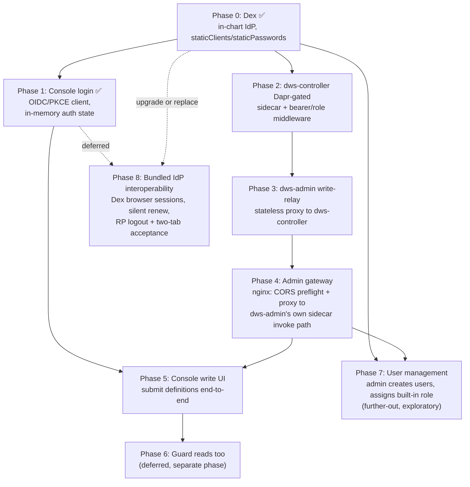

# `dws-console` Auth Roadmap

Supersedes the `dws-console.md` Phase 4 (definition submission) / Phase 5 (auth) split — those
can't ship safely in isolation (an unauthenticated write path is a bad default), so this tracks
them as one dependency-ordered sequence. `dws-console.md` should link here once this lands.

Ground rules decided during design, carried through every phase below:

- Login lives in the React app (OIDC Authorization Code + PKCE, public client, token in memory —
  never `localStorage`).
- JWT/role verification is Dapr-only, never hand-rolled in app code — `middleware.http.bearer` (+
  optional role/Rego middleware) on each sidecar that needs to gate something.
- `dws-console` only ever calls `dws-admin`. `dws-controller` is purely internal, reached only by
  `dws-admin`, server-to-server, through `dws-admin`'s own sidecar.
- Reads stay unauthenticated for now — guarding them is a deliberately separate later phase (6).

## 1. Phase dependency graph

## 2. Phased roadmap

| Phase | Scope | Depends on | Status |
|---|---|---|---|
| **0** | Add Dex as an optional in-chart dependency (toggle like `postgresql.enabled`); `staticPasswords` for dev users, `staticClients` registers `dws-console` as a public PKCE client; auto-generate a bootstrap admin login (see §2a) | — | ✅ done |
| **1** | React OIDC client (Authorization Code + PKCE), in-memory token, silent-renew integration, logout integration, additive unauthenticated reads | Phase 0 | ✅ done — implementation merged in `ed1fdfc2`; local gates, chart contract checks, live discovery/CORS/PKCE request evidence, and failure-state handling are verified. Bundled-Dex interoperability acceptance moved to Phase 8 |
| **2** | Enable `dws-controller`'s Dapr sidecar (`dapr.io/enabled`/`app-id`/`app-port`); add a bearer `Component` and a `Configuration` wiring it to the inbound pipeline; route the Service through Dapr and keep the app port pod-local | Phase 0 (needs the IdP's JWKS endpoint) | ⚠️ implementation complete; live authorization/bypass verification pending |
| **3** | New route in `dws-admin`: stateless relay that forwards the `Authorization` header + body to `dws-controller` via `dws-admin`'s own local sidecar invoke call. No verification logic — `dws-admin` never inspects the token | Phase 2 | ❌ not started |
| **4** | New `admin-gateway` nginx Deployment/Service/ConfigMap (chart-bundled, not an assumed cluster Ingress): answers CORS preflight, proxies the real request to `dws-admin`'s sidecar invoke path. Extend `dws-admin`'s Service with its sidecar port. Add `bearer`/role `Component`s + `Configuration` to `dws-admin`'s sidecar, scoped to this route only | Phase 3 | ❌ not started |
| **5** | Wire the console's definition-submission UI to call the gateway with the bearer token attached; reads keep using the existing direct `dws-admin` path unchanged | Phases 1 and 4 | ❌ not started |
| **6** | Guard reads: move `dws-admin`'s read routes onto the same gateway+sidecar+bearer path, retire the old direct/CORS-only route | Phase 5 | ❌ not started — deliberately deferred, tracked here so it isn't lost |
| **7** | User management: an admin-only console screen to create users and assign one of a small set of built-in roles (e.g. `admin`/`operator`/`viewer`). New `dws-admin` route, reusing Phase 4's gateway + Dapr role check (only `admin`-role tokens may call it), which manages users through **Dex's own gRPC management API** — no user/password storage or hashing added to DWS's own database | Phases 0, 4 | ❌ not started — further-out, exploratory; see §4 for a real open risk before committing to this shape |
| **8** | Make the bundled development IdP satisfy the browser client contract: adopt a released Dex version/configuration (or another in-chart IdP) with non-interactive `prompt=none` browser sessions and advertised RP-initiated logout; then verify token-expiry renewal, clean renewal failure, authenticated storage, logout, route restoration, and two-tab convergence | Phases 0, 1 | ❌ deferred — Dex 2.44.0 lacks the required browser-session and `end_session_endpoint` behavior; owns deferred checklist tasks 6.1, 6.2, 7.2, and 8.3 |

### Current progress (2026-08-24)

- Phase 0 is complete.
- Phase 1's console code, PKCE configuration, sign-in/identity/logout UI, SSR integration, unit
  coverage, and root redirect are merged. Fresh gates are green: lint, typecheck, 57 tests, build,
  Helm lint, and a rendered public-client/no-secret/root-redirect check.
- A live Docker Desktop release (`dws-phase1` in namespace `dws-phase1`) used issuer
  `http://localhost:5556`, console root `http://localhost:3000/`, and the Helm-NOTES bootstrap
  credentials. Discovery, `/auth`, `/token`, `/keys`, PKCE S256, and browser CORS were verified.
- The live run found and fixed a chart defect: Dex had no `web.allowedOrigins`, so browser discovery
  was blocked by CORS. The config now derives `http://localhost:3000` from the registered root
  redirect. The console also reports `Authentication unavailable` when OIDC initialization fails,
  while keeping unauthenticated reads available.
- Phase 1 is complete for the provider-agnostic console client. The live run also established that
  chart-pinned Dex 2.44.0 is not a compliant acceptance provider: it sends hidden-iframe
  `prompt=none` requests to its interactive login form until `oidc-spa` times out, and discovery has
  no `end_session_endpoint`. Those provider-specific implementation and acceptance requirements now
  belong to deferred Phase 8. They have **not** been marked verified. Dex tracks the missing native
  browser-session/RP-logout capability in
  [dexidp/dex#4560](https://github.com/dexidp/dex/issues/4560); no local-only logout fallback was
  accepted.
- Phase 2's chart implementation and local render gates are landed. Its live Dapr/OIDC
  authorization and application-port bypass checks remain pending.
- Phases 3–7 have not started. Phase 8 is explicitly deferred until a released compatible IdP is
  available or the chart deliberately adopts a different one.

**Next up:** Phase 2 still needs its own cluster-reachable issuer probe; the localhost port-forward
used for Phase 1 browser evidence cannot serve workloads. Phase 3 remains the next
dependency-ordered implementation after Phase 2's live gate. Phase 8 is later, independent work and
does not block that sequence.

## 2a. Phase 0 detail — bootstrap admin user

So there's always a working login right after `helm install` with the console/Dex enabled, without
anyone hand-editing `values.yaml` with a password:

- Generate the password in-template with `randAlphaNum`, guarded by `lookup` against the existing
  Secret so `helm upgrade` doesn't rotate it on every release (the standard Bitnami-chart pattern
  for admin passwords).
- Hash it with Sprig's `bcrypt` function for Dex's `staticPasswords[].hash` — Dex requires bcrypt,
  and this keeps the whole thing template-only, no Job/script needed.
- Store email + plaintext password in a new chart-managed Secret (e.g.
  `{{ include "dws.dex.fullname" . }}-admin-credentials`), same `existingSecret`-override shape
  already used for the Postgres/admin DB URL — never in `values.yaml` itself.
- Default identity configurable (`dex.adminUser.email`, e.g. `admin@dws.local`); password is
  generated, never user-supplied by default.
- `charts/dws/templates/NOTES.txt` prints the `kubectl get secret ...` email/password retrieval
  commands after install/upgrade — the standard place Helm surfaces a generated credential.

## 3. Rationale for ordering

- **0 before 1/2**: nothing can validate or issue a token without an IdP to point at.
- **2 before 3**: `dws-controller` must already be Dapr-gated before `dws-admin` is allowed to relay
  real writes to it — never let the relay exist ahead of the thing it's relaying to.
- **3 before 4**: the gateway's only job is getting traffic to the relay route safely; build the
  route first so there's something real to point it at.
- **4 before 5**: don't wire the write UI to a CORS/preflight path that doesn't work yet.
- **6 last, and separate**: reads are lower-risk and already shipped unauthenticated — folding them
  in early would block writes on a change that isn't urgent. Revisit once 0–5 are stable.
- **7 depends on 0 and 4, not on 1/2/3/5/6**: user management only needs an IdP to manage (Phase 0)
  and an existing Dapr-gated admin write path to reuse (Phase 4) — it doesn't touch `dws-controller`
  or reads at all, so it can be picked up any time after those two, independent of the rest.
- **8 is deliberately deferred and independent**: Phase 1 established the generic browser-client
  contract and exposed a limitation in the bundled development provider. Upgrading/replacing that
  provider and rerunning its live acceptance suite should not block the Dapr write-path sequence.

## 4. Open items

- Role/Rego middleware remains intentionally unused: no stable Dex/OIDC role claim has been proven.
  Revisit only with a documented token claim and a Dapr middleware type verified against the target
  Dapr release.
- Dex's `staticClients`/`staticPasswords` are a dev/quickstart shape — real deployments will swap
  in a connector (LDAP/SAML/upstream OIDC) or a different IdP entirely; nothing above should assume
  Dex specifically beyond Phase 0's chart toggle. Phase 8 owns the bundled-provider decision.
- `dws-admin`'s CORS module (`src/config/cors.ts`) becomes redundant for the write path once Phase
  4 lands (the gateway owns CORS there) — decide whether to leave it as-is for reads or trim it.
- **Phase 7 real risk**: Dex's local/static-password connector has [known, still-open upstream gaps
  around attaching a `groups` claim per user](https://github.com/dexidp/dex/issues/1080) (also
  [#3958](https://github.com/dexidp/dex/issues/3958)) — dynamic user *creation* is well-supported
  via [Dex's gRPC API](https://dexidp.io/docs/configuration/api/) (`CreatePassword`/`UpdatePassword`/
  `DeletePassword`/`ListPasswords`, built for exactly this), but cleanly attaching a *role* to that
  user for the token to carry is the open design question — resolve before committing to "assign a
  built-in role" as a literal Dex group. A fallback (e.g. a small role-lookup table in `dws-admin`'s
  own DB, keyed by subject, consulted alongside — not instead of — Dapr's role check) may end up
  being necessary; this needs a short spike at the start of Phase 7, not an assumption baked in now.
