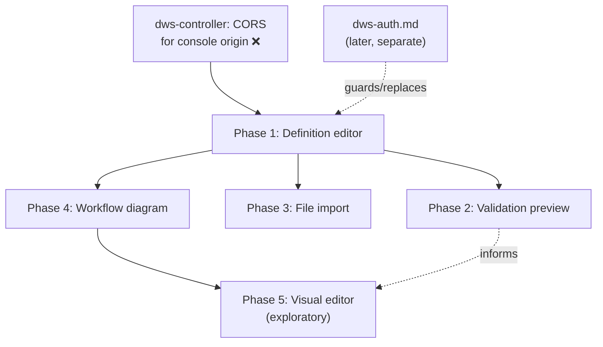

# `dws-console` Definition Submission Roadmap

Splits out of [`dws-console.md`](dws-console.md)'s Phase 4 (definition submission) — the
console-side authoring surface: how an operator gets a DSL 1.0 definition into `dws-controller`,
previews what it will compile to, and (eventually) edits it visually. This doc owns the **client-side architecture and UX**. Definition submission uses the authenticated
`dws-admin` write relay from [`dws-auth.md`](dws-auth.md) Phase 3: the console attaches its OIDC
bearer token and never calls `dws-controller` directly.

## 1. What already exists

- `dws-controller`'s `POST /workflows?dryRun={true|false}` (pre-existing, no auth work needed to
  build it): body is the raw YAML/JSON definition text. `dryRun=true` compiles and returns a
  `DeploymentPlan` — `workflow`, `versionId`, `version`, `steps` (deployable I/O tasks), `bindings`
  (pub/sub topics), `orchestrator` — **without** applying. It is a "what will be deployed" view,
  not the task graph: `switch`/`set`/`wait`/`try`/`for`/`fork` never appear in it. `dryRun=false`
  applies and returns `ApplyResult` (`created: false` when the exact content is already deployed —
  content-addressed versioning makes a repeat submit an idempotent no-op). A 400 returns
  `{message, errors: string[]}` — a flat list, no line/path pointers (structured, path-aware errors
  are [OWS Phase 3](openworkflow-features.md), not built yet).
- `dws-console/src/components/definition-graph.tsx` — a fully hardcoded, hand-positioned SVG of one
  example workflow; not wired to any real definition. Its own comment: "a live version would swap
  this for `@xyflow/react`."
- `dws-console` has no local YAML parser. Its definition editor uses a CodeMirror 6 raw text buffer
  with YAML/JSON syntax highlighting and sends the unmodified buffer to the `dws-admin` relay.
- DSL structural shapes, confirmed against `dws-controller`/`dws-orchestrator` test fixtures
  (`order.yaml`, `try-order.yaml`): `switch` branches are **jump edges** (`then: <taskName>`,
  referencing a sibling task elsewhere in the flat `do` list) — a natural flowchart edge. `try`,
  `catch.do`, `for`, `fork` are **nested body lists** — need container/group nodes, not edges. No
  `x`/`y`/layout field exists anywhere in the DSL.

## 2. Phase dependency graph

## 3. Phased roadmap

| Phase | Sub-feature | Depends on | Status |
|---|---|---|---|
| **1** | **Definition editor** — write or paste a DSL 1.0 definition and submit it to the cluster | dws-auth Phase 1 OIDC client + Phase 3 `dws-admin` write relay | ✅ done — `dws-console-definition-editor` |
| **2** | **Validation preview** — see what a definition will deploy, and why it's invalid, before committing it | Phase 1 | ❌ not started |
| **3** | **File import** — load a definition from a local `.yaml`/`.yml`/`.json` file instead of typing it | Phase 1 | ❌ not started |
| **4** | **Workflow diagram** — see the task graph a definition describes, laid out automatically | Phase 1 | ❌ not started |
| **5** | **Visual editor** — inspect, then edit, a workflow directly on the diagram instead of the text | Phase 4 | ❌ not started — exploratory |

## 4. Rationale for ordering

- **1 before 2/3/4**: every later phase reads from or writes to the one draft-text buffer Phase 1
  creates — nothing else has anywhere to attach.
- **2 and 3 are independent siblings of each other**: validation doesn't need file upload, and
  upload is just an alternate way to fill the buffer Phase 2 validates. Either can ship first.
- **4 does not depend on transport at all**: unlike 1–3, rendering a graph from already-typed text
  is a pure client-side parse — no network call, so it doesn't even need Phase 1's CORS prerequisite
  and can ship earliest of the non-trivial phases if sequencing needs a quick win.
- **5 last, and explicitly not committed**: turning a read-only graph into a structural editor is a
  distinct, larger product surface (undo/redo, node palette, drag-to-wrap semantics) — not an
  increment on Phase 4. It waits until Phase 4 is live and the editing-depth decision below is
  made.

## 5. Open items

- **Editor library**: CodeMirror 6 is selected for the raw-buffer editor; Monaco is intentionally
  excluded to keep the initial authoring surface lightweight. Later autocomplete/diagnostics remain
  a separate decision.
- **Canvas layout persistence**: the DSL has no position/layout field. Undecided whether Phase 5
  always re-runs auto-layout on load (arrangement is never saved) or the console invents its own
  UI-hint extension to persist manual arrangement — needs a decision before Phase 5 starts, not
  Phase 4.
- **Editing depth (Phase 5)**: "visual editor" is a spectrum, not a plan — needs an explicit choice
  between **A** inspect-only (click a node, read its fields — no changes), **B** field-edit +
  reorder + branch retarget (edit a task's params inline, drag to reorder, redirect a `switch`
  branch), and **C** full builder (palette to add tasks, wrap/unwrap in `try`/`for`/`fork`, remove
  tasks). C is materially bigger than A/B and should probably be scoped as its own follow-up rather
  than bundled into "Phase 5." Underlying architecture, once a depth is chosen: the parsed
  definition (not the text or the diagram) is the single source of truth — the editor, the diagram,
  and the text view all read from and write to it, never to each other directly.
- **Error precision**: the flat `errors[]` string list has no line/path mapping until
  [OWS Phase 3](openworkflow-features.md#phased-roadmap) ships an RFC 7807 model — until then the
  editor can show the message list but can't highlight the offending line.
- **Gateway rollout remains separate**: Phase 1 calls the Phase 3 relay directly using the console's
  bearer token. The Phase 4 gateway can later become the browser-facing route without changing
  editor semantics.

## Status legend

✅ done · ⚠️ partial/stubbed · ❌ not started. Updated 2026-08-19.
