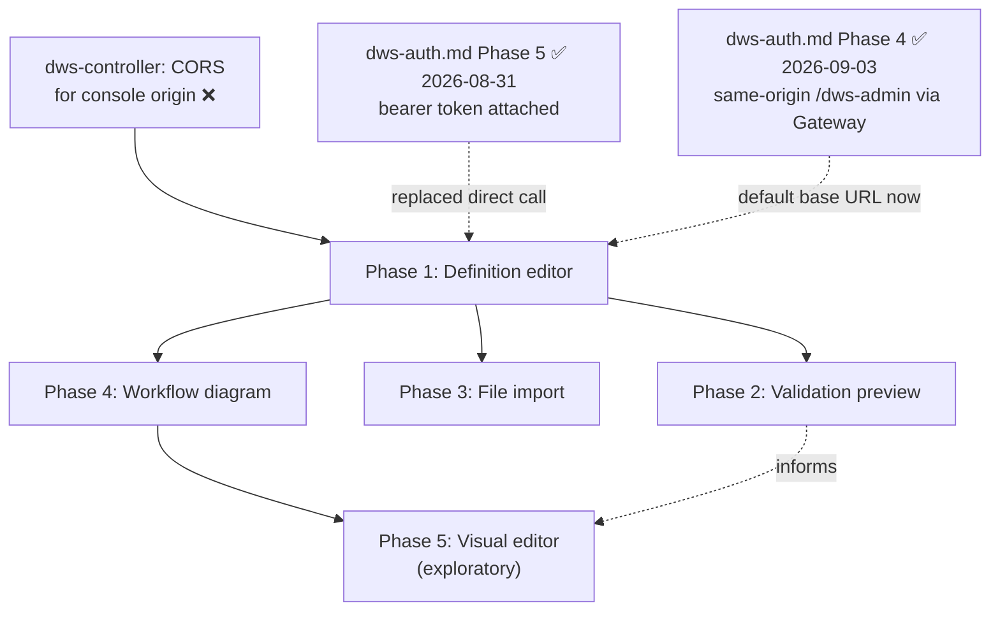
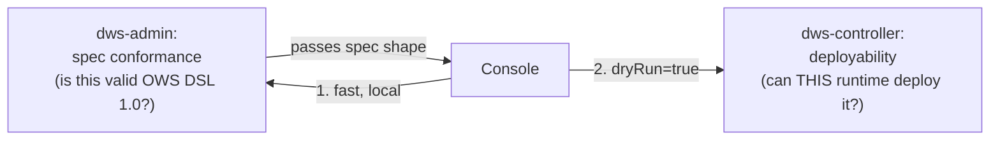

# `dws-console` Definition Submission Roadmap

Splits out of [`dws-console.md`](dws-console.md)'s Phase 4 (definition submission) — the
console-side authoring surface: how an operator gets a DSL 1.0 definition into `dws-controller`,
previews what it will compile to, and (eventually) edits it visually. This doc owns the **client-side architecture and UX**. Definition submission uses the authenticated
`dws-admin` write relay from [`dws-auth.md`](dws-auth.md) Phase 3: the console attaches its OIDC
bearer token and never calls `dws-controller` directly.

## 1. What already exists

- `dws-controller`'s `POST /workflows?dryRun={true|false}` (pre-existing, no auth work needed to
  build it): body is the raw YAML/JSON definition text. `dryRun=true` compiles and returns a
  `DeploymentPlan` — `workflow`, `versionId`, `version`, `steps` (deployable I/O tasks), `bindings`
  (pub/sub topics), `orchestrator` — **without** applying. It is a "what will be deployed" view,
  not the task graph: `switch`/`set`/`wait`/`try`/`for`/`fork` never appear in it. `dryRun=false`
  applies and returns `ApplyResult` (`created: false` when the exact content is already deployed —
  content-addressed versioning makes a repeat submit an idempotent no-op). A 400 returns
  `{message, errors: string[]}` — a flat list, no line/path pointers (structured, path-aware errors
  are [OWS Phase 3](openworkflow-features.md), not built yet).
- `dws-console/src/components/definition-graph.tsx` — a fully hardcoded, hand-positioned SVG of one
  example workflow; not wired to any real definition. Its own comment: "a live version would swap
  this for `@xyflow/react`."
- `dws-console` has no local YAML parser. Its definition editor uses a CodeMirror 6 raw text buffer
  with YAML/JSON syntax highlighting and sends the unmodified buffer to the `dws-admin` relay.
- DSL structural shapes, confirmed against `dws-controller`/`dws-orchestrator` test fixtures
  (`order.yaml`, `try-order.yaml`): `switch` branches are **jump edges** (`then: <taskName>`,
  referencing a sibling task elsewhere in the flat `do` list) — a natural flowchart edge. `try`,
  `catch.do`, `for`, `fork` are **nested body lists** — need container/group nodes, not edges. No
  `x`/`y`/layout field exists anywhere in the DSL.

## 2. Phase dependency graph



## 3. Phased roadmap

| Phase | Sub-feature | Depends on | Status |
|---|---|---|---|
| **1** | **Definition editor** — write or paste a DSL 1.0 definition and submit it to the cluster | dws-auth Phase 1 OIDC client + Phase 3 `dws-admin` write relay | ✅ done — `dws-console-definition-editor` |
| **2** | **Validation preview** — see what a definition will deploy, and why it's invalid, before committing it | Phase 1 | ✅ done 2026-09-04 — `submission-preview-validation`; two-layer validation, see §6 |
| **3** | **File import** — load a definition from a local `.yaml`/`.yml`/`.json` file instead of typing it | Phase 1 | ❌ not started — design decided 2026-09-04 (file input + Zustand-persisted draft, see §7) |
| **4** | **Workflow diagram** — see the task graph a definition describes, laid out automatically | Phase 1 | ❌ not started |
| **5** | **Visual editor** — inspect, then edit, a workflow directly on the diagram instead of the text | Phase 4 | ❌ not started — exploratory |

## 4. Rationale for ordering

- **1 before 2/3/4**: every later phase reads from or writes to the one draft-text buffer Phase 1
  creates — nothing else has anywhere to attach.
- **2 and 3 are independent siblings of each other**: validation doesn't need file upload, and
  upload is just an alternate way to fill the buffer Phase 2 validates. Either can ship first.
- **4 does not depend on transport at all**: unlike 1–3, rendering a graph from already-typed text
  is a pure client-side parse — no network call, so it doesn't even need Phase 1's CORS prerequisite
  and can ship earliest of the non-trivial phases if sequencing needs a quick win.
- **5 last, and explicitly not committed**: turning a read-only graph into a structural editor is a
  distinct, larger product surface (undo/redo, node palette, drag-to-wrap semantics) — not an
  increment on Phase 4. It waits until Phase 4 is live and the editing-depth decision below is
  made.

## 5. Open items

- **Editor library**: CodeMirror 6 is selected for the raw-buffer editor; Monaco is intentionally
  excluded to keep the initial authoring surface lightweight. Later autocomplete/diagnostics remain
  a separate decision.
- **Canvas layout persistence**: the DSL has no position/layout field. Undecided whether Phase 5
  always re-runs auto-layout on load (arrangement is never saved) or the console invents its own
  UI-hint extension to persist manual arrangement — needs a decision before Phase 5 starts, not
  Phase 4.
- **Editing depth (Phase 5)**: "visual editor" is a spectrum, not a plan — needs an explicit choice
  between **A** inspect-only (click a node, read its fields — no changes), **B** field-edit +
  reorder + branch retarget (edit a task's params inline, drag to reorder, redirect a `switch`
  branch), and **C** full builder (palette to add tasks, wrap/unwrap in `try`/`for`/`fork`, remove
  tasks). C is materially bigger than A/B and should probably be scoped as its own follow-up rather
  than bundled into "Phase 5." Underlying architecture, once a depth is chosen: the parsed
  definition (not the text or the diagram) is the single source of truth — the editor, the diagram,
  and the text view all read from and write to it, never to each other directly.
- **Error precision — corrected 2026-09-03.** This was previously written as blocked on
  [OWS Phase 3](openworkflow-features.md#phased-roadmap) shipping an RFC 7807 model. That's wrong:
  OWS Phase 3 (`openspec/changes/ows-phase3-errors-timeouts`) is about *runtime* error kinds
  (`WorkflowErrors`, used by `catch`/`retry` while an instance is executing) — a different code
  path from `dws-controller`'s compile-time `CompilationException`, which is what dry-run actually
  throws (a flat `List<String>`, unrelated to that change). Error precision isn't blocked on
  anything upstream; see §6 for how the new dws-admin spec-validation layer solves it directly via
  ajv's `instancePath`, without touching dws-controller at all. **Closed 2026-09-04** — that layer
  shipped with Phase 2. Structural errors now carry a JSON pointer and parse failures carry a real
  line and column. One limit remains, deliberately: the pointer is rendered as text, not mapped to
  a CodeMirror gutter marker, because mapping a JSON path back to a YAML source position needs a
  CST the console does not have.
- **Gateway rollout — closed, as predicted.** `dws-auth.md` Phase 4 (Kubernetes Gateway API via
  APISIX) merged 2026-09-03. As this section anticipated, it changed nothing about editor
  semantics: `dws-console/src/lib/admin-client.ts`'s `DEFAULT_BASE_URL` is `/dws-admin`, so Phase
  1's submit call already goes same-origin through the shared Gateway by default — no editor-side
  change was needed to pick it up. Phase 1 also already carries the OIDC bearer token on every
  call (`dws-auth.md` Phase 5, 2026-08-31, via the centralized `admin-client`/`admin-hooks`
  boundary), so Phase 1 is authenticated + gateway-routed end to end.

### Current progress (2026-09-04)

- **Phase 2 shipped.** New: `dws-admin/src/definition-validation/` (service, controller, module,
  `task-names.ts`, `validation-report.ts`, the vendored `schema/`, and five spec files),
  `dws-admin/scripts/vendor-dsl-schema.mjs`, and `dws-console/src/components/deployment-plan-view.tsx`,
  plus the preview action in `dws-console/src/routes/workflows/new.tsx` and two new transport
  functions in `admin-client.ts` (`submitDefinition` itself is unchanged). See §6 for the design as
  built and for the three open questions it resolved.
- Phases 3–5 are unchanged and still not started: no `@xyflow/react` or Monaco dependency in
  `dws-console/package.json`, `definition-graph.tsx` is still the hardcoded single-example SVG
  described in §1, and no file-import component exists under `dws-console/src`.

**Next up:** Phase 3 (file import) — designed 2026-09-04 in §7 and unblocked. Phase 4 (workflow
diagram) has no network dependency at all and, per §4's rationale, could ship first if a quick,
self-contained win is wanted — it only needs a client-side DSL parser plus swapping
`definition-graph.tsx`'s hardcoded SVG for `@xyflow/react`. Phase 5 (visual editor) stays
exploratory and blocked on Phase 4 plus the still-open editing-depth (A/B/C) and
canvas-layout-persistence decisions in §5.

## 6. Phase 2 design (2026-09-03): two-layer validation

Discussed with the user: instead of Phase 2 just rendering `dws-controller`'s dry-run response,
split validation by *kind of rule*, not by which service happens to run it.



**Layer 1 — dws-admin, spec conformance.** The OWS DSL 1.0 spec publishes its own JSON Schema:
[`schema/workflow.yaml`](https://github.com/open-workflow-specification/specification/blob/main/schema/workflow.yaml)
in the spec's own repo — `$id: https://open-workflow-specification.org/schemas/1.0.3/workflow.yaml`,
JSON Schema draft 2020-12, ~4,500 lines, single self-contained file (no external `$ref`s). `dws-admin`
vendors this one file and validates the parsed document against it with **ajv** (draft-2020-12
support). This needs no port of `dws-controller`'s `semanticErrors()` — the schema already encodes
document/task shape, required fields, and per-task-type structure — and ajv's errors carry an
`instancePath` (JSON pointer to the offending field), which is exactly the line/path precision the
old "Error precision" open item wanted, with no dependency on OWS Phase 3 (see the corrected bullet
above).

**Layer 2 — dws-controller, deployability.** Unchanged. Stays the sole authority on whether *this*
DWS runtime can actually compile and deploy a spec-valid document: task-kind support (`run:
container`/`run: workflow` rejected, script language must be `js`/`python`), Kubernetes-specific
naming (secret names must be DNS-1123), image resolution, OAuth/secret wiring. None of this is an
OWS DSL rule — it's this implementation's current limitations — so it stays exactly where it is
today, reached via the existing `dryRun=true` dry-run endpoint through the same relay.

**Mapping today's `WorkflowCompiler` checks onto the split**, for concreteness:

| Check | Layer |
|---|---|
| Missing `document`/`document.name`/`document.version`; `do` has no tasks | Spec (dws-admin) |
| Definition doesn't parse, or doesn't match the DSL's shape (unknown fields, wrong types) | Spec (dws-admin) |
| Secret name must be DNS-1123 (Kubernetes Secret naming) | Deployability (dws-controller) |
| `run: container`/`run: workflow` not yet supported; script language/identifier rules; image resolution | Deployability (dws-controller) |

**Open questions — all three resolved during implementation (2026-09-04). One of them
changed the design above.**

1. **DSL version — resolved, and the answer was not `1.0.3`.** `dws-controller` has no
   hand-written DSL model at all: it parses with `io.serverlessworkflow.api.WorkflowReader` from
   `serverlessworkflow-api`, pinned in `pom.xml` as
   `<serverlessworkflow.version>7.26.0.Final</serverlessworkflow.version>`, and every DSL type
   `WorkflowCompiler` imports is generated from that SDK's own schema. The SDK ships it inside the
   jar — `serverlessworkflow-types-7.26.0.Final.jar!/schema/workflow.yaml`, 1,828 lines,
   `$id: https://serverlessworkflow.io/schemas/1.0.1/workflow.yaml`. So the real comparison was
   **1.0.1 (what the compiler enforces) vs 1.0.3 (what this section proposed vendoring)**. Both
   were fetched and diffed: 185 added / 20 removed lines, and the differences are load-bearing.

   | Difference | Direction | Consequence of validating with 1.0.3 |
   |---|---|---|
   | `run.shell`/`run.script` `arguments`: **object** (1.0.1) → **array of strings** (1.0.3) | false positive | **Rejects a definition DWS deploys today.** `WorkflowCompiler` reads it as `Map<String,Object>`, dws-run renders `--key value` from that map's order, and `dws-controller/src/test/resources/fixtures/run-shell.yaml` uses the object form. |
   | `emit.event.with` required: `[source, type]` → `[type]` | false negative | accepts documents missing `source` that the 1.0.1 model still requires |
   | inline `oauth2` gains `required: [authority, grant]` | false positive | rejects OAuth shapes the controller accepts |
   | `for.in`: `string` → `oneOf[string, array]` | false negative | accepts inline arrays the 1.0.1 model cannot bind |
   | `uriTemplate` pattern loosened (scheme required → relative allowed) | false negative | accepts relative URIs the controller's stricter pattern rejects |
   | `call: mcp`, `catch.then`, `container.stdin`/`arguments`/`pullPolicy` added | false negative | passes constructs the controller has no model for |

   **Decision: vendor the SDK's schema, not the spec repo's.** DWS's spec-conformance layer is
   therefore pinned to DSL 1.0.1 as realised by SDK 7.26.0.Final; moving to 1.0.3 is a
   `dws-controller` SDK upgrade, not a console-side choice.

2. **Task-name uniqueness — confirmed needed, with a correction.** Still not expressible in JSON
   Schema, so `dws-admin` carries a custom walk over `do`, `try.do`, `catch.do`, `for.do`, and
   `fork.branches` (`task-names.ts`). But `dws-controller` **already** enforces this
   (`WorkflowCompiler.duplicateTaskNames`/`collectTaskNames`), so it is early, path-precise
   *parity* — not coverage that was missing. It is the one case where layer 1 would otherwise pass
   something layer 2 rejects.

3. **Vendoring — resolved as neither listed option.** Both listed options treated the spec repo as
   the source of truth, when what layer 2 actually enforces is the SDK's schema. Instead,
   `pnpm vendor:schema` in `dws-admin` reads `<serverlessworkflow.version>` out of
   `dws-controller/pom.xml`, downloads that jar from Maven Central, extracts `schema/workflow.yaml`,
   and writes a checked-in `workflow-schema.json` plus a `provenance.json` recording
   `sdkVersion`, `schemaId`, `sourceJar`, and `sha256`. A `dws-admin` test asserts the provenance
   still matches the pom, so a controller-side SDK bump that forgets this module fails `pnpm test`
   rather than drifting silently. Drift is made impossible to introduce quietly, not merely visible
   in review.

**What shipped (2026-09-04).**

- `dws-admin`: `POST /definitions/validate` — raw definition in (`application/yaml`,
  `application/x-yaml`, `text/yaml`, `application/json`), and **always 200** for a well-formed
  request, with the document's validity in the body (`{valid: true}` or `{valid: false, errors,
  truncated}`). Non-2xx means the *request* was wrong: 400 empty body or unsupported type, 413 over
  1 MiB. Parsing uses the `yaml` package, so a malformed buffer reports a real line and column —
  feedback `dws-controller` cannot give at all. Schema validation uses ajv `Ajv2020`
  (`allErrors: true`, `strict: false`, `ajv-formats`), reporting each error's `instancePath` as its
  `path`, capped at 50 errors with a `truncated` flag because the DSL schema is one large union and
  a broken document otherwise produces hundreds of `anyOf`-branch errors.
- A fixture-parity test asserts every `dws-controller` fixture that compiles today is spec-valid
  here — the regression net for the whole version decision. It also asserts that
  `run-container.yaml` and `run-script-bad-language.yaml` are *spec-valid despite* the controller
  rejecting them, which encodes the layer boundary as a test, and that `broken.yaml` is rejected.
- Both definition paths' body cap was lifted from the body parsers' 100 kB default to the
  documented 1 MiB, in `dws-admin/src/main.ts`. This widens the relay too, deliberately: preview
  and submit read the same buffer, so a definition that previews must be submittable.
- `dws-console`: a `Preview` action beside `Submit definition` that runs the layers **sequentially**
  — spec check first, and only on `valid: true` the `dryRun=true` compile. A spec-invalid document
  never reaches the controller, because it would fail there too with strictly worse feedback.
  Renders one of three outcomes: spec errors with their JSON pointer (and line/column for parse
  failures), the controller's flat deployability strings in a visibly distinct banner, or the
  `DeploymentPlan` (version, step services, topic bindings, orchestrator) via
  `src/components/deployment-plan-view.tsx`. The plan response is zod-parsed, not cast. A rendered
  preview clears when the buffer changes, so a stale plan is never read as current.
- **`dws-controller` was not modified.** The non-goal held: no deployability logic moved.

## 7. Phase 3 design (2026-09-04): file import + draft persistence

Discussed with the user: file import needs to (a) read a local file's text into the editor buffer,
and (b) survive a page refresh once loaded — the plain buffer Phase 1 introduced is in-memory React
state only, so a refresh silently returns to an empty editor with no warning today.

**Import mechanism: plain `<input type="file">`.** The File System Access API
(`showOpenFilePicker`) was considered — it additionally hands back a reusable `FileSystemFileHandle`
for writing back to the same file on disk — but Phase 3 is import-only, with no "save to the
original file" requirement, and the API is Chrome/Edge-only (no Safari/Firefox support). A standard
file input + `File.text()` covers the actual requirement everywhere, so it's the choice. The File
System Access API is deferred to a hypothetical future "save back to disk" feature — not part of
Phase 3.

Read the picked file, infer `format` from its extension (`.json` → `json`, else `yaml`), and feed
both into the same `definition`/`format` state the editor already uses — no new buffer, no parser.

**Draft persistence: Zustand, with the `persist` middleware.** Rather than hand-rolled
`localStorage` `useEffect` calls, `dws-console` should introduce Zustand (no state library currently
in `package.json`) as a small persisted store for `definition`/`format`, keyed e.g. `dws:draft`.
This is deliberately generic beyond file-import: it also survives refresh for hand-typed definitions
entered directly into the editor (Phase 1), and gives Phase 2/5 a natural place to add more
persisted editor state later instead of one-off storage per feature.

```ts
// lib/definition-draft-store.ts
export const useDraftStore = create<DraftState>()(
  persist(
    (set) => ({
      definition: "",
      format: "yaml",
      setDefinition: (definition) => set({ definition }),
      setFormat: (format) => set({ format }),
    }),
    { name: "dws:draft" },
  ),
);
```

`DefinitionEditor` swaps its two `useState` pairs for `useDraftStore()`; the file-import handler and
the CodeMirror `onChange` both just call the store's setters — no other wiring changes.

**Open items:**

- Confirm `dws-console/package.json` has no existing state library before adding Zustand as a new
  dependency.
- Extension-based `format` sniffing on import is a heuristic, not content-based — acceptable since
  the format dropdown remains user-overridable after import.

## Status legend

✅ done · ⚠️ partial/stubbed · ❌ not started. Updated 2026-09-04.
