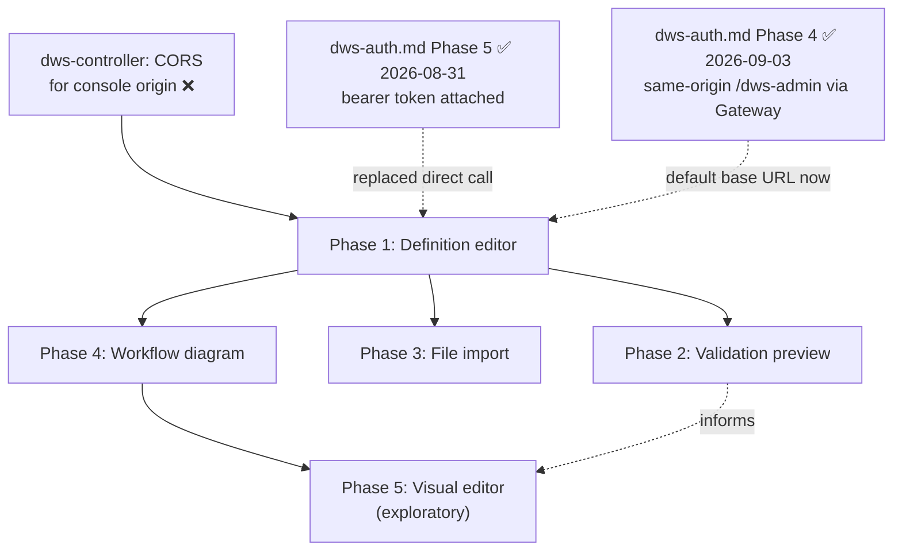
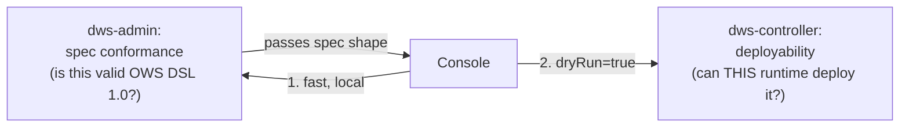

# `dws-console` Definition Submission Roadmap

Splits out of [`dws-console.md`](dws-console.md)'s Phase 4 (definition submission) — the
console-side authoring surface: how an operator gets a DSL 1.0 definition into `dws-controller`,
previews what it will compile to, and (eventually) edits it visually. This doc owns the **client-side architecture and UX**. Definition submission uses the authenticated
`dws-admin` write relay from [`dws-auth.md`](dws-auth.md) Phase 3: the console attaches its OIDC
bearer token and never calls `dws-controller` directly.

## 1. What already exists

- `dws-controller`'s `POST /workflows?dryRun={true|false}` (pre-existing, no auth work needed to
  build it): body is the raw YAML/JSON definition text. `dryRun=true` compiles and returns a
  `DeploymentPlan` — `workflow`, `versionId`, `version`, `steps` (deployable I/O tasks), `bindings`
  (pub/sub topics), `orchestrator` — **without** applying. It is a "what will be deployed" view,
  not the task graph: `switch`/`set`/`wait`/`try`/`for`/`fork` never appear in it. `dryRun=false`
  applies and returns `ApplyResult` (`created: false` when the exact content is already deployed —
  content-addressed versioning makes a repeat submit an idempotent no-op). A 400 returns
  `{message, errors: string[]}` — a flat list, no line/path pointers (structured, path-aware errors
  are [OWS Phase 3](openworkflow-features.md), not built yet).
- `dws-console/src/components/definition-graph.tsx` — a fully hardcoded, hand-positioned SVG of one
  example workflow; not wired to any real definition. Its own comment: "a live version would swap
  this for `@xyflow/react`."
- `dws-console` has no local YAML parser. Its definition editor uses a CodeMirror 6 raw text buffer
  with YAML/JSON syntax highlighting and sends the unmodified buffer to the `dws-admin` relay.
- DSL structural shapes, confirmed against `dws-controller`/`dws-orchestrator` test fixtures
  (`order.yaml`, `try-order.yaml`): `switch` branches are **jump edges** (`then: <taskName>`,
  referencing a sibling task elsewhere in the flat `do` list) — a natural flowchart edge. `try`,
  `catch.do`, `for`, `fork` are **nested body lists** — need container/group nodes, not edges. No
  `x`/`y`/layout field exists anywhere in the DSL.

## 2. Phase dependency graph

## 3. Phased roadmap

| Phase | Sub-feature | Depends on | Status |
|---|---|---|---|
| **1** | **Definition editor** — write or paste a DSL 1.0 definition and submit it to the cluster | dws-auth Phase 1 OIDC client + Phase 3 `dws-admin` write relay | ✅ done — `dws-console-definition-editor` |
| **2** | **Validation preview** — see what a definition will deploy, and why it's invalid, before committing it | Phase 1 | ❌ not started — design decided 2026-09-03 (two-layer validation, see §6) |
| **3** | **File import** — load a definition from a local `.yaml`/`.yml`/`.json` file instead of typing it | Phase 1 | ❌ not started |
| **4** | **Workflow diagram** — see the task graph a definition describes, laid out automatically | Phase 1 | ❌ not started |
| **5** | **Visual editor** — inspect, then edit, a workflow directly on the diagram instead of the text | Phase 4 | ❌ not started — exploratory |

## 4. Rationale for ordering

- **1 before 2/3/4**: every later phase reads from or writes to the one draft-text buffer Phase 1
  creates — nothing else has anywhere to attach.
- **2 and 3 are independent siblings of each other**: validation doesn't need file upload, and
  upload is just an alternate way to fill the buffer Phase 2 validates. Either can ship first.
- **4 does not depend on transport at all**: unlike 1–3, rendering a graph from already-typed text
  is a pure client-side parse — no network call, so it doesn't even need Phase 1's CORS prerequisite
  and can ship earliest of the non-trivial phases if sequencing needs a quick win.
- **5 last, and explicitly not committed**: turning a read-only graph into a structural editor is a
  distinct, larger product surface (undo/redo, node palette, drag-to-wrap semantics) — not an
  increment on Phase 4. It waits until Phase 4 is live and the editing-depth decision below is
  made.

## 5. Open items

- **Editor library**: CodeMirror 6 is selected for the raw-buffer editor; Monaco is intentionally
  excluded to keep the initial authoring surface lightweight. Later autocomplete/diagnostics remain
  a separate decision.
- **Canvas layout persistence**: the DSL has no position/layout field. Undecided whether Phase 5
  always re-runs auto-layout on load (arrangement is never saved) or the console invents its own
  UI-hint extension to persist manual arrangement — needs a decision before Phase 5 starts, not
  Phase 4.
- **Editing depth (Phase 5)**: "visual editor" is a spectrum, not a plan — needs an explicit choice
  between **A** inspect-only (click a node, read its fields — no changes), **B** field-edit +
  reorder + branch retarget (edit a task's params inline, drag to reorder, redirect a `switch`
  branch), and **C** full builder (palette to add tasks, wrap/unwrap in `try`/`for`/`fork`, remove
  tasks). C is materially bigger than A/B and should probably be scoped as its own follow-up rather
  than bundled into "Phase 5." Underlying architecture, once a depth is chosen: the parsed
  definition (not the text or the diagram) is the single source of truth — the editor, the diagram,
  and the text view all read from and write to it, never to each other directly.
- **Error precision — corrected 2026-09-03.** This was previously written as blocked on
  [OWS Phase 3](openworkflow-features.md#phased-roadmap) shipping an RFC 7807 model. That's wrong:
  OWS Phase 3 (`openspec/changes/ows-phase3-errors-timeouts`) is about *runtime* error kinds
  (`WorkflowErrors`, used by `catch`/`retry` while an instance is executing) — a different code
  path from `dws-controller`'s compile-time `CompilationException`, which is what dry-run actually
  throws (a flat `List<String>`, unrelated to that change). Error precision isn't blocked on
  anything upstream; see §6 for how the new dws-admin spec-validation layer solves it directly via
  ajv's `instancePath`, without touching dws-controller at all.
- **Gateway rollout — closed, as predicted.** `dws-auth.md` Phase 4 (Kubernetes Gateway API via
  APISIX) merged 2026-09-03. As this section anticipated, it changed nothing about editor
  semantics: `dws-console/src/lib/admin-client.ts`'s `DEFAULT_BASE_URL` is `/dws-admin`, so Phase
  1's submit call already goes same-origin through the shared Gateway by default — no editor-side
  change was needed to pick it up. Phase 1 also already carries the OIDC bearer token on every
  call (`dws-auth.md` Phase 5, 2026-08-31, via the centralized `admin-client`/`admin-hooks`
  boundary), so Phase 1 is authenticated + gateway-routed end to end.

### Current progress (2026-09-03)

- Repo scan confirms Phases 2–5 genuinely have not started: no `@xyflow/react` or Monaco dependency
  in `dws-console/package.json`, `definition-graph.tsx` is still the same hardcoded single-example
  SVG described in §1 (not wired to a real definition), and no file-import or validation-preview
  components exist under `dws-console/src`. The status table below is accurate as-is.
- The only change since this doc's last update is infrastructural, not a new phase: Phase 1's
  submission path is now both bearer-authenticated and same-origin-gateway-routed by construction
  (see the updated dependency graph and open item above) — nothing on this roadmap's own critical
  path moved.

**Next up:** Phases 2 (validation preview) and 3 (file import) are independent siblings — either
can start first, per §4's rationale. Phase 4 (workflow diagram) has no network dependency at all
and, per that same rationale, could ship earliest of the three if a quick, self-contained win is
wanted — it only needs a client-side DSL parser plus swapping `definition-graph.tsx`'s hardcoded
SVG for `@xyflow/react`. Phase 5 (visual editor) stays exploratory and blocked on Phase 4 plus the
still-open editing-depth (A/B/C) and canvas-layout-persistence decisions in §5.

## 6. Phase 2 design (2026-09-03): two-layer validation

Discussed with the user: instead of Phase 2 just rendering `dws-controller`'s dry-run response,
split validation by *kind of rule*, not by which service happens to run it.

**Layer 1 — dws-admin, spec conformance.** The OWS DSL 1.0 spec publishes its own JSON Schema:
[`schema/workflow.yaml`](https://github.com/open-workflow-specification/specification/blob/main/schema/workflow.yaml)
in the spec's own repo — `$id: https://open-workflow-specification.org/schemas/1.0.3/workflow.yaml`,
JSON Schema draft 2020-12, ~4,500 lines, single self-contained file (no external `$ref`s). `dws-admin`
vendors this one file and validates the parsed document against it with **ajv** (draft-2020-12
support). This needs no port of `dws-controller`'s `semanticErrors()` — the schema already encodes
document/task shape, required fields, and per-task-type structure — and ajv's errors carry an
`instancePath` (JSON pointer to the offending field), which is exactly the line/path precision the
old "Error precision" open item wanted, with no dependency on OWS Phase 3 (see the corrected bullet
above).

**Layer 2 — dws-controller, deployability.** Unchanged. Stays the sole authority on whether *this*
DWS runtime can actually compile and deploy a spec-valid document: task-kind support (`run:
container`/`run: workflow` rejected, script language must be `js`/`python`), Kubernetes-specific
naming (secret names must be DNS-1123), image resolution, OAuth/secret wiring. None of this is an
OWS DSL rule — it's this implementation's current limitations — so it stays exactly where it is
today, reached via the existing `dryRun=true` dry-run endpoint through the same relay.

**Mapping today's `WorkflowCompiler` checks onto the split**, for concreteness:

| Check | Layer |
|---|---|
| Missing `document`/`document.name`/`document.version`; `do` has no tasks | Spec (dws-admin) |
| Definition doesn't parse, or doesn't match the DSL's shape (unknown fields, wrong types) | Spec (dws-admin) |
| Secret name must be DNS-1123 (Kubernetes Secret naming) | Deployability (dws-controller) |
| `run: container`/`run: workflow` not yet supported; script language/identifier rules; image resolution | Deployability (dws-controller) |

**Open questions before this is buildable, not yet resolved:**

1. **DSL version match is unconfirmed.** The published schema is versioned `1.0.3`; nothing in
   `dws-controller`'s Java model (`Document`, `Workflow`, etc.) or `pom.xml` pins an explicit DSL
   spec version to compare against. A schema/model version mismatch would show up as either false
   positives (dws-admin rejects something dws-controller actually accepts) or false negatives (the
   reverse) — needs a deliberate check before adopting the schema, not an assumption.
2. **Not everything in the split above is expressible in JSON Schema alone.** Task-name uniqueness
   is cross-referential — "unique across the whole flat `do` list, including nested `try`/`catch`/
   `for`/`fork` bodies" — and JSON Schema can't express that constraint on its own. `dws-admin`
   still needs one small custom check layered on top of ajv for this; it is not a pure
   schema-only validator.
3. **Vendoring approach**: pull the schema file in at build time (a fetch script + checked-in
   snapshot, like the chart's own vendored APISIX archive) versus committing a manual copy — needs
   a decision so upstream spec revisions (past `1.0.3`) are a deliberate, visible update, not a
   silent drift.

## Status legend

✅ done · ⚠️ partial/stubbed · ❌ not started. Updated 2026-09-03.
