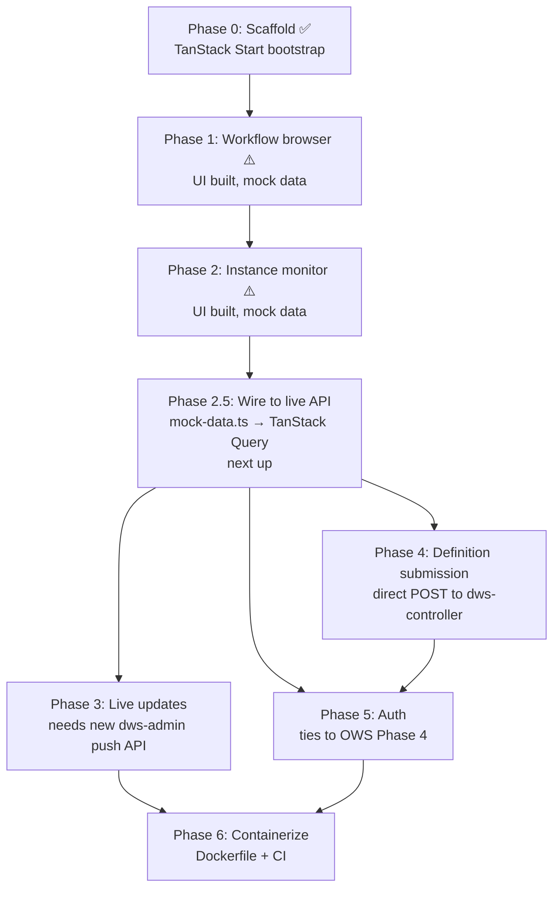

# `dws-console` Web UI Roadmap

Operator-facing web app for DWS. Reads from `dws-admin`'s read API (see
[`dws-admin/README.md`](../../dws-admin/README.md)); writes (submitting definitions) go direct
to `dws-controller`. The app has moved past the bare scaffold: workflow-browser and
instance-monitor screens exist and are UI-complete, but every screen currently renders from
[`src/lib/mock-data.ts`](../../dws-console/src/lib/mock-data.ts) — no route calls the live
`dws-admin` API yet. See [§6 Progress snapshot](#6-progress-snapshot) for the file-level detail.

## 1. What `dws-admin` already exposes

The read API this console will consume is real and merged today — not a plan:

| Endpoint | Returns |
|---|---|
| `GET /workflows` | paginated workflow summaries |
| `GET /workflows/:name` | paginated versions for a workflow |
| `GET /workflows/:name/deployments` | paginated deployment history |
| `GET /instances` | paginated instance summaries, filterable by `workflow`/`status` |
| `GET /instances/:id` | instance detail |
| `GET /instances/:id/tasks` | paginated task-event timeline for an instance |
| `GET /health` | DB connectivity check |

Everything console Phases 1–2 need already exists server-side — this roadmap is UI work, not
API work, until Phase 3.

## 2. Phase dependency graph

## 3. Phased roadmap

| Phase | Scope | Depends on | Status |
|---|---|---|---|
| **0** | TanStack Start scaffold, Tailwind, shadcn/ui, Biome, file routing | — | ✅ done |
| **1** | Read-only workflow browser: list workflows, version history, deployment status | `dws-admin` `/workflows*` (done) | ⚠️ UI built, wired to mock data — not connected to the live API |
| **2** | Instance monitor: instance list with status filter, instance detail, task-event timeline | `dws-admin` `/instances*` (done) | ⚠️ UI built, wired to mock data — not connected to the live API |
| **2.5** ← next | Wire Phases 1–2 to the real API: replace `mock-data.ts` reads with TanStack Query calls against `dws-admin` | TanStack Query provider (done, unused) | ❌ not started |
| **3** | Live status updates (poll or push) on running instances | New `dws-admin` push API (SSE/WebSocket) — **not built yet** | ❌ not started |
| **4** | Submit new/updated definitions from the console (`POST` to `dws-controller`) | `dws-controller`'s existing compile endpoint + CORS story | ❌ not started |
| **5** | Console-level auth (login, session, RBAC on write actions) | [OWS Phase 4 — auth/secrets](openworkflow-features.md) for backend parity | ❌ not started |
| **6** | Dockerfile + CI workflow, publish `ghcr.io/tonylibs/dws-console` | Phases 3–5 substantially done | ❌ not started — blocks [Helm Phase 5](helm-packaging.md) |

## 4. Rationale for ordering

- **1 before 2**: workflow browsing is the simpler read surface and validates the API-client
  layer before instance monitoring's higher data volume.
- **2 before 3**: build the static instance views first; only add polling/push once the shape of
  "what needs to refresh live" is clear from real usage.
- **3 needs new backend work**: `dws-admin` currently has no push mechanism — this phase is
  blocked on a small `dws-admin` addition, not just console-side work.
- **4 is independent of 2/3**: definition submission only needs the workflow browser's API-client
  scaffolding, not the instance monitor.
- **5 before 6**: shipping a container image with write access and no auth is a bad default.
- **6 last**: no Dockerfile exists today, which is why [Helm packaging Phase 5](helm-packaging.md#phased-roadmap)
  currently ships the console toggle disabled by default.

## 5. Open items

- No design for how the console authenticates to `dws-admin`/`dws-controller` in-cluster
  (service-to-service vs. browser-direct) — needs a decision before Phase 4.
- Push mechanism for Phase 3 (SSE vs. WebSocket vs. short-poll) is unpicked; `dws-admin`'s
  `@dbc-tech/nest-dapr` `DaprServer` already runs a second HTTP listener, which may be reusable.

## 6. Progress snapshot

What exists in `dws-console/src/` today, checked directly against the repo (not just this doc):

| Area | Files | State |
|---|---|---|
| Workflow browser (Phase 1) | `routes/workflows/index.tsx`, `routes/workflows/$name.tsx` | List + detail views built, `WorkflowTag` status pills, deployment table. Reads `workflows` array from `lib/mock-data.ts`. |
| Instance monitor (Phase 2) | `routes/instances/index.tsx`, `routes/instances/$id.tsx`, `components/definition-graph.tsx` | List + detail views built, includes a task-graph visualization component. Reads from `lib/mock-data.ts`. |
| Shared UI kit | `components/data-table.tsx`, `components/skeleton.tsx`, `components/states.tsx`, `components/status.tsx`, `components/app-layout.tsx` | Built — table primitives, loading/empty/error states, status-to-color mapping already cover all four `dws-admin` status enums (`WorkflowStatus`, `DeploymentStatus`, `InstanceStatus`, `TaskStatus`). |
| Data fetching | `integrations/tanstack-query/root-provider.tsx` | `QueryClient` is wired into the app shell, but **no route calls `useQuery`** — this is Phase 2.5's entire scope. |
| Mock data | `lib/mock-data.ts` | Explicitly commented as tracking the documented `dws-admin` endpoint shapes, meant to be swapped for real calls — not throwaway. |
| Definition submission (Phase 4) | — | No form/mutation code found; the only `POST` reference is copy text in an empty state. |
| Auth (Phase 5) | — | Nothing found. |
| Containerization (Phase 6) | — | No `Dockerfile` in `dws-console/`. |

**Bottom line**: the console is further along than "scaffold only" — it's a UI-complete
prototype for Phases 1–2, blocked on Phase 2.5 (live-wiring) before any of it is real.
