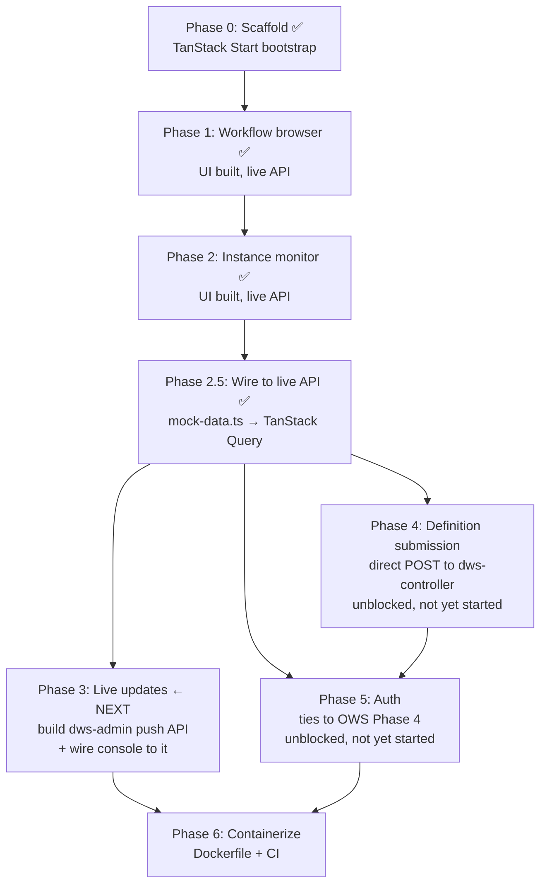

# `dws-console` Web UI Roadmap

Operator-facing web app for DWS. Reads from `dws-admin`'s read API (see
[`dws-admin/README.md`](../../dws-admin/README.md)); writes (submitting definitions) go direct
to `dws-controller`. The app has moved past the UI-complete prototype stage: workflow-browser and
instance-monitor screens are now wired to the live `dws-admin` API via TanStack Query — no route
reads from [`src/lib/mock-data.ts`](../../dws-console/src/lib/mock-data.ts) for data anymore (it's
kept around for shared types/constants only). See [§6 Progress snapshot](#6-progress-snapshot) for
the file-level detail.

## 1. What `dws-admin` already exposes

The read API this console consumes is real, merged, and now live-wired end to end:

| Endpoint | Returns |
|---|---|
| `GET /workflows` | paginated workflow summaries |
| `GET /workflows/:name` | paginated versions for a workflow |
| `GET /workflows/:name/deployments` | paginated deployment history |
| `GET /instances` | paginated instance summaries, filterable by `workflow`/`status` |
| `GET /instances/:id` | instance detail |
| `GET /instances/:id/tasks` | paginated task-event timeline for an instance |
| `GET /health` | DB connectivity check |

Everything console Phases 1–2.5 needed already existed server-side — this roadmap was UI work,
not API work, until Phase 3.

## 2. Phase dependency graph

## 3. Phased roadmap

| Phase | Scope | Depends on | Status |
|---|---|---|---|
| **0** | TanStack Start scaffold, Tailwind, shadcn/ui, Biome, file routing | — | ✅ done |
| **1** | Read-only workflow browser: list workflows, version history, deployment status | `dws-admin` `/workflows*` (done) | ✅ done — live API |
| **2** | Instance monitor: instance list with status filter, instance detail, task-event timeline | `dws-admin` `/instances*` (done) | ✅ done — live API |
| **2.5** | Wire Phases 1–2 to the real API: replace `mock-data.ts` reads with TanStack Query calls against `dws-admin` | TanStack Query provider (done) | ✅ done — merged `497d7c8c` (2026-08-12), follow-up fix `d30c36f9` |
| **3** ← next | Live status updates (poll or push) on running instances. **Scope now explicitly includes the backend piece**: designing and building the new `dws-admin` push API (SSE/WebSocket/short-poll — see [§5](#5-open-items)), not just consuming it from the console | Phase 2.5 (done) | ❌ not started — chosen as the next phase to pick up; covers both `dws-admin` and `dws-console` work |
| **4** | Submit new/updated definitions from the console (`POST` to `dws-controller`) | `dws-controller`'s existing compile endpoint + CORS story | ❌ not started — unblocked, available in parallel with Phase 3 |
| **5** | Console-level auth (login, session, RBAC on write actions) | [OWS Phase 4 — auth/secrets](openworkflow-features.md) for backend parity | ❌ not started — unblocked, available in parallel with Phase 3 |
| **6** | Dockerfile + CI workflow, publish `ghcr.io/tonylibs/dws-console` | Phases 3–5 substantially done | ❌ not started — blocks [Helm Phase 5](helm-packaging.md) |

## 4. Rationale for ordering

- **1 before 2**: workflow browsing is the simpler read surface and validates the API-client
  layer before instance monitoring's higher data volume.
- **2 before 3**: build the static instance views first; only add polling/push once the shape of
  "what needs to refresh live" is clear from real usage.
- **3 is picked up next, backend included**: `dws-admin` currently has no push mechanism, so
  Phase 3's scope was widened to cover building that `dws-admin` addition itself, not just the
  console-side consumption of it. Sequencing it as one phase (rather than splitting the backend
  piece out as a separate, unscheduled prerequisite) keeps the push-mechanism decision and its
  implementation owned by the same piece of work.
- **4 is independent of 2/3**: definition submission only needs the workflow browser's API-client
  scaffolding, not the instance monitor or Phase 3's push work. Fully unblocked now that Phase 2.5
  is merged, and can run in parallel with Phase 3.
- **5 before 6**: shipping a container image with write access and no auth is a bad default.
- **6 last**: no Dockerfile exists today, which is why [Helm packaging Phase 5](helm-packaging.md#phased-roadmap)
  currently ships the console toggle disabled by default.

## 5. Open items

- No design for how the console authenticates to `dws-admin`/`dws-controller` in-cluster
  (service-to-service vs. browser-direct) — needs a decision before Phase 4.
- Push mechanism for Phase 3 (SSE vs. WebSocket vs. short-poll) is unpicked — this is now the
  first decision to make within Phase 3, since the phase covers building it. `dws-admin`'s
  `@dbc-tech/nest-dapr` `DaprServer` already runs a second HTTP listener, which may be reusable
  and is worth checking before standing up a new one.
- The "Definition" tab's graph view (`components/definition-graph.tsx`) still only imports a
  *type* from `mock-data.ts` and isn't wired to a real DSL payload — worth folding into Phase 4's
  scope alongside the submission form, since both need the live definition source.

## 6. Progress snapshot

What exists in `dws-console/src/` today, checked directly against the repo (not just this doc):

| Area | Files | State |
|---|---|---|
| Workflow browser (Phase 1) | `routes/workflows/index.tsx`, `routes/workflows/$name.tsx` | List + detail views built, `WorkflowTag` status pills, deployment table. Reads live via `useWorkflows`/`useWorkflowDetail`. |
| Instance monitor (Phase 2) | `routes/instances/index.tsx`, `routes/instances/$id.tsx`, `components/definition-graph.tsx` | List + detail views built, includes a task-graph visualization component. Reads live via `useInstances`/`useInstanceDetail`; server-side filtering on `workflow`/`status`. |
| Shared UI kit | `components/data-table.tsx`, `components/skeleton.tsx`, `components/states.tsx`, `components/status.tsx`, `components/app-layout.tsx` | Built — table primitives, loading/empty/error states, status-to-color mapping already cover all four `dws-admin` status enums (`WorkflowStatus`, `DeploymentStatus`, `InstanceStatus`, `TaskStatus`). |
| Data fetching (Phase 2.5) | `lib/admin-client.ts`, `lib/admin-hooks.ts`, `lib/admin-adapters.ts` (+ `admin-adapters.test.ts`), `lib/admin-types.ts` | ✅ done. Typed fetch client (`VITE_DWS_ADMIN_URL`, `ApiError` with status), TanStack Query hooks (infinite queries for lists, plain queries for details, 4xx-no-retry), unit-tested DTO→view-model adapters. All four routes drive loading/empty/error/not-found state from live query status; `QueryClient` from `integrations/tanstack-query/root-provider.tsx` is now actually used. |
| Mock data | `lib/mock-data.ts` | No longer a data source — only its type/constant exports (`TaskType`, `statusClass`, `INSTANCE_STATUSES`, etc.) are still imported. |
| Definition submission (Phase 4) | — | No form/mutation code found; the only `POST` reference is copy text in an empty state. Definition graph view also still unwired (see §5). |
| Auth (Phase 5) | — | Nothing found. |
| Containerization (Phase 6) | — | No `Dockerfile` in `dws-console/`. |

**Bottom line**: Phases 0–2.5 are done — the console reads live cluster state end to end for
workflows and instances. **Phase 3 (live updates) is next**, and its scope now spans both repos:
design + build the `dws-admin` push API (§5) and wire the console's instance screens to consume
it. Phases 4 (definition submission) and 5 (auth) remain unblocked and can proceed in parallel if
capacity allows.
