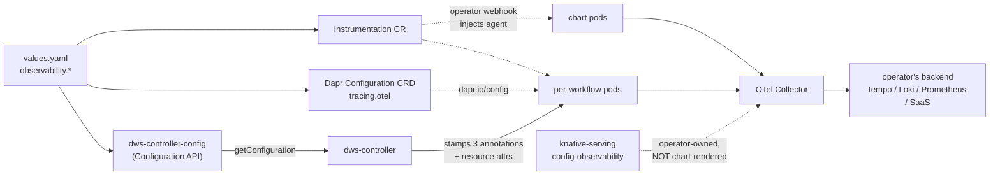
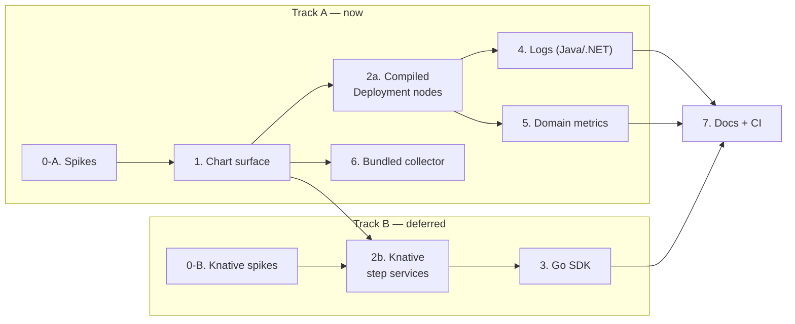

# Observability Roadmap

Roadmap for making every DWS component emit **metrics, traces, and logs in OpenTelemetry
shape**, and for giving a cluster operator one place to point them — an OTLP endpoint they own.
No DWS component ships a storage backend; the chart's job ends at "correctly shaped signals,
correctly addressed".

**The deployed workflow components are the target, not an afterthought.** `dws-orchestrator`,
`dws-flow`, `dws-step`, and the `call`/`run` step images are stamped out per-workflow by
`dws-controller` at runtime — they are the pods that actually execute customer workflows, and the
ones an operator will be debugging. The chart-managed control plane (`dws-controller`,
`dws-admin`) is the smaller, easier half.

## Delivery order — ordinary Deployments first

**Decided 2026-09-19.** The work splits into two tracks along the workload-type line, and Track A
goes first. Every open Knative question is confined to Track B, so Track A can start immediately.

| | Track A — start now | Track B — deferred, needs its own spike |
|---|---|---|
| Components | `dws-controller`, `dws-admin` (chart) · `dws-orchestrator`, `dws-flow`, `dws-step` (controller-deployed) | The eight `TaskKind` step images |
| Workload | Deployment | Knative Service |
| Stacks | Java, .NET, Node | Node, Python, Go |
| Blocked by | Nothing Knative-related | Knative init containers, `emptyDir` gating, Pod-vs-Revision admission, `inject-python`, cold-start cost |

Why this split is the right one:

- **Track A has no Knative dependency at all.** The OTel Operator's init container is only
  contentious inside a Knative Revision; an ordinary Deployment accepts injection normally.
- **Track A still exercises the highest-risk design question.** `dws-orchestrator` is where Dapr
  Workflow runs, so the replay/trace-context ADR — the thing most likely to invalidate the design
  — gets answered on real workloads without waiting for Track B.
- **Track A is most of the control-plane debugging story**, and it proves the whole chain:
  values → CR → annotation → agent → collector → backend.

**Be honest about what Track A does not give you.** A trace of a real workflow execution will
show `dws-controller` → `dws-orchestrator` → a **client-side span for the Dapr invocation of each
step** → response, with **no server-side span inside the step pod**. You get step latency as the
orchestrator sees it, and nothing about what happened inside. That gap is Track B's whole value,
and it should be stated in any demo so the partial picture is not mistaken for a broken one.

## Scope

**Workload type matters more than stack here**, because it decides whether OTel Operator
auto-injection is even available. Only the step images are Knative Services; everything else is
an ordinary Deployment.

| Component | Stack | Deployed by | Workload | Instrumentation mechanism |
|---|---|---|---|---|
| `dws-controller` | Java 25, Quarkus | Helm chart | Deployment | `inject-java` |
| `dws-admin` | Node, NestJS | Helm chart | Deployment | `inject-nodejs` |
| `dws-console` | React/Vite (browser) | Helm chart | Deployment | Deferred — browser SDK, off by default |
| `dws-orchestrator` | Java 25, Spring Boot | **controller, per workflow** | Deployment | `inject-java`, stamped by the controller |
| `dws-step` | Java 25, Spring Boot | **controller, per workflow** | Deployment | `inject-java`, stamped by the controller |
| `dws-flow` | .NET 10 | **controller, per workflow** | Deployment | `inject-dotnet`, stamped by the controller |
| `dws-call-openapi` / `dws-call-asyncapi` | Node 24 | **controller, per workflow** | **Knative Service** | `inject-nodejs`, stamped by the controller |
| `dws-call-a2a` | **Python 3, FastAPI** | **controller, per workflow** | **Knative Service** | `inject-python` — **undecided, see Phase 0-B(d)** |
| `dws-call-http` / `dws-call-grpc` / `dws-run-*` | Go 1.26 | **controller, per workflow** | **Knative Service** | **In-code OTel SDK** — no usable auto-injection |
| Dapr sidecars (all of the above) | — | Dapr injector | — | `dapr.io/config` → Configuration CRD with `tracing.otel` |
| Knative Serving data plane | — | Knative install | — | **Native OTLP** — `config-observability` ConfigMap, no injection |
| OTel Collector | — | Helm chart, optional | — | Bundled subchart behind `observability.collector.enabled` |

Every deployable step kind in `TaskKind` (`CALL_HTTP`, `CALL_OPENAPI`, `CALL_GRPC`,
`CALL_ASYNCAPI`, `CALL_A2A`, `RUN_SHELL`, `RUN_SCRIPT_JS`, `RUN_SCRIPT_PYTHON`) is rendered by
`StackSynthesizer.knativeServices()` as a scale-to-zero Knative Service. The orchestrator is
rendered by `StackSynthesizer.orchestratorDeployment()`. `dws-flow`/`dws-step` (runtime v2) are
ordinary Deployments.

Both Dapr "Configuration" things this repo distinguishes appear here, doing different jobs:

| Thing | Used for |
|---|---|
| **Configuration CRD** (`dapr.io/v1alpha1 kind: Configuration`) | Sidecar tracing — referenced per pod via the `dapr.io/config` annotation, exactly as `auth.enabled` already does with `dws.auth.configName` |
| **Configuration API** (`configuration.redis` Component) | The observability flags the controller READS — extends the existing `dws-controller-config` store that already backs the v1/v2 compiler flag (ADR 0002) |

## Signal architecture



## Deployed workflow components

The core of the roadmap. The controller compiles a definition into a stack of pods; each of those
pods must come out of the compiler already instrumented, because nothing else in the system gets
a chance to touch them.

### What the controller must stamp

Three annotations, not two — the `dapr.io/config` reference is easy to miss, and without it the
sidecar half of the picture silently never happens:

| Stamped onto every compiled pod | Value | Why |
|---|---|---|
| `instrumentation.opentelemetry.io/inject-<lang>` | `true`, or `"<ns>/dws-instrumentation"` | Triggers the OTel Operator webhook. Language chosen per node type by the compiler |
| `instrumentation.opentelemetry.io/container-names` | the app container name | Without it the operator injects into **every** container in the pod, including `daprd` |
| `dapr.io/config` | `dws-tracing` | Points the sidecar at the tracing Configuration CRD. Mirrors the existing `auth.enabled`-gated `dapr.io/config` pattern on the controller/admin Deployments |

Plus, for Go nodes only (no auto-injection), the standard `OTEL_*` env block the agent would
otherwise have supplied.

**No fourth annotation needed — resolved 2026-09-19 (Phase 0-A(e)).** The .NET
auto-instrumentation ships separate `linux-x64` and `linux-musl-x64` builds, so an Alpine-based
`dws-flow` would have needed `instrumentation.opentelemetry.io/otel-dotnet-auto-runtime` or the
native profiler would silently fail to load, leaving a healthy pod emitting nothing.
`dws-flow/Dockerfile`'s runtime stage is `mcr.microsoft.com/dotnet/aspnet:10.0` — the
Debian-based default tag, glibc — so the default `linux-x64` payload is correct and **three
annotations remain the complete set**.

**Treat that as a constraint, not a fact.** Retagging `dws-flow` to an Alpine variant would break
instrumentation silently, with no build or deploy error. Same shape of risk applies to
`dws-controller`: CI builds `src/main/docker/Dockerfile.jvm`
(`registry.access.redhat.com/ubi9/openjdk-25-runtime:1.24`, a real JVM), but the repo also
carries `Dockerfile.native` and `Dockerfile.native-micro` from the Quarkus scaffolding. A
GraalVM native image has no JVM, so `-javaagent` becomes a no-op and the controller would stop
emitting with nothing in the logs to say why. Both constraints belong in the Phase 7 operator
guide and ideally in a CI assertion.

### Resource attributes — the part only the controller knows

A trace is useless if every workflow's pods report as anonymous services. Workflow identity is
compiler-time knowledge, so the controller stamps it as `OTEL_RESOURCE_ATTRIBUTES` on each node:

| Attribute | Source |
|---|---|
| `service.name` | the node's Dapr app-id (already computed — see `AGENTS.md` "Task name → Dapr app-id") |
| `dws.workflow.name` | definition name |
| `dws.workflow.version` | definition version — the immutable versioned definition already exists |
| `dws.node.id` | `CompiledNode.nodeId()` (ADR 0003) |
| `dws.node.kind` | `flow` / `step` |

`service.name` reusing the app-id is deliberate: it makes a trace's service graph line up
one-to-one with the compiled node graph an operator sees in the console.

### Where the config comes from

**Not** controller env vars. The controller already reads its v1/v2 compiler-strategy flag from
the `dws-controller-config` `configuration.redis` store via the Dapr Configuration API
(`CompilerProducer`, ADR 0002), and that is this repo's established answer for app-level flags.
Observability flags extend that same store with the same defaulting discipline — absent key or
unreachable store means observability off, never a failed compile.

Consequence worth stating: changing the OTLP endpoint does **not** retro-fit already-deployed
workflow stacks. Each workflow version redeploys its whole pod-set anyway, so annotations are
correct at stamp time and a config change takes effect on the next deploy of each workflow.
Accepted trade-off, not a gap to engineer around.

### Namespace

Compiled stacks land in the controller's own namespace (`DWS_NAMESPACE`, a `fieldRef` on
`metadata.namespace`), so the chart-rendered `Instrumentation` CR and tracing Configuration CRD
are already in the right namespace for the default single-namespace install. The cross-namespace
form (`inject-java: "dws-system/dws-instrumentation"`) is only needed if workflow stacks ever
target other namespaces — supported by stamping the qualified reference, not by replicating CRs.

## Three instrumentation layers, deliberately all three

| Observable | App agent / SDK | Dapr sidecar | Knative native |
|---|---|---|---|
| **Outbound call to the upstream API** | ✅ | ⚠️ **only when `auth: oauth2`** — see below | ❌ |
| Postgres (`dws-admin`), Kubernetes API (`dws-controller`) | ✅ | ❌ | ❌ |
| In-process time — DSL compile, `jq` evaluation | ✅ | ❌ | ❌ |
| Exceptions and stack traces | ✅ | ❌ | ❌ |
| **Resiliency retries / circuit-breaker decisions** | ❌ (sees one call) | ✅ | ❌ |
| **Dapr Workflow engine — replay, timers, actor activation** | ❌ | ✅ | ❌ |
| **pub/sub `dws.events` publish → deliver causal link** | partial | ✅ | ❌ |
| Wrong app-id / mTLS / service-discovery failure | ❌ | ✅ | ❌ |
| `dapr_*` runtime metrics | ❌ | ✅ | ❌ |
| **Scale-to-zero behaviour, queue depth, cold starts** | ❌ | ❌ | ✅ **only source** |
| Per-revision request rate / latency / status | ✅ | partial | ✅ |

No layer is redundant. Each owns rows nothing else can see.

### Knative native telemetry — free, and we are not using it yet

Knative Serving emits OTLP directly, configured cluster-wide in the `config-observability`
ConfigMap in the `knative-serving` namespace. No injection, no annotation, no code change:

| Key | Purpose |
|---|---|
| `request-metrics-protocol` / `request-metrics-endpoint` | data-plane request metrics → OTLP |
| `metrics-protocol` | Knative's own component metrics (`prometheus`, `http/protobuf`, `grpc`) |
| `tracing-protocol` / `tracing-endpoint` / `tracing-sampling-rate` | OTel traces (Knative 1.19+) |

The queue-proxy already present in every step pod emits `kn.serving.queue.depth`,
`kn.serving.invocation.duration`, and HTTP server/client metrics, attributed by
`kn.revision.name`, `kn.service.name`, `kn.configuration.name`, `k8s.pod.name` and
`http.response.status_code`. The activator adds `kn.revision.request.concurrency` and connection
error counters.

**Config ownership crosses a chart boundary.** `config-observability` belongs to the Knative
install, not to the DWS chart, so `observability.otlp.endpoint` cannot simply render it. Options:
document it as an operator prerequisite, or reuse the chart's existing Knative hook-Job pattern.
This is a fourth answer to the question ADR candidate 5 already asks — decide them together.

### The egress asymmetry — observability that depends on auth scheme

`dws-call-http`, `dws-call-openapi` and `dws-call-a2a` rewrite their outbound request through the
Dapr sidecar **only when the step's auth scheme is `oauth2`**:

```
http://localhost:${DAPR_HTTP_PORT}/v1.0/invoke/<HTTPEndpoint-name>/method<path><query>
```

The `HTTPEndpoint` resource is synthesized per workflow version by
`StackSynthesizer.oauthHttpEndpoints()`, scoped to the requesting app-ids, paired with a
`middleware.http.oauth2clientcredentials` Component that owns token acquisition — which is why
the runners strip their own `Authorization` header. The motive was auth, not telemetry.

The observability consequence is a genuine wart: **two workflows calling the same API with the
same step kind and the same image have different egress visibility, decided by an unrelated auth
choice.** OAuth2 steps get `dapr_http_client_*` and `dapr_resiliency_*` for free; bearer, basic
and unauthenticated steps are dark at the sidecar. `dws-call-grpc`, `dws-call-asyncapi` and
`dws-run-*` never route through Dapr at all.

Two ways to resolve it, both out of scope for this roadmap to decide alone:

1. Accept the asymmetry and rely on the app agent / in-code SDK for egress spans uniformly.
2. Route **all** call-step egress through Dapr. The synthesis machinery already exists and is
   tested, and Dapr also accepts an inline FQDN with no `HTTPEndpoint` resource at all
   (`/v1.0/invoke/https://host/method/...`). This would make retries and circuit-breaking
   declarative — but it changes failure semantics for every call step, risks retry amplification
   against `WorkflowErrors.classify`, and therefore belongs to the Workflow Runtime Architecture
   roadmap as its own ADR, with this roadmap consuming the outcome.

Until that is decided, **do not have Phase 2a or 2b quietly introduce Dapr-routed egress.**

### Istio — the planned mesh, and what it does and does not solve

A future DWS integration puts Istio in front of every service, Kubernetes and Knative alike.
Assessed 2026-09-19; the conclusion changes how ADR candidate 6 should be handled.

Istio is what Dapr is not: **transparent interception**. iptables (sidecar mode) or ztunnel
(ambient mode) captures all TCP in and out of the pod, so every `dws-call-*` and `dws-run-*`
egress becomes visible with no URL rewriting, no auth-scheme dependency and no code change. That
is a strictly better answer to the uniformity problem than routing egress through Dapr.

**But HTTPS collapses it to L4, which is the normal case for a `call` step:**

| Upstream | What the proxy sees | Metrics |
|---|---|---|
| `http://` | full HTTP | `istio_requests_total`, `istio_request_duration_milliseconds`, `istio_request_bytes`, `istio_response_bytes` — with `response_code`, `request_protocol`, `destination_service` |
| **`https://`** | source IP, dest IP, SNI only | `istio_tcp_sent_bytes_total`, `istio_tcp_received_bytes_total`, `istio_tcp_connections_opened_total`, `istio_tcp_connections_closed_total` |

Outbound metrics carry `reporter="source"`. Recovering L7 for an HTTPS upstream requires TLS
origination — a `ServiceEntry` (protocol HTTP) plus a `DestinationRule` with `tls.mode: SIMPLE`,
and the app dropping to `http://` — which means the controller synthesizing a `ServiceEntry` per
external host per workflow, structurally the same work `oauthHttpEndpoints()` already does.
Undeclared hosts also fall into `PassthroughCluster`, collapsing per-destination labels, so a
`ServiceEntry` is needed for per-API breakdown even at L4.

Costs to weigh:

- A Knative step pod would carry user container + `queue-proxy` + `daprd` + `istio-proxy`, plus
  the OTel init container. That is a lot in front of a scale-to-zero function.
- **Dapr and Istio both do mTLS.** Expect to disable one, and to need
  `traffic.sidecar.istio.io/excludeInboundPorts` for daprd's ports so the two proxies do not
  fight over interception.
- Ambient mode (ztunnel, no per-pod sidecar) is the obvious mitigation for pod weight, but its
  L7 metrics need a waypoint proxy — without one you are back to L4 for egress.
- **A fourth sampling claimant**: `meshConfig.defaultConfig.tracing.sampling`. Pin it to 100 and
  keep the app agent as the root, per ADR candidate 3.

**Conclusion.** Istio removes the *uniformity* problem and leaves the *L7-for-HTTPS* problem
exactly where it is — which the app agent and the Phase 3 in-code SDK already solve. Treat it as
a fifth layer for L4 egress, mesh security and service topology, not as a substitute for
application instrumentation or for any phase here. And because it delivers ADR candidate 6's
main benefit without changing call semantics, **candidate 6 should be deferred pending the Istio
decision rather than decided now.**

### Sampling must be ONE decision — now with three claimants

If the agent samples at 10% and another layer samples independently at 10%, traces get holes in
the middle. Rule:

| Layer | Setting |
|---|---|
| App agent / in-code SDK | **the sampling root** — `parentbased_traceidratio` |
| Dapr Configuration CRD | pinned `samplingRate: "1"` — honour the inbound parent flag |
| Knative `config-observability` | pinned `tracing-sampling-rate: 1.0` — same reason |

Knative is the newly-added third claimant and the easiest to miss, because it is configured in a
namespace the DWS chart does not own.

## Instrumentation mechanism — OTel Operator `Instrumentation` CRD

Auto-injection is preferred over baking agents into Dockerfiles: the operator's mutating webhook
adds an init container and the `OTEL_*` env block at Pod admission, triggered by an annotation.
That is what keeps the controller's job down to stamping annotations rather than synthesizing a
full telemetry env block for every compiled resource.

The init container is purely a file courier. It writes the agent into an `emptyDir` that the app
container also mounts:

| Stack | Mount path | Payload | Activation env |
|---|---|---|---|
| Java | `/otel-auto-instrumentation-java` | `javaagent.jar` (~20 MB) | `JAVA_TOOL_OPTIONS` |
| Node | `/otel-auto-instrumentation-nodejs` | package tree (~30 MB) | `NODE_OPTIONS=--require …` |
| .NET | `/otel-auto-instrumentation-dotnet` | native profiler + managed deps (~100 MB+) | `CORECLR_*`, `DOTNET_*` |

Mount paths carry the language suffix in current operator versions; older releases used a bare
`/otel-auto-instrumentation`. Pin the operator version in Phase 0 so templates do not drift.

```yaml
apiVersion: opentelemetry.io/v1alpha1
kind: Instrumentation
metadata:
  name: dws-instrumentation
spec:
  exporter:
    endpoint: http://dws-otel-collector:4318
  propagators: [tracecontext, baggage]
  sampler:
    type: parentbased_traceidratio
    argument: "0.1"
  resource:
    resourceAttributes:
      service.namespace: dws
  java: {}
  nodejs: {}
  dotnet: {}
```

| Stack | Annotation | Viable? |
|---|---|---|
| Java | `instrumentation.opentelemetry.io/inject-java` | ✅ |
| Node | `instrumentation.opentelemetry.io/inject-nodejs` | ✅ |
| .NET | `instrumentation.opentelemetry.io/inject-dotnet` | ✅ (check musl variant) |
| Python | `instrumentation.opentelemetry.io/inject-python` | ❓ undecided — `dws-call-a2a`, Phase 0-B(d) |
| **Go** | `inject-go` | ⚠️ **rejected** — eBPF-based, requires a privileged sidecar and `CAP_SYS_PTRACE`, one agent per container. Unacceptable for scale-to-zero step pods. Go uses an in-code SDK instead (Phase 3) |

## User-facing configuration

| Value | Default | Purpose |
|---|---|---|
| `observability.enabled` | `false` | Master switch — chart is a topological no-op when off |
| `observability.otlp.endpoint` | `http://dws-otel-collector:4318` | Where all signals go |
| `observability.otlp.protocol` | `http/protobuf` | `grpc` or `http/protobuf` |
| `observability.otlp.headers` | `{}` | Auth headers for SaaS backends |
| `observability.otlp.existingSecret` | `""` | Secret-sourced headers (API keys) |
| `observability.traces.enabled` | `true` | |
| `observability.traces.samplingRate` | `0.1` | App-side sampling root |
| `observability.traces.daprSpans` | `true` | Sidecar span volume control |
| `observability.metrics.enabled` | `true` | |
| `observability.logs.enabled` | `true` | |
| `observability.logs.format` | `json` | `json` or `text` |
| **`observability.workflows.enabled`** | `true` | **Whether compiled workflow stacks get instrumented.** Separate from the master switch so an operator can observe the control plane without paying per-workflow span volume |
| `observability.operator.required` | `true` | Preflight — fail fast if Operator CRDs absent |
| `observability.collector.enabled` | `false` | Bundle the collector subchart |
| `observability.resourceAttributes` | `{}` | Extra `service.*` / `deployment.environment` attrs |

Knative's own `config-observability` keys are deliberately **not** in this table — see the chart
boundary note above.

## Chart layout additions

```
charts/dws/templates/
├── observability/
│   ├── instrumentation.yaml       # opentelemetry.io/v1alpha1 Instrumentation CR
│   ├── dapr-configuration.yaml    # dapr.io/v1alpha1 Configuration — tracing.otel, samplingRate "1"
│   └── otlp-secret.yaml           # optional header secret passthrough
├── controller/config-component.yaml  # EXTENDED — same store, observability flag keys
├── _preflight.tpl                 # + dws.preflight.observability (opentelemetry.io/v1alpha1)
└── _helpers.tpl                   # + dws.observability.podAnnotations, dws.observability.configName
```

## Phased roadmap

Status legend: ✅ done · ⚠️ partial/stubbed · ❌ not started. Nothing started as of 2026-09-19. Track A phases are 0-A, 1, 2a, 6 (and the Track A halves of 4 and 5); Track B is 0-B, 2b, 3.

| Phase | Status | Goal | Key tasks |
|---|---|---|---|
| **0-A. Spikes (Track A)** | ⚠️ | De-risk the Deployment track | **(b) ✅ ANSWERED — documented prerequisite + preflight, not a chart dependency.** **(e) ✅ ANSWERED — `dws-flow` is glibc; no fourth annotation.** **(f) ✅ ANSWERED — pin chart `0.123.0` / operator `0.159.0`.** **(c) ❌ OPEN — does trace context survive a Dapr Workflow replay?** Exercised by `dws-orchestrator`, a Deployment, so it is answerable inside Track A. Now the only open Track A spike and the highest-risk item in the roadmap. See the Findings log for (b), (e), (f) |
| **0-B. Spikes (Track B)** | ❌ | Deferred — de-risk the Knative track | **(a) Knative init containers**, scoped to `dws-call-openapi`, `dws-call-asyncapi`, `dws-call-a2a` — Knative gates init containers behind `kubernetes.podspec-init-containers` and `emptyDir` behind `kubernetes.podspec-volumes-emptydir`. Two sub-questions: is the flag on, and — since the operator mutates the **Pod**, downstream of Knative's Revision validation — does injection work even with the flag off? **(d) `inject-python` for `dws-call-a2a`**, or the in-code SDK path? Plus cold-start cost on a scale-to-zero step pod — the cost is the **init-container image pull**, cached per node, so measure cold node vs warm node separately |
| **1. Chart surface** | ❌ | Render the CRs, cover the control plane | `observability.*` values block; `Instrumentation` CR template; tracing Configuration CRD with `tracing.otel` + `samplingRate: "1"`; observability flag keys added to the existing `dws-controller-config` store; `dws.preflight.observability`; `dws.observability.podAnnotations` helper; annotate `dws-controller` + `dws-admin` (all three annotations). **Track A. No Knative dependency** — both targets are Deployments. Deliverable: a trace covering controller → Dapr → admin → Postgres, with zero application code changed |
| **2a. Compiled Deployment nodes** | ❌ | **Track A's payoff** | `dws-controller` stamps `inject-<lang>`, `container-names` and `dapr.io/config` onto the compiled **Deployments** — the orchestrator plus the `dws-flow`/`dws-step` nodes — with `OTEL_RESOURCE_ATTRIBUTES` carrying `service.name`/`dws.workflow.*`/`dws.node.*`. Controller reads the flags from `dws-controller-config` via the Configuration API, defaulting to off. Touches both compiler strategies (`V1OrchestratorCompiler`, `V2StructuralCompiler`) and `StackSynthesizer`. **No Knative dependency.** Deliverable: a trace from controller through orchestrator to the edge of each step invocation |
| **2b. Knative step services** | ❌ | Deferred — needs Phase 0-B | The same stamping applied to `StackSynthesizer.knativeServices()` output, for the eight `TaskKind` images. Covers the Node and Python images via auto-injection; the Go images consume the stamped env in Phase 3. This is where end-to-end step visibility actually arrives |
| **3. Go step services** | ❌ | Deferred with 2b | In-code OTel SDK bootstrap in `dws-call-http`, `dws-call-grpc`, `dws-run` (shared internal package — one codebase produces the three `dws-run-*` images). `otel-go` + `autoexport`, reading the standard `OTEL_*` env vars Phase 2b stamps, so the config surface stays identical to the injected stacks. If Phase 0-B comes back hostile, the Node and Python images adopt this same pattern — a known path, not a re-plan |
| **4. Logs** | ❌ | Log ↔ trace correlation | Structured JSON to stdout with `trace_id`/`span_id` injected by the active context; collector `filelog` receiver; `observability.logs.format`. The only phase requiring a code change in every package. **Splittable along the same track line** — Java and .NET (Track A) first, the step images with 2b |
| **5. Domain metrics** | ❌ | DWS-specific SLOs | `dws_workflow_duration_seconds`, `dws_task_failures_total`, `dws_task_retries_total`, `dws_definition_compile_duration_seconds`, `dws_deployment_failures_total`, dimensioned by the same `dws.workflow.*` attributes Phase 2a establishes. Naming fixed against OTel semantic conventions **and against the `kn.*` and `dapr_*` families** before first emission — renaming a metric post-release breaks operator dashboards |
| **6. Bundled collector** | ❌ | Batteries-included install | `opentelemetry-collector` subchart under `condition: observability.collector.enabled`, following the existing Postgres/Redis optional-subchart pattern. Dev/eval-grade by default with the same "point at a managed instance for production" caveat |
| **7. Docs + CI** | ❌ | Prove it, then document it | `docs/observability.md` operator guide; values reference; the Knative `config-observability` prerequisite; CI assertion in the existing kind integration job that a **deployed workflow** produces a connected trace across controller → orchestrator → step, mirroring the existing end-to-end pub/sub delivery check |

### Sequencing



Track A proves the whole chain and answers the replay ADR. Track B is where end-to-end step
visibility actually arrives — it is deferred, not dropped, and Phase 7 cannot close without it.

## Design decisions needing an ADR

| # | Decision | Why it needs a record |
|---|---|---|
| 1 | **Trace context across Dapr Workflow replay** | Durable workflow re-executes activity code on replay. Naive span creation produces duplicate spans per replay, or a fresh trace per replay. Needs a stated rule for what the workflow-level span is, and whether replayed activity work is suppressed. Highest-risk item in this roadmap |
| 2 | **Compiled nodes carry their own telemetry identity** | `service.name` = Dapr app-id, plus `dws.workflow.*`/`dws.node.*` resource attributes stamped at compile time. Sits directly alongside ADR 0004 and should be consistent with it |
| 3 | App is the sampling root; Dapr **and Knative** pinned to `1` | Non-obvious and easy to "fix" wrongly later by lowering one of the downstream rates, which silently shreds traces. Three layers now, not two |
| 4 | Go rejects `inject-go` in favour of an in-code SDK | Asymmetry between Go and the other stacks will otherwise look like an oversight |
| 5 | OTel Operator as prerequisite vs. chart dependency — **and the same question for Knative's `config-observability`** | Follows the Dapr (dependency) / Knative (hook Job) / APISIX (bundled) precedents; the chart already has three different answers to this shape of question, and Knative's ConfigMap adds a fourth surface in a namespace the chart does not own |
| 6 | **Whether all call-step egress routes through Dapr** — **DEFERRED pending the Istio decision** | Today only `auth: oauth2` steps do, making egress observability depend on an unrelated auth choice. Changing it alters failure semantics for every call step. Istio delivers the same uniformity transparently, so deciding this now risks changing how every call step talks to the internet for a benefit the mesh provides for free. Belongs to the Workflow Runtime Architecture roadmap; recorded here because this roadmap consumes the outcome |
| 7 | **Istio as a fifth telemetry layer** | If the mesh lands, its sampling rate joins the pinned-to-1 rule, and per-destination egress metrics require a synthesized `ServiceEntry` per external host. Both are controller-side obligations that should be written down before the mesh work starts, not discovered during it |

## Open items

- **Phase 0-B(a) is narrower than first assessed.** Only `dws-call-openapi`, `dws-call-asyncapi`
  and `dws-call-a2a` need OTel Operator injection on Knative. The Go step images already take the
  in-code SDK path for unrelated reasons, and every non-step component is a plain Deployment. The
  fallback if Knative blocks injection is "those three images adopt Phase 3's pattern", not a
  re-plan of Phases 1–2.
- **The Pod-vs-Revision admission question is unresolved and worth answering first.** Knative
  validates the PodSpec *you* declare in a Revision; the OTel Operator mutates the Pod created by
  the Knative-owned Deployment, downstream of that. If those are genuinely separate admission
  paths, the feature flag may not gate operator injection at all. Verify empirically with the
  flag off before assuming either way.
- **`dws-call-a2a` (Python) post-dates the first draft of this roadmap.** Added by ADR 0004
  (2026-09-15). Any per-stack count written before that date is stale.
- **Knative + scale-to-zero cost.** Auto-injection adds an init container to every affected step
  pod. The dominant cost is pulling the autoinstrumentation image, which is cached per node, so
  measure cold node and warm node separately rather than quoting one number.
- **Span volume from per-workflow pods is the real cost driver.** A busy platform has far more
  step pods than control-plane pods, and agent + sidecar + queue-proxy produces several times the
  spans of any one alone. `observability.workflows.enabled` and `observability.traces.daprSpans`
  are the escape hatches; neither is default-off.
- **Config changes don't retro-fit deployed stacks.** Annotations are stamped at compile time, so
  an OTLP endpoint change reaches a given workflow only when that workflow is next deployed.
  Accepted. Worth documenting prominently in the Phase 7 operator guide, since it will otherwise
  be reported as a bug.
- **`dws-console` browser telemetry is deferred.** RUM has a different consent/privacy shape than
  server-side telemetry and shares no configuration with it. Not a phase here.
- **Relationship to `dws.events`.** The lifecycle-event stream (`docs/events.md`) is a *product*
  feature — the console's instance monitor consumes it. It is not a replacement for tracing and
  is not being retired. Overlap is intentional; keep the contracts separate. A future console-side
  "open this instance's trace" link is the natural join point, not a merge.
- **Unverified:** whether Dapr's `HTTPEndpoint` invocation path populates the
  `dapr_runtime_service_invocation_*` counters (framed around remote Dapr apps) or only the
  `dapr_http_client_*` family. Settle by curling the sidecar's metrics endpoint after one OAuth2
  call step, before Phase 5 fixes any naming.
- **Next up:** Phase 0-A(c) — the Dapr Workflow replay question — is the only open Track A spike. (b), (e) and (f) are answered; Phase 1 is unblocked and can start in parallel. Track B waits.

## Findings log

### 2026-09-19 — scope correction, Knative-native layer, egress asymmetry, Istio

Verified against the repo at the time of writing. Each item changed something in this document.

| # | Finding | Evidence | Consequence |
|---|---|---|---|
| 1 | **Only step images are Knative Services.** `dws-orchestrator`, `dws-flow` and `dws-step` are ordinary Deployments | `StackSynthesizer.knativeServices()` iterates `plan.steps()` over the eight `TaskKind` values; `StackSynthesizer.orchestratorDeployment()` builds a Deployment | Phase 0-B(a) went from "blocks everything" to "blocks three images". Made the Track A / Track B split possible |
| 2 | **`dws-call-a2a` is a Python 3 / FastAPI image** and was missing from this roadmap entirely | `dws-call-a2a/pyproject.toml`; ADR 0004, accepted 2026-09-15 — three days after this roadmap was drafted | Added to Scope; new Phase 0-B(d) on `inject-python`; every pre-2026-09-15 per-stack count in this doc was stale |
| 3 | **Knative Serving emits OTLP natively** — queue-proxy metrics with no injection | `config-observability` keys `request-metrics-*`, `metrics-protocol`, `tracing-*`; `kn.serving.queue.depth`, `kn.serving.invocation.duration` | Added as a third layer. Scale-to-zero and queue depth have no other source. Adds a third sampling claimant and a chart-boundary question |
| 4 | **Egress through Dapr happens only under `auth: oauth2`** | `runner.go` `if r.cfg.Auth.Scheme == config.AuthOAuth2`; `request.ts` `if (auth.oauth === undefined) return` direct; `auth.py` `if not isinstance(auth, OAuth2Auth): return url`. `HTTPEndpoint` synthesized by `StackSynthesizer.oauthHttpEndpoints()` with `middleware.http.oauth2clientcredentials` | Egress visibility currently depends on an unrelated auth choice. Raised as ADR candidate 6 |
| 5 | **Dapr is not a transparent mesh** — the sidecar sees only what the app addresses to `localhost:3500` | Dapr service-invocation docs; non-Dapr endpoints reachable by `HTTPEndpoint` name *or* inline FQDN, no CRD required | Rules out "register as a Dapr app and get egress telemetry for free" |
| 6 | **Istio would intercept transparently, but HTTPS gives L4 only** | Istio standard metrics; egress TLS-origination guidance — with end-to-end TLS the proxy sees only IPs and SNI | ADR candidate 6 deferred rather than decided; new ADR candidate 7 |
| 7 | **The init container is a file courier**, and its cost is the image pull, not the copy | OTel Operator injection writes the agent into an `emptyDir` the app container also mounts | Cold-start measurement must separate cold node from warm node |
| 8 | **This document had drifted a full restructure behind its Notion mirror** | Repo copy still had Phase 2 = Go / Phase 3 = controller, four ADR candidates, `DWS_OBSERVABILITY_*` env vars, no resource-attributes section | Rebuilt on the Notion baseline before applying the above. Working-tree roadmap edits get auto-stashed on this checkout — commit promptly |

### 2026-09-19 (later) — Phase 0-A spikes (b), (e), (f) answered

| Spike | Answer | Evidence |
|---|---|---|
| **(e)** `dws-flow` libc | **glibc — no fourth annotation.** Three annotations stay the complete set | `dws-flow/Dockerfile` runtime stage is `mcr.microsoft.com/dotnet/aspnet:10.0`, the Debian default tag |
| **(f)** operator version | **Pin chart `0.123.0` / operator `0.159.0`** (published 2026-09-15) | `opentelemetry-helm-charts` index |
| **(b)** dependency vs prerequisite | **Documented prerequisite + preflight.** Diverge from the chart's subchart pattern, specifically because of cert-manager | `charts/dws/Chart.yaml`, `_preflight.tpl` |

**On (b) — and a correction to this document.** The roadmap previously said the chart "already has
three different answers to this shape of question". It does not. `Chart.yaml` carries five
conditional dependencies — `postgresql`, `dapr`, `dex`, `redis`, `apisix` — every one of them
`condition: <x>.enabled`, and `_preflight.tpl` carries exactly two checks, `dws.preflight.dapr`
and `dws.preflight.apiGateway`, both the same shape: when the toggle is off, assert the CRDs are
present, otherwise `fail` with a message naming both ways out. That is **one pattern applied
consistently**, not three answers.

The OTel Operator should nonetheless diverge from it, for a reason the other five do not have:
**it pulls cert-manager, which is a cluster singleton.** Bundling it risks colliding with an
existing install, and the chart already documents the related hazard — `dws.preflight.apiGateway`
is deliberately skipped when `apisix.enabled=true` because Helm computes
`.Capabilities.APIVersions` *before* a fresh install's own dependency CRDs land, which would
false-fail. A bundled operator would hit exactly that, and drag cert-manager's CRDs through it.

So: operator stays a documented prerequisite, and `observability.operator.required` drives a
preflight that mirrors `dws.preflight.dapr` one-for-one:

```
{{- define "dws.preflight.observability" -}}
{{- if and .Values.observability.enabled .Values.observability.operator.required }}
{{- if not (.Capabilities.APIVersions.Has "opentelemetry.io/v1alpha1") }}
{{- fail "observability.enabled=true but the OpenTelemetry Operator CRDs (opentelemetry.io/v1alpha1) were not found in the cluster. Install the OpenTelemetry Operator (which requires cert-manager) before running helm install/upgrade, or set observability.operator.required=false to skip this check." }}
{{- end }}
{{- end }}
{{- end }}
```

registered in `preflight.yaml` alongside the existing two includes.

**Unasked-for finding, same class as (e): the controller has a native-image escape hatch.**
CI builds `dws-controller/src/main/docker/Dockerfile.jvm`
(`registry.access.redhat.com/ubi9/openjdk-25-runtime:1.24`, entrypoint `run-java.sh`), so
`-javaagent` works today. But `Dockerfile.native` and `Dockerfile.native-micro` sit beside it
from the Quarkus scaffolding, and a GraalVM native image has no JVM — injection would become a
silent no-op. Related good news: `run-java.sh` consumes `JAVA_OPTS`/`JAVA_OPTS_APPEND` while the
operator injects `JAVA_TOOL_OPTIONS`, so there is no variable collision.

**Still unverified, carried forward:** whether Knative's Revision-level feature flags gate a
Pod-level operator mutation at all (Phase 0-B(a)); whether Dapr's `HTTPEndpoint` path populates
`dapr_runtime_service_invocation_*` or only `dapr_http_client_*`; and `dws-flow`'s base image
libc (Phase 0-A(e)).
