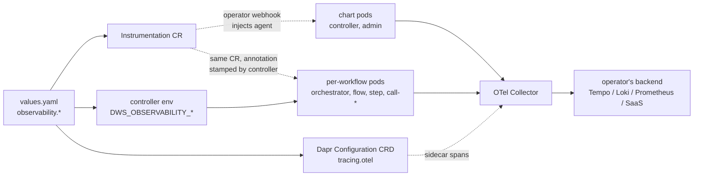
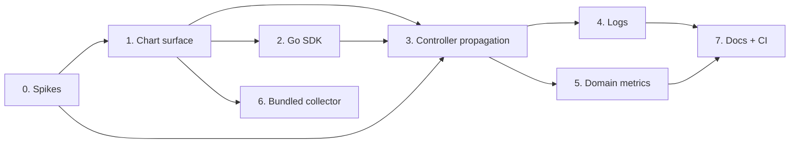

# Observability Roadmap

Roadmap for making every DWS component emit **metrics, traces, and logs in OpenTelemetry
shape**, and for giving a cluster operator one place to point them — an OTLP endpoint they own.
No DWS component ships a storage backend; the chart's job ends at "correctly shaped signals,
correctly addressed".

The defining constraint of this roadmap: **most DWS workloads are not chart-managed.**
`dws-orchestrator`, `dws-flow`, `dws-step`, and the `call`/`run` step images are stamped out
per-workflow by `dws-controller` at runtime. Any instrumentation story that only covers the
Helm chart covers the minority of the pods.

## Scope

| Component | Stack | Deployed by | Instrumentation mechanism |
|---|---|---|---|
| `dws-controller` | Java 25, Quarkus | Helm chart | OTel Operator auto-injection (`inject-java`) |
| `dws-admin` | Node, NestJS | Helm chart | OTel Operator auto-injection (`inject-nodejs`) |
| `dws-console` | React/Vite (browser) | Helm chart | Deferred — browser SDK, off by default |
| `dws-orchestrator` | Java 25, Spring Boot | **controller, per workflow** | `inject-java`, annotation stamped by the controller |
| `dws-step` | Java 25, Spring Boot | **controller, per workflow** | `inject-java`, annotation stamped by the controller |
| `dws-flow` | .NET 10 | **controller, per workflow** | `inject-dotnet`, annotation stamped by the controller |
| `dws-call-openapi` / `dws-call-asyncapi` | Node 24, Fastify | **controller, per workflow** | `inject-nodejs`, annotation stamped by the controller |
| `dws-call-http` / `dws-call-grpc` / `dws-run-*` | Go 1.26 | **controller, per workflow** | **In-code OTel SDK** — no usable auto-injection (see below) |
| Dapr sidecars (all of the above) | — | Dapr injector | `dapr.io/v1alpha1 kind: Configuration` — `tracing.otel` |
| OTel Collector | — | Helm chart, optional | Bundled subchart behind `observability.collector.enabled` |

Note the two Dapr "Configuration" things this repo already distinguishes (see `AGENTS.md`): this
roadmap uses the **Configuration CRD** (sidecar behaviour), not the Configuration API building
block that backs `dws-definitions`.

## Signal architecture



### Two instrumentation layers, deliberately both

| Observable | App agent | Dapr sidecar |
|---|---|---|
| Upstream HTTP/gRPC calls from step services | ✅ | ❌ |
| Postgres (`dws-admin`), Kubernetes API (`dws-controller`) | ✅ | ❌ |
| In-process time — DSL compile, `jq` evaluation | ✅ | ❌ |
| Exceptions and stack traces | ✅ | ❌ |
| **Resiliency retries / circuit-breaker decisions** | ❌ (sees one call) | ✅ |
| **Dapr Workflow engine — replay, timers, actor activation** | ❌ | ✅ |
| **pub/sub `dws.events` publish → deliver causal link** | partial | ✅ |
| Wrong app-id / mTLS / service-discovery failure | ❌ | ✅ |
| `dapr_*` runtime metrics | ❌ | ✅ |

Rows 5–9 are core DWS concerns — retry classification (`WorkflowErrors.classify`), the durable
workflow runtime, the `dws.events` contract, and the known task-name → app-id mismatch failure
mode. Sidecar tracing is not redundant with the agent; it is the only source for them.

**Sampling must be one decision, not two.** If the agent samples at 10% and Dapr samples
independently at 10%, traces get holes in the middle. Rule: the **app agent is the sampling
root** (`parentbased_traceidratio`), and Dapr's Configuration is pinned to `samplingRate: "1"`
so the sidecar honours the inbound parent flag rather than re-deciding.

## Instrumentation mechanism — OTel Operator `Instrumentation` CRD

Auto-injection is preferred over baking agents into Dockerfiles: the operator's mutating webhook
adds an init container and the `OTEL_*` env block at Pod admission, triggered by an annotation.
That turns the controller's job from "inject a dozen env vars into every compiled resource" into
"stamp two annotations".

```yaml
apiVersion: opentelemetry.io/v1alpha1
kind: Instrumentation
metadata:
  name: dws-instrumentation
spec:
  exporter:
    endpoint: http://dws-otel-collector:4318
  propagators: [tracecontext, baggage]
  sampler:
    type: parentbased_traceidratio
    argument: "0.1"
  resource:
    resourceAttributes:
      service.namespace: dws
  java: {}
  nodejs: {}
  dotnet: {}
```

| Stack | Annotation | Viable? |
|---|---|---|
| Java | `instrumentation.opentelemetry.io/inject-java` | ✅ |
| Node | `instrumentation.opentelemetry.io/inject-nodejs` | ✅ |
| .NET | `instrumentation.opentelemetry.io/inject-dotnet` | ✅ |
| **Go** | `inject-go` | ⚠️ **rejected** — eBPF-based, requires a privileged sidecar and `CAP_SYS_PTRACE`, one agent per container. Unacceptable for scale-to-zero step pods. Go uses an in-code SDK instead (Phase 2). |

Every injected pod also needs `instrumentation.opentelemetry.io/container-names: "<app>"`.
Without it the operator injects into **every** container in the pod — including `daprd`.

## User-facing configuration

One values block; everything else is derived from it.

| Value | Default | Purpose |
|---|---|---|
| `observability.enabled` | `false` | Master switch — chart is a topological no-op when off |
| `observability.otlp.endpoint` | `http://dws-otel-collector:4318` | Where all signals go |
| `observability.otlp.protocol` | `http/protobuf` | `grpc` or `http/protobuf` |
| `observability.otlp.headers` | `{}` | Auth headers for SaaS backends |
| `observability.otlp.existingSecret` | `""` | Secret-sourced headers (API keys) |
| `observability.traces.enabled` | `true` | |
| `observability.traces.samplingRate` | `0.1` | App-side sampling root |
| `observability.traces.daprSpans` | `true` | Sidecar span volume control |
| `observability.metrics.enabled` | `true` | |
| `observability.logs.enabled` | `true` | |
| `observability.logs.format` | `json` | `json` or `text` |
| `observability.operator.required` | `true` | Preflight — fail fast if Operator CRDs absent |
| `observability.collector.enabled` | `false` | Bundle the collector subchart |
| `observability.resourceAttributes` | `{}` | Extra `service.*` / `deployment.environment` attrs |

## Chart layout additions

```
charts/dws/templates/
├── observability/
│   ├── instrumentation.yaml       # opentelemetry.io/v1alpha1 Instrumentation CR
│   ├── dapr-configuration.yaml    # dapr.io/v1alpha1 Configuration — tracing.otel, samplingRate "1"
│   └── otlp-secret.yaml           # optional header secret passthrough
├── _preflight.tpl                 # + dws.preflight.observability (opentelemetry.io/v1alpha1)
└── _helpers.tpl                   # + dws.observability.podAnnotations
```

The controller Deployment additionally gains `DWS_OBSERVABILITY_*` env vars, so it can stamp the
same annotations onto everything it compiles.

## Phased roadmap

Status legend: ✅ done · ⚠️ partial/stubbed · ❌ not started. Nothing started as of 2026-09-12.

| Phase | Status | Goal | Key tasks |
|---|---|---|---|
| **0. Spikes** | ❌ | De-risk before writing templates | Three questions, all blocking: (a) **Knative init containers** — OTel Operator injection is an init container; Knative Serving gates those behind the `kubernetes.podspec-init-containers` feature flag. Every step service is a Knative Service, so if that flag is unavailable, auto-injection covers none of them and the whole mechanism changes. (b) Is the OTel Operator a chart dependency or a documented prerequisite (it also pulls cert-manager)? (c) Does trace context survive a Dapr Workflow replay, or does each replay start a new trace? |
| **1. Chart surface** | ❌ | Signals from the control plane | `observability.*` values block; `Instrumentation` CR template; Dapr `Configuration` CRD with `tracing.otel` + `samplingRate: "1"`; `dws.preflight.observability`; `dws.observability.podAnnotations` helper; annotate `dws-controller` + `dws-admin`. Deliverable: a trace covering controller → Dapr → admin → Postgres, with zero application code changed |
| **2. Go step services** | ❌ | Close the only auto-injection gap | In-code OTel SDK bootstrap in `dws-call-http`, `dws-call-grpc`, `dws-run` (shared internal package — one codebase produces the three `dws-run-*` images). `otel-go` + `autoexport`, reading the standard `OTEL_*` env vars so the config surface stays identical to the injected stacks |
| **3. Controller propagation** | ❌ | **The core phase** — cover per-workflow pods | `dws-controller` stamps `inject-<lang>` + `container-names` annotations (and `OTEL_*` env for Go) onto every compiled resource: the orchestrator Deployment, `dws-flow`/`dws-step` nodes, and each Knative Service. Touches both compiler strategies (`V1OrchestratorCompiler`, `V2StructuralCompiler`) and `StackSynthesizer`. Depends on Phase 0(a) — a Knative-hostile answer reshapes this entirely |
| **4. Logs** | ❌ | Log ↔ trace correlation | Structured JSON to stdout across all five stacks with `trace_id`/`span_id` injected by the active context; collector `filelog` receiver; `observability.logs.format`. This is the only phase requiring a code change in every package |
| **5. Domain metrics** | ❌ | DWS-specific SLOs | `dws_workflow_duration_seconds`, `dws_task_failures_total`, `dws_task_retries_total`, `dws_definition_compile_duration_seconds`, `dws_deployment_failures_total`. Naming fixed against OTel semantic conventions before first emission — renaming a metric post-release breaks operator dashboards |
| **6. Bundled collector** | ❌ | Batteries-included install | `opentelemetry-collector` subchart under `condition: observability.collector.enabled`, following the existing Postgres/Redis optional-subchart pattern. Dev/eval-grade by default with the same "point at a managed instance for production" caveat |
| **7. Docs + CI** | ❌ | Prove it, then document it | `docs/observability.md` operator guide; values reference; CI assertion in the existing kind `integration` job that a deployed workflow actually produces a connected trace across controller → orchestrator → step, mirroring the existing end-to-end pub/sub delivery check |

### Sequencing



Phases 1 and 2 are independent of each other and can run in parallel. Phase 3 is the gate —
before it, observability covers two pods; after it, it covers the platform.

## Design decisions needing an ADR

| # | Decision | Why it needs a record |
|---|---|---|
| 1 | **Trace context across Dapr Workflow replay** | Durable workflow re-executes activity code on replay. Naive span creation produces duplicate spans per replay, or a fresh trace per replay. Needs a stated rule for what the workflow-level span is, and whether replayed activity work is suppressed. Highest-risk item in this roadmap |
| 2 | App is the sampling root; Dapr pinned to `samplingRate: "1"` | Non-obvious and easy to "fix" wrongly later by lowering the Dapr rate, which silently shreds traces |
| 3 | Go rejects `inject-go` in favour of an in-code SDK | Asymmetry between Go and the other stacks will otherwise look like an oversight |
| 4 | OTel Operator as prerequisite vs. chart dependency | Follows the Dapr (dependency) / Knative (hook Job) / APISIX (bundled) precedents — the chart already has three different answers to this shape of question |

## Open items

- **Phase 0(a) is the schedule risk.** If Knative Serving in the target cluster can't run init
  containers, the entire auto-injection mechanism fails for every step service, and Phases 1–3
  fall back to baking agents into Dockerfiles plus full `OTEL_*` env propagation from the
  controller — a substantially larger change. Verify against a real cluster before committing.
- **Knative + scale-to-zero cost.** Auto-injection adds an init container to every step pod;
  agent startup adds to cold-start latency on a scale-to-zero service. Measure in Phase 0 —
  if the penalty is material, the in-code SDK path (Phase 2's approach) may be right for the
  Node step services too, not just Go.
- **Namespace scope.** `Instrumentation` is namespace-scoped. Per-workflow stacks must resolve
  it — either the chart replicates the CR per target namespace, or the controller stamps a
  cross-namespace reference (`inject-java: "dws-system/dws-instrumentation"`). Decide in Phase 3.
- **Span volume.** Agent + sidecar produces roughly 2–3× the spans of either alone. That is the
  price of seeing retries and workflow-engine behaviour; `observability.traces.daprSpans` is the
  escape hatch, not a default-off.
- **`dws-console` browser telemetry is deferred.** RUM has a different consent/privacy shape than
  server-side telemetry and shares no configuration with it. Not a phase here.
- **Relationship to `dws.events`.** The lifecycle-event stream (`docs/events.md`) is a *product*
  feature — the console's instance monitor consumes it. It is not a replacement for tracing and
  is not being retired. Overlap is intentional; keep the contracts separate.
- **Next up:** Phase 0 spikes — no template work should start before (a) is answered.
