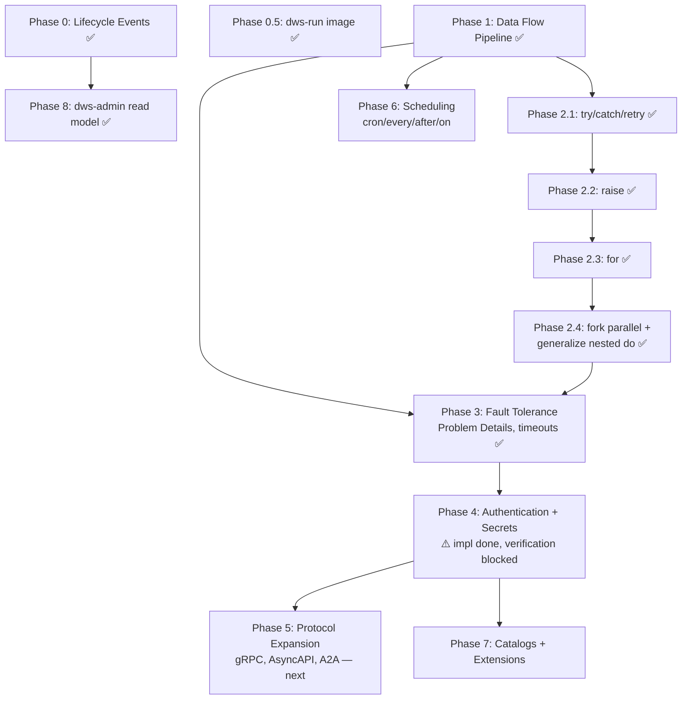

# OWS DSL Feature Roadmap

Gap analysis of [Open Workflow Spec DSL 1.0](https://github.com/open-workflow-specification/specification/blob/main/dsl.md) vs. current `dws-orchestrator`/`dws-controller` support, phased into build order.

## 1. Current task-type coverage

Two different readiness axes get conflated below — worth separating:

- **Control-flow tasks** (`switch`, `set`, `wait`, `listen`, `emit`) run **in-process** in `dws-orchestrator` (jq eval, Dapr timer/external-event/pub-sub primitives). No prebuilt image was ever needed for these, so they're genuinely done despite no new image work.
- **I/O tasks** (`call`, `run`) compile to a deployed **StepService backed by a prebuilt image**. `call: http`, `call: openapi`, and `run` (`shell`/`script`) all have real images now (`dws-call-http`, `dws-call-openapi`, `dws-run`); `run: container`/`run: workflow` are rejected at compile time — no deployable image exists for either.

| Task | Status | Notes |
|---|---|---|
| `call` (http) | ✅ | StepService via `dws-call-http` (built) |
| `call` (openapi) | ✅ | StepService via `dws-call-openapi` (built) |
| `call` (grpc/asyncapi/a2a) | ❌ | not started |
| `run` (shell/script) | ✅ | StepService via `dws-run` (`dws-run-shell`/`dws-run-script-js`/`dws-run-script-python`); shipped in `2026-07-26-dws-run` |
| `run` (container/workflow) | ❌ | rejected at compile time — no deployable image for either |
| `switch` | ✅ | jq eval in a local in-process activity, no image needed |
| `set` | ✅ | jq eval in a local in-process activity, no image needed |
| `wait` | ✅ | Dapr timer, no image needed |
| `listen` | ✅ | single external event only, no correlation (`one`/`any`/`all`); no image needed |
| `emit` | ✅ | pub/sub, no image needed |
| `for` | ✅ | in-process, no image needed — collection resolved via `EvaluateForActivity`, body scoped through `runTaskList` per iteration with `$<each>`/`$<at>` bound, optional `while` early-exit via `EvaluateWhileActivity`; shipped in `for-task` (new capability `workflow-iteration`) |
| `try` | ✅ | full `try`/`catch`/`retry`: static (`catch.errors.with`) + dynamic (`catch.when`/`exceptWhen`) filtering, error object bound under `catch.as`, retry with backoff/jitter/limits (inline or named via `use.retries`), `catch.do` recovery — shipped in `try-catch-retry`, merged to `main` |
| `fork` | ✅ | in-process orchestration, one Dapr child workflow instance per branch — join (`compete: false`, default) via `ctx.allOf` returns branch outputs as an array in declared order, race (`compete: true`) via `ctx.anyOf` returns the first branch to settle and abandons the rest; shipped in `fork-task` (new capability `workflow-parallelism`) |
| `raise` | ✅ | in-process, no image needed — the author's five-field error is evaluated then thrown, surviving classification unmodified and caught by the same `catch.errors.with`/`when` machinery as any real failure; shipped in `raise-task` |
| nested `do` | ✅ | scope-aware task-list runner generalized to every container task type — `try`/`catch.do`, `for.do`, and `fork` branches; `dws-controller`'s compile-time walk covers all three, so `call`/`run` nested in any of them deploys the expected step services; shipped across `try-catch-retry`, `for-task`, and `fork-task` |

## 2. Cross-cutting spec features — status

| Feature | Status |
|---|---|
| Data flow (`input.from/schema`, `output.as/schema`, `export.as/schema`) | ❌ raw data passed through untransformed |
| Errors as Problem Details (RFC 7807) + standard error types | ✅ |
| Timeouts (workflow/task) | ✅ |
| Authentication (basic/bearer/oauth2) | ⚠️ implemented, blocked on live-cluster verification — see Phase 4 |
| Secrets | ⚠️ implemented, blocked on live-cluster verification — see Phase 4 |
| Catalogs / custom functions | ❌ |
| Extensions (`before`/`after` hooks) | ❌ |
| External resources | ❌ |
| Scheduling (`every`/`cron`/`after`/`on`) | ❌ controller deploys on `POST` only |
| Lifecycle events (CloudEvents) | ✅ done — controller + orchestrator publish to `dws.events` (Epic 1, merged) |

## 3. Phase dependency graph

Data flow is the foundation: retry/catch, extensions, and error handling all read/write through `input`/`output`/`context`, so it must land before Phases 2–7 are worth building correctly.

## 4. Phased roadmap

| Phase | Scope | Components | Route |
|---|---|---|---|
| **0** ✅ | Lifecycle CloudEvents publishing | controller, orchestrator | done — Epic 1, merged |
| **0.5** ✅ | Build `dws-run` prebuilt images (shell/script); container/workflow rejected at compile time | `dws-run` component | done — `2026-07-26-dws-run`, merged |
| **1** ✅ | `input.from/schema`, `output.as/schema`, `export.as/schema`, validation faults | orchestrator | done — `2026-07-27-data-flow-pipeline`, merged |
| **2** ✅ | `try`/`catch`/`retry`, `raise`, `for`, `fork` (parallel), nested `do` | orchestrator, controller | done — `try-catch-retry`, `raise-task`, `for-task`, `fork-task` |
| **3** ✅ | RFC 7807 error model, standard error types, task/workflow timeouts | orchestrator | complete |
| **4** ⚠️ | `basic`/`bearer`/`oauth2` auth, secrets resolution | controller, orchestrator, call-http, call-openapi | opsx — `workflow-auth`, 19/21 tasks done, code committed; blocked on live-cluster verification (see §4b) |
| **5** | gRPC, AsyncAPI, A2A call protocols | new `dws-call-grpc`/`dws-call-asyncapi`/`dws-call-a2a` images | opsx — new components |
| **6** | `schedule.every/cron/after/on` triggers | controller (Dapr Jobs API / cron binding) | opsx — new capability |
| **7** | Catalogs, custom functions, extensions (`before`/`after`), external resources | controller, orchestrator | opsx — new capability |
| **8** ✅ | `dws-admin` consumes lifecycle events into read model, exposes read API | dws-admin | done — Epics 2–3, merged |

## 4a. Phase 2 slice detail

Phase 2 shipped as separate opsx changes rather than one, because `try`/`catch` alone justified
introducing the scope-aware task-list runner (`runTaskList`) that every later slice reuses:

| Slice | Scope | Status |
|---|---|---|
| 2.1 | `try`/`catch`/`retry`, the scope-aware runner (`runTaskList`), scope-local flow directives (`exit` vs `end`), depth guard, recursive task lookup and compile-time nesting into `try`/`catch.do` | ✅ done — archived as `openspec/changes/archive/2026-08-19-try-catch-retry` |
| 2.2 | `raise` — explicit error construction/throw from a task, matched by the same `catch.errors.with`/`when` machinery slice 2.1 built | ✅ done — archived as `openspec/changes/archive/2026-08-19-raise-task`; no controller change was needed, and `raise.error.status` is literal-only (the pinned SDK models no expression variant) |
| 2.3 | `for` — currently recognized, throws `UnsupportedOperationException`; reuses `runTaskList` for the loop body the same way `try` does | ✅ done — archived as `openspec/changes/archive/2026-08-19-for-task`; no controller change was needed, and `DefinitionLookup` gained the `for.do` recursion branch |
| 2.4 | `fork` (parallel branches) + generalizing nested `do` to any task type that nests a list | ✅ done — archived as `openspec/changes/archive/2026-08-19-fork-task`; each branch runs as its own Dapr child workflow instance (`ForkBranchWorkflow`), joined via `ctx.allOf` (`compete: false`) or raced via `ctx.anyOf` (`compete: true`); `WorkflowCompiler.walk()`/`collectTaskNames()` extended to both `fork` branches and `for.do` |

## 4b. Phase 3 status

`openspec/changes/ows-phase3-errors-timeouts`: all 7 task groups checked, including verification —
`dws-orchestrator` full `mvn test` run green at **147/147**, `dws-controller` confirmed to need no
change (timeouts never touch `WorkflowCompiler.walk()`), and the invented error-type-URI prefix
grepped out of the codebase. RFC 7807 catalogue now lives at
`https://serverlessworkflow.io/spec/1.0.0/errors/` with `AUTHORIZATION`/`EXPRESSION`/`TIMEOUT` added
alongside `VALIDATION`/`COMMUNICATION`/`RUNTIME`. Task- and workflow-level timeouts race a
`ForkBranchWorkflow`/`ScopeRunnerWorkflow` child instance against a Dapr timer via `ctx.anyOf`;
retry per-attempt timeout (`limit.attempt.duration`) reuses the same `ScopeRunnerWorkflow` pattern.

Implementation is complete and merged; the change folder has **not yet been run through
`/opsx:archive`** (unlike Phase 2's slices, which all archived cleanly — see §4a). A sibling stub,
`openspec/changes/workflow-error-format` (only a `.openspec.yaml`, no proposal/tasks/specs), appears
to be an abandoned earlier attempt at the same scope, superseded by `ows-phase3-errors-timeouts` —
worth deleting once confirmed, so it doesn't get mistaken for open work.

## 4c. Phase 4 status

`openspec/changes/workflow-auth`: **19/21 tasks done**, implementation code committed
(`de42dd98..91f9b269`, 18 commits), and every component's own test suite is green:

| Component | Command | Result |
|---|---|---|
| `dws-controller` | `mvnw test` | 99 tests, 0 failures |
| `dws-orchestrator` | `mvnw verify` | 152 tests, 0 failures |
| `dws-call-openapi` | `pnpm test` / `lint` / `build` | 95 tests + lint/build pass |
| `dws-call-http` | `go vet` / `go test` | all pass |

Delivered: scalar `use.secrets` → Kubernetes `secretKeyRef` projection (no plaintext in compiled
plans/ConfigMaps), inline/named `basic`/`bearer`/OAuth2 `client_credentials` policies for `call:
http`/`call: openapi`, version-scoped Dapr `HTTPEndpoint`/OAuth2-middleware `Component`/scoped
`Configuration` synthesis, and the `$secrets` jq extension in `set`/`switch` (leakage-warned, per
§5a).

**Blocked** — tasks 6.2/6.3 need a disposable Docker/Helm/kind environment to run
`scripts/verify-dapr-oauth-path-filter.sh`, proving the OAuth middleware only injects tokens on the
intended filtered endpoint path and doesn't leak onto unrelated sidecar traffic. Every other check
is static (synthesizer/compiler tests); this is the one live-cluster proof still outstanding, and it
gates both archiving `workflow-auth` and starting Phase 5.

## 5. Rationale for ordering

- **1 before 2/3**: retry/catch and error handling are meaningless without a real input/output/context pipeline to operate on.
- **2 before 3**: `try`/`raise` define the fault surface that timeouts and Problem Details formatting attach to.
- **4 before 5/7**: new protocols and catalogs both need auth to call real external services.
- **6 is independent**: scheduling only touches the controller's trigger path, not the interpreter — can be pulled forward if needed.
- **8 last**: read model is a pure consumer of Phase 0's event contract; no orchestrator/controller changes required once events exist.

## 5a. Phase 4 secret extension

Phase 4 adds the DWS-specific `$secrets` scope to `set` and `switch`. Unlike the upstream DSL,
this can expose secret material through assigned workflow data or selected branches, so authors
must treat it as potentially leaking data.

### Phase 4 rollout and rollback

`charts/dws` pins the Dapr control-plane chart at **1.18.1**. The OAuth path-isolation probe in
the Helm workflow defaults `DAPR_VERSION` to that version; its manual-dispatch input permits a
newer compatible Dapr chart to be tested before any chart-pin upgrade.

The probe installs and removes a Dapr Helm release, including its control-plane and any
cluster-scoped Dapr resources the upstream chart manages. Run it only on a disposable cluster;
the probe is intentionally manually dispatched rather than being a trigger for an unchanged DWS
chart release.

Before deploying a definition that declares `use.secrets`, an operator must create each referenced
Kubernetes Secret in the workflow namespace. Each scalar logical secret maps to a Secret of the
same DNS-1123-compatible name whose data key is **`value`**. Missing secret references prevent the affected workload
from starting; definitions and generated resource metadata never contain the secret values.
Use jq dot notation for identifier-like names (for example `$secrets.apitoken`) and bracket
notation for other valid DNS-1123 names (for example `$secrets["api-token"]`).

To roll back an OAuth-enabled definition version, delete that version's deployed workflow stack.
This deletes its version-scoped `HTTPEndpoint`, OAuth middleware `Component`, and Dapr
`Configuration` alongside its step workloads. Retain the operator-managed Kubernetes Secrets for
other versions or later redeployments; they are not owned by the workflow stack.

## Future spikes

- **Static-credential Dapr Wasm middleware:** Evaluate a workflow-scoped Wasm filter that creates
  Basic or Bearer `Authorization` headers before Dapr invokes an external endpoint. This is not
  Phase 4 scope, which retains runner-local Basic/Bearer construction. A spike must assess Wasm
  artifact ownership and supply chain, secret-derived configuration, request-path isolation, and
  compatibility with the Dapr 1.18.1 runtime pinned by `charts/dws`.
