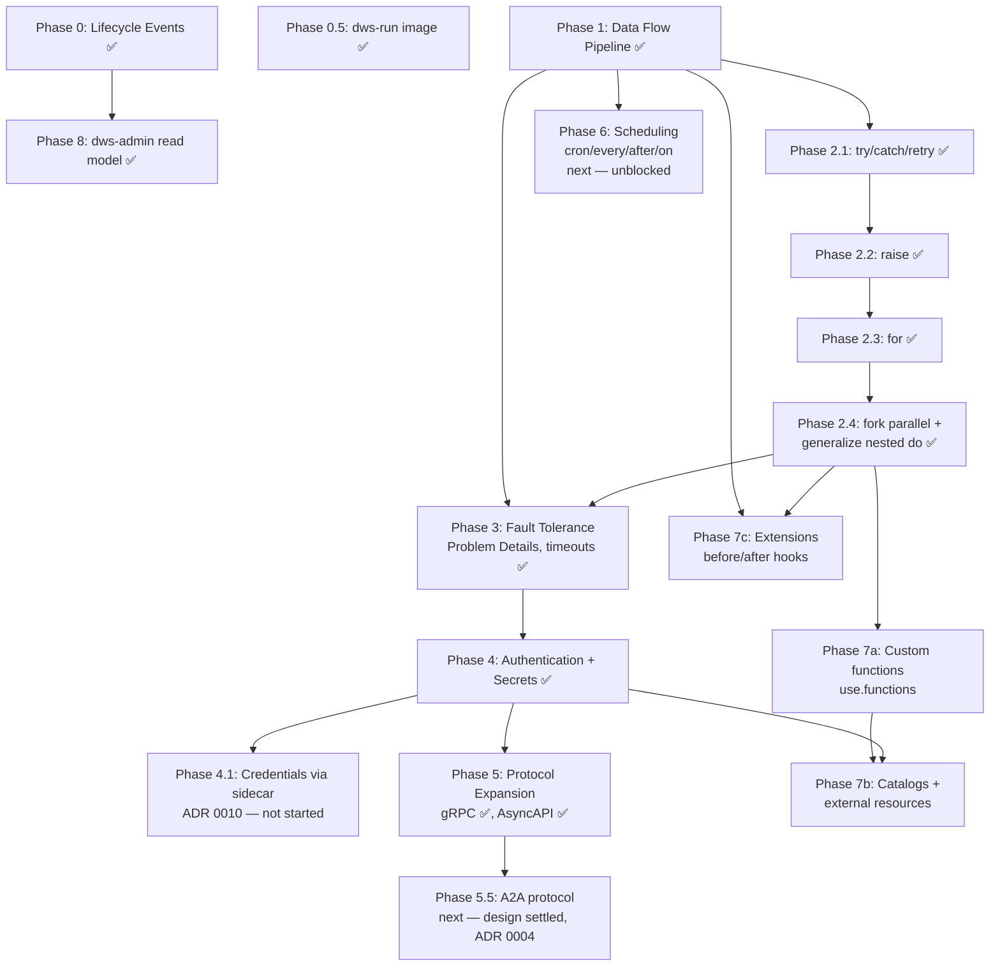

# OWS DSL Feature Roadmap

Gap analysis of [Open Workflow Spec DSL 1.0](https://github.com/open-workflow-specification/specification/blob/main/dsl.md) vs. current `dws-orchestrator`/`dws-controller` support, phased into build order.

## 1. Current task-type coverage

Two different readiness axes get conflated below — worth separating:

- **Control-flow tasks** (`switch`, `set`, `wait`, `listen`, `emit`) run **in-process** in `dws-orchestrator` (jq eval, Dapr timer/external-event/pub-sub primitives). No prebuilt image was ever needed for these, so they're genuinely done despite no new image work.
- **I/O tasks** (`call`, `run`) compile to a deployed **StepService backed by a prebuilt image**. `call: http`, `call: openapi`, and `run` (`shell`/`script`) all have real images now (`dws-call-http`, `dws-call-openapi`, `dws-run`); `run: container`/`run: workflow` are rejected at compile time — no deployable image exists for either.

| Task | Status | Notes |
|---|---|---|
| `call` (http) | ✅ | StepService via `dws-call-http` (built) |
| `call` (openapi) | ✅ | StepService via `dws-call-openapi` (built) |
| `call` (grpc) | ✅ | StepService via `dws-call-grpc` (built); shipped in `dws-call-grpc` (Phase 5 slice 1) |
| `call` (asyncapi) | ✅ | StepService via `dws-call-asyncapi` (Dapr output binding, `action: send` only); controller `call: asyncapi` branch + version-scoped `bindings.*` Component synthesis; shipped in `dws-call-asyncapi` (Phase 5 slice 2), archived as `openspec/changes/archive/2026-08-26-dws-call-asyncapi` — one deferred task, the live Dapr+Kafka integration test (see §4e) |
| `call` (a2a) | ❌ | not started — its own **Phase 5.5**; AsyncAPI has shipped, so this is unblocked. Design settled in [ADR 0004](../adr/0004-call-a2a-runner-design.md), summarized in §4f |
| `run` (shell/script) | ✅ | StepService via `dws-run` (`dws-run-shell`/`dws-run-script-js`/`dws-run-script-python`); shipped in `2026-07-26-dws-run` |
| `run` (container/workflow) | ❌ | rejected at compile time — no deployable image for either |
| `switch` | ✅ | jq eval in a local in-process activity, no image needed |
| `set` | ✅ | jq eval in a local in-process activity, no image needed |
| `wait` | ✅ | Dapr timer, no image needed |
| `listen` | ✅ | single external event only, no correlation (`one`/`any`/`all`); no image needed |
| `emit` | ✅ | pub/sub, no image needed |
| `for` | ✅ | in-process, no image needed — collection resolved via `EvaluateForActivity`, body scoped through `runTaskList` per iteration with `$<each>`/`$<at>` bound, optional `while` early-exit via `EvaluateWhileActivity`; shipped in `for-task` (new capability `workflow-iteration`) |
| `try` | ✅ | full `try`/`catch`/`retry`: static (`catch.errors.with`) + dynamic (`catch.when`/`exceptWhen`) filtering, error object bound under `catch.as`, retry with backoff/jitter/limits (inline or named via `use.retries`), `catch.do` recovery — shipped in `try-catch-retry`, merged to `main` |
| `fork` | ✅ | in-process orchestration, one Dapr child workflow instance per branch — join (`compete: false`, default) via `ctx.allOf` returns branch outputs as an array in declared order, race (`compete: true`) via `ctx.anyOf` returns the first branch to settle and abandons the rest; shipped in `fork-task` (new capability `workflow-parallelism`) |
| `raise` | ✅ | in-process, no image needed — the author's five-field error is evaluated then thrown, surviving classification unmodified and caught by the same `catch.errors.with`/`when` machinery as any real failure; shipped in `raise-task` |
| nested `do` | ✅ | scope-aware task-list runner generalized to every container task type — `try`/`catch.do`, `for.do`, and `fork` branches; `dws-controller`'s compile-time walk covers all three, so `call`/`run` nested in any of them deploys the expected step services; shipped across `try-catch-retry`, `for-task`, and `fork-task` |

## 2. Cross-cutting spec features — status

| Feature | Status |
|---|---|
| Data flow (`input.from/schema`, `output.as/schema`, `export.as/schema`) | ❌ raw data passed through untransformed |
| Errors as Problem Details (RFC 7807) + standard error types | ✅ |
| Timeouts (workflow/task) | ✅ |
| Authentication (basic/bearer/oauth2) | ✅ done — see Phase 4 |
| Secrets | ✅ done — see Phase 4 |
| Custom functions (`use.functions`, `call: <name>`) | ❌ — Phase 7a |
| Catalogs (`use.catalogs`, `call: <name>:<version>@<catalog>`) | ❌ — Phase 7b |
| Extensions (`use.extensions`, `before`/`after` hooks) | ❌ — Phase 7c |
| External resources | ⚠️ partial — only `call: openapi` `document` is fetched today; generalized in Phase 7b |
| Scheduling (`every`/`cron`/`after`/`on`) | ❌ controller deploys on `POST` only |
| Lifecycle events (CloudEvents) | ✅ done — controller + orchestrator publish to `dws.events` (Epic 1, merged) |

## 3. Phase dependency graph

```mermaid
flowchart TD
  P0[Phase 0: Lifecycle Events ✅] --> P8[Phase 8: dws-admin read model ✅]
  P05[Phase 0.5: dws-run image ✅]
  P1[Phase 1: Data Flow Pipeline ✅] --> P2a[Phase 2.1: try/catch/retry ✅]
  P2a --> P2b[Phase 2.2: raise ✅]
  P2b --> P2c[Phase 2.3: for ✅]
  P2c --> P2d[Phase 2.4: fork parallel +<br/>generalize nested do ✅]
  P1 --> P3[Phase 3: Fault Tolerance<br/>Problem Details, timeouts ✅]
  P2d --> P3
  P3 --> P4[Phase 4: Authentication + Secrets ✅]
  P4 --> P41[Phase 4.1: Credentials via sidecar<br/>ADR 0010 — not started]
  P4 --> P5[Phase 5: Protocol Expansion<br/>gRPC ✅, AsyncAPI ✅]
  P5 --> P55[Phase 5.5: A2A protocol<br/>next — design settled, ADR 0004]
  P1 --> P6[Phase 6: Scheduling<br/>cron/every/after/on<br/>next — unblocked]
  P2d --> P7a[Phase 7a: Custom functions<br/>use.functions]
  P7a --> P7b[Phase 7b: Catalogs +<br/>external resources]
  P4 --> P7b
  P1 --> P7c[Phase 7c: Extensions<br/>before/after hooks]
  P2d --> P7c
```

Data flow is the foundation: retry/catch, extensions, and error handling all read/write through `input`/`output`/`context`, so it must land before Phases 2–7 are worth building correctly.

## 4. Phased roadmap

| Phase | Scope | Components | Route |
|---|---|---|---|
| **0** ✅ | Lifecycle CloudEvents publishing | controller, orchestrator | done — Epic 1, merged |
| **0.5** ✅ | Build `dws-run` prebuilt images (shell/script); container/workflow rejected at compile time | `dws-run` component | done — `2026-07-26-dws-run`, merged |
| **1** ✅ | `input.from/schema`, `output.as/schema`, `export.as/schema`, validation faults | orchestrator | done — `2026-07-27-data-flow-pipeline`, merged |
| **2** ✅ | `try`/`catch`/`retry`, `raise`, `for`, `fork` (parallel), nested `do` | orchestrator, controller | done — `try-catch-retry`, `raise-task`, `for-task`, `fork-task` |
| **3** ✅ | RFC 7807 error model, standard error types, task/workflow timeouts | orchestrator | complete |
| **4** ✅ | `basic`/`bearer`/`oauth2` auth, secrets resolution | controller, orchestrator, call-http, call-openapi | done — archived as `2026-10-05-workflow-auth` (21/21 tasks; live OAuth probe passed, see §4c) |
| **4.1** | `basic`/`bearer` injected by a Wasm sidecar middleware; one merged Dapr Configuration per workload ([ADR 0010](../adr/0010-use-components-as-a-shared-store.md)) | controller, `charts/dws`, call-http, call-openapi, call-a2a, new Wasm image | not started — split into 4.1a–4.1h, see §4h |
| **5** ✅ | gRPC, AsyncAPI call protocols | new `dws-call-grpc`, `dws-call-asyncapi` images | done — both slices archived (`2026-08-25-dws-call-grpc`, `2026-08-26-dws-call-asyncapi`); live-cluster integration test deferred, see §4e |
| **5.5** (next) | A2A (Agent2Agent) call protocol | new `dws-call-a2a` image | design settled — [ADR 0004](../adr/0004-call-a2a-runner-design.md), §4f; not yet implemented |
| **6** (next, parallel) | `schedule.every/cron/after/on` triggers | controller (Dapr Jobs API / cron binding) | not started — independent of Phases 4/5, can run alongside 5.5 |
| **7a** | Custom functions: `use.functions` and `call: <name>` with `with` arguments | controller (+ orchestrator if resolved at runtime) | not started — opsx, new capability; see §4g |
| **7b** | Catalogs: `use.catalogs` and `call: <name>:<version>@<catalog>`; generalized external-resource fetching | controller | not started — opsx, new capability; needs 7a + Phase 4 auth; see §4g |
| **7c** | Extensions: `use.extensions` `before`/`after` task lists, matched by `extend` and `when` | orchestrator, controller | not started — opsx, new capability; independent of 7a/7b; see §4g |
| **8** ✅ | `dws-admin` consumes lifecycle events into read model, exposes read API | dws-admin | done — Epics 2–3, merged |

## 4a. Phase 2 slice detail

Phase 2 shipped as separate opsx changes rather than one, because `try`/`catch` alone justified
introducing the scope-aware task-list runner (`runTaskList`) that every later slice reuses:

| Slice | Scope | Status |
|---|---|---|
| 2.1 | `try`/`catch`/`retry`, the scope-aware runner (`runTaskList`), scope-local flow directives (`exit` vs `end`), depth guard, recursive task lookup and compile-time nesting into `try`/`catch.do` | ✅ done — archived as `openspec/changes/archive/2026-08-19-try-catch-retry` |
| 2.2 | `raise` — explicit error construction/throw from a task, matched by the same `catch.errors.with`/`when` machinery slice 2.1 built | ✅ done — archived as `openspec/changes/archive/2026-08-19-raise-task`; no controller change was needed, and `raise.error.status` is literal-only (the pinned SDK models no expression variant) |
| 2.3 | `for` — currently recognized, throws `UnsupportedOperationException`; reuses `runTaskList` for the loop body the same way `try` does | ✅ done — archived as `openspec/changes/archive/2026-08-19-for-task`; no controller change was needed, and `DefinitionLookup` gained the `for.do` recursion branch |
| 2.4 | `fork` (parallel branches) + generalizing nested `do` to any task type that nests a list | ✅ done — archived as `openspec/changes/archive/2026-08-19-fork-task`; each branch runs as its own Dapr child workflow instance (`ForkBranchWorkflow`), joined via `ctx.allOf` (`compete: false`) or raced via `ctx.anyOf` (`compete: true`); `WorkflowCompiler.walk()`/`collectTaskNames()` extended to both `fork` branches and `for.do` |

## 4b. Phase 3 status

`openspec/changes/ows-phase3-errors-timeouts`: all 7 task groups checked, including verification —
`dws-orchestrator` full `mvn test` run green at **147/147**, `dws-controller` confirmed to need no
change (timeouts never touch `WorkflowCompiler.walk()`), and the invented error-type-URI prefix
grepped out of the codebase. RFC 7807 catalogue now lives at
`https://serverlessworkflow.io/spec/1.0.0/errors/` with `AUTHORIZATION`/`EXPRESSION`/`TIMEOUT` added
alongside `VALIDATION`/`COMMUNICATION`/`RUNTIME`. Task- and workflow-level timeouts race a
`ForkBranchWorkflow`/`ScopeRunnerWorkflow` child instance against a Dapr timer via `ctx.anyOf`;
retry per-attempt timeout (`limit.attempt.duration`) reuses the same `ScopeRunnerWorkflow` pattern.

Implementation is complete, merged, and now archived as
`openspec/changes/archive/2026-09-15-ows-phase3-errors-timeouts` (30/30 tasks checked). A sibling
stub, `openspec/changes/workflow-error-format` (still only a `.openspec.yaml`, no
proposal/tasks/specs), is an abandoned earlier attempt at the same scope, superseded by
`ows-phase3-errors-timeouts` — **still present and still worth deleting**, so it doesn't get
mistaken for open work.

## 4c. Phase 4 status — done

`workflow-auth` is archived as `openspec/changes/archive/2026-10-05-workflow-auth` with **21/21
tasks** (implementation `de42dd98..91f9b269`, 18 commits). Its `workflow-authentication` and
`workflow-secrets` delta specs are synced into `openspec/specs/`. Verification: PASS WITH WARNINGS.

The last two tasks (6.2/6.3) closed on 2026-10-05. `scripts/verify-dapr-oauth-path-filter.sh`
passed live: the intended path received `Bearer issued-oauth-token` and the unrelated path
received no `Authorization` header. Named warnings, detailed in the archived `verify.md`:

- The live run used the cluster's existing Dapr **1.18.2** control plane (probe Helm install
  skipped), not the 1.18.1 default. The project owner accepted this.
- `dws-controller` `verify` is red on Windows only (6 `V2GoldenTest` cases, OS line separator);
  Linux CI is green for the identical tree.

Component gates at verification time:

| Component | Command | Result |
|---|---|---|
| `dws-controller` | `mvn -Dexec.skip=true verify` (Windows) / `mvnw test` (Linux CI) | 224 tests; 6 Windows-only failures / 0 on CI |
| `dws-orchestrator` | `mvnw verify` | 162 tests, 0 failures |
| `dws-call-openapi` | `pnpm lint` / `test` / `build` | 95 tests + lint/build pass |
| `dws-call-http` | `make lint && make test` | all pass |

Delivered: scalar `use.secrets` → Kubernetes `secretKeyRef` projection (no plaintext in compiled
plans/ConfigMaps), inline/named `basic`/`bearer`/OAuth2 `client_credentials` policies for `call:
http`/`call: openapi`, version-scoped Dapr `HTTPEndpoint`/OAuth2-middleware `Component`/scoped
`Configuration` synthesis, and the `$secrets` jq extension in `set`/`switch` (leakage-warned, per
§5a).

An earlier version of this section claimed that the live-cluster proof gated starting Phase 5.
That was false: Phase 5 shipped while Phase 4 was still waiting on verification.

## 4d. Phase 5 slice 2 design (AsyncAPI) and the A2A split

`dws-call-asyncapi` design, worked through ahead of an opsx brainstorm.md:

- **Building block: Dapr output bindings, not pub/sub.** `call` is a single outbound dispatch
  (`action: send` only — the receive/subscribe side belongs to `listen`, out of scope), which is
  what a Dapr *binding* models directly. Coverage is narrower than pub/sub (no NATS/Pulsar/Solace
  binding components exist), so v1 targets Kafka/RabbitMQ/MQTT/SQS/GCP Pub/Sub — the protocols with
  a `bindings.*` component — and falls back to `pubsub.*` later for the rest if needed.
- **Stack: TypeScript/Node, mirroring `dws-call-openapi` file-for-file.** `message.payload`'s JSON
  Schema is the same dialect `dws-call-openapi/src/openapi/validator.ts` already validates
  `requestBody` against with `ajv`/`ajv-formats` — direct reuse, not a new validation approach.
  `@asyncapi/parser` (official, npm) is the AsyncAPI-side counterpart to
  `@readme/openapi-parser`/`swagger-client`. The runner fetches+parses the AsyncAPI document itself
  at boot (`DOC_ENDPOINT` + a `DOC_SHA256` integrity pin from the controller) exactly like
  `dws-call-openapi/src/openapi/document.ts` does — the controller does NOT pre-resolve the schema.
- **Controller still needs a light compile-time read** of `servers.*.protocol`/`host` only (not the
  full document) to pick the `bindings.*` component type and synthesize a version-scoped Dapr
  `Component`, secret-backed via Phase 4's `use.secrets`/`secretKeyRef` machinery — the one piece
  that can't be deferred to runtime the way schema validation can, since it's a Kubernetes resource.
- **Validation failures must classify as `ErrorKind.VALIDATION`**, not fall through to a generic
  runner failure, so `catch.errors.with.type` filtering works on them the same as any Phase 3
  validation fault — needs a new marker in `WorkflowErrors.classify()`.

**A2A was split into Phase 5.5** rather than built alongside gRPC/AsyncAPI in Phase 5: it got none of
the design work above — no building-block analysis, no stack decision, no open-questions list — and
its shape is genuinely different (agent task/artifact lifecycle, not a single request/response or
publish), so bundling it in would have meant starting Phase 5.5's design from zero mid-Phase-5 rather
than after AsyncAPI ships. Revisit once `dws-call-asyncapi` is done.

## 4e. Phase 5 status — both slices shipped

Phase 5 is done. Slice 1 (`dws-call-grpc`) archived as
`openspec/changes/archive/2026-08-25-dws-call-grpc`; slice 2 (`dws-call-asyncapi`) archived as
`openspec/changes/archive/2026-08-26-dws-call-asyncapi` with **18/19 tasks checked**, and the
`dws-call-asyncapi` component now exists at the repo root alongside its CI workflow.

The one unchecked task is **8.2 — an integration test against a real Dapr sidecar + Kafka binding**,
deferred because there was no cluster to run it on.

Phase 4's live check (tasks 6.2/6.3) has since passed on the local cluster (§4c). Task 8.2 is the
only live-cluster item still open. That cluster (Dapr 1.18.2, Strimzi operator installed; its `default/fo-cluster` Kafka is not Ready) can be reused
for it. Phase 5.5 and Phase 6 don't depend on it.

## 4f. Phase 5.5 design (A2A) — settled

Full rationale in [ADR 0004](../adr/0004-call-a2a-runner-design.md). Reading the actual
specifications inverted §4d's assumption that A2A was the hardest slice: the OWS `a2a` call is a
**thin JSON-RPC passthrough** (`method` + free-form `parameters`), with no document parsing, no
payload schema validation, and — for the `with.agentCard` RPC target — **no Kubernetes resource to
synthesize** (the `with.server` RPC target synthesizes the same oauth2 middleware triple as `call:
http`/`call: openapi` when the policy is oauth2; see ADR 0004 Decision 5's amendment). There is no
runtime-managed task lifecycle either: OWS binds one RPC per invocation,
so polling, resumption after `input-required`, and escalation on `auth-required` are composed by the
author from `switch`/`wait`/`then: <taskName>` that Phases 2–3 already shipped.

The decisions:

| # | Decision |
|---|---|
| 1 | Python 3 / FastAPI, plain `POST /run` + `GET /healthz`, no Dapr Workflow SDK, official `a2a-sdk` client; the agent card is resolved explicitly, never by passing a bare URL to `create_client` |
| 2 | `message/send` + `tasks/get` only; `message/stream`/`tasks/resubscribe` deferred (SSE aggregation) and rejected at compile time |
| 3 | Dialect normalized — the JSON-RPC **wire** enum is lowercase (`"working"`, `"input-required"`, `"auth-required"`, `"unknown"`); `TASK_STATE_*`/`ROLE_USER` are language-binding surface only |
| 4 | Auth: the OWS policy supplies credentials, the agent card validates them — a card declares required schemes but never carries credentials |
| 5 | No Dapr Component, HTTPEndpoint, or Configuration synthesized for the `with.agentCard` RPC target; the `with.server` RPC target synthesizes the same oauth2 middleware triple as `call: http`/`call: openapi` under an oauth2 policy |
| 6 | `history` stripped from output by default (secret echo + state bloat); `input-required`/`auth-required` returned as data, never as step failures |
| 7 | The agent card is not integrity-pinned — it is a live discovery document, unlike a versioned API contract |

This is the first image built under the "new function images are born plain-HTTP" corollary in
[workflow-runtime-architecture-roadmap.md](workflow-runtime-architecture-roadmap.md).

**Resolved:** retry idempotency. OWS `try`/`retry` re-invokes the step, and a fresh `messageId` per
attempt most likely makes the agent start a duplicate task. ADR 0004 Decision 8 settles this with a
deterministic `messageId` (`uuid5` over instance/task/iteration) so a cooperative agent can
recognise a retry, plus a no-default-retry activity policy in `dws-orchestrator`: `call: a2a` gets
exactly one attempt unless the workflow author wraps it in an explicit `try`/`catch.retry`, which
still re-executes the step at that separate, higher layer. `dws-orchestrator` now also sends the
derivation's two inputs as outbound headers (`X-Dws-Workflow-Instance-Id` always,
`X-Dws-Iteration-Index` when the call is nested in a `for` loop) on every `CallServiceActivity`
dispatch, closing the gap `dws-call-a2a`'s own `CLAUDE.md` used to flag: the headers it reads and
falls back safely without were previously never actually sent by the orchestrator.

**Open, not blocking:** agent-call concurrency. A `for` over a large collection fans out to one
agent invocation per item and Knative scales to meet it; agent calls are metered and rate-limited in
a way the other protocols' targets are not. Whether the controller caps a2a step services or leaves
pacing to the author is undecided — see ADR 0004's consequences.

Unlike Phases 4 and 5, Phase 5.5 needs **no live cluster** — a mock transport, an in-repo fake A2A
server, and a CI conformance job against the official `a2a-sdk` server cover it end to end.

## 4g. Phase 7 split — functions, catalogs, extensions

Phase 7 was one row ("catalogs, custom functions, extensions, external resources"). It is split into
three phases on 2026-10-09, one per `use.*` component, so each can be designed, shipped and archived
on its own.

**Current behavior (gap):** `dws-controller` does not validate `use.functions`, `use.catalogs` or
`use.extensions` at all. A definition that declares them is accepted and the keys are silently
ignored; a `call: <customFunction>` task is not resolved. Before any of 7a–7c lands, the controller
should reject these three keys with an explicit "not supported" compile error, the same way it already
rejects external `run.script` sources. Each phase then removes its own rejection.

**Prerequisite — one `use` model ([ADR 0010](../adr/0010-use-components-as-a-shared-store.md)).**
The data kinds (`errors`, `retries`, `timeouts`) compile into a shared, version-scoped Dapr
configuration store that hosts read by name through one `UseResolver`; `secrets` are pulled by name
from a version-scoped Dapr secret store by hosts; `basic`/`bearer` on HTTP calls are injected by a
Wasm sidecar middleware configured from a controller-composed Secret (validated by spike, 2026-10-10); `oauth2`
stays deploy-time infrastructure. Catalogs
join functions and extensions as compile-time "code" kinds, which is why 7b sits on 7a.

| Phase | DSL surface | Likely shape | Open questions for its design pass |
|---|---|---|---|
| **7a** Custom functions | `use.functions: map[string, task]`; `call: <name>` with `with` | Compile-time expansion in `dws-controller`: replace `call: <name>` with the named task, bind `with` as its input, then compile it like any inline task (so the right step service is deployed) | Expand at compile time vs resolve at runtime in the orchestrator; may a function be any task type or only `call`/`run`; how `with` merges with the function's own `with`/`input`; name collisions with built-in call types (`http`, `grpc`, `openapi`, `asyncapi`, `a2a`) |
| **7b** Catalogs + external resources | `use.catalogs: map[string, {endpoint}]`; `call: <name>:<version>@<catalog>`; external resources (`{name?, endpoint}`) | Controller fetches the function definition from the catalog endpoint at compile time (reusing the `OpenApiDocumentFetcher` pattern and `use.authentications`), pins the version, then hands it to 7a's expansion. Generalize the same fetcher for other external resources | Support for a runtime-configured `default` catalog (chart value?); fetch-time caching and digest pinning; behavior when the catalog is unreachable at compile time; whether to lift the external `run.script` source rejection here |
| **7c** Extensions | `use.extensions: [ {name: {extend, when?, before?, after?}} ]`; `extend` = a task type or `all` | Orchestrator wraps each matching task with the `before`/`after` task lists, evaluating `when` per task. Controller walks extension task lists too, so any `call`/`run` inside them deploys its step service | Order when several extensions match; whether extension tasks are themselves extended (recursion guard); how failures in `before`/`after` surface (Phase 3 error model); placement in the v2 runtime (`dws-flow`/`dws-step` per-node graph) |

## 4h. Phase 4.1 — Credentials via sidecar ([ADR 0010](../adr/0010-use-components-as-a-shared-store.md)) — split

Moves `basic`/`bearer` on HTTP calls out of step images into a Wasm middleware on the step's
sidecar, and puts every per-pod Dapr setting into one merged Configuration. Applies to v1 now; v2's
Phase 4 deploy synthesis reuses the same pieces for `-fn` function services. Design and spike
results: ADR 0010 Decision 4a, `spikes/wasm-auth-middleware/FINDINGS.md`.

| Sub | Scope | Components | Depends on | Status |
|---|---|---|---|---|
| **4.1a** | Fixes found by the spike: Dapr metrics port collides with Knative queue-proxy (9090) on **every** Dapr-enabled Knative step; verify the controller Role covers `httpendpoints` and Dapr `configurations` (the OAuth2 path creates both) | controller, `charts/dws` | — | ✅ step services set `dapr.io/metrics-port: "9095"` (orchestrators keep 9090); the Role already grants both kinds (since `ff3326f`), pinned by `orchestrator-wiring-render-test.sh` |
| **4.1b** | **One merged Configuration per workload**: pipeline handlers (OAuth2 today, Wasm next) + tracing in the single `dapr.io/config` slot; naming and lifecycle per version | controller | — | ❌ not started |
| **4.1c** | Wasm guest image as a new component: TinyGo **0.34.0** pinned, `http-wasm-guest-tinygo` v0.4.0, `busybox` base, public GHCR, CI, release-please (released by hand) | new image | — | ❌ not started |
| **4.1d** | Controller emits, per (base URL, policy): composed `guestConfig` Secret, `HTTPEndpoint`, `middleware.http.wasm` Component; adds the init container, `emptyDir` and `dapr.io/volume-mounts` to the step service; Role gains Secret `get`/`create`/`delete` | controller, `charts/dws` | 4.1a, 4.1b, 4.1c, 4.1g | ❌ not started |
| **4.1e** | Step images `dws-call-http`, `dws-call-openapi`, `dws-call-a2a`: drop credential env vars, one sidecar-invocation path for every scheme, wait for sidecar readiness before the first call. Ships with 4.1d | step images | 4.1d | ❌ not started |
| **4.1f** | Design note: authenticated **secondary fetches** — the OpenAPI document (controller at compile time, runner at boot) and the a2a agent card — still use direct HTTP with credentials | docs | — | ❌ not started |
| **4.1g** | Platform: Knative `config-features` `kubernetes.podspec-init-containers` + `kubernetes.podspec-volumes-emptydir` set by the chart (Helm Phase 11) and checked by a preflight | `charts/dws` | — | ❌ not started |
| **4.1h** | Promote the spike's `verify.sh` to a maintained live probe under `scripts/`, run against the current kubectl context | scripts | 4.1e | ❌ not started |

Unchanged, documented exceptions: `call: grpc` keeps `secretKeyRef` env vars (the HTTP pipeline
does not see gRPC); `asyncapi` broker credentials stay in the binding Component's metadata;
`oauth2` keeps its middleware and only moves into the merged Configuration (4.1b).

**Not here:** the data kinds (`errors`, `retries`, `timeouts`) and `$secrets` have no consumer
until the v2 runtime exists, so their store and resolvers are built inside the v2 phases — see
[workflow-runtime-architecture-roadmap.md](workflow-runtime-architecture-roadmap.md), "ADR 0010
integration".

## 5. Rationale for ordering

- **1 before 2/3**: retry/catch and error handling are meaningless without a real input/output/context pipeline to operate on.
- **2 before 3**: `try`/`raise` define the fault surface that timeouts and Problem Details formatting attach to.
- **4 before 5/7b**: new protocols and catalogs both need auth to call real external services.
- **7a before 7b**: a catalog function is a custom function that comes from a remote source, so 7b reuses 7a's `call: <name>` resolution and only adds fetching and versioning.
- **7c is independent of 7a/7b**: extensions wrap tasks of any type and do not depend on how a `call` is resolved. They need Phase 1 data flow and the Phase 2 nested-`do` runner.
- **6 is independent**: scheduling only touches the controller's trigger path, not the interpreter — can be pulled forward if needed.
- **8 last**: read model is a pure consumer of Phase 0's event contract; no orchestrator/controller changes required once events exist.

## 5a. Phase 4 secret extension

Phase 4 adds the DWS-specific `$secrets` scope to `set` and `switch`. Unlike the upstream DSL,
this can expose secret material through assigned workflow data or selected branches, so authors
must treat it as potentially leaking data.

### Phase 4 rollout and rollback

`charts/dws` pins the Dapr control-plane chart at **1.18.1**. The OAuth path-isolation probe in
the Helm workflow defaults `DAPR_VERSION` to that version; its manual-dispatch input permits a
newer compatible Dapr chart to be tested before any chart-pin upgrade.

The probe installs and removes a Dapr Helm release, including its control-plane and any
cluster-scoped Dapr resources the upstream chart manages. Run it only on a disposable cluster;
the probe is intentionally manually dispatched rather than being a trigger for an unchanged DWS
chart release.

Before deploying a definition that declares `use.secrets`, an operator must create each referenced
Kubernetes Secret in the workflow namespace. Each scalar logical secret maps to a Secret of the
same DNS-1123-compatible name whose data key is **`value`**. Missing secret references prevent the affected workload
from starting; definitions and generated resource metadata never contain the secret values.
Use jq dot notation for identifier-like names (for example `$secrets.apitoken`) and bracket
notation for other valid DNS-1123 names (for example `$secrets["api-token"]`).

To roll back an OAuth-enabled definition version, delete that version's deployed workflow stack.
This deletes its version-scoped `HTTPEndpoint`, OAuth middleware `Component`, and Dapr
`Configuration` alongside its step workloads. Retain the operator-managed Kubernetes Secrets for
other versions or later redeployments; they are not owned by the workflow stack.

## Future spikes

- **Static-credential Dapr Wasm middleware:** Evaluate a workflow-scoped Wasm filter that creates
  Basic or Bearer `Authorization` headers before Dapr invokes an external endpoint. This is not
  Phase 4 scope, which retains runner-local Basic/Bearer construction. A spike must assess Wasm
  artifact ownership and supply chain, secret-derived configuration, request-path isolation, and
  compatibility with the Dapr 1.18.1 runtime pinned by `charts/dws`.
