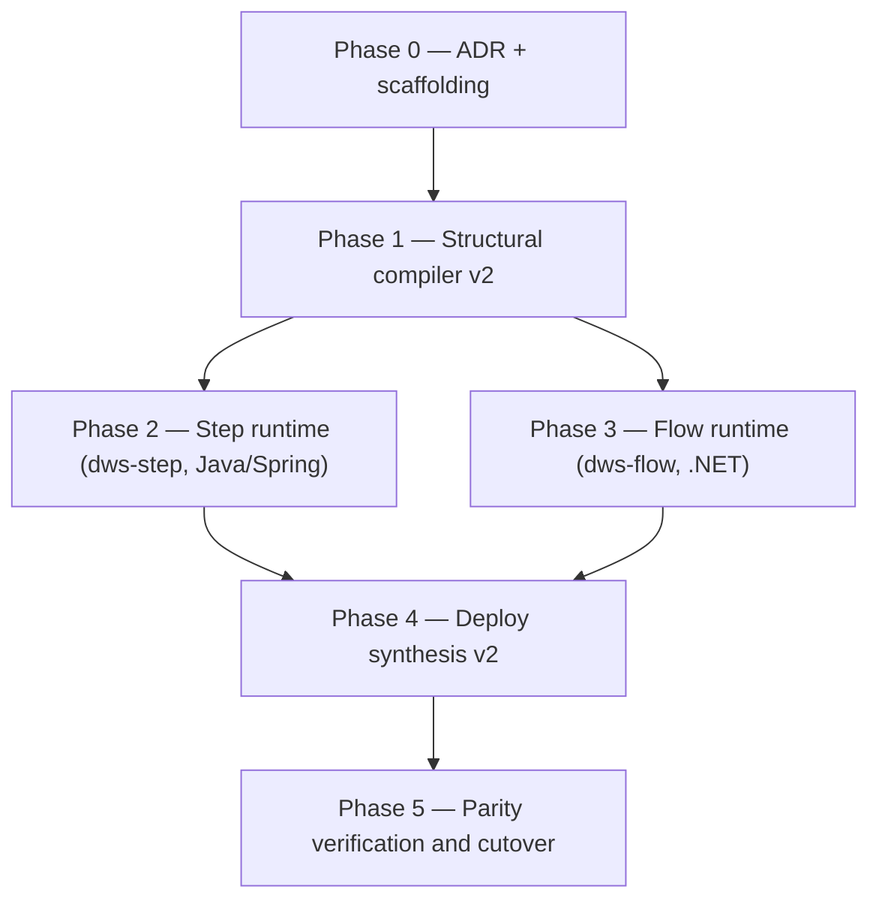

# Workflow Runtime Architecture — Implementation Roadmap

Implements [Workflow Runtime Architecture](workflow-runtime-architecture.md) (the spec —
read that first). This roadmap is the build order for turning it from target-state into running
code. Status: 🟡 in progress — Phase 0 done (2026-09-04), Phase 1 not started.

## Scope note: `dws-console` is unaffected

This is a **backend runtime/deploy** rewrite only. `dws-console` keeps showing the workflow the way
it does today — the DSL-authored view (`then`, `switch` cases, loop/fork structure, as written in
the definition). The spec's "component-invocation view" (`Flow: main` / `Step` / `CallActivityAsync`
mermaid diagrams) describes runtime *architecture*, for docs like this one — it is not a new
console screen, and nothing in this roadmap touches `dws-console`. See [Acceptance](#acceptance)
below for how this narrows the spec's own acceptance criteria for this build order.

## Where this leaves v1

Today `dws-controller` compiles a definition into **one** `dws-orchestrator` Deployment (generic
Java interpreter, loads a pinned definition at startup) that runs `switch`/`set`/`wait`/`listen`/
`emit`/`for`/`try`/`catch`/`retry`/`fork`/`raise` **in-process**, and only farms `call`/`run` out to
prebuilt Knative functions (`dws-call-*`, `dws-run-*`). v2 turns every task in the classification
table into its own deployable Flow or Step component, cross-app-invoked. That's a structural
rewrite of the runtime, not an incremental patch — `dws-orchestrator` and `dws-controller`'s
`WorkflowCompiler`/`StackSynthesizer` are both in scope.

## Design decision: uniform Step layer — every function image goes back to plain HTTP

_Recorded in [ADR 0001](../adr/0001-workflow-runtime-v2-decisions.md#decision-2-uniform-step-layer--every-function-image-goes-back-to-plain-http)._

Checked the actual code. Today the six prebuilt function images split into two shapes:

| Group | Task kinds | Image(s) | Confirmed in source | Today's dispatch |
|---|---|---|---|---|
| Go, already a Dapr Workflow activity worker | `call: http`, `run: shell`, `run: script`, `call: grpc` | `dws-call-http`, `dws-run-shell`/`-script-js`/`-script-python`, `dws-call-grpc` | each `main.go` registers a Dapr Workflow activity named `Run` against its own app-id (`workflow.NewRegistry()` + `daprc.NewWorkflowClient()`) | `dws-orchestrator` dispatches it as a **multi-app activity**, `CallActivityAsync` straight to the function's app-id, no wrapper |
| Node, plain HTTP | `call: openapi`, `call: asyncapi` | `dws-call-openapi`, `dws-call-asyncapi` | each `index.ts`: "Invoked by dws-orchestrator via Dapr service invocation; runs as a scale-to-zero Knative service" — plain Fastify server, no workflow SDK | `dws-orchestrator`'s local `CallServiceActivity` (a Java `WorkflowActivity`) does the Dapr-service-invocation `POST /run` call |

**Decision: v2 does not keep the Go group's shortcut.** All six images go back to (or, for the
Node two, stay) plain Dapr-sidecar HTTP apps — `POST /run`, `GET /healthz`, no Dapr Workflow SDK,
no registered activity. `dws-step` becomes the **one uniform Java Activity boundary in front of
every I/O step**, exactly the shape the spec's own
[Step-to-function delegation](workflow-runtime-architecture.md#step-to-function-delegation) section already
describes: `dws-flow` → `CallActivityAsync` → `dws-step` Activity → Dapr service invocation →
function's `POST /run`. No task kind is special-cased. This trades away the "skip a hop" shortcut
three of the six images happen to have today, in exchange for one dispatch path to build, test, and
reason about instead of two.

Concretely this means `dws-call-http`, `dws-run-*`, and `dws-call-grpc` need a real code change —
not just a v2-side wrapper: their `Run` activity-worker registration is removed (or, during
migration, left in place but unused — see the Phase 2/5 sequencing note below) and a plain HTTP
`POST /run` handler is added, matching `dws-call-openapi`/`dws-call-asyncapi`'s existing shape. The
step-execution logic itself (`runner.Run` internals) doesn't change — only the transport surface
around it does, so this isn't a "no reimplementing the functions" violation of the spec's
non-goals, just a narrower one: no change to what a step *does*, only to how it's *invoked*.

**Sequencing hazard to plan around:** `dws-orchestrator` (v1) depends on `dws-call-http`/`dws-run-*`/
`dws-call-grpc` staying activity workers — that's literally how it dispatches them today
(`StepActivity.java`, `activity-step-dispatch` spec). If Phase 2 strips the activity-worker
registration before v1 is retired, v1 breaks for those four task kinds during the whole migration
window that Phase 5 needs for side-by-side parity testing. So: add the plain-HTTP handler in
Phase 2 without removing the activity-worker registration yet; only delete the now-unused
activity-worker code as a cleanup step once Phase 5 retires `dws-orchestrator` for good.

## Design decision: one Dapr app per graph node

_Recorded in [ADR 0001](../adr/0001-workflow-runtime-v2-decisions.md#decision-1-one-dapr-app-per-graph-node), including the app-ID naming-collision resolution below._

The spec says each compiled Flow/Step "can be scheduled from its parent with a target app ID."
**Resolved: one Dapr app per graph node.** Every compiled Flow scope (`main`, each `for`, `try`,
`catch`, fork branch) gets its own deployed `dws-flow` instance, and — following from the decision
above — **every compiled Step task, with no exceptions**, gets its own deployed `dws-step` instance,
each addressed by its derived identifier as the Dapr app ID. Not a shared app multiplexing scopes
as registered workflow types, and not a carve-out for the Go-backed task kinds either.

This is the closest literal reading of the spec, and it lines up with the convention
`dws-controller` already uses: `call`/`run` task names become kebab-case Dapr app IDs for their
Knative Services (root `CLAUDE.md` § *Task name → Dapr app-id*). Per-node app IDs generalize that
same rule to every task type.

**Trade-off to watch in Phase 4:** pod count scales with graph size on *both* axes now — Flow pods
with scope nesting (a `for` inside a `try` inside a `fork` branch is 4+ Flow pods on its own), and
Step pods 1:1 with every Step task, including every `call`/`run` (each of those also keeps its
existing, unchanged Knative Service running underneath as the thing `dws-step` proxies to — so a
`call: http` task is now *two* Dapr apps, not one). Flow/Step Dapr Workflow-adjacent apps hold or
front runtime state, so they aren't an obvious scale-to-zero fit the way the Knative functions
already are; worth a capacity check once Phase 4 has a real compiled graph to measure, and worth
reading the existing [`step-service-scaling` spec](../../openspec/specs/step-service-scaling/spec.md)
for prior art on whether `dws-step` itself can follow a similar scale-to-zero path.

### Example: one workflow, many pods

The spec's own [nested `try`/`for`/`catch` example](workflow-runtime-architecture.md#example-nested-try-for-and-catch-flows) —
3 leaf tasks, one level of nesting, one of those tasks (`reserveItem`) a `call: http` — compiles to:

| Node | Kind | Component | Dapr app ID | New? |
|---|---|---|---|---|
| `main` | Flow | `dws-flow` | `order-fulfillment-main` | ✅ new |
| `fulfillOrder` (`try`) | Flow | `dws-flow` | `fulfill-order` | ✅ new |
| `reserveItems` (`for`) | Flow | `dws-flow` | `reserve-items` | ✅ new |
| `fulfillOrder.catch` | Flow | `dws-flow` | `fulfill-order-catch` | ✅ new |
| `validateOrder` (`set`) | Step | `dws-step` | `validate-order` | ✅ new |
| `markOrderFailed` (`set`) | Step | `dws-step` | `mark-order-failed` | ✅ new |
| `reserveItem` (`call: http`) | Step | `dws-step` | `reserve-item` | ✅ new |
| — the function `reserveItem`'s `dws-step` proxies to | (unchanged) | `dws-call-http` | `reserve-item-fn` (resolved naming rule: `-fn` suffix on the function's app ID; `dws-step` keeps the unsuffixed, task-derived name) | ⚠️ existing, renamed `reserve-item` → `reserve-item-fn`; now sits behind a new pod instead of being called directly |

**7 new pods** (4 `dws-flow` + 3 `dws-step`) for a workflow with 3 leaf tasks, plus the 1 existing
`dws-call-http`-backed Knative Service that's now called by `reserveItem`'s `dws-step` instead of
directly by the orchestrator. **Naming rule (resolved):** `dws-step`'s app ID for a `call`/`run`
task keeps the plain task-derived name (`reserve-item`) unsuffixed — it's the node the rest of the
graph addresses, so it gets the conventional name. The underlying function's own Knative Service
app ID instead gets an explicit `-fn` suffix (`reserve-item` → `reserve-item-fn`), since it's the
pre-existing side and `dws-step` becomes the only thing that calls it directly going forward.

Note also: `fulfillOrder.catch`'s `.` isn't a legal Kubernetes Service/app-ID character, so Phase 1
must sanitize dots to dashes when turning a derived identifier into a Dapr app ID — the same kind of
transform `checkInventory` → `check-inventory` already does for `call`/`run` task names today, just
extended to dotted identifiers too.

## Design decision: WorkflowCompiler as two Strategies over a widened DeploymentPlan

_Recorded in [ADR 0002](../adr/0002-workflow-compiler-strategy-split.md)._

Phase 1 needs a second, structurally different compile pass alongside the existing one, and Phase
5 below already assumes v1 and v2 can run side by side behind a controller flag — without saying
how. Resolved: `WorkflowCompiler` becomes an interface (`compile(String specText) ->
DeploymentPlan`, same signature as today); the current class body is renamed to
`V1OrchestratorCompiler` with no behavior change; a new `V2StructuralCompiler` holds Phase 1's
graph logic as it's built. `CompilerProducer` is the one selection point, and **the flag itself
lives on a Dapr Configuration resource, not local app config** — following the precedent this repo
already set for `dws-definitions` (`charts/dws/templates/definitions-component.yaml`): a new
`configuration.redis` Component (working name `dws-controller-config`, scoped to `dws-controller`
only, same isolation reason `dws-definitions` is scoped to `dws-orchestrator` only), read via the
Dapr Configuration API rather than a Quarkus config property. Default `v1` until Phase 5 cutover.
Because it's a k/v store, one global key or per-workflow override keys both fit without a schema
change (which to use is still open). That flag *is* the Phase 5 "controller flag," decided now
instead of later. Because the interface keeps the `WorkflowCompiler` name, no caller
(`WorkflowResource`, etc.) changes while only v1 is wired.

`DeploymentPlan` is widened, not replaced: existing fields (`orchestrator`, `steps`, `bindings`,
`oauthEndpoints`, `bindingComponents`) keep their v1 meaning unchanged; new fields carry the
compiled Flow/Step node graph for v2. Contract: each strategy populates only its own fields, never
both, so nothing consuming the legacy fields needs to change while v1 is selected. The same
interface/two-strategy split repeats one layer down at `StackSynthesizer` in Phase 4 — not a
different mechanism, the same one applied to rendering instead of compiling. Recommended as the
first Phase 1 task (a pure refactor) before any classification-rule logic lands.

## Phases

| Phase | Deliverable | Touches | Status |
|---|---|---|---|
| **0** | Write the ADR covering both decisions above ([ADR 0001](../adr/0001-workflow-runtime-v2-decisions.md) — done, 2026-08-29) (per-node app IDs; uniform plain-HTTP function images behind a uniform `dws-step`); scaffold `dws-flow` (.NET, Dapr Workflow SDK) and `dws-step` (Java/Spring, Dapr Workflow SDK) as new, per-node-deployable component templates — one running instance hosts exactly one compiled node, same "generic image, pinned definition at startup" shape `dws-orchestrator` uses today, just one node's definition instead of the whole workflow — alongside, not replacing, `dws-orchestrator`. Define the language-neutral single-node definition JSON contract (a node's own task list plus its children's target app IDs) the controller hands each instance | new repos/modules | ✅ done, 2026-09-04 (`workflow-runtime-v2-phase0-scaffolding`; schema + both runtime scaffolds, loaders, activities, Dockerfiles, READMEs, unit tests all landed; only the deferred follow-up — path-filtered CI for `dws-flow`/`dws-step` — remains open) |
| **1** | Structural compiler: extract `WorkflowCompiler` into an interface with `V1OrchestratorCompiler`/`V2StructuralCompiler` strategies over a widened `DeploymentPlan`, selected via a Dapr Configuration resource, not local app config (see [Design decision](#design-decision-workflowcompiler-as-two-strategies-over-a-widened-deploymentplan) above, [ADR 0002](../adr/0002-workflow-compiler-strategy-split.md)) — do this refactor first. Then `V2StructuralCompiler` gains a pass that emits the Flow/Step/fork-branch graph per the [classification rules](workflow-runtime-architecture.md#classification-rules), with derived identifiers (`<workflow>.main`, `<try-task>.catch`, `<fork-task>.branch.<branch-root-task>`) that become each node's Dapr app ID once sanitized to a DNS-1123 label (dots → dashes). Every Step node — no exceptions — gets a `dws-step` app-id entry; for `call`/`run` Step nodes, apply the resolved naming rule to avoid the app-ID collision with the existing function's Knative Service — `dws-step` keeps the task-derived name, the function's Knative Service app ID gets a `-fn` suffix (see worked example above). Plus duplicate/ambiguous-id rejection. Golden tests against the spec's 5 worked examples | `dws-controller/compile` | ❌ not started |
| **2** | `dws-step` runtime: new `WorkflowActivity` implementations for `set`/`switch`/`wait`/`listen`/`emit`/`raise` (ported from the in-process orchestrator — no prebuilt image exists for these today); one uniform proxy `WorkflowActivity` for every `call`/`run` kind (`http`/`openapi`/`grpc`/`asyncapi`/`shell`/`script`) that does the same Dapr-service-invocation `POST /run` call `CallServiceActivity` already makes for `call: openapi` today, generalized to all six. In parallel: add a plain HTTP `POST /run` handler to `dws-call-http`/`dws-run-*`/`dws-call-grpc` (matching `dws-call-openapi`/`dws-call-asyncapi`'s existing shape) **without removing their current `Run` activity-worker registration yet** — see the sequencing note above; that removal is deferred to Phase 5's cleanup so v1 keeps working throughout | new `dws-step` | ❌ not started |
| **3** | `dws-flow` runtime: .NET Dapr Workflow host where each deployed instance hosts the single compiled Flow scope it was built for as its one registered workflow type, sequences that scope's tasks, and calls `CallActivityAsync`/`CallChildWorkflowAsync` per the classification rules — every Step child, with no exceptions, is invoked by calling its deployed `dws-step` app-id (never the underlying function image directly). Ports `try`/`catch`/`retry` (backoff, jitter, limits) from Java; parent Flow performs `allOf`/`anyOf` directly for `fork` (no standalone fork node) | new `dws-flow` | ❌ not started |
| **4** | Deploy synthesis v2: `StackSynthesizer`/`StackApplier` gain a path that emits one `dws-flow` Deployment per compiled Flow node and one `dws-step` Deployment per compiled Step node — every Step node, no exceptions — per workflow version, each carrying its own node's compiled definition as its definition key; version-drain/GC logic extended to both. Knative synthesis for `dws-call-*`/`dws-run-*` is unchanged and still runs — `dws-step` is a new layer deployed *in front of* those functions, not a replacement for their synthesis. No new Helm templates — same "deployed dynamically per-workflow, not chart-managed" pattern `dws-orchestrator` already follows — only new base images to build/push in CI | `dws-controller/k8s`, CI | ❌ not started |
| **5** | Parity verification and cutover: cross-app integration tests (.NET Flow → child Flow, .NET Flow → Java Step, Java Step → function `POST /run`; success/retry/failure propagation); run v1 and v2 side by side behind a controller flag — `dws-call-http`/`dws-run-*`/`dws-call-grpc` keep serving both interfaces (activity worker for v1, plain HTTP for v2's `dws-step`) throughout this window; parity-tested against the full [OWS feature matrix](openworkflow-features.md#1-current-task-type-coverage). On cutover: retire `dws-orchestrator`, **then** remove the now-unused activity-worker registration from those three images as cleanup, update [deployed-workflow.md](../../openwiki/architecture/deployed-workflow.md) | `dws-orchestrator` (retired), `dws-call-http`/`dws-run-*`/`dws-call-grpc` (cleanup), openwiki | ❌ not started |

## Non-goals (inherited from the spec, plus our own)

Same as [workflow-runtime-architecture.md § Non-goals](workflow-runtime-architecture.md#non-goals-of-the-target-state):
no DSL semantic changes, no merging structural topology with execution/data-flow/deployment views.
Refined for this roadmap: **no reimplementing what the functions *do*** — `runner.Run` and
equivalent step-execution logic is untouched — only their transport surface (activity-worker →
plain HTTP) changes, and only for `dws-call-http`/`dws-run-*`/`dws-call-grpc`. Also added: **no
`dws-console` changes** — its DSL-based workflow display stays exactly as-is (see
[Scope note](#scope-note-dws-console-is-unaffected)).

## Acceptance

Done when [workflow-runtime-architecture.md § Target-state acceptance criteria](workflow-runtime-architecture.md#target-state-acceptance-criteria)
items 1–6 and 9–10 hold against a live cluster. Items 7 and 8 aren't build targets for this
roadmap: the spec's visualizer language is reference material illustrating how target Flow/Step
components should be designed and wired together, not a UI this roadmap has to ship (see
[Scope note](#scope-note-dws-console-is-unaffected)). Item 8's "separate view modes" aspect is
likewise not a target change of this proposal — it can stay as-is or be improved later,
independently of this build order. No conflict with the spec to reconcile here.
