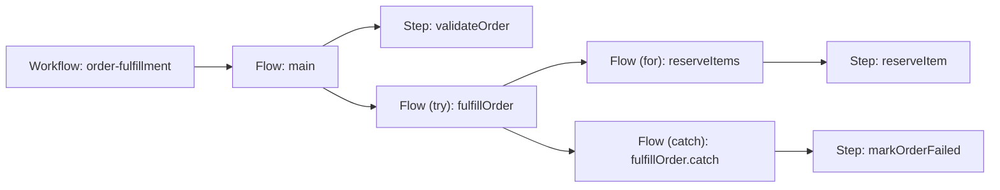
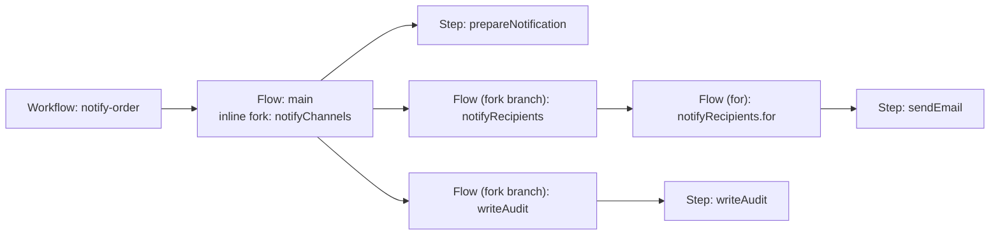

# Proposed Workflow Visual Model

Status: **proposal** — this document defines the desired workflow-topology model for a future
visualizer. It does not change DSL execution, deployment, or the existing console.

## Goal

Render an Open Workflow DSL definition as a hierarchy of **workflows**, **flows**, and **steps**.
The diagram explains which definition entities own or invoke other definition entities. It is not an
execution sequence diagram, a data-flow diagram, or a Kubernetes/Dapr deployment diagram.

## Target runtime architecture

The future implementation has two deployable component kinds. A structural **flow** is hosted by a
.NET Dapr Workflow service. A **step** is hosted by a Java/Spring Dapr Workflow Activity service.
The parent Flow service performs all durable orchestration; a Step service performs exactly one
business operation.

| Component | Desired stack |
|---|---|
| Flow service | .NET application, Dapr .NET Workflow SDK, registered `Workflow` classes, Dapr sidecar, and the shared workflow/actor state store. |
| Step service | Java/Spring Boot application, Dapr Java Workflow SDK or Spring workflow support, registered `WorkflowActivity` implementations, Dapr sidecar, and its external-integration clients. |

### Main responsibilities

| Component | Responsibilities |
|---|---|
| Flow service | Own durable orchestration; invoke child Flow services and Step activities; preserve flow state and scoped context; handle sequencing, retries, errors, loops, and fork joins/races. |
| Step service | Validate and map input; perform one business operation; call external systems; return data or a failure; remain idempotent for retries; and emit step telemetry. It never owns orchestration or child flows. |

### Workflow-task ownership

| Component | Tasks and constructs |
|---|---|
| Flow service | Top-level `main` flow, `for`, `try`, `catch`, and `fork` branch-flow lifecycle. The parent Flow service performs `allOf` or `anyOf` for a `fork`. |
| Step service | `call`, `run`, `set`, `switch`, `wait`, `listen`, `emit`, and `raise`. |

At the service boundary, a .NET Flow calls another .NET Flow through
`CallChildWorkflowAsync` with the target Flow app ID, and calls a Java Step through
`CallActivityAsync` with the target Step app ID. Every participating app must share a Dapr
namespace and workflow/actor state store, publish compatible JSON contracts, and be allowed by
workflow access policy.

## Terms

| Entity | Meaning | Diagram treatment |
|---|---|---|
| Workflow | The submitted DSL document. | Root entity. It owns the top-level `main` flow. |
| Flow | A task-list scope. | Green node. A flow invokes its direct child steps and flows. |
| Step | A single task that does not own a task list. | Orange node. |
| Fork branch flow | The implicit scope created for every item in `fork.branches`. | Green node. All sibling branch flows start in parallel. |
| Fork region | An inline parallel region on the containing flow. | Annotation on the parent flow, not a separate node. |

## Classification rules

| DSL construct | Classification | Reason |
|---|---|---|
| Top-level `do` | `Flow: main` | It is the workflow's outer task-list scope. |
| `for` | Flow | Its `do` property owns the loop body. |
| `try` | Flow | It owns the `try` task list and may own a `catch.do` recovery list. |
| `catch` | Flow | `catch.do` owns the recovery task list. Its identifier is derived as `<try-task>.catch`. |
| `fork` | Inline parallel region | The parent flow starts the branch flows and performs the join or race. Do not render a separate `fork` flow node. |
| Each `fork.branches` item | Fork branch flow | It is an independently executed child scope of the fork. |
| `call`, `run`, `set`, `switch`, `wait`, `listen`, `emit`, `raise` | Step | These tasks do not own a nested task list. |

`switch` is deliberately a **step**, not a flow. Its `then` values route execution to named
entities, but it does not contain its own task list.

## Edge semantics

Every edge means **contains/invokes**:

- Workflow → its `main` flow.
- Flow → each direct child step or child flow.
- A parent flow with a `fork` region → each fork branch flow. Sibling branch flows execute in
  parallel. The parent flow performs the `allOf` join when `compete: false` and the `anyOf` race
  when `compete: true`.

The structural view must not add control-path edges such as `then`, `switch` cases, loop-back
arrows, error transitions, deployment resources, or Dapr service calls. Those belong in separate
execution, data-flow, or deployment views.

## Example: nested `try`, `for`, and `catch` flows

```yaml
document:
  dsl: '1.0.0'
  namespace: default
  name: order-fulfillment
  version: '1.0.0'

do:
  - validateOrder:
      set:
        status: validating
      then: fulfillOrder

  - fulfillOrder:
      try:
        - reserveItems:
            for:
              each: item
              in: .items
            do:
              - reserveItem:
                  call: http
                  with:
                    method: post
                    endpoint: https://inventory.example.com/reservations
      catch:
        do:
          - markOrderFailed:
              set:
                status: failed
      then: end
```



## Example: parallel fork branch flows

```yaml
document:
  dsl: '1.0.0'
  namespace: default
  name: notify-order
  version: '1.0.0'

do:
  - prepareNotification:
      set:
        status: ready
      then: notifyChannels

  - notifyChannels:
      fork:
        compete: false
        branches:
          - notifyRecipients:
              for:
                each: recipient
                in: .recipients
              do:
                - sendEmail:
                    call: http
                    with:
                      method: post
                      endpoint: https://email.example.com/send
          - writeAudit:
              set:
                auditStatus: recorded
      then: end
```



## Future implementation requirements

1. Build a structural graph from the parsed DSL definition, preserving source-order for each task
   list.
2. Generate stable derived identifiers for scopes that do not have an explicit DSL name:
   `<workflow>.main`, `<try-task>.catch`, and `<fork-task>.branch.<branch-root-task>`.
3. Render `fork` as an inline region on its containing flow. Represent only its branches as
   distinct child-flow nodes, and expose `compete` as metadata on the parent flow's join/race.
4. Keep structural, execution, data-flow, and deployment diagrams as separate view modes so their
   relationships are never conflated.
5. Reject or visibly report definitions whose duplicate task names make a derived visual identifier
   ambiguous, consistent with controller validation.

## Non-goals

- Changing DSL semantics or the controller/orchestrator implementation.
- Inferring runtime state, retries, task results, or service deployment topology.
- Replacing a future execution graph, which may separately render `then`, switch outcomes, timers,
  error paths, and fork joins.
