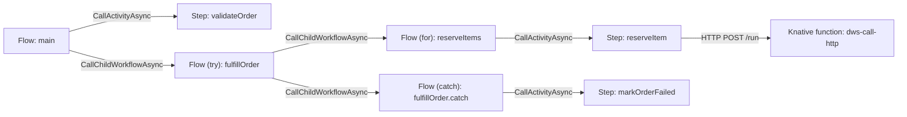
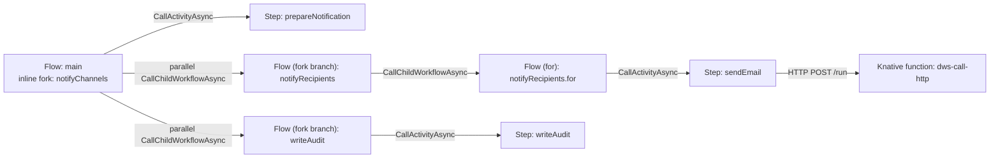
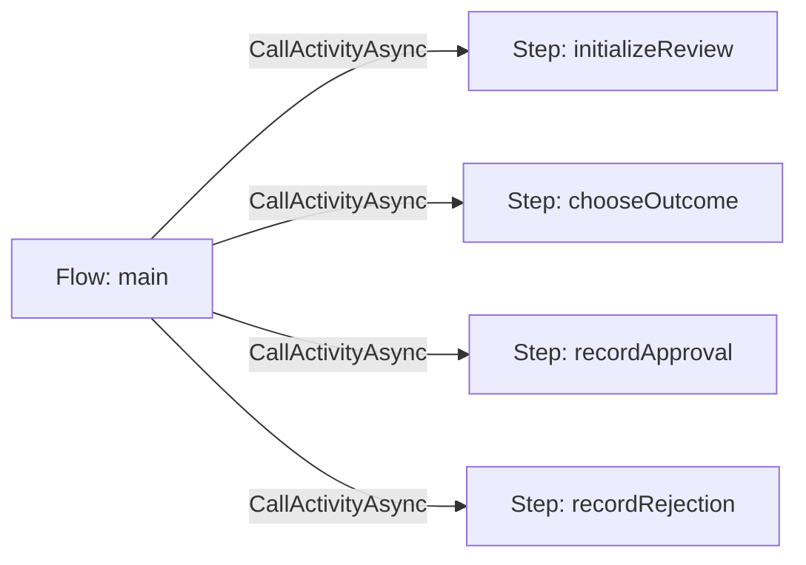
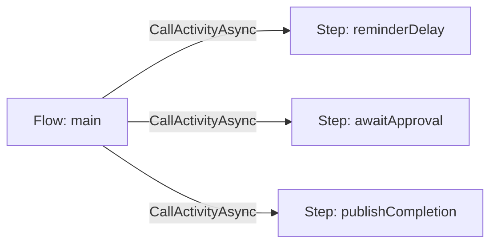
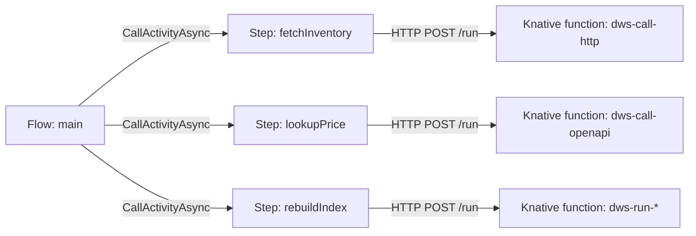
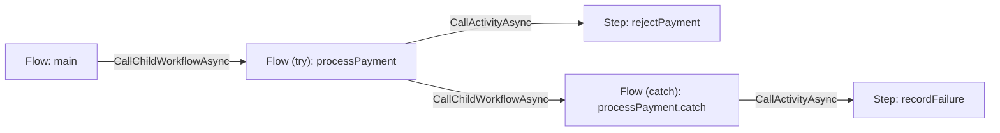

# Target Workflow Runtime and Visual Architecture

Status: **target state** - this document is the architecture DWS is intended to reach. The current
implementation does not yet satisfy every requirement below.

## Goal

Compile an Open Workflow DSL definition into two deployable component kinds - **flows** and
**steps** - and render their invocation hierarchy consistently. The runtime topology and its visual
model must describe the same component boundaries.

## Target-state principles

1. Every workflow owns a top-level `main` Flow.
2. Every Flow runs as a .NET Dapr Workflow and owns durable orchestration.
3. Every Step runs as a Java/Spring Dapr Workflow Activity and performs one task operation.
4. A parent Flow invokes child Flows with cross-app `CallChildWorkflowAsync` and Steps with
   cross-app `CallActivityAsync`.
5. I/O Steps delegate their concrete execution to the existing task-derived Knative functions.
6. The structural diagram shows component containment and invocation, not runtime control paths,
   data movement, or Kubernetes resources.

## Target component architecture

The target implementation has exactly two workflow component kinds. A **Flow** is hosted by a .NET
Dapr Workflow service. A **Step** is hosted by a Java/Spring Dapr Workflow Activity service. The
parent Flow performs all durable orchestration; a Step performs exactly one task operation.

| Component | Target stack |
|---|---|
| Flow service | .NET application, Dapr .NET Workflow SDK, registered `Workflow` classes, Dapr sidecar, and the shared workflow/actor state store. |
| Step service | Java/Spring Boot application, Dapr Java Workflow SDK or Spring workflow support, registered `WorkflowActivity` implementations, Dapr sidecar, and an HTTP/Dapr service-invocation client for the task's Knative function. |

### Main responsibilities

| Component | Responsibilities |
|---|---|
| Flow service | Own durable orchestration; invoke child Flow services and Step activities; preserve flow state and scoped context; handle sequencing, retries, errors, loops, and fork joins/races. |
| Step service | Validate and map input; select the task's Knative function; call that function over HTTP; return data or a failure; remain idempotent for retries; and emit step telemetry. It never owns orchestration or child flows. |

### Workflow-task ownership

| Component | Tasks and constructs |
|---|---|
| Flow service | Top-level `main` flow, `for`, `try`, `catch`, and `fork` branch-flow lifecycle. The parent Flow service performs `allOf` or `anyOf` for a `fork`. |
| Step service | `call`, `run`, `set`, `switch`, `wait`, `listen`, `emit`, and `raise`. The `call` and `run` variants delegate their concrete work to Knative functions; the remaining Step task types execute in their Java Activity implementations. |

At the service boundary, a .NET Flow calls another .NET Flow through
`CallChildWorkflowAsync` with the target Flow app ID, and calls a Java Step through
`CallActivityAsync` with the target Step app ID. Every participating app must share a Dapr
namespace and workflow/actor state store, publish compatible JSON contracts, and be allowed by
workflow access policy.

### Step-to-function delegation

For an I/O step, the Java Step Activity is a durable boundary and does not embed the protocol or
execution implementation. After the .NET parent invokes it with `CallActivityAsync`, the activity
resolves the task-derived target app ID and sends the task input through Dapr service invocation to
the target Knative function's HTTP `POST /run` endpoint.

```text
.NET Flow Workflow
  -> CallActivityAsync(target: java-step-service)
     -> Java Step WorkflowActivity
        -> Dapr service invocation: HTTP POST /run
           -> task-derived dws-call-http, dws-call-openapi, or dws-run-* function
```

The function response becomes the Step Activity result and is returned durably to the parent Flow.
Function failures become structured activity failures for the Flow service's retry and `try`/`catch`
handling. This preserves the existing DWS separation: generic Knative function runners execute
the task-specific I/O, while the workflow layer retains orchestration and retry ownership.

## Terms

| Entity | Meaning | Diagram treatment |
|---|---|---|
| Workflow | The submitted DSL document. | Root entity. It owns the top-level `main` flow. |
| Flow | A task-list scope. | Green node. A flow invokes its direct child steps and flows. |
| Step | A single task that does not own a task list. | Orange node. |
| Fork branch flow | The implicit scope created for every item in `fork.branches`. | Green node. All sibling branch flows start in parallel. |
| Fork region | An inline parallel region on the containing flow. | Annotation on the parent flow, not a separate node. |

## Classification rules

| DSL construct | Classification | Reason |
|---|---|---|
| Top-level `do` | `Flow: main` | It is the workflow's outer task-list scope. |
| `for` | Flow | Its `do` property owns the loop body. |
| `try` | Flow | It owns the `try` task list and may own a `catch.do` recovery list. |
| `catch` | Flow | `catch.do` owns the recovery task list. Its identifier is derived as `<try-task>.catch`. |
| `fork` | Inline parallel region | The parent flow starts the branch flows and performs the join or race. Do not render a separate `fork` flow node. |
| Each `fork.branches` item | Fork branch flow | It is an independently executed child scope of the fork. |
| `call`, `run`, `set`, `switch`, `wait`, `listen`, `emit`, `raise` | Step | These tasks do not own a nested task list. |

`switch` is deliberately a **step**, not a flow. Its `then` values route execution to named
entities, but it does not contain its own task list.

## Architecture component-invocation view

The architecture visual starts at `Flow: main` and shows invocations between deployable runtime
components. The submitted Workflow document is metadata, not a deployable component, so it is not
rendered as a node.

Every edge represents one of these target invocations:

- Flow -> child Flow: cross-app `CallChildWorkflowAsync`.
- Flow -> Step: cross-app `CallActivityAsync`.
- I/O Step -> task-derived Knative function: Dapr service invocation using HTTP `POST /run`.
- A parent Flow with a `fork` region -> each fork branch Flow: parallel
  `CallChildWorkflowAsync` calls. The parent performs `allOf` when `compete: false` and `anyOf`
  when `compete: true`.

The view must not add control-path edges such as `then`, switch cases, loop-back arrows, or error
transitions. Dapr sidecars, state stores, pub/sub brokers, and Kubernetes resources belong in a
separate deployment view.

## Example: nested `try`, `for`, and `catch` flows

```yaml
document:
  dsl: '1.0.0'
  namespace: default
  name: order-fulfillment
  version: '1.0.0'

do:
  - validateOrder:
      set:
        status: validating
      then: fulfillOrder

  - fulfillOrder:
      try:
        - reserveItems:
            for:
              each: item
              in: .items
            do:
              - reserveItem:
                  call: http
                  with:
                    method: post
                    endpoint: https://inventory.example.com/reservations
      catch:
        do:
          - markOrderFailed:
              set:
                status: failed
      then: end
```



## Example: parallel fork branch flows

```yaml
document:
  dsl: '1.0.0'
  namespace: default
  name: notify-order
  version: '1.0.0'

do:
  - prepareNotification:
      set:
        status: ready
      then: notifyChannels

  - notifyChannels:
      fork:
        compete: false
        branches:
          - notifyRecipients:
              for:
                each: recipient
                in: .recipients
              do:
                - sendEmail:
                    call: http
                    with:
                      method: post
                      endpoint: https://email.example.com/send
          - writeAudit:
              set:
                auditStatus: recorded
      then: end
```



## Example: state and decision steps

`set` and `switch` are both Java Activity Steps. Although `switch` selects the next task at
runtime, it does not own a task list and therefore does not become a Flow.

```yaml
document:
  dsl: '1.0.0'
  namespace: default
  name: review-request
  version: '1.0.0'

do:
  - initializeReview:
      set:
        eligible: true
      then: chooseOutcome

  - chooseOutcome:
      switch:
        - approved:
            when: ${ .eligible }
            then: recordApproval
        - default:
            then: recordRejection

  - recordApproval:
      set:
        status: approved
      then: end

  - recordRejection:
      set:
        status: rejected
      then: end
```



## Example: timing and event steps

`wait`, `listen`, and `emit` remain Steps. Their Java Activity implementations use the appropriate
Dapr timer, external-event, or pub/sub capability; those infrastructure dependencies are not
additional Flow components.

```yaml
document:
  dsl: '1.0.0'
  namespace: default
  name: approval-reminder
  version: '1.0.0'

do:
  - reminderDelay:
      wait: PT5M

  - awaitApproval:
      listen:
        to:
          one:
            with:
              type: com.example.request.approved

  - publishCompletion:
      emit:
        event:
          with:
            source: https://workflow.example.com/approval-reminder
            type: com.example.request.completed
            data: ${ . }
      then: end
```



## Example: external call and run steps

The parent Flow invokes each `call` or `run` Step as a Java Activity. The Step then invokes its
task-derived Knative function over HTTP. The Flow never calls the function directly.

```yaml
document:
  dsl: '1.0.0'
  namespace: default
  name: synchronize-catalog
  version: '1.0.0'

do:
  - fetchInventory:
      call: http
      with:
        method: get
        endpoint: https://inventory.example.com/items

  - lookupPrice:
      call: openapi
      with:
        document:
          endpoint: https://catalog.example.com/openapi.json
        operationId: getPrice

  - rebuildIndex:
      run:
        shell:
          command: ./rebuild-index.sh
      then: end
```



## Example: raise and recovery steps

The `try` and `catch` task lists are child Flows. `raise` and the recovery `set` remain Java
Activity Steps invoked by the Flow that owns each task.

```yaml
document:
  dsl: '1.0.0'
  namespace: default
  name: guarded-payment
  version: '1.0.0'

do:
  - processPayment:
      try:
        - rejectPayment:
            raise:
              error:
                type: https://example.com/errors/payment-rejected
                status: 402
                title: Payment rejected
                detail: Payment authorization failed
      catch:
        errors:
          with:
            status: 402
        do:
          - recordFailure:
              set:
                status: failed
      then: end
```



## Target-state acceptance criteria

The target state is achieved when all of the following are true:

1. The controller compiles every supported definition into a structural graph of Flow and Step
   components while preserving source order within each task list.
2. The compiler generates stable derived identifiers for scopes without an explicit DSL name:
   `<workflow>.main`, `<try-task>.catch`, and `<fork-task>.branch.<branch-root-task>`.
3. Each compiled Flow is deployed as a .NET Dapr Workflow service and can be scheduled from its
   parent with a target app ID.
4. Each compiled Step is deployed as a Java/Spring Dapr Workflow Activity service and can be
   scheduled from its parent with a target app ID.
5. I/O Steps invoke their task-derived Knative function through Dapr service invocation and return
   its result or structured failure to the parent Flow.
6. A parent Flow handles `fork` directly: it starts one child Flow per branch and performs `allOf`
   when `compete: false` or `anyOf` when `compete: true`. No standalone fork invocation is created.
7. The visualizer renders `fork` as an inline region of its containing Flow and represents only its
   branches as distinct child Flow nodes.
8. Structural, execution, data-flow, and deployment diagrams remain separate view modes.
9. Duplicate task names or ambiguous derived identifiers are rejected or visibly reported,
   consistent with controller validation.
10. Cross-app integration tests prove .NET Flow -> .NET child Flow, .NET Flow -> Java Step, and
    Java Step -> Knative function invocation, including success, retry, and failure propagation.

## Non-goals of the target state

- Changing Open Workflow DSL semantics.
- Reimplementing the concrete `dws-call-*` and `dws-run-*` function behavior inside Flow or Step
  services.
- Combining structural topology with execution state, data flow, or Kubernetes deployment details
  in one diagram.
- Replacing an execution graph that separately renders `then`, switch outcomes, timers, error
  paths, retries, and fork joins.
