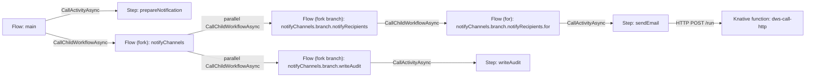

# V2StructuralCompiler Classification Pass Implementation Plan

> **For agentic workers:** REQUIRED SUB-SKILL: Use superpowers:subagent-driven-development
> (recommended) or superpowers:executing-plans to implement this plan task-by-task. Steps use
> checkbox (`- [ ]`) syntax for tracking.

**Goal:** Make `V2StructuralCompiler` compile a DSL 1.0 definition into a `CompiledNode` tree with
sanitized collision-free Dapr app IDs and a valid per-node `specText`, without changing v1.

**Architecture:** `V2StructuralCompiler` orchestrates four small collaborators in
`io.dws.controller.compile` — `SpecParser` (shared parse, extracted from `V1OrchestratorCompiler`),
`NodeNaming` (identifier derivation, DNS-1123 sanitization, `-fn`, collision detection),
`SingleNodeDefinition` (renders one node's wire JSON), and `NodeClassifier` (the recursive descent
that produces the tree). Classification reads the typed serverlessworkflow model for task kinds and
a parallel raw `JsonNode` cursor for verbatim task objects, so `tasks` in the wire format carries
the definition's own JSON rather than a round-tripped rebuild.

**Tech Stack:** Java 25, Quarkus, Maven (`./mvnw verify`), JUnit 5, AssertJ, Jackson (incl.
`jackson-dataformat-yaml`), `io.serverlessworkflow:serverlessworkflow-api` 7.26.0.Final,
`com.networknt:json-schema-validator` 2.0.0 (already on the classpath).

**Spec:** `openspec/changes/phase-1-structural-classification/` — `proposal.md`, `design.md`,
`specs/*/spec.md`, `tasks.md`. Read `design.md` before Task 1.

## Global Constraints

- Work only inside `dws-controller`, `openspec/schemas/single-node-definition.schema.json`, and
  `docs/roadmaps/workflow-runtime-architecture.md`. Touch no other package.
- `V1OrchestratorCompiler`'s behavior must not change. `WorkflowCompilerTest` must pass
  unmodified — do not edit it.
- `CompilerStrategyTest` has exactly one sanctioned edit, in Task 5: its `v2LeavesLegacyEmpty`
  test asserts `assertThat(plan.flowStepGraph()).isEmpty()`, which is true only of the stub. Update
  that one assertion (and the `@DisplayName`) to assert a populated graph, per
  `specs/workflow-compiler-strategy/spec.md`. Leave every other test in that file alone,
  `v1LeavesGraphEmpty` and the two producer-selection tests included.
- `CompilerProducer`'s default stays v1. Do not change strategy selection.
- v2 populates `flowStepGraph` plus the identity fields (`workflow`, `versionId`, `version`,
  `definitionResource`, `specText`) and leaves `steps`, `bindings`, `orchestrator`,
  `oauthEndpoints`, `bindingComponents` empty.
- `children()` stays a plain `List<CompiledNode>`. Never add a parent-side keyed map; build wire
  `children` with `CompiledNode::key`.
- Every gate run is `cd dws-controller && ./mvnw verify` from the repo root. Spotless auto-formats
  on `process-sources`; if it reformats your file, re-stage before committing.
- Commit message form: `<type>(controller): <description>` — or `(openspec)` / `(docs)` for the
  schema and roadmap edits. End every commit body with the repository's required trailers.
- Derived identifiers, verbatim from `design.md` §D3:
  `<workflow>.main`, `<try-task>.catch`, `<fork-task>.branch.<branch-root-task>`,
  `<branch-nodeId>.<kind>` for a structural task at a branch root, and the task's own name for any
  named scope. `appId` = `Names.kebab(nodeId)`. Max app ID length 63.

---

## Task 1: Contract updates — schema and architecture doc

No Java. This lands first so later tasks can validate against a schema that admits fork.

**Files:**
- Modify: `openspec/schemas/single-node-definition.schema.json`
- Modify: `docs/roadmaps/workflow-runtime-architecture.md`

**Interfaces:**
- Consumes: nothing.
- Produces: a `flow` schema branch accepting `scope: "fork"` with a required `forkMode` of `all`
  or `any`, forbidden on every other scope. Task 4 and Task 6 validate against it.

- [ ] **Step 1: Add `fork` to the scope enum**

In `openspec/schemas/single-node-definition.schema.json`, inside `definitions.flow.allOf[1].properties`:

```json
"scope": { "enum": ["main", "for", "try", "catch", "fork", "forkBranch"] },
```

- [ ] **Step 2: Add `forkMode` and its conditional requirement**

Add the property alongside `catch`:

```json
"forkMode": { "enum": ["all", "any"] }
```

Then add, as a sibling of `properties` and `required` in that same `allOf[1]` object:

```json
"if": { "properties": { "scope": { "const": "fork" } }, "required": ["scope"] },
"then": { "required": ["forkMode"] },
"else": { "not": { "required": ["forkMode"] } }
```

- [ ] **Step 3: Verify the schema still parses as draft-07**

Run: `python3 -c "import json;d=json.load(open('openspec/schemas/single-node-definition.schema.json'));print(d['definitions']['flow']['allOf'][1]['then'])"`
Expected: `{'required': ['forkMode']}`

- [ ] **Step 4: Rewrite the classification table's fork rows**

In `docs/roadmaps/workflow-runtime-architecture.md`, replace the `fork` row of the "Classification
rules" table:

```markdown
| `fork` | Flow | It owns the fan-out over `fork.branches` and the join. Its own task list is empty; `forkMode` is `all` when `compete: false` and `any` when `compete: true`. |
```

And in the "Terms" table, replace the "Fork region" row:

```markdown
| Fork node | The flow created for a `fork` task. | Green node. It starts every branch flow and performs the join or race. |
```

- [ ] **Step 5: Rewrite acceptance criteria #6 and #7**

```markdown
6. A `fork` task compiles to its own Flow, deployed like any other scope: it starts one child Flow
   per branch and performs `allOf` when `compete: false` or `anyOf` when `compete: true`.
7. The visualizer renders `fork` as its own Flow node with its branch Flows as children.
```

- [ ] **Step 6: Redraw the parallel-fork example's mermaid**

Replace the mermaid block under "Example: parallel fork branch flows" with:



Also update the paragraph above the "Architecture component-invocation view" bullet that reads
"A parent Flow with a `fork` region -> each fork branch Flow" so it describes a parent Flow calling
the fork Flow, which calls its branches.

- [ ] **Step 7: Validate the change**

Run: `openspec validate phase-1-structural-classification --json`
Expected: `"valid": true`

- [ ] **Step 8: Commit**

```bash
git add openspec/schemas/single-node-definition.schema.json docs/roadmaps/workflow-runtime-architecture.md
git commit -m "docs(openspec): admit fork scope and forkMode per ADR 0003"
```

---

## Task 2: Shared parsing seam

**Files:**
- Create: `dws-controller/src/main/java/io/dws/controller/compile/SpecParser.java`
- Modify: `dws-controller/src/main/java/io/dws/controller/compile/V1OrchestratorCompiler.java`
- Test: `dws-controller/src/test/java/io/dws/controller/compile/SpecParserTest.java`

**Interfaces:**
- Consumes: `CompilationException`, `WorkflowFormat`, `WorkflowReader`.
- Produces: `SpecParser.detectFormat(String) -> WorkflowFormat` and
  `SpecParser.parseOrThrow(String, WorkflowFormat) -> Workflow`, both `static`, package-private
  class. Tasks 5 and 6 call them.

- [ ] **Step 1: Write the failing test**

`dws-controller/src/test/java/io/dws/controller/compile/SpecParserTest.java`:

```java
package io.dws.controller.compile;

import static org.assertj.core.api.Assertions.assertThat;
import static org.assertj.core.api.Assertions.assertThatThrownBy;

import io.serverlessworkflow.api.WorkflowFormat;
import org.junit.jupiter.api.Test;

class SpecParserTest {

  private static final String YAML =
      """
      document:
        dsl: '1.0.0'
        namespace: default
        name: minimal
        version: '1.0.0'
      do:
        - noop:
            set:
              ok: true
      """;

  @Test
  void detectsYamlAndJson() {
    assertThat(SpecParser.detectFormat(YAML)).isEqualTo(WorkflowFormat.YAML);
    assertThat(SpecParser.detectFormat("  {\"document\": {}}")).isEqualTo(WorkflowFormat.JSON);
  }

  @Test
  void parsesAValidDefinition() {
    assertThat(SpecParser.parseOrThrow(YAML, WorkflowFormat.YAML).getDocument().getName())
        .isEqualTo("minimal");
  }

  @Test
  void wrapsParseFailuresInCompilationException() {
    assertThatThrownBy(() -> SpecParser.parseOrThrow("::not yaml::", WorkflowFormat.YAML))
        .isInstanceOf(CompilationException.class);
  }
}
```

- [ ] **Step 2: Run it and confirm it fails**

Run: `cd dws-controller && ./mvnw -q -Dtest=SpecParserTest test`
Expected: compile failure — `SpecParser` does not exist.

- [ ] **Step 3: Create `SpecParser` by moving the two methods verbatim**

Move `detectFormat`, `parseOrThrow`, and the `collectMessages` helper `parseOrThrow` depends on out
of `V1OrchestratorCompiler` into a new package-private final class `SpecParser`, unchanged apart
from becoming `static`. Do not rewrite their bodies — copy them.

```java
package io.dws.controller.compile;

import io.serverlessworkflow.api.WorkflowFormat;
import io.serverlessworkflow.api.WorkflowReader;
import io.serverlessworkflow.api.types.Workflow;
import java.util.List;

/** Format detection and parse-or-throw, shared by the v1 and v2 compile strategies. */
final class SpecParser {

  private SpecParser() {}

  static WorkflowFormat detectFormat(String specText) {
    return specText.stripLeading().startsWith("{") ? WorkflowFormat.JSON : WorkflowFormat.YAML;
  }

  static Workflow parseOrThrow(String specText, WorkflowFormat format) {
    // body copied verbatim from V1OrchestratorCompiler
  }
}
```

If `collectMessages` is also used elsewhere in `V1OrchestratorCompiler`, leave a copy there rather
than changing any other call site.

- [ ] **Step 4: Delegate from `V1OrchestratorCompiler`**

Replace its `detectFormat(...)` and `parseOrThrow(...)` call sites with `SpecParser.detectFormat(...)`
and `SpecParser.parseOrThrow(...)`, and delete the now-unused private methods.

- [ ] **Step 5: Run the full gate**

Run: `cd dws-controller && ./mvnw verify`
Expected: PASS, including `WorkflowCompilerTest` and `CompilerStrategyTest` unmodified.

- [ ] **Step 6: Commit**

```bash
git add dws-controller/src/main/java/io/dws/controller/compile/SpecParser.java \
        dws-controller/src/main/java/io/dws/controller/compile/V1OrchestratorCompiler.java \
        dws-controller/src/test/java/io/dws/controller/compile/SpecParserTest.java
git commit -m "refactor(controller): extract SpecParser shared by both compiler strategies"
```

---

## Task 3: Naming and identifiers

**Files:**
- Modify: `dws-controller/src/main/java/io/dws/controller/compile/Names.java`
- Create: `dws-controller/src/main/java/io/dws/controller/compile/NodeNaming.java`
- Test: `dws-controller/src/test/java/io/dws/controller/compile/NodeNamingTest.java`

**Interfaces:**
- Consumes: `Names.kebab`, `CompilationException`.
- Produces, all `static` on package-private final `NodeNaming`:
  - `String mainNodeId(String workflow)` → `workflow + ".main"`
  - `String catchNodeId(String tryTaskName)` → `tryTaskName + ".catch"`
  - `String branchNodeId(String forkTaskName, String branchRootTaskName)`
  - `String appId(String nodeId)` — kebab + 63-char rejection
  - `String functionAppId(String appId)` → `appId + "-fn"`
  And on `Names`: `String nodeDefinitionResource(String workflow, String versionId, String appId)`.
  Task 4 and Task 5 call these.

- [ ] **Step 1: Write the failing test**

`dws-controller/src/test/java/io/dws/controller/compile/NodeNamingTest.java`:

```java
package io.dws.controller.compile;

import static org.assertj.core.api.Assertions.assertThat;
import static org.assertj.core.api.Assertions.assertThatThrownBy;

import org.junit.jupiter.api.Test;

class NodeNamingTest {

  @Test
  void derivesUnnamedScopeIdentifiers() {
    assertThat(NodeNaming.mainNodeId("order-fulfillment")).isEqualTo("order-fulfillment.main");
    assertThat(NodeNaming.catchNodeId("fulfillOrder")).isEqualTo("fulfillOrder.catch");
    assertThat(NodeNaming.branchNodeId("notifyChannels", "notifyRecipients"))
        .isEqualTo("notifyChannels.branch.notifyRecipients");
  }

  @Test
  void sanitizesDottedAndCamelCaseIdentifiers() {
    assertThat(NodeNaming.appId("fulfillOrder.catch")).isEqualTo("fulfill-order-catch");
    assertThat(NodeNaming.appId("order-fulfillment.main")).isEqualTo("order-fulfillment-main");
    assertThat(NodeNaming.appId("reserveItems")).isEqualTo("reserve-items");
    assertThat(NodeNaming.appId("notifyChannels.branch.notifyRecipients"))
        .isEqualTo("notify-channels-branch-notify-recipients");
  }

  @Test
  void suffixesFunctionAppIds() {
    assertThat(NodeNaming.functionAppId("reserve-item")).isEqualTo("reserve-item-fn");
  }

  @Test
  void rejectsAnAppIdOverSixtyThreeCharacters() {
    String longName = "a".repeat(70);
    assertThatThrownBy(() -> NodeNaming.appId(longName))
        .isInstanceOf(CompilationException.class)
        .hasMessageContaining(longName);
  }

  @Test
  void buildsPerNodeDefinitionResources() {
    assertThat(Names.nodeDefinitionResource("order-fulfillment", "v1a2b3c4d", "fulfill-order-catch"))
        .isEqualTo("dws-def-order-fulfillment-v1a2b3c4d-fulfill-order-catch");
  }
}
```

- [ ] **Step 2: Run it and confirm it fails**

Run: `cd dws-controller && ./mvnw -q -Dtest=NodeNamingTest test`
Expected: compile failure — `NodeNaming` does not exist.

- [ ] **Step 3: Implement**

Add to `Names`:

```java
  public static String nodeDefinitionResource(String workflow, String versionId, String appId) {
    return definitionResource(workflow, versionId) + "-" + appId;
  }
```

Create `NodeNaming`:

```java
package io.dws.controller.compile;

import java.util.List;

/** Derives a compiled node's identifier and its sanitized DNS-1123 Dapr app ID (ADR 0001). */
final class NodeNaming {

  private static final int DNS_1123_LABEL_MAX = 63;

  private NodeNaming() {}

  static String mainNodeId(String workflow) {
    return workflow + ".main";
  }

  static String catchNodeId(String tryTaskName) {
    return tryTaskName + ".catch";
  }

  static String branchNodeId(String forkTaskName, String branchRootTaskName) {
    return forkTaskName + ".branch." + branchRootTaskName;
  }

  static String appId(String nodeId) {
    String appId = Names.kebab(nodeId);
    if (appId.length() > DNS_1123_LABEL_MAX) {
      throw new CompilationException(
          List.of(
              "node '"
                  + nodeId
                  + "' derives the app ID '"
                  + appId
                  + "' ("
                  + appId.length()
                  + " characters), which exceeds the "
                  + DNS_1123_LABEL_MAX
                  + "-character DNS-1123 label limit"));
    }
    return appId;
  }

  static String functionAppId(String appId) {
    return appId + "-fn";
  }
}
```

- [ ] **Step 4: Run the test**

Run: `cd dws-controller && ./mvnw -q -Dtest=NodeNamingTest test`
Expected: PASS.

- [ ] **Step 5: Run the full gate**

Run: `cd dws-controller && ./mvnw verify`
Expected: PASS.

- [ ] **Step 6: Commit**

```bash
git add dws-controller/src/main/java/io/dws/controller/compile/NodeNaming.java \
        dws-controller/src/main/java/io/dws/controller/compile/Names.java \
        dws-controller/src/test/java/io/dws/controller/compile/NodeNamingTest.java
git commit -m "feat(controller): derive and sanitize v2 node identifiers"
```

---

## Task 4: Single-node definition rendering

**Files:**
- Create: `dws-controller/src/main/java/io/dws/controller/compile/SingleNodeDefinition.java`
- Test: `dws-controller/src/test/java/io/dws/controller/compile/SingleNodeDefinitionTest.java`

**Interfaces:**
- Consumes: `CompiledNode`, `FlowNode`, `StepNode`, `CompiledNode::key`.
- Produces, on package-private final `SingleNodeDefinition`:
  - `record Envelope(String workflow, String version)`
  - `static String flow(Envelope envelope, String appId, String scope, List<JsonNode> tasks,
    Map<String, String> children, String catchAppId, String forkMode)` — `catchAppId` and
    `forkMode` nullable, omitted from output when null.
  - `static String step(Envelope envelope, String appId, JsonNode task, String functionAppId)` —
    `functionAppId` nullable.
  Both return pretty-printed JSON ending in a newline. Task 5 calls them.

Rendering rules, from `design.md` §D5: the envelope's `nodeId` is the sanitized app ID; `tasks`
holds name-keyed DSL task objects in source order; `children` maps each child's `key()` to its
`appId`; `catch` and `forkMode` appear only when non-null; a fork node renders an empty `tasks`
array.

- [ ] **Step 1: Write the failing test**

`dws-controller/src/test/java/io/dws/controller/compile/SingleNodeDefinitionTest.java`:

```java
package io.dws.controller.compile;

import static org.assertj.core.api.Assertions.assertThat;

import com.fasterxml.jackson.databind.JsonNode;
import com.fasterxml.jackson.databind.ObjectMapper;
import com.networknt.schema.JsonSchema;
import com.networknt.schema.JsonSchemaFactory;
import com.networknt.schema.SpecVersion;
import java.nio.file.Files;
import java.nio.file.Path;
import java.util.List;
import java.util.Map;
import org.junit.jupiter.api.Test;

class SingleNodeDefinitionTest {

  private static final ObjectMapper JSON = new ObjectMapper();
  private static final SingleNodeDefinition.Envelope ENVELOPE =
      new SingleNodeDefinition.Envelope("order-fulfillment", "order-fulfillment@v1a2b3c4d");

  private static JsonSchema schema() throws Exception {
    Path path = Path.of("..", "openspec", "schemas", "single-node-definition.schema.json");
    return JsonSchemaFactory.getInstance(SpecVersion.VersionFlag.V7)
        .getSchema(Files.readString(path));
  }

  private static void assertValid(String rendered) throws Exception {
    assertThat(schema().validate(JSON.readTree(rendered))).isEmpty();
  }

  @Test
  void rendersAFlowNodeWithChildrenAndCatch() throws Exception {
    JsonNode task = JSON.readTree("{\"reserveItems\":{\"for\":{\"each\":\"item\"}}}");
    String rendered =
        SingleNodeDefinition.flow(
            ENVELOPE,
            "fulfill-order",
            "try",
            List.of(task),
            Map.of("reserveItems", "reserve-items", "catch", "fulfill-order-catch"),
            "fulfill-order-catch",
            null);
    JsonNode node = JSON.readTree(rendered);
    assertThat(node.get("nodeId").asText()).isEqualTo("fulfill-order");
    assertThat(node.get("kind").asText()).isEqualTo("flow");
    assertThat(node.get("scope").asText()).isEqualTo("try");
    assertThat(node.get("catch").asText()).isEqualTo("fulfill-order-catch");
    assertThat(node.get("children").get("reserveItems").asText()).isEqualTo("reserve-items");
    assertThat(node.has("forkMode")).isFalse();
    assertValid(rendered);
  }

  @Test
  void rendersAForkNodeWithForkModeAndNoTasks() throws Exception {
    String rendered =
        SingleNodeDefinition.flow(
            ENVELOPE,
            "notify-channels",
            "fork",
            List.of(),
            Map.of("notifyRecipients", "notify-channels-branch-notify-recipients"),
            null,
            "all");
    JsonNode node = JSON.readTree(rendered);
    assertThat(node.get("forkMode").asText()).isEqualTo("all");
    assertThat(node.get("tasks")).isEmpty();
    assertThat(node.has("catch")).isFalse();
    assertValid(rendered);
  }

  @Test
  void rendersAStepNodeWithAndWithoutFunctionAppId() throws Exception {
    JsonNode task = JSON.readTree("{\"reserveItem\":{\"call\":\"http\"}}");
    String withFunction =
        SingleNodeDefinition.step(ENVELOPE, "reserve-item", task, "reserve-item-fn");
    assertThat(JSON.readTree(withFunction).get("functionAppId").asText())
        .isEqualTo("reserve-item-fn");
    assertValid(withFunction);

    JsonNode setTask = JSON.readTree("{\"validateOrder\":{\"set\":{\"status\":\"validating\"}}}");
    String withoutFunction = SingleNodeDefinition.step(ENVELOPE, "validate-order", setTask, null);
    assertThat(JSON.readTree(withoutFunction).has("functionAppId")).isFalse();
    assertValid(withoutFunction);
  }
}
```

- [ ] **Step 2: Run it and confirm it fails**

Run: `cd dws-controller && ./mvnw -q -Dtest=SingleNodeDefinitionTest test`
Expected: compile failure — `SingleNodeDefinition` does not exist.

- [ ] **Step 3: Implement**

```java
package io.dws.controller.compile;

import com.fasterxml.jackson.core.JsonProcessingException;
import com.fasterxml.jackson.databind.JsonNode;
import com.fasterxml.jackson.databind.ObjectMapper;
import com.fasterxml.jackson.databind.node.ArrayNode;
import com.fasterxml.jackson.databind.node.ObjectNode;
import java.util.List;
import java.util.Map;

/** Renders one compiled node's single-node definition (Phase 0 schema). */
final class SingleNodeDefinition {

  private static final ObjectMapper JSON = new ObjectMapper();

  private SingleNodeDefinition() {}

  /** The envelope fields every node shares. */
  record Envelope(String workflow, String version) {}

  static String flow(
      Envelope envelope,
      String appId,
      String scope,
      List<JsonNode> tasks,
      Map<String, String> children,
      String catchAppId,
      String forkMode) {
    ObjectNode node = envelope(envelope, appId, "flow");
    node.put("scope", scope);
    ArrayNode taskArray = node.putArray("tasks");
    tasks.forEach(taskArray::add);
    ObjectNode childObject = node.putObject("children");
    children.forEach(childObject::put);
    if (catchAppId != null) {
      node.put("catch", catchAppId);
    }
    if (forkMode != null) {
      node.put("forkMode", forkMode);
    }
    return write(node);
  }

  static String step(Envelope envelope, String appId, JsonNode task, String functionAppId) {
    ObjectNode node = envelope(envelope, appId, "step");
    node.set("task", task);
    if (functionAppId != null) {
      node.put("functionAppId", functionAppId);
    }
    return write(node);
  }

  private static ObjectNode envelope(Envelope envelope, String appId, String kind) {
    ObjectNode node = JSON.createObjectNode();
    node.put("workflow", envelope.workflow());
    node.put("version", envelope.version());
    node.put("nodeId", appId);
    node.put("kind", kind);
    return node;
  }

  private static String write(ObjectNode node) {
    try {
      return JSON.writerWithDefaultPrettyPrinter().writeValueAsString(node) + "\n";
    } catch (JsonProcessingException e) {
      throw new IllegalStateException("single-node definition could not be rendered", e);
    }
  }
}
```

`children` must arrive as an order-preserving map (`LinkedHashMap`) so rendering is deterministic;
Task 5 supplies it that way.

- [ ] **Step 4: Run the test**

Run: `cd dws-controller && ./mvnw -q -Dtest=SingleNodeDefinitionTest test`
Expected: PASS, including the three schema validations.

- [ ] **Step 5: Run the full gate**

Run: `cd dws-controller && ./mvnw verify`
Expected: PASS.

- [ ] **Step 6: Commit**

```bash
git add dws-controller/src/main/java/io/dws/controller/compile/SingleNodeDefinition.java \
        dws-controller/src/test/java/io/dws/controller/compile/SingleNodeDefinitionTest.java
git commit -m "feat(controller): render per-node single-node definitions"
```

---

## Task 5: Classification pass

**Files:**
- Modify: `dws-controller/src/main/java/io/dws/controller/model/CompiledNode.java`
- Create: `dws-controller/src/main/java/io/dws/controller/compile/NodeClassifier.java`
- Modify: `dws-controller/src/main/java/io/dws/controller/compile/V2StructuralCompiler.java`
- Test: `dws-controller/src/test/java/io/dws/controller/model/CompiledNodeFlattenTest.java`
- Test: `dws-controller/src/test/java/io/dws/controller/compile/V2StructuralCompilerTest.java`

**Interfaces:**
- Consumes: `SpecParser`, `NodeNaming`, `Names.nodeDefinitionResource`, `SingleNodeDefinition`,
  `SpecDigest.versionId`, `WorkflowCompiler.version`.
- Produces: `CompiledNode.flatten() -> List<CompiledNode>` (pre-order, default method);
  `NodeClassifier.classify(Workflow, JsonNode rawSpec, SingleNodeDefinition.Envelope, String
  workflow, String versionId) -> CompiledNode`; a working `V2StructuralCompiler.compile`.
  Task 6 exercises all three.

Classification rules and identifier forms are in `design.md` §D2 and §D3 — read them before
writing code. Fork uses `task.getForkTask().getFork().isCompete()` (`true` → `any`, `false` → `all`)
and `.getBranches()`; try uses `task.getTryTask().getTry()` and `.getCatch().getDo()`; for uses
`task.getForTask().getDo()`.

`tasks` entries must be the definition's own JSON, so classification walks the typed model and a
parallel raw `JsonNode` in lockstep: parse `specText` once with a `YAMLMapper` (or `ObjectMapper`
for JSON input, chosen by `SpecParser.detectFormat`) into a `JsonNode`, then index into
`raw.get("do")`, `raw.at("/do/0/fulfillOrder/try")` and so on alongside the typed lists, which
carry the same elements in the same order.

- [ ] **Step 1: Write the failing `flatten()` test**

`dws-controller/src/test/java/io/dws/controller/model/CompiledNodeFlattenTest.java`:

```java
package io.dws.controller.model;

import static org.assertj.core.api.Assertions.assertThat;

import java.util.List;
import java.util.Optional;
import org.junit.jupiter.api.Test;

class CompiledNodeFlattenTest {

  private static StepNode step(String id) {
    return new StepNode(id, id, "res-" + id, "{}", Optional.empty());
  }

  @Test
  void walksTheTreeInPreOrder() {
    StepNode leaf = step("leaf");
    FlowNode inner = new FlowNode("inner", "inner", "res-inner", "{}", List.of(leaf));
    FlowNode root = new FlowNode("root", "root", "res-root", "{}", List.of(inner, step("sibling")));

    assertThat(root.flatten()).extracting(CompiledNode::nodeId)
        .containsExactly("root", "inner", "leaf", "sibling");
  }

  @Test
  void aStepFlattensToItself() {
    assertThat(step("only").flatten()).extracting(CompiledNode::nodeId).containsExactly("only");
  }
}
```

- [ ] **Step 2: Run it and confirm it fails**

Run: `cd dws-controller && ./mvnw -q -Dtest=CompiledNodeFlattenTest test`
Expected: compile failure — `flatten()` is undefined.

- [ ] **Step 3: Add `flatten()` to `CompiledNode`**

```java
  /**
   * This node followed by all its descendants in pre-order — the flat "one Deployment per node"
   * view {@code StackSynthesizer} will consume in Phase 4, and the walk the compiler's
   * duplicate-app-ID check runs over.
   */
  default List<CompiledNode> flatten() {
    List<CompiledNode> all = new ArrayList<>();
    all.add(this);
    children().forEach(child -> all.addAll(child.flatten()));
    return List.copyOf(all);
  }
```

- [ ] **Step 4: Run the flatten test**

Run: `cd dws-controller && ./mvnw -q -Dtest=CompiledNodeFlattenTest test`
Expected: PASS.

- [ ] **Step 5: Write the failing classification test**

`dws-controller/src/test/java/io/dws/controller/compile/V2StructuralCompilerTest.java`:

```java
package io.dws.controller.compile;

import static org.assertj.core.api.Assertions.assertThat;
import static org.assertj.core.api.Assertions.assertThatThrownBy;

import io.dws.controller.model.CompiledNode;
import io.dws.controller.model.DeploymentPlan;
import io.dws.controller.model.FlowNode;
import io.dws.controller.model.StepNode;
import org.junit.jupiter.api.Test;

class V2StructuralCompilerTest {

  private static final String NESTED =
      """
      document:
        dsl: '1.0.0'
        namespace: default
        name: order-fulfillment
        version: '1.0.0'
      do:
        - validateOrder:
            set:
              status: validating
            then: fulfillOrder
        - fulfillOrder:
            try:
              - reserveItems:
                  for:
                    each: item
                    in: .items
                  do:
                    - reserveItem:
                        call: http
                        with:
                          method: post
                          endpoint: https://inventory.example.com/reservations
            catch:
              do:
                - markOrderFailed:
                    set:
                      status: failed
            then: end
      """;

  private final V2StructuralCompiler compiler = new V2StructuralCompiler();

  @Test
  void classifiesNestedTryForAndCatch() {
    DeploymentPlan plan = compiler.compile(NESTED);

    assertThat(plan.flowStepGraph()).hasSize(1);
    CompiledNode main = plan.flowStepGraph().get(0);
    assertThat(main).isInstanceOf(FlowNode.class);
    assertThat(main.nodeId()).isEqualTo("order-fulfillment.main");
    assertThat(main.appId()).isEqualTo("order-fulfillment-main");

    assertThat(main.flatten()).extracting(CompiledNode::appId)
        .containsExactly(
            "order-fulfillment-main",
            "validate-order",
            "fulfill-order",
            "reserve-items",
            "reserve-item",
            "fulfill-order-catch",
            "mark-order-failed");

    CompiledNode reserveItem =
        main.flatten().stream().filter(n -> n.appId().equals("reserve-item")).findFirst().orElseThrow();
    assertThat(reserveItem).isInstanceOf(StepNode.class);
    assertThat(((StepNode) reserveItem).functionAppId()).contains("reserve-item-fn");

    CompiledNode validateOrder =
        main.flatten().stream().filter(n -> n.appId().equals("validate-order")).findFirst().orElseThrow();
    assertThat(((StepNode) validateOrder).functionAppId()).isEmpty();
  }

  @Test
  void populatesIdentityAndLeavesLegacyFieldsEmpty() {
    DeploymentPlan plan = compiler.compile(NESTED);

    assertThat(plan.workflow()).isEqualTo("order-fulfillment");
    assertThat(plan.versionId()).startsWith("v");
    assertThat(plan.version()).isEqualTo("order-fulfillment@" + plan.versionId());
    assertThat(plan.definitionResource())
        .isEqualTo("dws-def-order-fulfillment-" + plan.versionId());
    assertThat(plan.specText()).isEqualTo(NESTED);
    assertThat(plan.steps()).isEmpty();
    assertThat(plan.bindings()).isEmpty();
    assertThat(plan.orchestrator()).isNull();
    assertThat(plan.oauthEndpoints()).isEmpty();
    assertThat(plan.bindingComponents()).isEmpty();
  }

  @Test
  void givesEachNodeItsOwnDefinitionResource() {
    DeploymentPlan plan = compiler.compile(NESTED);
    CompiledNode catchNode =
        plan.flowStepGraph().get(0).flatten().stream()
            .filter(n -> n.appId().equals("fulfill-order-catch"))
            .findFirst()
            .orElseThrow();
    assertThat(catchNode.definitionResource())
        .isEqualTo("dws-def-order-fulfillment-" + plan.versionId() + "-fulfill-order-catch");
  }

  @Test
  void rejectsAnEmptyDefinition() {
    assertThatThrownBy(() -> compiler.compile("  "))
        .isInstanceOf(CompilationException.class)
        .hasMessageContaining("empty");
  }

  @Test
  void rejectsCollidingDerivedIdentifiers() {
    String colliding =
        """
        document:
          dsl: '1.0.0'
          namespace: default
          name: collide
          version: '1.0.0'
        do:
          - reserveItem:
              set:
                a: 1
          - reserve-item:
              set:
                b: 2
        """;
    assertThatThrownBy(() -> compiler.compile(colliding))
        .isInstanceOf(CompilationException.class)
        .hasMessageContaining("reserve-item");
  }
}
```

- [ ] **Step 6: Run it and confirm it fails**

Run: `cd dws-controller && ./mvnw -q -Dtest=V2StructuralCompilerTest test`
Expected: FAIL — the stub returns an empty plan, so `flowStepGraph()` is empty.

- [ ] **Step 7: Implement `NodeClassifier`**

Write the recursive descent. Shape it as one method per scope kind so each stays readable:

```java
  static CompiledNode classify(
      Workflow workflow,
      JsonNode rawSpec,
      SingleNodeDefinition.Envelope envelope,
      String workflowName,
      String versionId)
```

which builds the `main` `FlowNode` from `workflow.getDo()` and `rawSpec.get("do")`, and a private
`List<CompiledNode> classifyTasks(List<TaskItem> tasks, JsonNode rawTasks, Context context)` that
switches on task kind:

- `task.getForTask() != null` → `FlowNode`, scope `for`, `nodeId` = the task's own name, children
  from `getDo()` / `raw.get(name).get("do")`.
- `task.getTryTask() != null` → `FlowNode`, scope `try`, children from `getTry()` plus, when
  `getCatch() != null && getCatch().getDo() != null`, a catch `FlowNode` with
  `NodeNaming.catchNodeId(name)` and scope `catch`.
- `task.getForkTask() != null` → `FlowNode`, scope `fork`, `forkMode` from
  `getFork().isCompete() ? "any" : "all"`, empty tasks, one branch child per
  `getFork().getBranches()` entry. Each branch is a `FlowNode` with
  `NodeNaming.branchNodeId(forkName, branchRootName)` and scope `forkBranch`, whose single child is
  the classified branch root, which keeps its own task name as its `nodeId` whatever its kind.
- otherwise → `StepNode`, `nodeId` = the task's own name, `functionAppId` set via
  `NodeNaming.functionAppId(appId)` when `task.getCallTask() != null || task.getRunTask() != null`,
  otherwise `Optional.empty()`.

Every node gets `appId = NodeNaming.appId(nodeId)`,
`definitionResource = Names.nodeDefinitionResource(workflowName, versionId, appId)`, and a
`specText` from `SingleNodeDefinition`. Build a flow's `children` map as
`children.stream().collect(toMap(CompiledNode::key, CompiledNode::appId, (a, b) -> a,
LinkedHashMap::new))` — never a stored parent-side map.

Because a node's `specText` names its children's app IDs, classify children first, then render the
parent's `specText` from the finished child list.

- [ ] **Step 8: Wire `V2StructuralCompiler.compile`**

```java
  @Override
  public DeploymentPlan compile(String specText) {
    if (specText == null || specText.isBlank()) {
      throw new CompilationException(List.of("Definition is empty"));
    }
    WorkflowFormat format = SpecParser.detectFormat(specText);
    Workflow workflow = SpecParser.parseOrThrow(specText, format);

    String w = Names.kebab(workflow.getDocument().getName());
    String versionId = SpecDigest.versionId(specText, format);
    String version = WorkflowCompiler.version(w, versionId);
    String defResource = Names.definitionResource(w, versionId);

    JsonNode raw = readRaw(specText, format);
    CompiledNode root =
        NodeClassifier.classify(
            workflow, raw, new SingleNodeDefinition.Envelope(w, version), w, versionId);
    rejectDuplicateAppIds(root);

    return new DeploymentPlan(
        w, versionId, version, defResource, specText,
        List.of(), List.of(), null, List.of(), List.of(), List.of(root));
  }
```

with `rejectDuplicateAppIds` walking `root.flatten()` into a `LinkedHashMap<String, String>` of
`appId -> nodeId` and throwing on the second binding:

```java
  private static void rejectDuplicateAppIds(CompiledNode root) {
    Map<String, String> seen = new LinkedHashMap<>();
    for (CompiledNode node : root.flatten()) {
      String previous = seen.putIfAbsent(node.appId(), node.nodeId());
      if (previous != null) {
        throw new CompilationException(
            List.of(
                "nodes '"
                    + previous
                    + "' and '"
                    + node.nodeId()
                    + "' both derive the app ID '"
                    + node.appId()
                    + "'"));
      }
    }
  }
```

- [ ] **Step 9: Run the classification test**

Run: `cd dws-controller && ./mvnw -q -Dtest=V2StructuralCompilerTest test`
Expected: PASS.

- [ ] **Step 10: Run the full gate**

Run: `cd dws-controller && ./mvnw verify`
Expected: FAIL on `CompilerStrategyTest.v2LeavesLegacyEmpty`, which asserts
`assertThat(plan.flowStepGraph()).isEmpty()` — true of the stub, false now. This is the one
sanctioned test edit. Change it to:

```java
  @Test
  @DisplayName("v2 compiler populates flowStepGraph and leaves legacy steps empty")
  void v2LeavesLegacyEmpty() {
    DeploymentPlan plan = new V2StructuralCompiler().compile(MINIMAL);
    assertThat(plan.steps()).isEmpty();
    assertThat(plan.orchestrator()).isNull();
    assertThat(plan.flowStepGraph()).hasSize(1);
    assertThat(plan.flowStepGraph().get(0).appId()).isEqualTo("minimal-main");
    assertThat(plan.workflow()).isEqualTo("minimal");
  }
```

Then re-run `./mvnw verify` and expect PASS. Touch nothing else in that file.

- [ ] **Step 11: Commit**

```bash
git add dws-controller/src/main/java/io/dws/controller/compile/NodeClassifier.java \
        dws-controller/src/main/java/io/dws/controller/compile/V2StructuralCompiler.java \
        dws-controller/src/main/java/io/dws/controller/model/CompiledNode.java \
        dws-controller/src/test/java/io/dws/controller/compile/V2StructuralCompilerTest.java \
        dws-controller/src/test/java/io/dws/controller/model/CompiledNodeFlattenTest.java \
        dws-controller/src/test/java/io/dws/controller/compile/CompilerStrategyTest.java
git commit -m "feat(controller): classify definitions into the v2 Flow/Step graph"
```

---

## Task 6: Golden tests over the six worked examples

**Files:**
- Create: `dws-controller/src/test/resources/v2/<example>/definition.yaml` (6 directories)
- Create: `dws-controller/src/test/resources/v2/<example>/expected-graph.json` (6)
- Create: `dws-controller/src/test/resources/v2/<example>/nodes/<appId>.json` (one per node)
- Test: `dws-controller/src/test/java/io/dws/controller/compile/V2GoldenTest.java`

Directory names: `nested-try-for-catch`, `parallel-fork`, `state-and-decision`,
`timing-and-event`, `external-call-and-run`, `raise-and-recovery`.

**Interfaces:**
- Consumes: `V2StructuralCompiler.compile`, `CompiledNode.flatten`.
- Produces: nothing further.

Each `definition.yaml` is copied verbatim from its example's YAML block in
`docs/roadmaps/workflow-runtime-architecture.md`. Do not edit the definitions to make a test pass —
if a definition does not compile, the compiler is wrong.

`expected-graph.json` records the tree, one object per node:

```json
{
  "nodeId": "order-fulfillment.main",
  "appId": "order-fulfillment-main",
  "definitionResource": "dws-def-order-fulfillment-<versionId>-order-fulfillment-main",
  "kind": "flow",
  "children": [ { "nodeId": "validateOrder", "appId": "validate-order", "kind": "step",
                  "functionAppId": null, "children": [] } ]
}
```

`<versionId>` is a literal placeholder the test substitutes with the compiled plan's actual
`versionId` before comparing, so the fixtures stay stable when the digest changes.

- [ ] **Step 1: Write the failing test**

`dws-controller/src/test/java/io/dws/controller/compile/V2GoldenTest.java`:

```java
package io.dws.controller.compile;

import static org.assertj.core.api.Assertions.assertThat;

import com.fasterxml.jackson.databind.ObjectMapper;
import com.networknt.schema.Schema;
import com.networknt.schema.SchemaRegistry;
import com.networknt.schema.SpecificationVersion;
import io.dws.controller.model.CompiledNode;
import io.dws.controller.model.DeploymentPlan;
import java.nio.file.Files;
import java.nio.file.Path;
import org.junit.jupiter.params.ParameterizedTest;
import org.junit.jupiter.params.provider.ValueSource;

class V2GoldenTest {

  private static final ObjectMapper JSON = new ObjectMapper();
  private static final Path EXAMPLES = Path.of("src", "test", "resources", "v2");
  private static final Path SCHEMA =
      Path.of("..", "openspec", "schemas", "single-node-definition.schema.json");

  @ParameterizedTest
  @ValueSource(
      strings = {
        "nested-try-for-catch",
        "parallel-fork",
        "state-and-decision",
        "timing-and-event",
        "external-call-and-run",
        "raise-and-recovery"
      })
  void matchesItsGoldenFixture(String example) throws Exception {
    Path dir = EXAMPLES.resolve(example);
    String definition = Files.readString(dir.resolve("definition.yaml"));
    DeploymentPlan plan = new V2StructuralCompiler().compile(definition);
    CompiledNode root = plan.flowStepGraph().get(0);

    String expectedGraph =
        Files.readString(dir.resolve("expected-graph.json"))
            .replace("<versionId>", plan.versionId());
    assertThat(JSON.readTree(describe(root))).isEqualTo(JSON.readTree(expectedGraph));

    Schema schema =
        SchemaRegistry.withDefaultDialect(SpecificationVersion.DRAFT_7)
            .getSchema(JSON.readTree(Files.readString(SCHEMA)));
    for (CompiledNode node : root.flatten()) {
      Path nodeFixture = dir.resolve("nodes").resolve(node.appId() + ".json");
      assertThat(node.specText())
          .as("specText for %s", node.appId())
          .isEqualTo(Files.readString(nodeFixture).replace("<versionId>", plan.versionId()));
      assertThat(schema.validate(JSON.readTree(node.specText())))
          .as("schema violations for %s", node.appId())
          .isEmpty();
    }
  }

  /** Projects a node into the fixture's shape: identity and structure, not specText. */
  private static String describe(CompiledNode node) throws Exception {
    // build an ObjectNode with nodeId, appId, definitionResource, kind, functionAppId, children
    // and serialize it with JSON.writerWithDefaultPrettyPrinter()
    throw new UnsupportedOperationException("implement in Step 3");
  }
}
```

- [ ] **Step 2: Run it and confirm it fails**

Run: `cd dws-controller && ./mvnw -q -Dtest=V2GoldenTest test`
Expected: FAIL — `describe` throws, and no fixture files exist.

Note the validator API: `com.networknt:json-schema-validator` resolves at 2.0.0 on this classpath,
which is a from-scratch rewrite — `JsonSchema`/`JsonSchemaFactory`/`SpecVersion` do not exist in it.
Use `SchemaRegistry`/`Schema`/`SpecificationVersion` as written above. `SingleNodeDefinitionTest`
from Task 4 already uses this API; copy its `schema()` helper rather than reinventing it.

- [ ] **Step 2b: Prove the validator is not vacuous**

A validator that silently fails to load its schema returns an empty violation list for everything,
so every `isEmpty()` assertion would pass against nothing. Add one negative control:

```java
  @Test
  void theSchemaActuallyRejectsAnInvalidNode() throws Exception {
    Schema schema =
        SchemaRegistry.withDefaultDialect(SpecificationVersion.DRAFT_7)
            .getSchema(JSON.readTree(Files.readString(SCHEMA)));
    // kind: flow with no scope, no tasks, no children — required fields missing
    JsonNode invalid = JSON.readTree("{\"workflow\":\"w\",\"version\":\"v\",\"nodeId\":\"n\",\"kind\":\"flow\"}");
    assertThat(schema.validate(invalid)).isNotEmpty();
  }
```

Run it and confirm it passes before trusting any `isEmpty()` assertion in this file.

- [ ] **Step 3: Implement `describe` and generate the fixtures**

Implement `describe` as a recursive projection. Then, for each of the six examples, copy the YAML
out of the roadmap doc into `definition.yaml`, run the test once, and write the fixtures from the
actual output — **after reading each one and confirming it matches `design.md` §D3's identifier
table and the example's mermaid**. A fixture written without that check is worthless; the point of
the golden test is that a human confirmed this output once.

The expected tree for `parallel-fork`, spelled out because it is the one the roadmap's own mermaid
used to contradict:

```
notify-order-main                                (flow, main)
  prepare-notification                           (step)
  notify-channels                                (flow, fork, forkMode all)
    notify-channels-branch-notify-recipients     (flow, forkBranch)
      notify-recipients                          (flow, for)
        send-email                               (step, functionAppId send-email-fn)
    notify-channels-branch-write-audit           (flow, forkBranch)
      write-audit                                (step)
```

- [ ] **Step 4: Run the golden test**

Run: `cd dws-controller && ./mvnw -q -Dtest=V2GoldenTest test`
Expected: PASS for all six examples.

- [ ] **Step 5: Run the full gate**

Run: `cd dws-controller && ./mvnw verify`
Expected: PASS.

- [ ] **Step 6: Commit**

```bash
git add dws-controller/src/test/resources/v2 \
        dws-controller/src/test/java/io/dws/controller/compile/V2GoldenTest.java
git commit -m "test(controller): golden fixtures for the six worked examples"
```

---

## Task 7: Mark tasks.md complete

- [ ] **Step 1: Tick every checkbox in `openspec/changes/phase-1-structural-classification/tasks.md`
      that the work above completed**, leaving any genuinely undone item unticked with a one-line
      reason beneath it.

- [ ] **Step 2: Validate**

Run: `openspec validate phase-1-structural-classification --json`
Expected: `"valid": true`

- [ ] **Step 3: Commit**

```bash
git add openspec/changes/phase-1-structural-classification/tasks.md
git commit -m "docs(openspec): mark structural-classification tasks complete"
```
