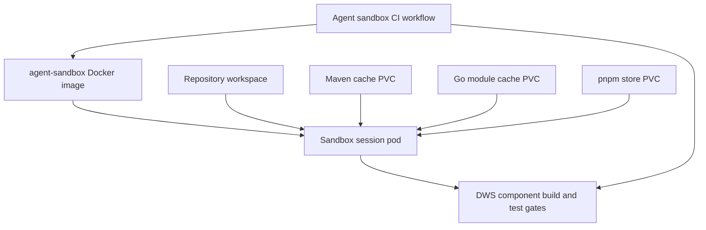
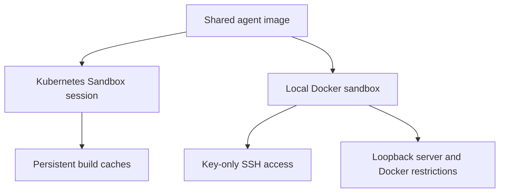

# Agent sandbox

`agent-sandbox/` provides a shared image and two OpenSandbox deployment options for long-lived Claude, Codex, or other agent development sessions: a Kubernetes `Sandbox` resource on an existing control plane, or a local Docker-backed OpenSandbox server. It is a contributor environment, not part of the DWS workflow runtime: the controller and orchestrator deployment lifecycle remains documented in [deployed workflow lifecycle](deployed-workflow.md). Unlike `scripts/start-kind-cluster.sh`, which supports ephemeral local `CLAUDE_CODE_REMOTE` test runs, the Kubernetes option expects persistent build caches; the Docker option creates local containers and does not create `Sandbox` CRDs.

## Image and cluster session template

The shared image is built from `agent-sandbox/Dockerfile`. It assembles the same toolchain families used by the independently built DWS components: JDK 25 for the controller and orchestrator, Go 1.26 for `dws-call-http` and `dws-run`, and Node 24 with pnpm 11.10.0 for `dws-call-openapi`. It also includes `git`, `gh`, `jq`, `make`, the C toolchain needed by Go race tests, and the Claude Code, Codex, OpenSpec, OpenWiki, and ClawTeam CLIs. A Dockerfile smoke test checks those tool versions during image build.

`agent-sandbox/sandbox.yaml` is intentionally a skeleton for a single session. It mounts the repository at `/workspace` and connects Maven, Go module, and pnpm-store cache volumes. `agent-sandbox/cache-pvcs.yaml` defines the corresponding PVC templates (5 GiB Maven, 5 GiB Go, and 2 GiB pnpm), but leaves the storage class as a cluster-specific placeholder.

This diagram shows the sandbox image, session mounts, and CI validation sharing the same component toolchains.

## Local Docker runtime and SSH access

`agent-sandbox/opensandbox/docker.toml` configures the OpenSandbox lifecycle server to create Docker containers through a local Docker Desktop or Docker Engine daemon. It is an alternative to the Kubernetes template, not a bridge to it: the server listens on `127.0.0.1:8080`, uses bridge networking, persists server state in SQLite, and accepts no host bind mounts by default. Its Docker policy drops selected dangerous Linux capabilities, prevents privilege escalation, and limits each container to 4096 processes.

Normal local use requires `OPENSANDBOX_SERVER_API_KEY`. `OPENSANDBOX_INSECURE_SERVER=YES` is only for a strictly local experiment without that key; a public bind address or public exposure is outside this profile's safe operating boundary.

The same image exposes port 22 and starts `sshd-start` by default. It generates fresh host keys for every container and starts SSH with password and keyboard-interactive authentication disabled; a caller must provide an authorized public key at `/root/.ssh/authorized_keys` and map port 22 through the Docker/OpenSandbox deployment. Keep that mapping on localhost or a protected VPN/mesh network: the repository does not supply a key-injection or port-mapping manifest, so those details remain runtime-specific.

This diagram shows the shared image serving separate cluster-hosted and local Docker session paths; SSH is available only from the Docker-backed path described here.

## CI validation and publishing

The [agent-sandbox CI workflow](../../.github/workflows/agent-sandbox.yml) runs on pull requests and pushes to `main` when sandbox files change, and can also be dispatched manually. It builds the image before running the repository's real component gates inside that image:

- `dws-controller` and `dws-orchestrator`: `./mvnw -B -ntp verify`
- `dws-call-http` and `dws-run`: `make vet && make test`
- `dws-call-openapi`: `pnpm install --frozen-lockfile && pnpm lint && pnpm test && pnpm build`

The workflow validates image builds for pull requests but publishes to `ghcr.io/<repository owner>/dws-agent-sandbox` only for `main` pushes. Thus it depends on the component verification conventions summarized in the [quickstart](../quickstart.md), while proving that the sandbox can execute them rather than merely exposing the executables.

## Cluster prerequisites and boundaries

Before applying the template, confirm the installed `sandboxes.agents.x-k8s.io` CRD version. The checked-in manifest currently uses `agents.x-k8s.io/v1beta1`, while the repository notes that agent-sandbox v0.4.x serves only `v1alpha1` and has no conversion webhook. Also resolve the image registry/tag, namespace and service-account RBAC, storage class, an available gVisor or Kata runtime class if required, and the way the empty workspace is populated (for example, a git-clone init container or a persistent repository volume).

The image deliberately does not include `kubectl`, the Dapr CLI, or in-session image-building tools. Add them only when a live-cluster workflow requires them. Source: `agent-sandbox/README.md`, `agent-sandbox/sandbox.yaml`, and `agent-sandbox/cache-pvcs.yaml`.

## Change and verification guide

- Change the assembled toolchain or SSH daemon in `agent-sandbox/Dockerfile` only when its supported runtime, package-manager version, or remote-development boundary changes; keep the smoke test aligned.
- Change cache paths only as a coordinated edit across the Dockerfile, `sandbox.yaml`, and `cache-pvcs.yaml`.
- Change the CI contract in `.github/workflows/agent-sandbox.yml` when a component's CI gate changes, then validate the workflow by building the image and running its affected gate in that image.
- Treat CRD version, storage class, runtime class, RBAC, registry, and workspace hydration as deployment-specific configuration; do not represent template TODOs as defaults.
- Change `opensandbox/docker.toml` or `sshd-start.sh` with a security review: preserve loopback/authentication requirements, capability restrictions, fresh host keys, and key-only SSH unless the exposure model is deliberately redesigned.
