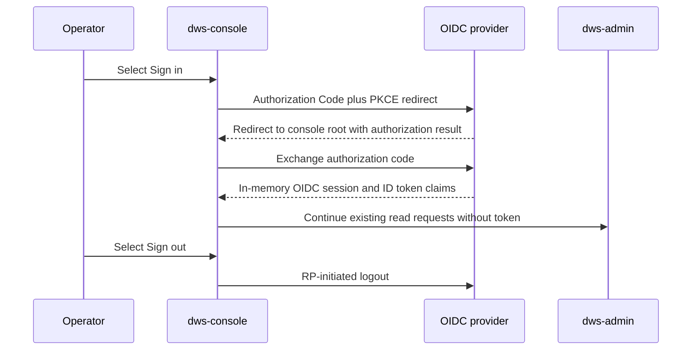

# Console OIDC login

`dws-console` provides an optional, browser-side identity experience: it authenticates operators through OIDC Authorization Code + PKCE, shows the signed-in identity in the shared top bar, and offers sign-out. Its catalog and instance reads remain unauthenticated, so an unavailable provider does not block the existing [administrative read model](../integrations/admin-read-model.md). The new-definition screen is the exception: it requires a signed-in operator and supplies the memory-only access token to the administrative relay, which forwards it to the controller's Dapr bearer middleware described in [Helm chart packaging](helm-chart-roadmap.md#controller-bearer-middleware).

## Browser client behavior

`src/lib/oidc.ts` initializes `oidc-spa` once at module scope using the TanStack Start Vite integration. The console is a public client: the access token remains inside the OIDC client in memory and must not be added to web storage or exposed through the console's `AuthState` abstraction. `src/lib/oidc-config.ts` reduces the provider state to four UI states:

- **initializing** — the top-bar control is hidden while OIDC starts;
- **unavailable** — discovery/configuration failed, so the control reports `Authentication unavailable` without disrupting reads;
- **signed out** — the operator can begin the authorization redirect; and
- **signed in** — the control displays the best available ID-token label and routes sign-out through the provider's RP-initiated logout endpoint.

`AppLayout` renders this control on every screen. The redirect URI is deliberately the console root rather than a `/callback` route: the client completes the exchange at the root and restores the route the operator started from. `oidc-spa` is installed as a Vite plugin so this browser-only integration remains compatible with TanStack Start SSR.

The browser session gates submission but not read navigation. On `/workflows/new`, a nonempty YAML or JSON draft becomes submittable only after sign-in; the console posts the source as `application/yaml` to `dws-admin`'s `POST /workflows?dryRun=false` relay with `Authorization: Bearer <access token>`. The editor does not parse or reformat the draft when its syntax-highlighting selector changes. It reports controller validation errors as a list, distinguishes an already-applied version from a newly applied one, and reports an expired session separately from relay reachability. This preserves the ownership boundary in the [auth roadmap](../../docs/roadmaps/dws-auth.md): the browser never calls the controller directly; the [administrative read model](../integrations/admin-read-model.md#controller-submission-relay) invokes it through its own Dapr sidecar.

## Configuration and deployment agreement

The console resolves these build-time `VITE_*` variables; defaults are in `dws-console/.env.example`:

| Variable | Default | Meaning |
|---|---|---|
| `VITE_OIDC_ISSUER_URI` | `http://dex.dws.local/dex` | Provider issuer and OIDC discovery base URL. |
| `VITE_OIDC_CLIENT_ID` | `dws-console` | Public client registration. |
| `VITE_OIDC_SCOPES` | `profile email` | Extra requested scopes; the client supplies `openid`. |

Vite embeds these values in the client bundle at build time. The issuer must be reachable from the browser and must match the provider's configured issuer; the default `dex.dws.local` host is a local/in-cluster placeholder, not a host that resolves automatically.

The optional Dex installation documented in [Helm chart packaging](helm-chart-roadmap.md#optional-dex-identity-provider) supplies a compatible public-client registration when `dex.enabled=true`. Its `dex.consoleRedirectURI` must be the exact console root URL—default `http://localhost:3000/` for `pnpm dev`—because the chart derives Dex's browser CORS allowlist from that URL's origin. Do not register a callback subpath for this client.

## Current limits and change guidance

The client code supports silent-renew and RP-initiated logout through its provider contract, but the chart-pinned Dex 2.44.0 did not meet that browser-session acceptance bar during live validation: hidden-iframe `prompt=none` renew reaches its interactive login form and discovery does not advertise `end_session_endpoint`. The generic client/login implementation is complete; provider replacement or upgrade and the associated live acceptance checks are intentionally deferred to Phase 8 in `docs/roadmaps/dws-auth.md`. Do not claim that enabling the current bundled Dex proves silent renewal or provider logout.

For changes in this area:

- Keep tokens in the OIDC library's memory-only state; do not add browser persistence or expose token fields from `useAuth`.
- Preserve additive failure behavior: an unreachable/misconfigured provider must not prevent console read pages from rendering.
- Keep the root redirect agreement synchronized across `dws-console/src/lib/oidc.ts`, `dws-console/.env.example`, and `charts/dws/values.yaml`; use a real deployed console origin outside local development.
- The definition editor must send the bearer token only to its `dws-admin` gateway path, never directly to the controller. It must not claim direct pod-IP access to controller port `8080` is protected: that residual network path remains deferred in the [chart middleware guidance](helm-chart-roadmap.md#controller-bearer-middleware).
- In `dws-console/`, run `npm run lint`, `npm run typecheck`, `npm test`, and `npm run build`. The console CI also checks generated routes and smoke-tests the built container's health and SSR workflow route (`.github/workflows/dws-console.yml`).
