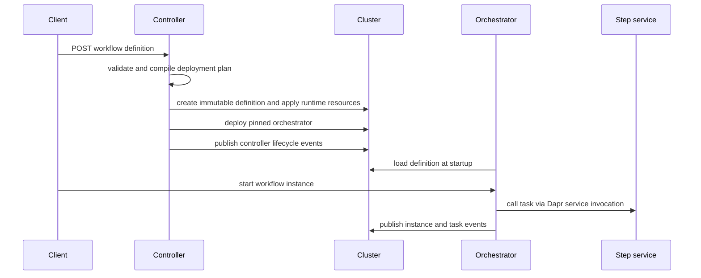

# Deployed workflow lifecycle

The controller owns deployment while the orchestrator owns runtime interpretation. A `POST /workflows` accepts DSL 1.0 YAML or JSON, compiles it without Kubernetes mutation, then applies the resulting stack unless `dryRun=true`. First deployment returns `201`; reposting identical definition content resolves to the same version and returns `200`. Source: `dws-controller/src/main/java/io/dws/controller/api/WorkflowResource.java` and `compile/WorkflowCompiler.java`.

This sequence shows the ownership boundary: controller apply, runtime interpretation, and advisory telemetry. The event data and delivery boundaries are documented in [lifecycle events](../integrations/lifecycle-events.md).

## Compile and apply model

A compiled plan contains the workflow definition, step services, an orchestrator specification, and topic bindings. The controller materializes:

1. an immutable, versioned definition ConfigMap;
2. a workflow-scoped Dapr Configuration component;
3. scale-to-zero Knative Services for deployable I/O tasks; and
4. an orchestrator Deployment configured with the immutable definition key.

`StackApplier` creates the ConfigMap only if it is absent, applies the remaining resources, then drains superseded orchestrator versions and collects them only after their Deployment explicitly reports zero replicas (`dws-controller/src/main/java/io/dws/controller/k8s/StackApplier.java`). The cluster, selected through `dws.io/*` labels, is the source of truth; there is no controller database.

Version identity is `<workflow>@v<sha256-8>` of the canonicalized definition. This makes repeat submission idempotent while preserving the submitted definition text in immutable storage. Knative Service names remain stable—not version-suffixed—because the orchestrator routes by their Dapr app ID; services no longer present in a new version retain their old labels and can be garbage-collected. These rules are defined in `dws-controller/CLAUDE.md` and are surfaced by controller deployment events in [lifecycle events](../integrations/lifecycle-events.md#controller-events).

## Interpreter conventions

Each orchestrator pod loads one definition once at startup from the Dapr Configuration API, using a required immutable `DEFINITION_KEY`; it does not subscribe to definition updates. `InterpreterWorkflow` walks the definition task list with a program counter and supports `call`, `switch`, `set`, `wait`, `listen`, and `emit`. `for` and `try` are recognized but currently rejected as unsupported. See `dws-orchestrator/src/main/java/io/dws/orchestrator/workflow/InterpreterWorkflow.java`.

Task names are the common deployment/runtime adapter:

- `call` task `checkInventory` invokes Dapr app ID `check-inventory` at `POST /run`.
- `emit` task `orderPlaced` publishes current workflow data to topic `order-placed`.
- `listen` task `approval` waits for external event `approval`.

The schema-required `with.endpoint` on a call task is not used for routing. Changing task naming therefore affects both controller-created Knative service names and orchestrator invocation targets.

## Change and verification guide

- Change resource shape or versioning in `dws-controller/src/main/java/io/dws/controller/compile/` or `k8s/`; run `cd dws-controller && ./mvnw test`, and use `./mvnw verify` for package/integration coverage. The cdk8s imports are generated during the build and require Node.js on `PATH`.
- Change task semantics in `dws-orchestrator/src/main/java/io/dws/orchestrator/workflow/`; run `cd dws-orchestrator && ./mvnw verify`.
- When changing apply or execution boundaries, update [lifecycle events](../integrations/lifecycle-events.md) if emitted types, payload fields, or best-effort semantics change; their contract is maintained in `docs/events.md`.
