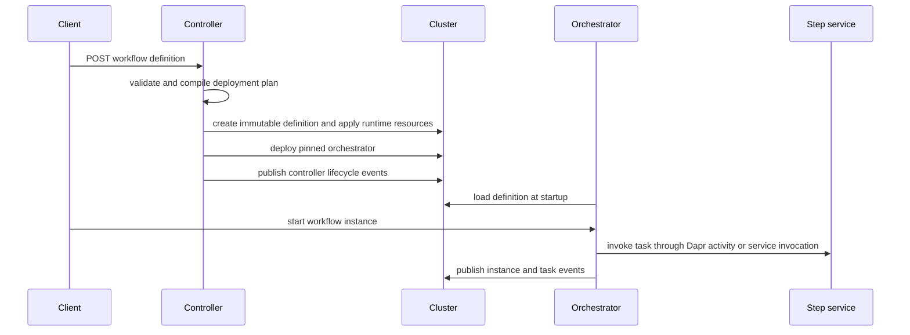

# Deployed workflow lifecycle

The controller owns deployment while the orchestrator owns runtime interpretation. A `POST /workflows` accepts DSL 1.0 YAML or JSON, compiles it without Kubernetes mutation, then applies the resulting stack unless `dryRun=true`. First deployment returns `201`; reposting identical definition content resolves to the same version and returns `200`. Source: `dws-controller/src/main/java/io/dws/controller/api/WorkflowResource.java` and `compile/WorkflowCompiler.java`.

This sequence shows the ownership boundary: controller apply, runtime interpretation, and advisory telemetry. The event data and delivery boundaries are documented in [lifecycle events](../integrations/lifecycle-events.md).

## Compile and apply model

A compiled plan contains the workflow definition, step services, an orchestrator specification, and topic bindings. The controller materializes:

1. an immutable, versioned definition ConfigMap;
2. a workflow-scoped Dapr Configuration component;
3. scale-to-zero Knative Services for deployable I/O tasks; and
4. an orchestrator Deployment configured with the immutable definition key.

`StackApplier` creates the ConfigMap only if it is absent, applies the remaining resources, then drains superseded orchestrator versions and collects them only after their Deployment explicitly reports zero replicas (`dws-controller/src/main/java/io/dws/controller/k8s/StackApplier.java`). The cluster, selected through `dws.io/*` labels, is the source of truth; there is no controller database.

Version identity is `<workflow>@v<sha256-8>` of the canonicalized definition. This makes repeat submission idempotent while preserving the submitted definition text in immutable storage. Knative Service names remain stable—not version-suffixed—because the orchestrator routes by their Dapr app ID; services no longer present in a new version retain their old labels and can be garbage-collected. Task names must now be unique across the entire definition, including `try` and `catch.do` scopes: duplicate `call` or `run` names would collide on that app ID and Knative Service. These rules are defined in `dws-controller/CLAUDE.md` and are surfaced by controller deployment events in [lifecycle events](../integrations/lifecycle-events.md#controller-events).

## Interpreter conventions

Each orchestrator pod loads one definition once at startup from the Dapr Configuration API, using a required immutable `DEFINITION_KEY`; it does not subscribe to definition updates. `InterpreterWorkflow` runs each task list as a scope with its own program counter, so flow targets resolve only within that scope. It supports `call`, `run`, `switch`, `set`, `wait`, `listen`, `emit`, `for`, `try`, and `raise`. Every supported task dispatches through a durable mechanism: `call: http`, `run: shell`, and `run: script` schedule the remote Dapr Workflow activity named `Run` against the task's step-runner app ID; `call: openapi` retains the local activity that uses Dapr service invocation; `switch`, `set`, and `for.in`/`for.while` evaluation use local replay-safe activities; `wait` and `listen` use workflow timer/event primitives; and `emit` invokes its pub/sub activity. `fork` and general nested `do` are not implemented. See `dws-orchestrator/src/main/java/io/dws/orchestrator/workflow/InterpreterWorkflow.java` and [OWS DSL feature roadmap](roadmap.md).

Task names are the common deployment/runtime adapter:

- `call: http` task `checkInventory` schedules activity `Run` against Dapr app ID `check-inventory`, passing the current workflow JSON unchanged; an empty activity result preserves that document.
- `call: openapi` task `getCatalog` invokes Dapr app ID `get-catalog` at `POST /run`; that is the remaining service-invocation path because its Node step image is not a multi-app activity worker.
- `emit` task `orderPlaced` publishes current workflow data to topic `order-placed`.
- `listen` task `approval` waits for external event `approval`.

The schema-required `with.endpoint` on a call task is not used for routing. Changing task naming therefore affects both controller-created Knative service names and orchestrator invocation targets: remote activity dispatch and the retained OpenAPI HTTP path both derive the Dapr app ID from the kebab-cased task name. The controller recursively compiles deployable `call`/`run` tasks, and `emit`/`listen` bindings, in a `try` body and `catch.do`; nested tasks therefore receive the same resources as top-level tasks.

### For iteration

A `for` task evaluates `for.in` once through a replay-safe activity and requires its result to be a JSON array; a non-array result fails the named task. It runs `for.do` sequentially for each array element, passing each body's output data to the next iteration. `for.each` and `for.at` bind the current element and zero-based index as scope-local jq variables (defaulting to `item` and `index`), so they are visible in that iteration's body and optional `while` expression but do not escape the loop. `while` is re-evaluated before each body and stops iteration when jq evaluates it as falsy. An empty array leaves input data unchanged; `exit` finishes only the current body iteration, while `end` ends the instance. Tasks inside `for.do` are resolved from the pinned definition and report lifecycle events normally; a failure can therefore be handled by an enclosing `try` as described below. `for` itself creates no additional controller resource. This implemented control-flow capability is tracked in the [OWS DSL feature roadmap](roadmap.md).

### Try, catch, and retry

A `try` task runs its `try` list as a nested scope. On an inner-task failure, a `catch` may filter the synthesized five-field error object (`type`, `status`, `instance`, `title`, `detail`) with static fields, `when`, and `exceptWhen`; the object is available to `catch.do` expressions under `catch.as` or the default `error` name. The binding is scope-local, rather than added to workflow data or `$context`.

A matching `catch` may reference a named `use.retries` policy or declare one inline. The interpreter uses a durable timer for retry delay and re-runs the whole `try` list from the try task's original transformed input. Constant, linear, and exponential backoff, jitter, attempt-count limits, and total-duration limits are supported. `retry.limit.attempt.duration` is rejected because per-attempt cancellation/timeouts are not implemented. An unhandled error, or an error in `catch.do`, propagates normally; a handled recovery completes the enclosing `try` task and then applies that task's own data-flow/output and `then` behavior.

`exit` ends only the current task scope, while `end` terminates the whole instance even from a nested scope. Lifecycle events continue to report the `try` task and each inner task; a handled failure reports the `try` task as completed. This implementation is the completed `try`/`catch`/`retry` slice described in the [OWS DSL feature roadmap](roadmap.md).

## Change and verification guide

- Change resource shape or versioning in `dws-controller/src/main/java/io/dws/controller/compile/` or `k8s/`; run `cd dws-controller && ./mvnw test`, and use `./mvnw verify` for package/integration coverage. The cdk8s imports are generated during the build and require Node.js on `PATH`.
- Change task semantics in `dws-orchestrator/src/main/java/io/dws/orchestrator/workflow/`; run `cd dws-orchestrator && ./mvnw verify`.
- When changing apply or execution boundaries, update [lifecycle events](../integrations/lifecycle-events.md) if emitted types, payload fields, or best-effort semantics change; their contract is maintained in `docs/events.md`.
