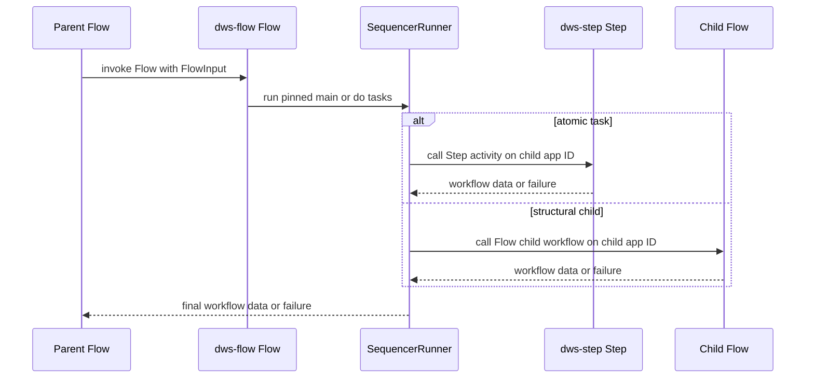

# DWS Flow workflow host

`dws-flow` is the generic .NET Dapr Workflow host for exactly one immutable `kind: "flow"` single-node definition. At startup, it loads `DWS_FLOW_DEFINITION_PATH` and registers the constant workflow name `Flow`; the pinned definition selects the node represented by that instance. This is the structural-node counterpart to the [DWS Step activity host](../integrations/step-activity-host.md), which owns atomic task execution through its constant `Step` activity.

The Flow core currently executes `main` and `do` scopes. It intentionally rejects `for`, `try-catch`, and `fork` scope definitions with `config failure: scope '<scope>' is not implemented yet`; it must not be presented as full support for those structural task types. The current core also has no runtime directive channel for a `switch` task to select a target from its output: only the static `then` value in the definition controls sequencing. The [OWS DSL feature roadmap](roadmap.md) tracks the deployed v1 interpreter's feature coverage and should not be read as completion status for this early Flow runtime core.

## Startup and node contract

`SingleNodeDefinitionLoader` requires a JSON object with non-empty `workflow`, `version`, and DNS-1123 `nodeId` values, `kind: "flow"`, a valid scope, an array of non-empty single-key task objects, and a `children` object whose values are non-empty app IDs. An optional `catch` field must also be a non-empty app ID. Invalid or missing configuration ends the process before the web host starts.

`Program.cs` initializes the process-wide validated definition, registers `FlowWorkflow` under `Flow`, and exposes `GET /healthz`. Dapr's workflow registration requires a parameterless workflow type, so `FlowWorkflow` obtains the already-validated definition from `FlowDefinitionHolder`; other runtime collaborators use normal arguments.

## Sequencing and child dispatch



This flow is implemented by `FlowWorkflow`, `SequencerRunner`, `ChildClassifier`, and `DaprChildCaller`. The host passes the same `FlowInput` shape to every child: `data`, scope-local `variables`, root `workflowInstanceId`, and `iterationIndex`. That envelope deliberately mirrors the [Step host's activity input](../integrations/step-activity-host.md#activity-execution), and the sequencer does not apply `input.from` or `output.as` transformations itself.

For a `main` or `do` node, `SequencerRunner` runs task objects in source order, threads each child result into the next child, and resolves the task body's static `then` directive: omitted or `continue` advances, a declared task name jumps inside the same scope, and `end` or `exit` returns the current data. Falling past the final task also completes normally. It fails unknown targets and limits execution to 10,000 steps to detect definition loops.

`ChildClassifier` selects a Step child for `call`, `run`, `set`, and `switch` shapes. `for`, `try`, `fork`, `wait`, and `listen` shapes are classified as Flow children, using the deterministic child instance ID `<root instance>:<child app ID>:<iteration>`; absent iteration defaults to `0`. This classification describes dispatch capability, not completed support for every Flow scope: the child itself will fail fast if it is one of the currently unimplemented scopes.

A task-level ISO-8601 `timeout` races the child call against a durable Dapr timer. If the timer wins, the host reports `task '<name>' timed out after <duration>`. Dapr child-task failures are unwrapped and propagated using their original error message, preserving the failure boundary for the caller.

## Build and change guide

Run the named test project; a bare `dotnet test` in `dws-flow/` only sees the application project and succeeds without running tests:

```bash
cd dws-flow
dotnet test test/dws-flow.Tests.csproj
```

CI in `.github/workflows/dws-flow.yml` runs that test command, then builds the image and smoke-tests `/healthz`. For local Dapr execution, use the `DWS_FLOW_DEFINITION_PATH` example in `dws-flow/README.md`; it requires the standard local workflow state store installed by `dapr init`.

When changing the component, start with:

- `SingleNodeDefinitionLoader.cs` for the immutable-node schema and startup failures;
- `FlowWorkflow.cs` and `ScopeDispatch.cs` for Flow-scope ownership;
- `SequencerRunner.cs`, `ThenResolver.cs`, and `ChildClassifier.cs` for order, branches, and Step-versus-Flow dispatch;
- `DaprChildCaller.cs`, `InstanceIds.cs`, and `TaskTimeout.cs` for the durable Dapr boundary;
- `test/` for replay, sequencing, loader, `then`, and timeout coverage.

Keep the `Flow` workflow name, the input-envelope field names, deterministic child IDs, and failure wording aligned with their [Step-host counterpart](../integrations/step-activity-host.md). Do not add nondeterministic I/O, time, or randomness to workflow code outside Dapr workflow calls: replay safety is a runtime requirement.
