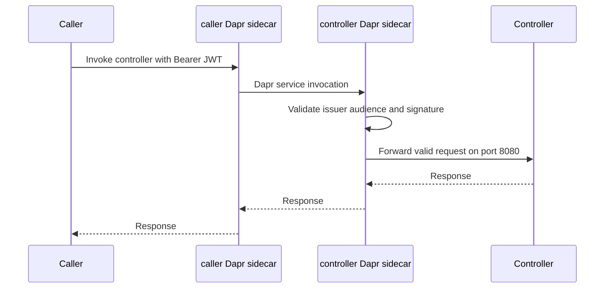

# Helm chart packaging

`charts/dws` is the DWS application chart. It packages the persistent control-plane services—the `dws-controller` API and the `dws-admin` [administrative read model](../integrations/admin-read-model.md)—plus optional `dws-console` and `admin-gateway` workloads and conditional infrastructure dependencies, rather than the per-workflow runtime. The controller continues to create the pinned orchestrator and step services for each submitted definition; that lifecycle is described in [deployed workflow lifecycle](deployed-workflow.md).

The chart defaults to one controller replica, one admin replica, an in-chart standalone PostgreSQL instance, Dapr and its Redis backing services. It installs into the Helm release namespace unless `namespaceOverride` is set. Dex is available as a disabled-by-default optional in-chart identity provider. When the separate `auth.enabled` setting is enabled, the chart can derive the controller and admin sidecars' JWT-validation settings from Dex; otherwise Dex only supports the optional browser login described in [console OIDC login](console-auth.md). The current chart metadata and values live in `charts/dws/Chart.yaml` and `charts/dws/values.yaml`.

## Installed components

| Values area | Default | What it controls |
|---|---:|---|
| `controller.enabled` | `true` | Controller Deployment, HTTP Service, ServiceAccount, Role, and RoleBinding. Its `DWS_IMAGES_*` environment variables select the images stamped into per-workflow resources. |
| `admin.enabled` | `true` | Admin Deployment and HTTP Service. The pod is Dapr sidecar-enabled and runs migrations on boot. |
| `postgresql.enabled` | `true` | Conditional Bitnami PostgreSQL chart dependency, configured as a single-node development/evaluation database for admin. |
| `dapr.enabled` | `true` | Conditional Dapr control plane and its Redis-backed components. Disable only when a Dapr installation already exists in the cluster; the chart preflight validates that prerequisite. |
| `dex.enabled` | `false` | Conditional upstream Dex dependency. It registers `dws-console` as a public PKCE client and seeds one bootstrap administrator. With `auth.enabled=true` and `auth.dex.enabled=true`, it also provides the controller middleware's issuer, audience, and JWKS URL. |
| `auth.enabled` | `false` | Opt-in Dapr bearer middleware for inbound controller traffic. Requires either external `auth.issuer` and `auth.audience` (with optional `auth.jwksURL`) or the enabled in-chart Dex mode. |
| `console.enabled` | `false` | Optional console Deployment, Service, and console-only Ingress. Its browser login is described in [console OIDC login](console-auth.md). |
| `adminGateway.enabled` | `false` | Optional nginx reverse proxy for browser-to-admin write-relay traffic. It requires a non-empty `adminGateway.corsOrigins` list of explicit origins and rejects `*`. |
| `observability.enabled` | `false` | Opt-in OpenTelemetry agent and Dapr-sidecar tracing for the chart-managed controller and admin. It requires the cluster's OpenTelemetry Operator unless the operator preflight is explicitly disabled. |
| `imagePullSecrets` | `[]` | Pull credentials attached to component pods that use private registries. |

### Deployment defaults and overrides

`defaults.resources`, `defaults.nodeSelector`, `defaults.tolerations`, and `defaults.affinity` establish a chart-wide baseline for the chart-owned controller, admin, admin gateway, and console Deployments. Each component has matching `resources`, `nodeSelector`, `tolerations`, and `affinity` fields. Resources, node selectors, and affinity are deep-merged, so an override can change one nested value without restating the baseline; a non-empty component tolerations list replaces the defaults list. PostgreSQL is an upstream StatefulSet rather than a chart-owned Deployment, so configure the corresponding scheduling and resource settings under `postgresql.primary` instead. `imagePullSecrets` remains chart-wide.

The controller Role permits only the resources it reconciles: definition ConfigMaps, orchestrator Deployments, Knative Services, and Dapr components. Knative Serving and Dapr CRDs/control planes are therefore cluster prerequisites for actual workflow deployment; they are **not** installed by this chart. A server-side Helm dry run can validate the controller's core/RBAC/app manifests without those CRDs, but a running controller requires them when it applies workflow stacks.

## Database choices

With `postgresql.enabled=true`, the admin Deployment receives its `DATABASE_URL` from the chart-managed Postgres secret. Set `postgresql.enabled=false` for an external or managed database, then provide either `admin.database.url` (which renders an admin-owned Secret) or `admin.database.existingSecret` and, optionally, `admin.database.existingSecretKey`. Do not place real connection strings in committed values files.

The bundled database is explicitly configured for dev/eval use: a standalone instance with a 1 GiB persistent volume and no NetworkPolicy. Treat production sizing, credentials, backup, and network policy as operator-owned configuration.

## Optional Dex identity provider

Set `dex.enabled=true` to install the chart's upstream Dex dependency. `dex.issuer` must be an issuer URL reachable by the browser console and eventual token validators. `dex.consoleRedirectURI` configures the public PKCE client's **root** redirect URI (default `http://localhost:3000/` for `pnpm dev`); the chart derives Dex's browser CORS allowlist from its origin. This deployed-provider agreement is implemented by [console OIDC login](console-auth.md). The defaults are suitable only for in-cluster/local testing. Dex uses in-memory storage and a static password database, so this is a bootstrap/development-oriented identity-provider configuration, not a production identity lifecycle.

On a first live install, the chart generates a 20-character bootstrap-admin password, stores the administrator email and plaintext password in a chart-managed Kubernetes Secret, and puts only its bcrypt hash in Dex's rendered configuration Secret. A Helm upgrade reuses the stored password. Instead, operators can set `dex.adminUser.existingSecret` and `dex.adminUser.existingSecretKey` to source the password from an existing Secret; neither path puts a password in `values.yaml`. When Dex is enabled, Helm `NOTES.txt` prints commands to retrieve the bootstrap login. Treat the password and rendered Secrets as sensitive operational data.

Dex supplies the optional console's browser login and can supply the issuer configuration for the controller's opt-in [Dapr bearer middleware](#controller-bearer-middleware). It does **not** by itself protect reads or create a browser write path: the console still does not attach a bearer token, admin reads remain unauthenticated, and the admin write relay/gateway and console submission phases have not landed. The dependency sequence is recorded in `docs/roadmaps/dws-auth.md`.

## Controller bearer middleware

With `auth.enabled=true`, the chart adds separate `middleware.http.bearer` Dapr Components scoped to the controller and admin app IDs, using the resolved issuer, audience, and optional JWKS URL. The two configurations are intentionally asymmetric. The controller's handler stays in `spec.appHttpPipeline`: `dws-admin` reaches it through Dapr service invocation over internal gRPC, which does not traverse `httpPipeline`. The controller Deployment always declares `dapr.io/app-port: "8080"`; it receives the configuration annotation only when auth is enabled. The Service then targets the sidecar HTTP port (`3500`) rather than the controller container port, so callers must use Dapr service invocation and carry a JWT whose issuer and audience match the middleware configuration.

The admin handler instead uses `spec.httpPipeline`, which gates the sidecar HTTP API used by the Gateway's `/dws-admin` route while leaving Dapr's internal `GET /dapr/subscribe` discovery and pub/sub delivery to the [administrative read model](../integrations/admin-read-model.md) ungated. This placement restores its [lifecycle-event](../integrations/lifecycle-events.md) projection when authentication is enabled; it is not interchangeable with the controller configuration. The admin Deployment's auth-enabled sidecar is configured to listen beyond loopback because its Service fronts port `3500`; in Gateway mode that Service exposes only the sidecar, keeping the Nest port out of the browser-facing route.

This flow shows the enabled controller Service path; an invalid or missing JWT is rejected by the controller sidecar before it reaches the application.

Two value modes are supported: set `auth.issuer` and `auth.audience` for an external OIDC provider, optionally supplying `auth.jwksURL`; or set `dex.enabled=true`, `auth.enabled=true`, and `auth.dex.enabled=true` to derive all three values from the chart's Dex configuration. Helm rendering fails rather than deploy a middleware with no resolved issuer or audience. `auth.enabled=false` is the default and preserves the prior Service-to-controller-port topology.

The Service bypass is closed in the enabled path, but this is not complete pod-network isolation. Phase 2 verification found that another pod can still reach `<controller-pod-ip>:8080` on CNIs that do not enforce NetworkPolicy. A CNI-aware NetworkPolicy or binding the Quarkus application to loopback is deferred work; do not treat the current chart setting as protection against that direct pod-IP path. Role or Rego middleware is also deliberately deferred pending a proven token-claim contract.

## Control-plane observability

`observability.enabled=false` preserves the pre-observability chart render. When enabled, Phase 1 instruments only the chart-managed control plane: the OpenTelemetry Operator injects Java instrumentation into the `controller` container and Node.js instrumentation into the `admin` container; it does not target their Dapr sidecars. The chart also adds Dapr OTLP tracing to both pods. Per-workflow orchestrators, runtime-v2 flow/step deployments, and Knative step services are deliberately outside this chart phase; they remain part of the [deployed workflow lifecycle](deployed-workflow.md) and require controller-side stamping in later work.

The chart renders one namespaced `Instrumentation` resource (`<release>-instrumentation`) and uses its name in targeted `instrumentation.opentelemetry.io/inject-java` or `inject-nodejs` pod annotations. The OpenTelemetry Operator is an external prerequisite—not a chart dependency—because its installation also requires cluster-singleton cert-manager. With the default `observability.operator.required=true`, Helm fails when the `opentelemetry.io/v1alpha1` API is unavailable. Operators that intentionally install the Operator after this release can disable that preflight, but must ensure admission occurs before replacement pods are created.

`observability.otlp.endpoint` is a scheme-qualified base endpoint without a signal path (for example, `https://collector.example:4318`); the agents need the scheme and append signal paths themselves. The chart maps `http/protobuf` or `grpc` to Dapr's corresponding protocol, strips the scheme only for Dapr's required bare `endpointAddress`, and derives Dapr TLS from the original scheme. Invalid protocol, empty endpoint, missing scheme, and a path-bearing endpoint fail rendering rather than silently export nowhere.

If the OTLP receiver needs headers, set `observability.otlp.headers` and the chart creates an Opaque Secret with one `headers` key containing the deterministic comma-separated `key=value` list required by `OTEL_EXPORTER_OTLP_HEADERS`. Or set `observability.otlp.existingSecret`; it wins over inline headers and must expose that same key. Header credentials are not inlined into the `Instrumentation` resource. This Secret contract applies to application-agent export only: the chart does not translate it into Dapr's structured header configuration, so authenticated Dapr export should use an in-cluster collector that handles upstream authentication.

The agent is the sole sampling root: `observability.traces.samplingRate` configures its `parentbased_traceidratio` sampler, while the Dapr Configuration is deliberately pinned to `samplingRate: "1"`. This avoids independent probabilistic decisions producing partial traces. Observability and authentication share each component's one allowed `dapr.io/config` reference, so the chart combines tracing with the existing controller `appHttpPipeline` or admin `httpPipeline`; it must not create a second tracing Configuration or normalize those intentionally different pipelines. In particular, the admin pipeline must continue to permit the Dapr subscription path that feeds the [administrative read model](../integrations/admin-read-model.md) from [lifecycle events](../integrations/lifecycle-events.md).

The console does not yet exercise this route. The planned `dws-admin` relay is the first intended caller; it will forward the browser authorization header through its own sidecar. Until that phase exists, enabling controller auth changes the contract only for operators or in-cluster callers that invoke the controller directly.

For changes, keep each workload's Deployment `dapr.io/config` annotation, auth Component, and Configuration handler names synchronized. Do not normalize the controller and admin pipelines to match: `charts/dws/tests/auth-pipeline-placement-test.sh` pins controller `appHttpPipeline` and admin `httpPipeline`. Validate disabled and external/Dex-enabled render modes with `helm lint charts/dws` and `helm template`; the chart's Helm test includes an unauthenticated Dapr invocation that must receive `401`.

## Verification and release

`.github/workflows/helm.yml` runs on changes to `charts/**` or the workflow itself. Its verification job runs `helm lint`, schema and feature render checks (including `tests/observability-render-test.sh`), renders default and overridden values, confirms controller resources disappear when `controller.enabled=false`, and performs `helm install --dry-run=server` against Kind. The observability render test pins the disabled-state no-op, the auth/observability configuration matrix, targeted injection annotations, OTLP endpoint mapping, and header-Secret contract. The dry run does not start pods, so it cannot prove admin-to-Postgres connectivity or actual agent/collector delivery.

A dependent integration job installs Dapr into Kind, installs admin plus Postgres with the controller disabled, waits for both workloads, and runs `helm test`. It supplies a registry pull secret because the admin image is private in the CI environment. On pushes to `main`, the release job packages the chart and pushes it to `oci://ghcr.io/<repository-owner>/charts`; pull requests verify but do not publish.

For a local chart change, start with `helm lint charts/dws` and `helm template dws charts/dws`. When changing deployment templates, keep the controller image and `controller.images` values aligned with the runtime image contract in [deployed workflow lifecycle](deployed-workflow.md), then run the Helm workflow-equivalent checks where available.
