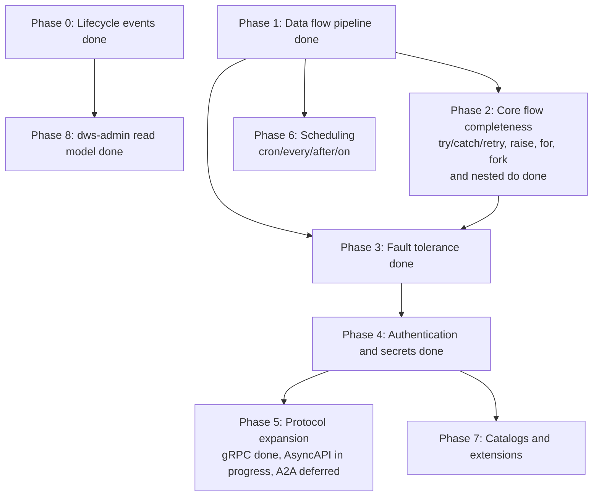

# OWS DSL feature roadmap

The canonical source for this roadmap is `docs/roadmaps/openworkflow-features.md`; this page summarizes it for OpenWiki navigation. Update that roadmap first, then this page.

DWS interprets a subset of the [Open Workflow Spec DSL 1.0](https://github.com/open-workflow-specification/specification/blob/main/dsl.md) today. This page tracks what's implemented in [`dws-orchestrator`](../architecture/deployed-workflow.md) and `dws-controller`, and the phased order for closing the gap.

## Current task-type coverage

Two readiness axes matter here. Control-flow tasks run in-process in the orchestrator (no deployable image needed); I/O tasks compile to a StepService backed by a prebuilt image.

| Task | Status | Notes |
|---|---|---|
| `call` (http) | Done | StepService via `dws-call-http` |
| `call` (openapi) | Done | StepService via `dws-call-openapi` |
| `call` (grpc) | Done | StepService via `dws-call-grpc`; unary calls use its remote Dapr Workflow activity |
| `call` (asyncapi) | In progress | StepService via `dws-call-asyncapi`, which dispatches AsyncAPI 3.0 `send` operations through a Dapr output binding |
| `call` (a2a) | Not started | Deferred until after AsyncAPI |
| `run` (shell / inline JS / inline Python) | Done | StepService backed by the matching `dws-run` image; `run: container`, `run: workflow`, and external script sources remain unsupported |
| `switch` | Done | local replay-safe jq evaluation activity; no image needed |
| `set` | Done | local replay-safe jq evaluation activity; no image needed |
| `wait` | Done | Dapr timer, no image needed |
| `listen` | Done | single external event only, no correlation (`one`/`any`/`all`); no image needed |
| `emit` | Done | pub/sub, no image needed |
| `for` | Done | Sequential array iteration over `for.do`; scope-local `each`/`at` jq bindings, optional per-iteration `while`, and data threading; it deploys no resource itself |
| `try` | Done | scoped `try`/`catch.do`, static/dynamic catch filtering, recovery, and durable retry |
| `fork` | Done | child workflow per branch; joins return declared-order outputs and competing branches return the first settled result |
| `raise` | Done | evaluates and throws a workflow error through normal task failure and enclosing `try` handling |
| nested `do` | Done | scope-aware execution covers `try`/`catch.do`, `for.do`, and fork branches |

Source: `dws-orchestrator/src/main/java/io/dws/orchestrator/workflow/InterpreterWorkflow.java`, `dws-controller/src/main/java/io/dws/controller/compile/WorkflowCompiler.java`, `dws-controller/src/main/java/io/dws/controller/model/TaskKind.java`.

## Cross-cutting spec features

| Feature | Status |
|---|---|
| Data flow (`input.from/schema`, `output.as/schema`, `export.as/schema`) | Done — input/output/export transformations and schema validation are implemented in the orchestrator |
| Catch error object | Done (Phase 2 slice) — `try` filters and recovery expressions receive `{type, status, instance, title, detail}` |
| Standard error types | Done — `validation`, `communication`, `authorization`, `expression`, and `timeout` use the `https://serverlessworkflow.io/spec/1.0.0/errors/` URI catalogue; `runtime` remains a 500 catch-all, while authorization/expression are not yet produced automatically |
| Timeouts (workflow/task/retry attempt) | Done — inline or named task and workflow deadlines use durable timers; retry `limit.attempt.duration` is a catchable timeout failure |
| Errors as Problem Details (RFC 7807) | Done — Phase 3 is complete |
| Authentication (basic/bearer/oauth2 client credentials) | Done — HTTP and OpenAPI endpoints accept inline or named policies; Basic/Bearer are applied by runners and OAuth calls use Dapr external endpoint middleware. See [deployed workflow lifecycle](deployed-workflow.md#protected-calls-and-secret-projection). |
| Secrets | Done — `use.secrets` declares scalar Kubernetes Secret names, which are projected as `secretKeyRef` values without controller reads; `$secrets` is a DWS extension for `set` and `switch` and can leak material into workflow data. |
| Catalogs / custom functions | Not started |
| Extensions (`before`/`after` hooks) | Not started |
| External resources | Not started |
| Scheduling (`every`/`cron`/`after`/`on`) | Not started — controller deploys on `POST` only |
| [Lifecycle events](../integrations/lifecycle-events.md) (CloudEvents) | In flight — `openspec/changes/event-publishing` |

## Phase dependency graph

Data flow (Phase 1) is the foundation: retry/catch, extensions, and error handling all read/write through `input`/`output`/`context`, so it must land before Phases 2–7 are worth building correctly.

## Phased roadmap

| Phase | Scope | Components | Status |
|---|---|---|---|
| 0 | Lifecycle CloudEvents publishing | controller, orchestrator | Done |
| 1 | `input.from/schema`, `output.as/schema`, `export.as/schema`, validation faults | orchestrator | Done |
| 2 | `try`/`catch`/`retry`, `raise`, `for`, `fork` (parallel), and generalized nested `do` | orchestrator, controller | Done |
| 3 | RFC 7807 error model, standard error types, and task/workflow timeouts | orchestrator | Done |
| 4 | `basic`/`bearer`/OAuth2 client-credentials auth and scalar secret resolution | controller, orchestrator, call-http, call-openapi | Done; live OAuth path-isolation validation remains environment-blocked |
| 5 | gRPC, AsyncAPI, A2A call protocols | `dws-call-grpc`, `dws-call-asyncapi`, future `dws-call-a2a` | gRPC done; AsyncAPI in progress; A2A deferred |
| 6 | `schedule.every/cron/after/on` triggers | controller (Dapr Jobs API / cron binding) | Not started |
| 7 | Catalogs, custom functions, extensions (`before`/`after`), external resources | controller, orchestrator | Not started |
| 8 | `dws-admin` consumes lifecycle events into read model | dws-admin | Done |

Per [`CLAUDE.md`'s workflow routing](../../CLAUDE.md), each phase is a new capability and goes through `opsx`, not a direct PR.

## Rationale for ordering

- **1 before 2/3**: retry/catch and error handling are meaningless without a real input/output/context pipeline to operate on.
- **2 before 3**: `try`/`raise` define the fault surface that the implemented error catalogue and timeouts use; RFC 7807 response formatting is completed in Phase 3.
- **4 before 5/7**: new protocols and catalogs both need auth to call real external services.
- **6 is independent**: scheduling only touches the controller's trigger path, not the interpreter — can be pulled forward if needed.
- **8 is last**: the read model is a pure consumer of Phase 0's event contract; no orchestrator/controller changes are required once events exist.
