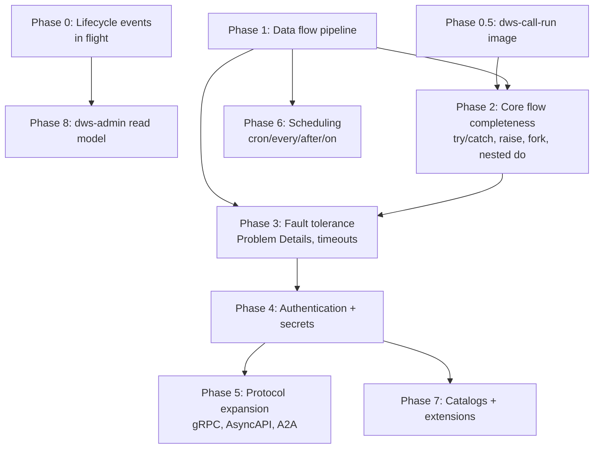

# OWS DSL feature roadmap

The canonical source for this roadmap is `docs/roadmap.md`; this page summarizes it for OpenWiki navigation. Update `docs/roadmap.md` first, then this page.

DWS interprets a subset of the [Open Workflow Spec DSL 1.0](https://github.com/open-workflow-specification/specification/blob/main/dsl.md) today. This page tracks what's implemented in [`dws-orchestrator`](../architecture/deployed-workflow.md) and `dws-controller`, and the phased order for closing the gap.

## Current task-type coverage

Two readiness axes matter here. Control-flow tasks run in-process in the orchestrator (no deployable image needed); I/O tasks compile to a StepService backed by a prebuilt image.

| Task | Status | Notes |
|---|---|---|
| `call` (http) | Done | StepService via `dws-call-http` |
| `call` (openapi) | Done | StepService via `dws-call-openapi` |
| `call` (grpc/asyncapi/a2a) | Not started | |
| `run` | Partial | Compiler emits a `StepService` referencing `images.run()`, but no `dws-call-run` image exists in the repo — undeployable today |
| `switch` | Done | inline jq eval, no image needed |
| `set` | Done | inline jq eval, no image needed |
| `wait` | Done | Dapr timer, no image needed |
| `listen` | Done | single external event only, no correlation (`one`/`any`/`all`); no image needed |
| `emit` | Done | pub/sub, no image needed |
| `for` | Partial | recognized, throws `UnsupportedOperationException` |
| `try` | Partial | recognized, throws `UnsupportedOperationException` — no catch/retry |
| `fork` | Not started | not recognized |
| `raise` | Not started | not recognized |
| nested `do` | Not started | only the top-level task list is interpreted |

Source: `dws-orchestrator/src/main/java/io/dws/orchestrator/workflow/InterpreterWorkflow.java`, `dws-controller/src/main/java/io/dws/controller/compile/WorkflowCompiler.java`, `dws-controller/src/main/java/io/dws/controller/model/TaskKind.java`.

## Cross-cutting spec features

| Feature | Status |
|---|---|
| Data flow (`input.from/schema`, `output.as/schema`, `export.as/schema`) | Not started — raw data passed through untransformed |
| Errors as Problem Details (RFC 7807) + standard error types | Not started — plain Java exceptions |
| Timeouts (workflow/task) | Not started |
| Authentication (basic/bearer/oauth2) | Not started |
| Secrets | Not started |
| Catalogs / custom functions | Not started |
| Extensions (`before`/`after` hooks) | Not started |
| External resources | Not started |
| Scheduling (`every`/`cron`/`after`/`on`) | Not started — controller deploys on `POST` only |
| [Lifecycle events](../integrations/lifecycle-events.md) (CloudEvents) | In flight — `openspec/changes/event-publishing` |

## Phase dependency graph

Data flow (Phase 1) is the foundation: retry/catch, extensions, and error handling all read/write through `input`/`output`/`context`, so it must land before Phases 2–7 are worth building correctly.

## Phased roadmap

| Phase | Scope | Components |
|---|---|---|
| 0 (in flight) | Finish lifecycle CloudEvents publishing | controller, orchestrator |
| 0.5 | Build `dws-call-run` prebuilt image (script/shell/container) | new `dws-call-run` component |
| 1 | `input.from/schema`, `output.as/schema`, `export.as/schema`, validation faults | orchestrator |
| 2 | `try`/`catch`/`retry`, `raise`, `fork` (parallel), nested `do` | orchestrator |
| 3 | RFC 7807 error model, standard error types, task/workflow timeouts | orchestrator |
| 4 | `basic`/`bearer`/`oauth2` auth, secrets resolution | controller, orchestrator, call-http, call-openapi |
| 5 | gRPC, AsyncAPI, A2A call protocols | new `dws-call-grpc`/`dws-call-asyncapi`/`dws-call-a2a` images |
| 6 | `schedule.every/cron/after/on` triggers | controller (Dapr Jobs API / cron binding) |
| 7 | Catalogs, custom functions, extensions (`before`/`after`), external resources | controller, orchestrator |
| 8 | `dws-admin` consumes lifecycle events into read model | dws-admin |

Per [`CLAUDE.md`'s workflow routing](../../CLAUDE.md), each phase is a new capability and goes through `opsx`, not a direct PR.

## Rationale for ordering

- **1 before 2/3**: retry/catch and error handling are meaningless without a real input/output/context pipeline to operate on.
- **2 before 3**: `try`/`raise` define the fault surface that timeouts and Problem Details formatting attach to.
- **4 before 5/7**: new protocols and catalogs both need auth to call real external services.
- **6 is independent**: scheduling only touches the controller's trigger path, not the interpreter — can be pulled forward if needed.
- **8 is last**: the read model is a pure consumer of Phase 0's event contract; no orchestrator/controller changes are required once events exist.
