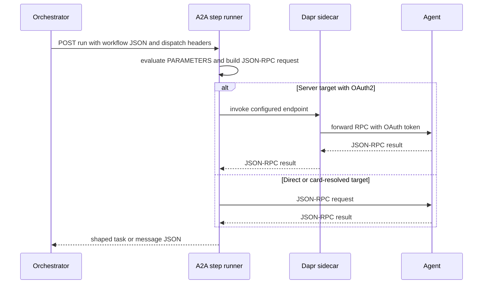

# A2A step runner

`dws-call-a2a` is the Python 3.13/FastAPI image for DWS `call: a2a` tasks. Like the other protocol runners, the [deployed workflow lifecycle](../architecture/deployed-workflow.md#interpreter-conventions) supplies one task-specific, versioned StepService and the orchestrator invokes its `POST /run` endpoint through the task's Dapr app ID. The controller accepts only `message/send` and `tasks/get`; it rejects the other A2A methods at definition compilation (`dws-controller/src/main/java/io/dws/controller/compile/V1OrchestratorCompiler.java`).

## Startup and invocation

The runner requires `TASK`, `METHOD`, `PARAMETERS`, and exactly one target: `AGENT_CARD_URL` or `SERVER_URL`. A card target is fetched and resolved once at application startup; the runner selects a `JSONRPC` interface and validates its authentication requirements before `/healthz` can report ready. `AGENT_CARD_SHA256` is an optional operator-set integrity check. A direct server target skips card discovery and its requirement check (`dws-call-a2a/src/dws_call_a2a/app_state.py`, `config.py`).

This shows the request path after an agent-card target has been resolved at startup; OAuth token acquisition is owned by Dapr.

`POST /run` accepts a JSON object, treating an empty body as `{}`. `PARAMETERS` is either a jq expression that must produce an object, or a nested object whose full `${...}` string leaves are evaluated against that input. A malformed body or unusable parameter result returns `400`; transport failures, JSON-RPC errors, and protocol-invalid agent responses return `502`; unexpected failures return `500`. Successful results replace the workflow data—there is no `OUTPUT=replace|merge` setting. The runner strips task `history` unless `INCLUDE_HISTORY=true`, a debugging-only setting (`main.py`, `runner.py`).

## A2A behavior that affects workflows

For `message/send`, the runner returns either an A2A task or message in the protocol's lowercase wire vocabulary. `input-required` and `auth-required` are successful task results, not step failures: authors use `switch`, `wait`, `listen`, or a later `message/send` to decide how to continue. The [feature roadmap](../architecture/roadmap.md) records this as completed protocol support rather than a runtime-managed agent lifecycle.

The runner accepts the agent's task lifecycle as data; it does not poll, resume, stream, cancel, or aggregate transcripts. Those unsupported operations are deliberately rejected by the controller instead of leaving a pod to fail at startup.

The orchestrator passes `X-Dws-Workflow-Instance-Id` and, for `for`-nested calls, `X-Dws-Iteration-Index` to all service calls. The A2A runner uses them to make a `message/send` `messageId` deterministic for a logical dispatch; a caller-supplied ID wins. This only enables deduplication for a cooperative agent, so A2A calls use a fixed single-attempt activity policy by default. An author may still use explicit workflow `try`/`catch.retry`, but must understand that a retry can repeat side effects (`dws-orchestrator/src/main/java/io/dws/orchestrator/workflow/WorkflowSupport.java`, `activity/CallServiceActivity.java`).

## Authentication and deployment

`AUTH_SCHEME` supports `none`, `basic`, `bearer`, and `oauth2`. Basic and bearer credentials are controller-projected environment values. A card fetch reuses RPC credentials unless `CARD_AUTH_SCHEME` explicitly selects `none`, `basic`, or `bearer`; OAuth2 cannot be reused for the card fetch because it is direct HTTPS. The card is a statement of required schemes, not a credential source.

OAuth2 is available only for a direct `with.server` target. The controller can then synthesize the same endpoint, middleware component, and scoped configuration used by the [OpenAPI step runner](openapi-step-runner.md#configuration-and-authentication); the runner preserves the RPC path and query while routing through the local Dapr invocation proxy. A card-resolved RPC endpoint is unknown at compile time, so `with.agentCard` plus OAuth2 is rejected (`V1OrchestratorCompiler.java`, `dws-call-a2a/src/dws_call_a2a/auth.py`).

The controller deploys no A2A-specific binding component. Its only additional resources are the existing OAuth2 middleware triple when a direct server target needs it.

## Change and verification guide

- Preserve startup card resolution and fail-fast configuration validation; readiness means the selected target can be configured, not just that FastAPI has started.
- Keep A2A wire normalization and shaping in `wire.py`; do not turn non-terminal task states into HTTP failures.
- Do not broaden default retry behavior without considering whether target agents honor stable `messageId` values.
- In `dws-call-a2a/`, run `uv sync --frozen`, `uv run ruff check .`, `uv run ruff format --check .`, `uv run pyright`, `uv run pytest -m "not conformance"`, and `uv run pytest -m conformance`. The dedicated CI workflow runs those checks and validates an image build in `.github/workflows/dws-call-a2a.yml`.
