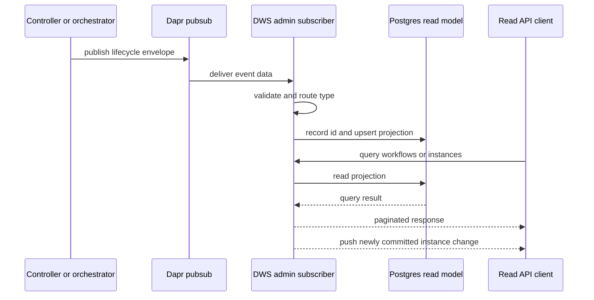

# DWS administrative read model

`dws-admin` is the read-model, query, and live-instance-update service for platform activity. It consumes the advisory stream described in [DWS lifecycle events](lifecycle-events.md), projects deployment and execution facts into Postgres, serves workflow and instance queries, and pushes newly ingested instance changes to connected browsers. It does not control the workflow lifecycle: the controller and orchestrator remain the sources of deployment and runtime truth described in [deployed workflow architecture](../architecture/deployed-workflow.md).

## Ingestion and projections

The service subscribes once to Dapr pub/sub component `pubsub` and topic `dws.events` by default; `DAPR_PUBSUB_NAME` and `DAPR_PUBSUB_TOPIC` can override those values. Dapr delivers the DWS envelope as the data of its transport CloudEvent. `DwsEventsSubscriber` accepts either JSON text or an object, validates the documented inner envelope with the CloudEvents SDK, drops malformed payloads, and dispatches known types to controller or orchestrator handlers.

This flow shows lifecycle publishers feeding a durable query projection and, for instance changes, an in-process push stream; neither surface invokes the controller or orchestrator.

`processed_events` provides the event-ID idempotency guard around each handler transaction. Unknown but valid event types are ignored. The projections are deliberately monotonic where delivery order can vary:

- `workflow_definitions` is keyed by workflow name and version; a reasserted definition preserves its first known creation time.
- `deployments` is keyed by workflow and version, with status precedence `failed` → `applied` → `drained` → `collected`; later lower-ranked events do not regress it.
- `workflow_instances` is keyed by instance ID; a terminal state cannot be replaced by a later-arriving `started` event.
- `task_events` retains each lifecycle event by event ID, so task attempts remain observable.

The source schema is under `dws-admin/src/store/schema/`; the mutation rules live in `dws-admin/src/events/upserts.ts`.

## Query surface and runtime boundary

The service exposes `GET /health` as a Postgres connectivity check and serves these paginated read endpoints:

| Resource | Endpoints |
|---|---|
| Workflows | `GET /workflows`, `GET /workflows/:name`, `GET /workflows/:name/deployments` |
| Instances | `GET /instances` (optional workflow/status filters), `GET /instances/:id`, `GET /instances/:id/tasks` |

It also exposes two server-sent-event streams on the Nest read-API listener: `GET /instances/:id/events` pushes `instance` status and `task` events for one existing instance, while `GET /instances/events` pushes lightweight `instanceId`, status, and end-time deltas for all instances. Both streams contain only changes committed after a client connects; clients must read the corresponding `GET` resource for initial or recovery state. A per-instance stream sends its terminal `completed` or `failed` status, then closes. Unknown instance IDs return 404 rather than opening a stream.

The streams are fed only after the ingestion transaction commits and suppress events for duplicate task inserts or status changes rejected by the terminal-state ratchet. Fan-out uses one in-process RxJS subject, so live delivery is correct only for a single `dws-admin` replica; horizontally scaling this component requires a cross-replica delivery mechanism. The committed console uses `EventSource` to patch its TanStack Query caches for a running detail view and already loaded instance-list rows, refetching on reconnect because the streams have no replay.

Workflow and instance lookups return 404 when the corresponding projection is absent. The service does not write definitions, apply deployments, start instances, or deliver task commands. Because its input is the best-effort lifecycle stream, the database is an operational view rather than a replacement for the controller's Kubernetes state or Dapr's workflow state.

`DaprServer` receives pub/sub callbacks separately from Nest's HTTP application. In local development, the Nest port defaults to `3000` while the Dapr callback port defaults to `3001`; the Dapr sidecar must target the latter. Both the publisher and the subscriber therefore depend on the same Dapr component/topic installation documented in [lifecycle events](lifecycle-events.md#transport-and-delivery-boundary).

## Change and verification guide

- When event envelopes or types change, update the canonical [lifecycle-events contract](lifecycle-events.md) and confirm the subscriber dispatches and projects the changed payload.
- Change table definitions only through `dws-admin/src/store/schema/`, then generate and commit a Drizzle migration with `pnpm db:generate`; do not hand-edit migration SQL.
- In `dws-admin/`, run `pnpm db:migrate`, `pnpm lint`, `pnpm test`, and `pnpm build`. Tests require reachable Postgres because they exercise the real upsert SQL and run serially against a shared database.
- The service's CI workflow (`.github/workflows/dws-admin.yml`) supplies Postgres and gates lint, tests, and build before validating its image.
