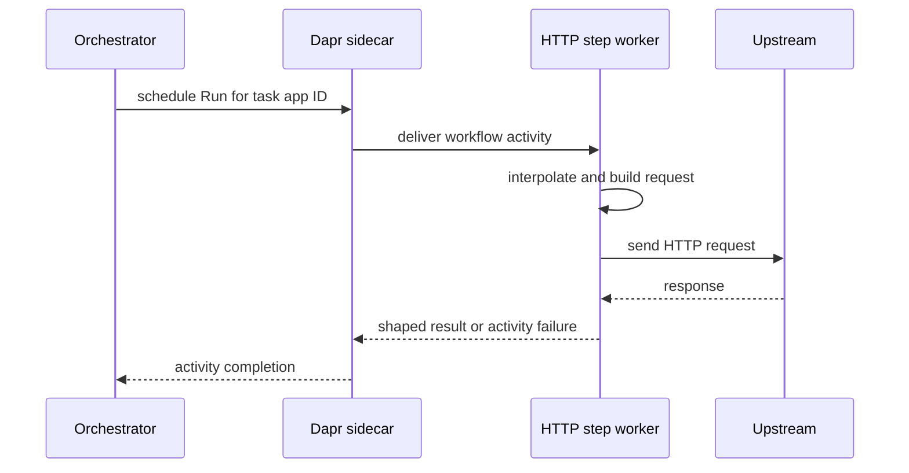

# HTTP step runner

`dws-call-http` 0.2.0 is the generic Go image for DWS `call: http` tasks. A task-specific Knative workload runs the same configuration-driven image with a Dapr sidecar. Unlike the HTTP endpoint model previously used by this runner, the process registers the Dapr Workflow activity named `Run`; the orchestrator dispatches that activity to the workload's Dapr app ID. The [deployed workflow lifecycle](../architecture/deployed-workflow.md#interpreter-conventions) defines the upstream task-name-to-app-ID convention and contrasts it with the retained OpenAPI service-invocation path.

## Worker lifecycle and activity result

At startup the process validates environment configuration, creates a Dapr Workflow client, registers one `Run` activity, starts its worker, then serves only `GET /healthz` for Knative readiness (`dws-call-http/main.go`). It does not expose `POST /run`: workflow data arrives as the activity input.

This is the post-startup activity path for a configured `call: http` workload.

The worker accepts the current workflow document as a JSON object; a missing activity input is treated as `{}`. `OUTPUT=replace` returns the parsed upstream JSON body, with an empty body becoming `{}`. `OUTPUT=merge` shallow-merges an upstream JSON object over the input; an empty body therefore preserves the input. A nil runner result also preserves input (`internal/activity/activity.go`, `internal/runner/runner.go`).

## Request configuration

`ENDPOINT` is required. Optional request settings are `TASK` (default `call-http`), `METHOD` (default `POST`), JSON-object string maps `HEADERS` and `QUERY`, `BODY_MODE` (`passthrough`, `none`, or `template`), `BODY_TEMPLATE` for template mode, `OUTPUT` (`replace` by default), `TIMEOUT` (a positive Go duration; default 30 seconds), and `INSECURE_SKIP_VERIFY` (default false). Invalid configuration terminates the process before it starts the worker (`internal/config/config.go`).

The runner replaces `{placeholder}` tokens in the endpoint, query values, and template body from top-level workflow-data keys; a missing key prevents the request. `passthrough` serializes input JSON as the request body, `none` omits a body, and `template` sends its interpolated body as JSON. It preserves static headers and applies the configured timeout and optional TLS-verification bypass (`internal/runner/runner.go`, `internal/runner/interpolate.go`).

## Authentication and failures

The runner consumes the controller-generated authentication contract described in [protected calls and secret projection](../architecture/deployed-workflow.md#protected-calls-and-secret-projection). `AUTH_SCHEME` is `none`, `basic`, `bearer`, or `oauth2`:

- `basic` requires `AUTH_USERNAME` and `AUTH_PASSWORD` and sets the outbound Basic authorization header.
- `bearer` requires `AUTH_TOKEN` and sets the outbound Bearer authorization header.
- `oauth2` requires `OAUTH_ENDPOINT` and optionally `DAPR_HTTP_PORT` (default 3500). The runner rewrites the external request to its local sidecar's endpoint-invocation URL, preserves path and query, and deletes any static `Authorization` header. Dapr's scoped OAuth middleware owns token acquisition and the external authorization header.

The controller supplies Basic and Bearer credentials as Kubernetes Secret environment references; OAuth credentials remain in Dapr-managed resources rather than the runner. Do not log or place any of these values into workflow data.

A non-2xx upstream response or a transport/read failure is surfaced as an activity error marked `upstream failure`, which lets the Java orchestrator classify it as retryable. Request construction, response decoding or output-shaping faults become `config failure` and are non-retryable (`internal/activity/activity.go`). This replaces the runner's former HTTP `502` retry signal with the activity failure contract.

## Change and verification guide

- Keep `Run` stable: dispatch is disambiguated by the Dapr app ID, not an activity name per task.
- Preserve the upstream-versus-config failure markers; the orchestrator relies on them to decide retryability.
- Treat `AUTH_SCHEME` values as controller-generated configuration. Preserve OAuth's removal of static authorization so Dapr retains ownership of that header.
- In `dws-call-http/`, run `make lint && make test`; `make test` runs `go test -race ./...`. The release version and release notes are in `dws-call-http/version.txt` and `dws-call-http/CHANGELOG.md`.

The [OpenAPI step runner](openapi-step-runner.md) is the comparable generic call runner, but it continues to receive `POST /run` through Dapr service invocation rather than a remote Workflow activity.
