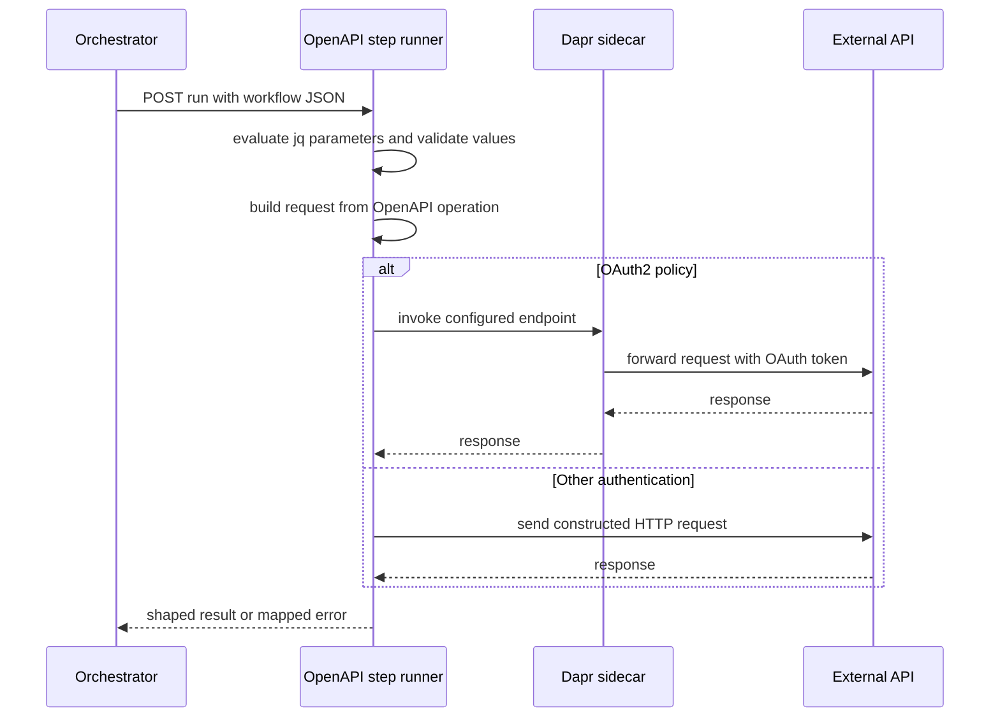

# OpenAPI step runner

`dws-call-openapi` 1.1.0 is the generic Node 24/Fastify image for a DWS `call: openapi` task. A deployed task runs the same image as a scale-to-zero Knative Service with a Dapr sidecar; its task-specific environment selects one pinned OpenAPI operation. The [deployed workflow lifecycle](../architecture/deployed-workflow.md#interpreter-conventions) explains the upstream relationship: the orchestrator invokes the task's Dapr app ID at `POST /run`, while the controller derives that app ID and projects generated credentials.

## Startup contract

The process builds its Fastify plugins in dependency order—configuration, OpenAPI engine, runner, then routes—and awaits full initialization before listening (`dws-call-openapi/src/app.ts`, `src/index.ts`). Invalid configuration, a document download or digest failure, an invalid document, an unknown operation, unresolved server template variables, or secret-resolution failure makes the process exit non-zero. Therefore `/healthz` is available only after the request-ready engine exists.

At startup, the engine (`src/openapi/engine.ts`) does the following once rather than on each invocation:

1. fetches `DOCUMENT_URL` and verifies its SHA-256 against `DOCUMENT_SHA256`;
2. parses, validates, and dereferences the OpenAPI 3.0/3.1 document;
3. resolves `OPERATION_ID`, compiles parameter and request-body validation, and resolves the first server plus `SERVER_VARIABLES` overrides;
4. resolves legacy inline or Dapr-secret-store credentials when needed; and
5. builds constant authentication material.

A document URL may use `http`, `https`, or `file`. An HTTP(S) document can supply the context needed to resolve a relative OpenAPI server; a local file document does not synthesize that context. The runner delegates OpenAPI parameter serialization, URL construction, and server templating to `swagger-client`; it does not reproduce those rules itself (`src/request.ts`).

## Invocation and result handling

This is the request path after the startup engine has been prepared; OAuth token acquisition belongs to Dapr, not the runner.

`POST /run` accepts the current workflow data as a JSON object; an empty body becomes `{}`, while an array, scalar, or malformed JSON is a bad request. `PARAMETERS` maps operation-parameter names—and the special `requestBody` key—to jq expressions evaluated against that object. Null or absent jq results are omitted so required-parameter validation reports the omission. Bound values are schema-validated and coerced before `SwaggerClient.buildRequest` creates the outbound request.

The runner uses `undici` with `TIMEOUT` applied to both headers and body. A 2xx upstream result is returned according to `OUTPUT`: `replace` returns the upstream body (or `{}` for no body), and `merge` shallow-merges an upstream JSON object over the input. `merge` rejects a non-object response. A binding or validation failure returns `400` with `task`, `error`, and validation `details`; an upstream non-2xx returns `502` with `task`, upstream `status`, and `body`; a transport or timeout failure returns `502`; unexpected failures return `500` (`src/routes.ts`, `src/runner.ts`).

## Configuration and authentication

Required configuration is `DOCUMENT_URL`, its 64-character hexadecimal `DOCUMENT_SHA256`, and `OPERATION_ID`. Optional settings are `TASK` (defaulting to the operation ID), JSON-object `PARAMETERS` and `SERVER_VARIABLES`, `OUTPUT` (`replace` by default), `TIMEOUT` (30 seconds by default), `PORT` (8080), `DAPR_HTTP_PORT` (3500), and `LOG_LEVEL`.

The runner supports two authentication inputs:

- **Controller-generated configuration** takes precedence when `AUTH_SCHEME` is present. `basic` requires `AUTH_USERNAME` and `AUTH_PASSWORD`; `bearer` requires `AUTH_TOKEN`; and `oauth2` requires `OAUTH_ENDPOINT`. The controller supplies the basic/bearer values through Kubernetes Secret environment references, as described in [protected calls and secret projection](../architecture/deployed-workflow.md#protected-calls-and-secret-projection).
- **Legacy standalone configuration** uses `AUTH_TYPE` (`none`, `bearer`, `basic`, or `apiKey`) with either `AUTH_SECRET` or both `AUTH_SECRET_STORE` and `AUTH_SECRET_KEY`. Store-backed secrets are fetched once through the Dapr sidecar secrets API during startup (`src/secrets.ts`). API keys follow the selected document security scheme's header, query, or cookie placement, falling back to `X-API-Key`.

For OAuth2, request construction preserves the OpenAPI-derived path and query but rewrites the destination to Dapr's local endpoint invocation URL. It removes any pre-existing `Authorization` header, so Dapr's OAuth middleware owns the external authorization header. This implementation realizes the runner half of the controller-created, path-scoped OAuth resources described in the [deployed workflow lifecycle](../architecture/deployed-workflow.md#protected-calls-and-secret-projection).

## Change and verification guide

- Preserve eager initialization when changing plugins, documents, or authentication: readiness is intended to prove the operation is executable, not merely that the HTTP server started.
- Keep `swagger-client` as the owner of OpenAPI serialization; changes in `src/request.ts` should not hand-roll path, query, header, cookie, or server interpolation.
- Treat generated `AUTH_SCHEME` values as authoritative over legacy environment variables. Do not log credentials or move controller-projected values into workflow data.
- When changing OAuth routing, retain the removal of static authorization and verify the controller's endpoint/path isolation as well as runner tests; live Dapr path-isolation validation remains an operator/CI prerequisite.
- In `dws-call-openapi/`, run `pnpm lint && pnpm test && pnpm build`. The release version and release notes are in `dws-call-openapi/package.json` and `dws-call-openapi/CHANGELOG.md`.
