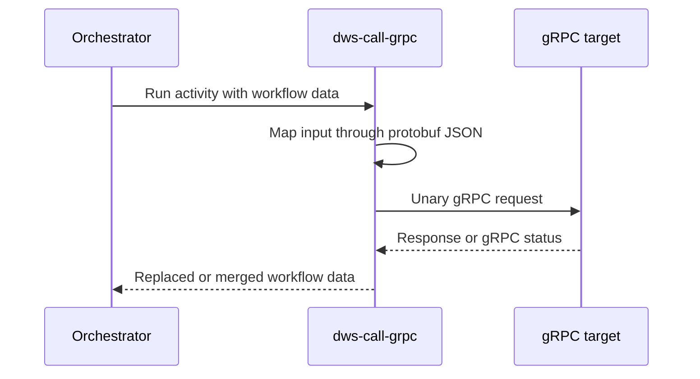
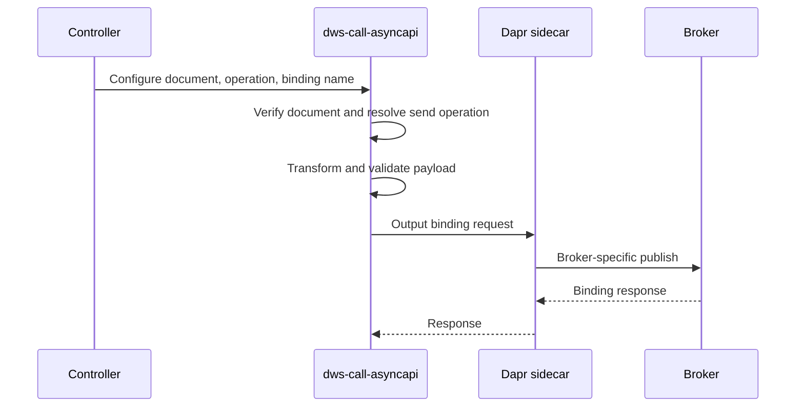

# gRPC and AsyncAPI step runners

DWS uses prebuilt, configuration-driven Knative step services for `call: grpc` and `call: asyncapi`; the controller selects the image and supplies task-specific environment variables rather than generating workflow-specific code. They are deployed as the I/O services described in the [deployed workflow architecture](../architecture/deployed-workflow.md), alongside the existing [HTTP](http-step-runner.md) and [OpenAPI](openapi-step-runner.md) runners.

## gRPC calls

`dws-call-grpc` supports one unary target method per service instance. At startup it builds a dynamic Connect/gRPC client either from a serialized, self-contained `google.protobuf.FileDescriptorSet` fetched from `PROTO_ENDPOINT` or, when that is unset, through server reflection. A descriptor-set response may be checked with `PROTO_SHA256`; raw `.proto` sources are not accepted.

The service registers the Dapr Workflow activity `Run`. The orchestrator invokes that activity via the task app ID, while `GET /healthz` is the Knative readiness endpoint. On each activity invocation, the runner converts workflow data to protobuf JSON, discards unknown fields, invokes the unary method, and returns the upstream response using `OUTPUT=replace` or `OUTPUT=merge`.

This shows the runtime path after startup has resolved the descriptor and registered `Run`.

### Configuration and failures

The controller configures `SERVICE_ADDR` and `METHOD` (`package.Service/Method`), with optional descriptor endpoint, TLS, timeout, and output mode. `AUTH_SCHEME` supports `none`, `basic`, and `bearer`; Basic or bearer values are secret-injected and become gRPC `authorization` metadata. OAuth2 is rejected for this protocol.

Upstream gRPC statuses and transport failures are retryable. Descriptor/configuration problems and protobuf encode/decode failures are non-retryable. Streaming calls and request templating through `with.arguments` are outside this runner's scope. Source: `dws-call-grpc/README.md`, `dws-call-grpc/main.go`.

## AsyncAPI sends

`dws-call-asyncapi` implements outbound AsyncAPI 3.0 `send` operations only. The controller performs a light document read during compilation: it chooses the first server, maps its protocol to a Dapr output-binding type, resolves the operation's channel address, creates a version-scoped binding component, and passes its name as `BINDING_NAME`. It rejects receive/subscription operations, which belong to `listen` tasks.

At service startup, the runner fetches `DOC_ENDPOINT`, verifies `DOC_SHA256`, validates the document, and resolves `OPERATION_ID`. For each `POST /run`, it evaluates the `PAYLOAD` jq expression against workflow data, validates the result against the AsyncAPI message payload schema, and sends it to the local Dapr sidecar binding endpoint. `OUTPUT` determines whether the sidecar response replaces the workflow data or shallow-merges into it.

This shows compile-time binding selection and the subsequent runner-to-sidecar broker dispatch; the runner itself holds no broker credentials.

### Supported protocols and contracts

The controller currently maps Kafka, AMQP, MQTT/MQTT5, SQS, and Google Pub/Sub servers to Dapr bindings. It supports basic broker credentials only where the binding has username/password metadata; credentials are projected as Kubernetes `secretKeyRef` values into the generated binding component. Unsupported protocols fail compilation.

Payload validation failures return HTTP 400. Binding non-2xx responses and transport failures return 502 so the orchestrator can apply its retry policy. Startup configuration and document errors prevent readiness. The runner's `GET /healthz` responds only after initialization.

Source: `dws-call-asyncapi/README.md`; `dws-controller/src/main/java/io/dws/controller/compile/V1OrchestratorCompiler.java` (`asyncApiStep`, binding selection, and binding registration).

## Change guidance

When changing protocol support, update the controller compiler and runner together: the compiler's emitted environment and binding metadata must match the runner's required configuration. Keep the controller's version-scoped binding registration intact for AsyncAPI so an identical deployed definition retains stable resources. Validate the relevant component commands before integration work: `make test` for `dws-call-grpc`; `pnpm lint && pnpm test && pnpm build` for `dws-call-asyncapi`.
