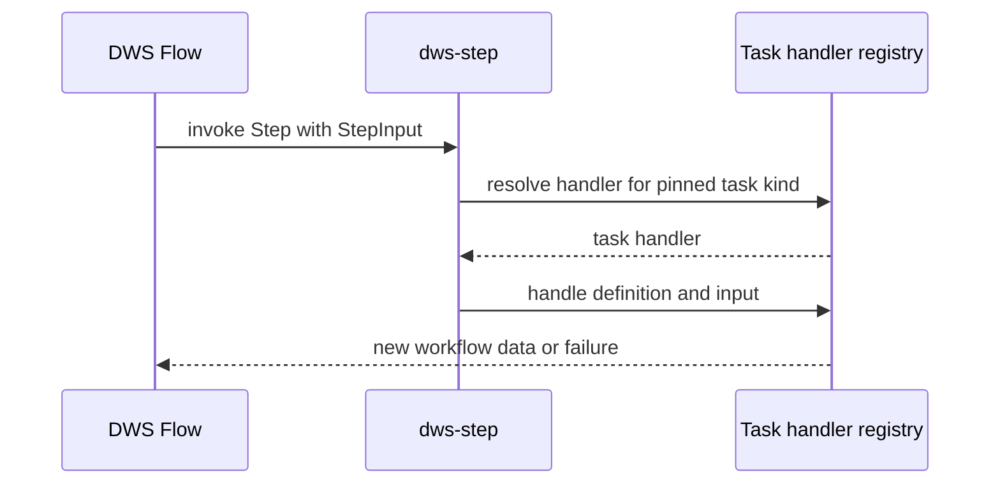

# DWS Step activity host

`dws-step` is the generic Java host for exactly one immutable `kind: "step"` single-node definition. It registers a constant Dapr Workflow activity called `Step`; the pinned definition, not the activity name, selects the represented task. This separates stable Flow-to-activity routing from task-specific handler implementation.

The host is in the early core-routing phase: `set`, `switch`, `emit`, `raise`, `call`, and `run` all route to registered placeholders that deliberately return a non-retryable configuration failure. Later implementations replace those handlers without changing the routing boundary.

## Startup contract

`StepRuntimeConfig` reads `DWS_STEP_DEFINITION_PATH` during Spring bean creation, so a missing or invalid definition prevents the application from starting. `SingleNodeDefinitionLoader` requires a JSON object with non-empty `workflow`, `version`, and DNS-1123 `nodeId` fields, `kind: "step"`, and one supported task kind. `call` and `run` additionally require `functionAppId`; it must be absent for other kinds.

`wait` and `listen` are rejected by this host because they remain flow-controller nodes. The loader points to ADR 0006 for that boundary.

## Activity execution



This shows the stable routing boundary: `StepActivity` reads the task kind from the definition loaded at startup and delegates to `TaskHandlerRegistry`; a handler owns the eventual task behavior.

The activity input is `StepInput`, whose fields are:

| Field | Meaning |
|---|---|
| `data` | Current workflow JSON, normalized to JSON `null` when absent. |
| `variables` | Scope-local JSON values, such as a caught error; normalized to an empty map when absent. |
| `workflowInstanceId` | Root workflow instance ID. |
| `iterationIndex` | Opaque enclosing-loop encoding, or `null` outside a loop. |

The output is the new workflow-data JSON document. Unknown input fields are ignored. Data-flow transforms (`input.from`, `output.as`, and schemas) are not part of this activity envelope.

## Failure and expression compatibility

Only an exception message survives the Dapr activity boundary. `dws-step` therefore preserves v1 wording so [deployed workflow architecture](../architecture/deployed-workflow.md) can continue to classify resulting failures in the orchestrator:

| Failure type | Retryable | Message form | Classified category |
|---|---:|---|---|
| `StepUpstreamException` | Yes | `step '<task>' upstream failure: <detail>` | communication |
| `StepConfigException` | No | `step '<task>' config failure: <detail>` | runtime |
| `StepValidationException` | No | `validation failed: <detail>` | validation |

Message markers are ordered-sensitive in the downstream classifier. In particular, a detail must not embed another category marker.

The host also carries a port of the orchestrator's jq evaluator: jackson-jq in jq 1.6 mode, accepting `${ .foo }` and bare `.foo`, with named variables available as `$name`. It is intentionally copied rather than shared, so this runtime preserves evaluator parity without introducing a cross-component module dependency.

## Build and change guide

Build and test the component with Java 25:

```bash
cd dws-step
./mvnw verify
```

For a local Dapr run, package the app and set `DWS_STEP_DEFINITION_PATH` to a single-node fixture; `dws-step/README.md` provides the exact example. The health endpoint is `GET /healthz`.

When changing this component, start with:

- `config/SingleNodeDefinitionLoader.java` for definition validation and Flow/Step ownership boundaries;
- `workflow/StepActivity.java` and `TaskHandlerRegistry.java` for routing and handler registration;
- `workflow/StepInput.java` for the activity wire envelope;
- `failure/` and `StepFailureContractTest.java` for the downstream-compatible failure contract.

Keep the activity name, envelope, and failure wording stable unless its Flow and orchestrator consumers change together. Handler implementations should replace placeholders in the registry rather than alter the routing mechanism.
